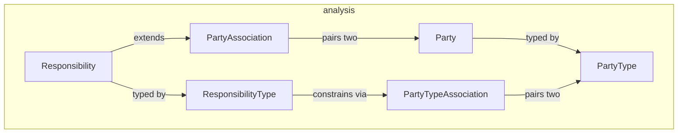

---
digest:
  local-classes:
    Party:
      mtime: '2026-09-05T09:41:23Z'
      digest: c73587adeb298614978ad38910b866b3db0f8caddc639ad15415cd4e086a9088
    PartyAssociation:
      mtime: '2026-09-05T09:41:43Z'
      digest: 686dcc6cf09668487e5badc26701d89cc694d12fa0d8919781d0be6d9c80fdcc
    PartyType:
      mtime: '2026-09-05T09:41:32Z'
      digest: c52a48c5aec8a9a545656f88051af1b3a7a5b0e7cd1f502d52ce6a9b54f8f00f
    PartyTypeAssociation:
      mtime: '2026-09-05T09:41:53Z'
      digest: f0e4687069327c454a1fd566d7de614559ef76762181c1e75c9056d455bb97c1
    Responsibility:
      mtime: '2026-09-05T09:42:02Z'
      digest: d7b8fc30157dbe4a7bad405a5a8549f7a8c4e7a7ce60cb8f78966f6ee6328a3a
    ResponsibilityType:
      mtime: '2026-09-05T09:42:10Z'
      digest: 3b1c35081a451e31a0dc51c25c9e6c084be890ee61770154afab91da89fccb20
  folders: {}
tags:
- code/domain_model
- code/type_system
concepts:
- Domain Model
- Relationship Modelling
facets:
  layer: domain
  status: stable
  complexity: low
description: 'A pure-interface implementation of Martin Fowler''s Party/Responsibility analysis pattern: `Party` (a Person or Organization, possibly composite) has a dynamically assignable `PartyType`, and `Responsibility` generalizes hierarchical relationships between Parties (parent/child, org membership, etc.) beyond a single fixed hierarchy. Each operational concept has a Knowledge-Level counterpart that constrains it: `PartyAssociation` pairs two `Party`s while `PartyTypeAssociation` pairs the corresponding `PartyType`s, and `ResponsibilityType` maintains the allowed `PartyTypeAssociation`s for a `Responsibility`. No implementation of these interfaces exists in this folder.'
---

# analysis

A pure-interface implementation of Martin Fowler's Party/Responsibility analysis pattern:
`Party` (a Person or Organization, possibly composite) has a dynamically assignable
`PartyType`, and `Responsibility` generalizes hierarchical relationships between Parties
(parent/child, org membership, etc.) beyond a single fixed hierarchy. Each operational
concept has a Knowledge-Level counterpart that constrains it: `PartyAssociation` pairs two
`Party`s while `PartyTypeAssociation` pairs the corresponding `PartyType`s, and
`ResponsibilityType` maintains the allowed `PartyTypeAssociation`s for a `Responsibility`.
No implementation of these interfaces exists in this folder.

## Classes

| Class | Responsibility |
|---|---|
| [Party](Party.java) | Defines the Interface for a Party (see Fowler: 'Analysis Patterns'). |
| [PartyAssociation](PartyAssociation.java) | Defines the Interface for a directed Parent/Child Association between two Parties. |
| [PartyType](PartyType.java) | Defines the Interface for a Party (i.e. Group of Agents) Type. |
| [PartyTypeAssociation](PartyTypeAssociation.java) | Defines the Interface for a directed Parent/Child Association between two PartyTypes, i.e. an allowed Responsibility at the Knowledge Level. |
| [Responsibility](Responsibility.java) | Defines the Interface for a Responsibility, a generalized Parent/Child Association between two Parties, typed by a ResponsibilityType. |
| [ResponsibilityType](ResponsibilityType.java) | Defines the Interface for a Responsibility Type. |

## Architecture

## Entry Points

| Class.Method | Description |
|---|---|
| [Party.getpartyType()](Party.java#L44) | Returns this Party's dynamically assignable Type. |
| [Responsibility.getresponsibilityType()](Responsibility.java#L44) | Returns this Responsibility's dynamically assignable Type. |
| [ResponsibilityType.getAllowedAssociations()](ResponsibilityType.java#L52) | Returns the allowed Associations between Parent and Child PartyTypes. |
