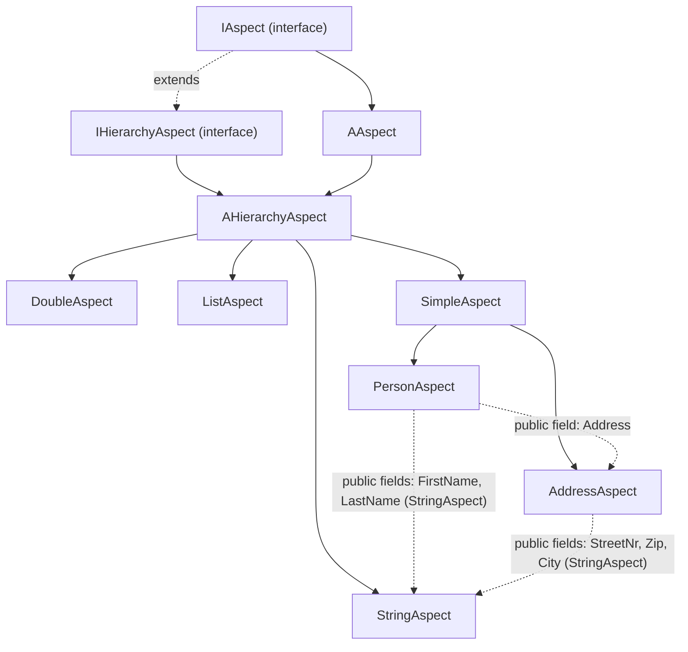

---
digest:
  local-classes:
    AAspect:
      mtime: '2026-09-05T10:23:27Z'
      digest: 1d35b91657113f94ed957b17185649c53e58ed90f62e5002e1874b4b5a661428
    AHierarchyAspect:
      mtime: '2026-09-05T10:23:42Z'
      digest: 834fd581e4836929d6c2f3023550943914b86cdbc4fafb0609b7075521d3ad1a
    AddressAspect:
      mtime: '2026-09-05T10:23:48Z'
      digest: 08377d527689d15cc06f217d2798c615e2e5524671ad6d75a2d42204d8e08865
    DoubleAspect:
      mtime: '2026-09-05T10:24:05Z'
      digest: 4ab02385677c808fa6e3900877966b64dad70f0fe35af11d4d52456146181398
    IAspect:
      mtime: '2026-09-05T10:24:18Z'
      digest: 4f98d2e90ceea351e8bdaeb01ebf3ef86b508927095d2908f7f23a7813dd0ee4
    IHierarchyAspect:
      mtime: '2026-09-05T10:24:25Z'
      digest: c11a7ddf63f14ece97525b7fdc1528b834f52cc28f98c41ee97008d1da7dc96b
    ListAspect:
      mtime: '2026-09-05T10:25:16Z'
      digest: eff64eebe9894b63bc607f5b042eace22a795804578384e7c3ab671a34e667a7
    PersonAspect:
      mtime: '2026-09-05T10:24:53Z'
      digest: 6cf1f556eb3bc6ecf4dd03a247f597d59051c0ea3a1d93a3f7301304977ec23e
    SimpleAspect:
      mtime: '2026-09-05T10:25:22Z'
      digest: 6b9e90a4b530a44147529d675b95d5d63473312938cb7e2b238aaf7eeba3b9a5
    StringAspect:
      mtime: '2026-09-05T10:25:39Z'
      digest: f7b860d99a5f5f8393269f705c9cdeb15b8812fd0b529502142582ef25e2f952
  folders:
    dialog/:
      mtime: '2026-09-05T10:26:23Z'
      digest: 315ed66824ded96705df25ba527203eff461f4a49ad9e3f6dcf498c36bc16ee0
tags:
- code/domain_model
- code/composite_pattern
- code/hierarchy
concepts:
- Attribute Modelling
- Reflective Property Access
facets:
  layer: domain
  status: stable
  complexity: medium
description: '`aspect` is a small object-property framework: an "Aspect" is a self-describing, named property of a business object that can be read and written both directly and by (possibly nested, underscore-separated) property name, e.g. `person.set("Address_City", "Frankfurt")`. `IAspect`/`AAspect` supply the name/key handling, reflection-based dirty-flag propagation and by-name dispatch; `IHierarchyAspect`/`AHierarchyAspect` add a Parent link so a leaf Aspect can validate upward (multi-field checks against sibling values) and update downward without triggering feedback loops. Concrete leaf types (`StringAspect`, `DoubleAspect`) hold an actual primitive Value with Min/Max (and, for `DoubleAspect`, Modulus) validation; `SimpleAspect` is the base for composite Aspects that hold no Value of their own and simply group other Aspects as public fields (`AddressAspect`, `PersonAspect`); `ListAspect` holds a Table (list) of Aspect records instead of a single sub-Aspect. The nested `dialog/` package builds a small console question-and-answer engine on top of `AAspect`.'
---

# aspect

`aspect` is a small object-property framework: an "Aspect" is a self-describing, named property of a
business object that can be read and written both directly and by (possibly nested, underscore-separated)
property name, e.g. `person.set("Address_City", "Frankfurt")`. `IAspect`/`AAspect` supply the name/key
handling, reflection-based dirty-flag propagation and by-name dispatch; `IHierarchyAspect`/`AHierarchyAspect`
add a Parent link so a leaf Aspect can validate upward (multi-field checks against sibling values) and update
downward without triggering feedback loops. Concrete leaf types (`StringAspect`, `DoubleAspect`) hold an
actual primitive Value with Min/Max (and, for `DoubleAspect`, Modulus) validation; `SimpleAspect` is the base
for composite Aspects that hold no Value of their own and simply group other Aspects as public fields
(`AddressAspect`, `PersonAspect`); `ListAspect` holds a Table (list) of Aspect records instead of a single
sub-Aspect. The nested `dialog/` package builds a small console question-and-answer engine on top of
`AAspect`.

## Architecture

Inheritance and composition among the folder's core types:

## Entry Points

| Class.Method | Description |
|---|---|
| `AAspect.set(String, Object)` / `AAspect.get(String)` | Read/write any (possibly nested) property by name; the main way external code addresses an Aspect tree. |
| `AAspect.CopyAt(Object)` / `IAspect.setVal(Object)` | Deep-copies another Aspect's (or compatible Object's) Value into this Aspect and its sub-Aspects, e.g. applying a Publisher update. |
| `AAspect.clone()` / `AAspect.Clone(String)` | Produces a deep copy of an Aspect tree under a new or the same Name. |
| `IAspect.newInstance(String)` | Creates a fresh, empty instance of a concrete Aspect type via reflection. |

## Classes

| Class | Responsibility |
|---|---|
| [AAspect](AAspect.java) | Title: AAspect Description: Abstract base class for a named, typed "aspect" of a business object: a self-describing property that knows its own name, can be read/written both directly (via #getVal()/#setVal(Object)) and by dotted/underscore-separated path name (via #get(String)/ #set(String, Object)), and tracks a dirty flag it can propagate to and from nested Aspect-typed public fields via reflection. |
| [AHierarchyAspect](AHierarchyAspect.java) | Title: AHierarchyAspect Description: Abstract Base Implementation of a HierarchyAspect * it can have 'Parent' Aspects and inherits the Prefix from them * validate and propagate Changes upward to the Parents (Multi Field Plausis). |
| [AddressAspect](AddressAspect.java) | Title: AddressAspect Description: Composite Aspect modelling a postal address, composed of three StringAspect sub-properties (street/number, zip code, city). |
| [DoubleAspect](DoubleAspect.java) | Title: DoubleAspect Description: Extends and implements the Aspect Class for double-precision numeric Values, with Min/Max range validation and an optional Modulus (step size) check. |
| [IAspect](IAspect.java) | Title: IAspect Description: Defines the Interface for an Aspect Object or Hierarchy that allows to read and write Properties both explicitly like "Customer.Address.Street = "Elm Street" and by their Name like "Customer.set("Address_Street") = "Elm Street" The Characteristics of an Aspect are: * it knows its Name and maintains the dirty Flag. |
| [IHierarchyAspect](IHierarchyAspect.java) | Title: IHierarchyAspect Description: Defines the Interface for an Aspect Hierarchy * it can have 'Parent' Aspects and inherits the Prefix from them * validate and propagate Changes upward to the Parents (Multi Field Plausis). |
| [ListAspect](ListAspect.java) | Title: ListAspect Description: Extends and implements the Aspect Class for a List (Table) of Aspect records, optionally keyed by an identifying "Id Column" name, with lookup/add/remove operations by index or by (Property, Value) match. |
| [PersonAspect](PersonAspect.java) | Title: PersonAspect Description: Composite Aspect describing a natural person: first name, last name and a nested AddressAspect. |
| [SimpleAspect](SimpleAspect.java) | Title: SimpleAspect Description: Base Class for composite "container" Aspects that hold no Value of their own (getVal() returns this, setPrimVal()/validatePrimVal() are no-ops) and simply group public Aspect-typed fields, e.g. AddressAspect and PersonAspect. |
| [StringAspect](StringAspect.java) | Title: StringAspect Description: Extends and implements the Aspect Class for String Values, with Min/Max length validation and an (unused-for-validation) RegExp field. |
