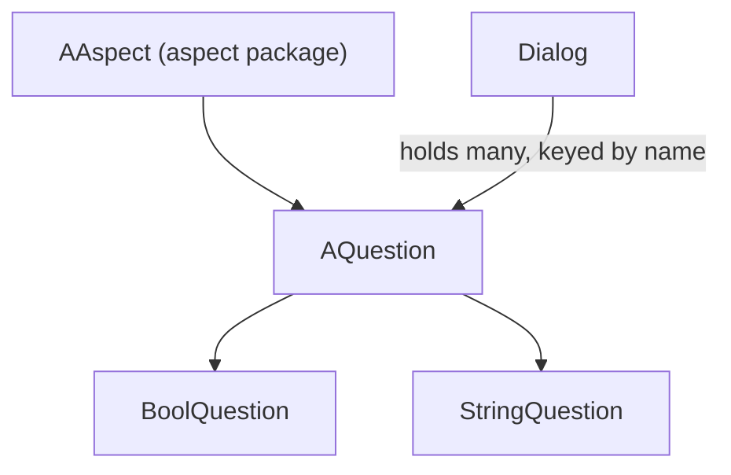

---
digest:
  local-classes:
    AQuestion:
      mtime: '2026-09-05T10:25:46Z'
      digest: bee3b646f5a943b57c89e893a280b5a99385381fbfe93e2e83781e8b641ade94
    BoolQuestion:
      mtime: '2026-09-05T10:26:00Z'
      digest: fd3a4be4bf2434d3e4250a1f784a2453e5efdc9d6b40278769dbf8bda4b7953d
    Dialog:
      mtime: '2026-09-05T10:26:09Z'
      digest: 9a77335c0c995e190e846a5fe75e41754f2a1bd357cf77e5d0ae648b75996b5e
    StreamDialog:
      mtime: '2026-09-05T10:26:16Z'
      digest: f722057299485d5701f94e14f48ff8b01305d9f09cd41c79de9f660767c2ad24
    StringQuestion:
      mtime: '2026-09-05T10:26:23Z'
      digest: 412d0ead6285240368a85982bcf5e776ddf0939ad70198a9c3e92af92cf23245
  folders: {}
tags:
- code/dialog
- code/dialog_invocation
concepts:
- Console Dialog Engine
facets:
  layer: domain
  status: stable
  complexity: low
description: '`dialog` is a small console question-and-answer engine built on top of the `aspect` package: each `AQuestion` is itself an `AAspect`, so an answer can be read/stored via the same `getVal()`/`setVal()` machinery as any other Aspect. `StringQuestion` and `BoolQuestion` are the two concrete question types (free-form text vs. Yes/No), each knowing the name of the next question to proceed to - `BoolQuestion` branches to a different next question depending on the answer, `StringQuestion` always proceeds to a fixed one. `Dialog` holds a named collection of `AQuestion`s (a tree, possibly with converging branches) and drives the question loop, substituting `[Name]`-style placeholders in later questions with earlier answers. `StreamDialog` is an unimplemented stub (empty constructor and no-op `main`) apparently intended as a future stream-based alternative driver.'
---

# dialog

`dialog` is a small console question-and-answer engine built on top of the `aspect` package: each `AQuestion`
is itself an `AAspect`, so an answer can be read/stored via the same `getVal()`/`setVal()` machinery as any
other Aspect. `StringQuestion` and `BoolQuestion` are the two concrete question types (free-form text vs.
Yes/No), each knowing the name of the next question to proceed to - `BoolQuestion` branches to a different
next question depending on the answer, `StringQuestion` always proceeds to a fixed one. `Dialog` holds a
named collection of `AQuestion`s (a tree, possibly with converging branches) and drives the question loop,
substituting `[Name]`-style placeholders in later questions with earlier answers. `StreamDialog` is an
unimplemented stub (empty constructor and no-op `main`) apparently intended as a future stream-based
alternative driver.

## Architecture

## Entry Points

| Class.Method | Description |
|---|---|
| `Dialog.run(PrintStream, InputStream)` | Runs the whole dialog tree from its start question to a question with no next question. |
| `Dialog.addQuestion(AQuestion)` | Registers a question under its own name so `run`/`ask` can look it up. |
| `AQuestion.ask(PrintStream, InputStream)` | Prints one question standalone, reads and stores the answer, returns the next question's name. |
| `Dialog.getQuestion(String)` | Looks up a previously added question by name. |

## Classes

| Class | Responsibility |
|---|---|
| [AQuestion](AQuestion.java) | Title: AQuestion Description: Abstract base class for a single Question in a console-driven Dialog: an Aspect that holds the question text, can be asked standalone (print the question, read an answer, store it via setVal()), and knows the name of the next Question to proceed to. |
| [BoolQuestion](BoolQuestion.java) | Title: BoolQuestion Description: A Question that can only be answered Yes or No, branching to a different next-Question name (nextOnTrue/nextOnFalse) depending on the Answer given. |
| [Dialog](Dialog.java) | Title: Dialog Description: A Dialog holds a Tree of Questions (possibly w. Diamonds!) It allows to lookup the next Question to retrieve and to retrieve the Value of a certain Question! Design Decisions / Implementation Details: Don't inheriting from HashMap, but delegating to it! Known SubClasses: Known Uses: Copyright: Copyright (c) Matthias Heuer Company: personal Created on 10-26-2002, 12:47 PM |
| [StreamDialog](StreamDialog.java) | Title: StreamDialog Description: Controller for a Dialog with an Input- and an Output- streamIO Design Decisions / Implementation Details: The actual writing to the streamIO is Question-specific and should be delegated to the Question! Known SubClasses: Known Uses: Copyright: Copyright (c) Matthias Heuer Company: personal Created on 10-26-2002, 12:47 PM |
| [StringQuestion](StringQuestion.java) | Title: StringQuestion Description: Implements the Model for a Text Question: a free-form String Answer with a fixed next-Question Name. |
