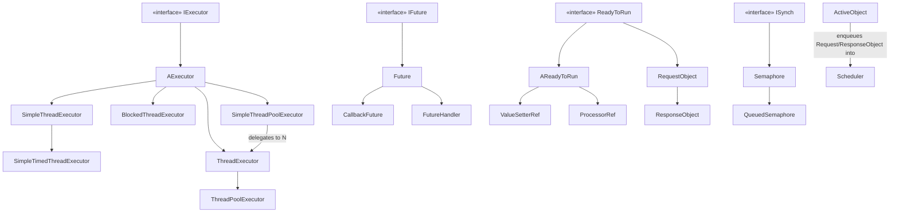

---
digest:
  local-classes:
    ABarrierClient:
      mtime: '2026-09-05T10:41:17Z'
      digest: ec46a371abea5e0d2b9980e1067d67c02d435c3b12a97391bc50789f7243ba82
    AExecutor:
      mtime: '2026-09-05T10:41:11Z'
      digest: ccc8f720c6dff0e5d2c6dcfbf72bbb75c46f183bdd6cfa1e8162326e7554c4ed
    AReadyToRun:
      mtime: '2026-09-05T10:41:20Z'
      digest: b5c17cbbd2460b0c2cf5b59e422c7f0a17b4817a37f8e1639a56ae928876f97d
    ActiveObject:
      mtime: '2026-09-05T10:12:23Z'
      digest: 4bf3d922a526e0c9c8a4e8f816d2fe9d675a818d132c33fd5c1d4ac1ff9b973a
    Barrier:
      mtime: '2026-09-05T10:41:22Z'
      digest: e19f4ebd02b8756a64b4c79e332701c6759923795c5f77bebf08605e8715e0f8
    BlockedThreadExecutor:
      mtime: '2026-09-05T10:42:07Z'
      digest: b1578a03aff4e2bcdbe8641ee04048c565425c65f1ac3ccc2a9c698e728b0737
    CallbackFuture:
      mtime: '2026-09-05T10:41:28Z'
      digest: d90b65a43dca4e1ff41dc08660d522d5f1bd193dd9a0ef4927541cba33b314de
    ForkJoinTask:
      mtime: '2026-09-05T10:43:08Z'
      digest: 77d25188d54a57e07772b48f802bcc1b5801aab03685b085e6784e44c027b56a
    Future:
      mtime: '2026-09-05T10:43:12Z'
      digest: b2e97b6329f7b1e1b592d613712edda1a487d1680d249cf59076eae0cb29ee55
    FutureHandler:
      mtime: '2026-09-05T10:12:24Z'
      digest: cf02121f17607b0ec43ec76d702165fbb21cf07c27bd83e6333de870efd45ff1
    IExecutor:
      mtime: '2026-09-05T10:12:24Z'
      digest: c84e1a736a2a1c595d70fb1773fcb406f2d4099d1a65b1783a0952d697b42389
    IFuture:
      mtime: '2026-09-05T10:12:24Z'
      digest: 240f869d49d83f68f5304aa6d9da05de3a5db8fde67af2794007a688d8001406
    ISynch:
      mtime: '2026-09-05T10:12:24Z'
      digest: f67843096be1eddaddc02b2ea07d503096d4cdfbdc9e0a078ebcf6c6358bf8fb
    ProcessorRef:
      mtime: '2026-09-05T10:41:46Z'
      digest: ca5a3e84d0b7fa44703999b21435e78e841a59c32e5404edd87cf28198dbf4af
    QueuedSemaphore:
      mtime: '2026-09-05T10:43:14Z'
      digest: cdeda40e324f9b7ec4d12131722a41378f58af84a57cc41e1b2874bd6b0f2c9c
    ReadyToRun:
      mtime: '2026-09-05T10:12:24Z'
      digest: e3b0c44298fc1c149afbf4c8996fb92427ae41e4649b934ca495991b7852b855
    RequestObject:
      mtime: '2026-09-05T10:43:16Z'
      digest: 138dd5f1088ebf25a07eca054064bffa947abcdb0911133d5e5b03d159c03b8d
    ResidiumDispatcher:
      mtime: '2026-09-05T10:43:32Z'
      digest: 02bff35d534f34bd61e31107ad5ced64c022abf424b1dac17bbdf2620573b93b
    ResponseObject:
      mtime: '2026-09-05T10:41:52Z'
      digest: ac6dd833779a5d829ee21d00f551cd073ede194720995b8735dd6b338f04afa2
    Scheduler:
      mtime: '2026-09-05T10:42:11Z'
      digest: 22f7427006e83c54a1cfd6ba4af1176fe84d6f1a077809b1ef6e7748166c7f23
    Semaphore:
      mtime: '2026-09-05T10:43:23Z'
      digest: 576127292b3e4c8f6935bbd7b3ef8c93eedab7330b9d2716f5022d0b2015206b
    SimpleThreadExecutor:
      mtime: '2026-09-05T10:12:24Z'
      digest: 2d7fd7a214fe1492d0722f3b33a3f0f48f00eab7ebd40b874cb80d511ef1c8d9
    SimpleThreadPoolExecutor:
      mtime: '2026-09-05T10:42:12Z'
      digest: 51cf661061a6602874d4ace108cf7bfa15abfb4b2b17479602c8205112915737
    SimpleTimedThreadExecutor:
      mtime: '2026-09-05T10:43:28Z'
      digest: 8320b81962276e6f69f9d30c4c7cda51016719ca7f2c1319f1ff1279dfa610c6
    SynchExecutor:
      mtime: '2026-09-05T10:41:58Z'
      digest: 607aff006a45f4c1fca1ca47e097f1218c2999e826ce358649054b0069b691a8
    ThreadExecutor:
      mtime: '2026-09-05T10:43:31Z'
      digest: 64a6bd8e0e79efb3fb945d7ba89d4342e34b761ae6461e33a554090484a286d5
    ThreadPoolExecutor:
      mtime: '2026-09-05T10:40:45Z'
      digest: a4e5b119a2fbf3b7e0e602f72a4398308057183fa475920115dbee6dc801ffc9
    ValueSetterRef:
      mtime: '2026-09-05T10:42:01Z'
      digest: 890166c399ced0d5779916ece79c7d2a5ebcf11329065c21f0827a5e38388aad
    WaitNode:
      mtime: '2026-09-05T10:43:14Z'
      digest: 75e381cf325709b9ef5374449c1444706b54e788656e3e2d7bd4f41f4b83ecd8
  folders: {}
tags:
- code/thread_pool
- code/concurrency_primitive
- code/deferred_execution
concepts:
- Concurrency Utilities
facets:
  layer: infrastructure
  status: legacy
  complexity: medium
description: 'This folder is a hand-rolled concurrency framework predating `java.util.concurrent`, written around 2002-2003. It has four loosely related sub-areas:'
---

# asynch

This folder is a hand-rolled concurrency framework predating `java.util.concurrent`, written around
2002-2003. It has four loosely related sub-areas:

- **Executors** (`IExecutor`, `AExecutor`, `SynchExecutor`, `SimpleThreadExecutor`,
  `SimpleTimedThreadExecutor`, `BlockedThreadExecutor`, `ThreadExecutor`, `ThreadPoolExecutor`,
  `SimpleThreadPoolExecutor`) abstract over how a `Runnable`/`IProcessor`/`IIStreamIn` call is actually
  carried out: on the calling thread, on a fresh thread per call, on one reused worker thread with a
  queue, or spread across a small pool of reused worker threads.
- **Futures and callbacks** (`IFuture`, `Future`, `CallbackFuture`, `FutureHandler`, `ValueSetterRef`,
  `ProcessorRef`) provide a handle to the result of an asynchronous call and the glue Runnables that
  bridge the `Runnable`/`IIStreamIn`/`IProcessor` interfaces to an `IValueSetter`/`Future` result slot.
- **Synchronization primitives** (`ISynch`, `Semaphore`, `QueuedSemaphore`, `Barrier`, `ABarrierClient`)
  are lock-style building blocks: a counting semaphore/mutex, a queued (fair, FIFO/LIFO/priority)
  variant of it, and a cyclic barrier for lockstep multi-thread iteration.
- **The generic Active Object pattern** (`ActiveObject`, `RequestObject`, `ResponseObject`, `Scheduler`,
  `ReadyToRun`, `AReadyToRun`, `ResidiumDispatcher`) decouples a method call from its execution: a call
  becomes a queued `RequestObject`/`ResponseObject` that a `Scheduler` thread picks up (respecting each
  request's `isDirty()`/readiness flag) and runs against the real "Servant"/"Responder", delivering the
  result through a `Future` or callback. `ResidiumDispatcher` is a separate, self-contained round-robin
  lock-slot allocator used by an unrelated (SQL delta/CDC) subsystem; it does not depend on the other
  classes in this folder.

`ForkJoinTask` is an unfinished sketch (its fork/join/start/reset methods are empty stubs) and is not
used by anything else here.

As documented in the individual Javadoc comments (and flagged inline as `TODO: LOGIC`), several classes
have real concurrency bugs typical of hand-rolled synchronization code from this era - see "Bugs found"
in the accompanying change report; `Barrier`, `BlockedThreadExecutor`, `Scheduler`, `ThreadExecutor`,
`ThreadPoolExecutor` and `QueuedSemaphore` are all affected.

## Architecture

## Entry Points

| Class.Method | Description |
|---|---|
| `ActiveObject.MapAt(Object, IValueSetter)` / `MapAt(Object)` | Proxies a call as an Active Object: wraps it in a `ResponseObject` and hands it to the configured `Scheduler`, returning results via callback or `Future`. |
| `Scheduler.execute(Runnable)` / `addRequest(ReadyToRun)` | Enqueues work for the Scheduler's dedicated worker thread, which runs requests in readiness (`isDirty()`) order. |
| `IExecutor.execute(...)` (via `SimpleThreadExecutor`, `ThreadExecutor`, `ThreadPoolExecutor`, etc.) | The common entry point for running a `Runnable`/`IProcessor`/`IIStreamIn` under whichever execution strategy the concrete Executor implements. |
| `Semaphore.lock()` / `QueuedSemaphore.lock()` and `unlock()` | Acquire/release a counting or queued lock around a critical section. |

## Classes

| Class | Responsibility |
|---|---|
| [ABarrierClient](ABarrierClient.java) | Abstract sample client for Barrier: drives a loop of update() / barrier() / isConverged() so several threads can iterate a shared computation in lockstep and let a single elected thread (the one for which barrier() returns 0) decide when it has converged. |
| [AExecutor](AExecutor.java) | Title: AExecutor Description: Abstract base implementation of IExecutor that derives the IStreamIn/IProcessor and callback/Future overloads of execute() from a single abstract execute(Runnable), by wrapping the call in a ValueSetterRef, ProcessorRef, Future or CallbackFuture as appropriate. |
| [AReadyToRun](AReadyToRun.java) | Title: AReadyToRun Description: Abstract base implementation of ReadyToRun that always reports itself as not dirty, i.e. always ready to run; subclasses that need a real readiness condition override isDirty(). |
| [ActiveObject](ActiveObject.java) | Title: ActiveObject Description: Active Object of the generic Active Object Pattern. |
| [Barrier](Barrier.java) | Synchronization of several Threads by waiting until all arrive at this Barrier. |
| [BlockedThreadExecutor](BlockedThreadExecutor.java) | Title: BlockedThreadExecutor Description: Purpose: Asynchronously executes the run() Method of the given Runnable Parameter by waking up an inner Thread. |
| [CallbackFuture](CallbackFuture.java) | Title: CallbackFuture Description: A Future that, once its value is set, also invokes an IValueSetter callback with itself as the argument, so the original caller can be notified directly instead of (or in addition to) polling/blocking on getVal(). |
| [ForkJoinTask](ForkJoinTask.java) | Title: ForkJoinTask Description: Unfinished sketch of a lightweight, subclassable task abstraction (fork/join style), intended to be cheaper than a full Thread. |
| [Future](Future.java) | Title: Future Description: Purpose: A Future is a Handle to the Result of an asynchronous Operation. |
| [FutureHandler](FutureHandler.java) | Title: FutureHandler Description: Purpose: Holds the Reference to the Future and implements the Runnable Interface. |
| [IExecutor](IExecutor.java) | Title: IExecutor Description: Defines the Interface for exchanging the Algorithm that executes the run() Method of the runnable Parameter. |
| [IFuture](IFuture.java) | Title: IFuture Description: Defines the Interface for a Future, i.e. a Value Object shared between Threads to return Results of Computations. |
| [ISynch](ISynch.java) | Title: ISynch.java Description: Defines the Interface for synchronizing Constructs. |
| [ProcessorRef](ProcessorRef.java) | Title: ProcessorRef Description: Purpose: Holds a Reference to an IValueSetter and implements the Runnable Interface Thus it acts as a Bridge between those two Interfaces. |
| [QueuedSemaphore](QueuedSemaphore.java) | Title: QueuedSemaphore Description: Purpose: Semaphore to allow 1 to n Threads to enter a Block. |
| [ReadyToRun](ReadyToRun.java) | Title: ReadyToRun Description: Defines the Interface for a Runnable Object, that checks a Condition before being run(). |
| [RequestObject](RequestObject.java) | Title: RequestObject Description: Request Object of the generic Active Object Pattern. |
| [ResidiumDispatcher](ResidiumDispatcher.java) | Dispatches Residuum Values to Clients and sets according Mutexes also watches Timeouts of these Mutexes. |
| [ResponseObject](ResponseObject.java) | Title: ResponseObject Description: ResponseObject of the generic Active Object Pattern. |
| [Scheduler](Scheduler.java) | Title: Scheduler Description: Scheduler of the generic Active Object Pattern. |
| [Semaphore](Semaphore.java) | Title: Semaphore Description: Purpose: Implements a Semaphore, i.e. a Thread Lock to restrict the Number of Threads entering a Code Section. |
| [SimpleThreadExecutor](SimpleThreadExecutor.java) | Title: SimpleThreadExecutor Description: Purpose: Asynchronously executes the run() Method of the given Runnable Parameter by starting a new Thread. |
| [SimpleThreadPoolExecutor](SimpleThreadPoolExecutor.java) | Title: SimpleThreadPoolExecutor Description: Purpose: A simple Thread Pool creating a List of ThreadExecutors does not work properly, because the Executors may be blocking or just queueing during assignment of a Task and the Feedback Mechanism via getNumTasks() to the Executor is not reliable! On Dispatch it iterates over all of them trying to find an available one. |
| [SimpleTimedThreadExecutor](SimpleTimedThreadExecutor.java) | Title: SimpleTimedThreadExecutor Description: A SimpleThreadExecutor variant that delays execution: it spawns a new Thread that sleeps for a configurable Timer (or a per-call delay) before running the given Runnable. |
| [SynchExecutor](SynchExecutor.java) | Title: SynchExecutor Description: An IExecutor that runs everything synchronously on the calling Thread: execute() calls run()/nextItem()/MapAt() directly and, where a callback is given, invokes it before returning the resulting Future (so callers relying on Future-then-callback ordering should note the callback fires first). |
| [ThreadExecutor](ThreadExecutor.java) | Title: ThreadExecutor Description: Purpose: Worker Thread Object, asynchronously executes the run() Method of the given Runnable Parameter by waking up the inner Thread. |
| [ThreadPoolExecutor](ThreadPoolExecutor.java) | Title: ThreadPoolExecutor Description: Purpose: A Thread Pool creating a List of Threads working on a common Queue. |
| [ValueSetterRef](ValueSetterRef.java) | Title: ValueSetterRef Description: Purpose: Holds a Reference to an IValueSetter and implements the Runnable Interface Thus it acts as a Bridge between those two Interfaces. |
| [WaitNode](QueuedSemaphore.java) | Title: WaitNode Description: Purpose: This was used as a Linked List Node in the QueuedSemaphore, but the Queue is realized separately now and synchronization happens on the Thread now... |
