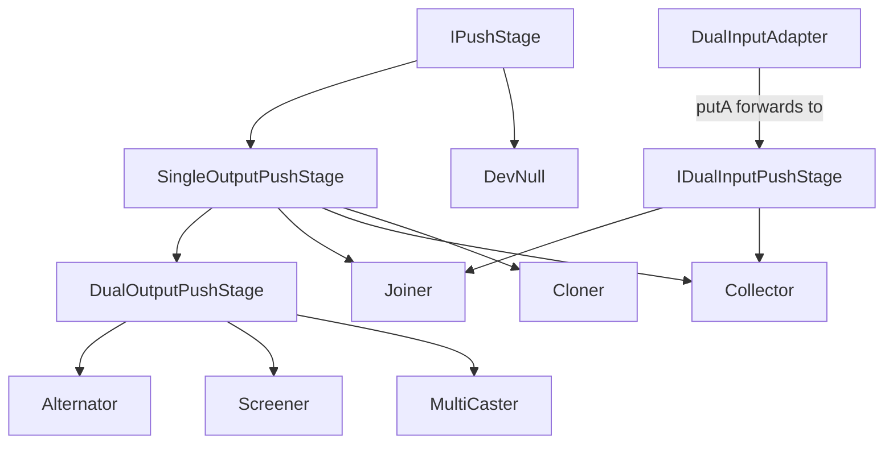

---
digest:
  local-classes:
    Alternator:
      mtime: '2026-09-05T10:23:50Z'
      digest: a34f1f6078e4da1c357850394a54c27fb64312d3cb34640646fc0f2190d66470
    Cloner:
      mtime: '2026-09-05T10:23:51Z'
      digest: 5b7bfbf0b6dc3be0da21e2d9d149ef47bb0d0ca4baf297f5ee924fa0b4cd6a6f
    Collector:
      mtime: '2026-09-05T10:23:54Z'
      digest: c7d9be7e3a35f93de9c4ec968c0ae10237fe51cf31ee4fe32b0387db29c5cde9
    DevNull:
      mtime: '2026-09-05T10:23:57Z'
      digest: d6e4d7159d6c01ddfd502528ad293e5945f734a5e51d20ddc6866c2a65d84c38
    DualInputAdapter:
      mtime: '2026-09-05T10:24:05Z'
      digest: e05615e5dfc5124d9b0e68a768620125dd9a5bcd868d7dede69f438b7598967c
    DualOutputPushStage:
      mtime: '2026-09-05T10:24:08Z'
      digest: aeb828c3fa325ffad855910125a0e64f737ff759a06359b14338bc3de42c71db
    IDualInputPushStage:
      mtime: '2026-09-05T10:12:24Z'
      digest: b0cf5c22f8b1dae5972614250dadf83acd8f76f5454b8cda3295f6bc58a9bdc5
    IPushSource:
      mtime: '2026-09-05T10:12:24Z'
      digest: 14f6730f155ea7ef17ee15cd100d2cea599bc19188af17b90d9e7fe45c633771
    IPushStage:
      mtime: '2026-09-05T10:12:24Z'
      digest: 0e3992512dbd3c024871ca2ece24c419acf7fcc0865c71a181d9f01f58d2c83b
    Joiner:
      mtime: '2026-09-05T10:24:12Z'
      digest: 98bb6c7baedcfa0ef16f1c514b5dd8cb85bd0c7a73a175f7b6b85c5b4f80648f
    MultiCaster:
      mtime: '2026-09-05T10:24:17Z'
      digest: f9ee69d0abe929b2173cffe4402baf1401768b48ed2bc3d312aed87e3d14d9c1
    Screener:
      mtime: '2026-09-05T10:24:21Z'
      digest: a34f1f6078e4da1c357850394a54c27fb64312d3cb34640646fc0f2190d66470
    SingleOutputPushStage:
      mtime: '2026-09-05T10:24:25Z'
      digest: d5b76c17bf6cb740bdef7df5557eb622873534cef9d9a4f542486f037c99df6f
  folders: {}
tags:
- code/multicast
- code/producer_consumer
- code/adapter_pattern
concepts:
- Dataflow
- Pipeline
facets:
  layer: domain
  status: stable
  complexity: medium
description: 'A push-based dataflow pipeline framework: producers actively call `putA`/`putB` on the next stage rather than being pulled from, so control flows forward with the data. `IPushStage` is the single-input contract every stage implements; `IPushSource` marks a stage that can originate new items on demand. `SingleOutputPushStage` and `DualOutputPushStage` are the base classes that hold the "next" reference(s) stages are chained through, and `IDualInputPushStage` adds a second (`putB`) input for stages that combine two channels.'
---

# push

A push-based dataflow pipeline framework: producers actively call `putA`/`putB` on the
next stage rather than being pulled from, so control flows forward with the data. `IPushStage`
is the single-input contract every stage implements; `IPushSource` marks a stage that can
originate new items on demand. `SingleOutputPushStage` and `DualOutputPushStage` are the base
classes that hold the "next" reference(s) stages are chained through, and `IDualInputPushStage`
adds a second (`putB`) input for stages that combine two channels.

On top of these, the folder provides: routers that send each item down one of two paths based
on a predicate (`Alternator`, `Screener` - functionally identical duplicates of each other);
fan-out (`MultiCaster`, which concurrently forwards an item and, optionally, a clone of it to
two successors on a new thread per call); fan-in (`Joiner`, an abstract blocking pairwise-join
of two channels; `Collector`, a non-blocking funnel of two channels into one); a copy-only
decorator (`Cloner`, deprecated in favor of `MultiCaster`'s built-in cloning); an adapter that
lets a single-output producer feed the B side of a dual-input stage (`DualInputAdapter`); and
a discard sink (`DevNull`).

## Architecture

## Entry Points

| Class.Method | Description |
|---|---|
| `IPushStage.putA(Object)` | The single method every stage implements; pushes one item into the stage. |
| `Alternator.putA(Object)` / `Screener.putA(Object)` | Predicate-driven fan-out to one of two next stages. |
| `MultiCaster.putA(Object)` | Fan-out (with optional cloning) of one item to two concurrent successors. |
| `Joiner.putA(Object)` / `Joiner.putB(Object)` | Blocking pairwise join of two input channels into one combined item. |

## Classes

| Class | Responsibility |
|---|---|
| [Alternator](Alternator.java) | Title: Alternator Description: Purpose: Directs the Objects of the streamIO either to one or to the other streamIO. |
| [Cloner](Cloner.java) | Title: Cloner Description: Purpose: Clones / Copies the Message Object and sends it on. |
| [Collector](Collector.java) | Title: Collector Description: Purpose: Funnels two independent input Channels (putA and putB) into a single output Stream. |
| [DevNull](DevNull.java) | Title: DevNull Description: A no-op Sink that discards every Item pushed into it. |
| [DualInputAdapter](DualInputAdapter.java) | Title: DualInputAdapter Description: Purpose: Adapts a single-input IPushStage Producer to feed the second (B) Input of a downstream IDualInputPushStage: every Item it receives via putA is forwarded as putB on the wrapped Stage. |
| [DualOutputPushStage](DualOutputPushStage.java) | Title: DualOutputPushStage Description: Purpose: Base class for a Stage that fans out to two following Stages (next1, next2). |
| [IDualInputPushStage](IDualInputPushStage.java) | Title: IDualInputPushStage Description: Defines the Interface for a Processing Stage with two Inputs. |
| [IPushSource](IPushSource.java) | Title: IPushSource Description: Defines the Interface for a Source of Objects. |
| [IPushStage](IPushStage.java) | Title: IPushStage Description: Defines the Interface for a single Processing Stage Known SubInterfaces: Known Implementors: Known Uses: Copyright: Copyright (c) Matthias Heuer Company: personal Created on 09-11-2002, 09:53 PM |
| [Joiner](Joiner.java) | Title: Joiner Description: Purpose: Joins two Streams by waiting for an Input from both Channels. |
| [MultiCaster](MultiCaster.java) | Title: MultiCaster Description: Purpose: Multicasts an Object and its Copy to both Successors concurrently by creating a new Thread. |
| [Screener](Screener.java) | Title: Screener Description: Purpose: Routes each Object to one of two following Stages, depending on the Result of an ITester Predicate. |
| [SingleOutputPushStage](SingleOutputPushStage.java) | Title: SingleOutputPushStage Description: Purpose: Base class for a pipeline Stage that holds a reference to a single following Stage (next1) and forwards Items to it. |
