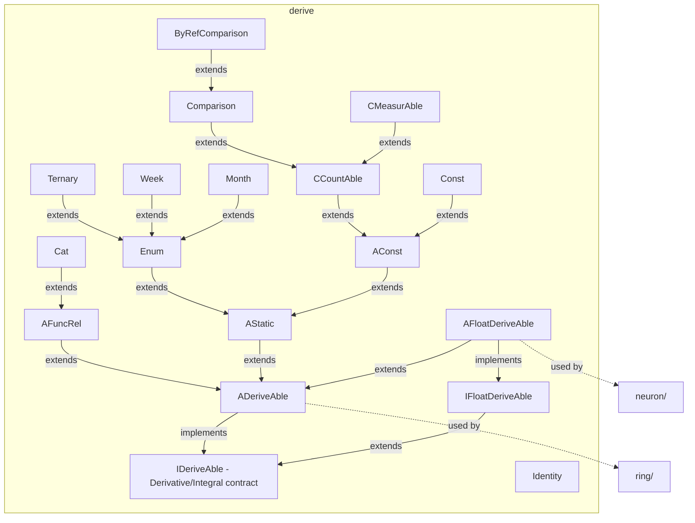

---
digest:
  local-classes:
    AConst:
      mtime: '2026-09-05T10:13:18Z'
      digest: 22bc313301421c596b4bf822744650956a6d9993d1760737e10976654f457280
    ADeriveAble:
      mtime: '2026-09-05T16:14:51Z'
      digest: 75d6bc4371fcf02ba3586ce7bde566ae3c3caf500906d478e3261da487149728
    AFloatDeriveAble:
      mtime: '2026-09-05T16:14:54Z'
      digest: a74a980c5fb4958754067b9483ac83e51b9a25f19cf92dfa273146f969965e69
    AFuncRel:
      mtime: '2026-09-05T10:13:18Z'
      digest: 941e66e9699bab302649c0d57c10e102052b070781e1318d15345e69316cb863
    AStatic:
      mtime: '2026-09-05T10:13:18Z'
      digest: f030b5a08ec082b14ee8ef857d26d4019af5b8c160b0bbc5b3d4782296804254
    ByRefComparison:
      mtime: '2026-09-05T16:17:38Z'
      digest: b817f34ea179447cb18ae995fd71abd78ba92329d58ac0874bb9371a19b357de
    CCountAble:
      mtime: '2026-09-05T16:17:38Z'
      digest: a3bcdf3ae655ecf976eb39855aedf0aceae0e4baec74c1da8b5031d76cba1e9d
    CMeasurAble:
      mtime: '2026-09-05T16:28:44Z'
      digest: 6cfd570b78b644a7174952e4d1545abf4d6646d84a5fa06c73c9648ef352fc70
    Cat:
      mtime: '2026-09-05T16:16:31Z'
      digest: 589d95f28e48132ca4fabf64e09e41f6e4e6601fe41a2f42105b1351b278d78b
    Comparison:
      mtime: '2026-09-05T16:17:38Z'
      digest: 7f6c4f77ff8928a0a8ca1ec33dafa2e6f873e3e8015d61c8bb3c2c566fae795f
    Const:
      mtime: '2026-09-05T16:16:22Z'
      digest: a8e8f4e57b3294eea147904faacfe7222c40c85afbcee431d8093b2f24d9520e
    Enum:
      mtime: '2026-09-05T16:17:11Z'
      digest: 25af641be81fcea98462fa887a5a0a666ed9c9cda219eb12a09a026f612fdc5d
    IDeriveAble:
      mtime: '2026-09-05T16:14:48Z'
      digest: 4c98f9958842fdce3e1f1133b1da7d7228b7768261d16ca33062bdb2989b1726
    IFloatDeriveAble:
      mtime: '2026-09-05T16:15:08Z'
      digest: 2d56abe1321816e1b24998d3cf8e247333f61e45f04dc6ec645aa7da06ad57b5
    Identity:
      mtime: '2026-09-05T16:16:25Z'
      digest: 8acbcbbf1d76bf8fdf02e65c1fc4aadb24c3f0810e0996e35264fe5783086ca7
    Month:
      mtime: '2026-09-05T16:16:27Z'
      digest: 6cb4c9493471fc4d0d40e2160b0a075a4a8ba9088706a4ebbe5fee621985fb70
    Ternary:
      mtime: '2026-09-05T16:29:30Z'
      digest: 7285306fbed827a680140b2a5cc2715961b2463f7d8502da6652c4fc0574a75a
    Week:
      mtime: '2026-09-05T16:16:29Z'
      digest: 4b04997eed9628d7ecd4c29825e4f2b5ae23a8ec28668604820e66731bb44424
  folders:
    neuron/:
      mtime: '2026-09-05T16:32:23Z'
      digest: ef06bc4ce3dabcb8b1d1f1990aa0c0d2e074e01be5715e7d1d88be15b04f109a
    ring/:
      mtime: '2026-09-05T16:39:12Z'
      digest: ebaf5b61f13cdf6e95c4480cff9bfee7ebcdb4d2fdae42dcaeab3b9eb12fcefa
tags:
- code/derivable_function_contract
- code/mathematical_function
concepts:
- Calculus and Function Algebra
facets:
  layer: utility
  status: legacy
  complexity: high
description: 'Foundational contracts and base Classes for a symbolic-differentiation Function library: any Function implementing `IDeriveAble`/`IFloatDeriveAble` can report its own Derivative and Integral (cached and cross-linked via `setDerivative()`/`setIntegral()`), letting the `ring` subfolder''s combinators (`Sum`, `Prod`, `Cat`, ...) build up and differentiate compound Expressions purely by composition. `ADeriveAble`/`AFloatDeriveAble`/`AStatic`/`AFuncRel` supply the default Singleton-oriented implementation most concrete Functions extend; `AConst`/`Const`/`CCountAble`/ `CMeasurAble` are the constant-Function hierarchy (with `Comparison`/`ByRefComparison` as CCountAble-derived helpers); `Cat`/`Identity` provide Function concatenation and the identity element; `Enum` and its `Month`/`Week`/`Ternary` Subclasses implement a Flyweight-based enumeration pattern reused for calendar values and three-valued Logic. The `neuron` subfolder builds a Neural Network layer on `IFloatDeriveAble`, and `ring` builds the symbolic Function Algebra proper, with `ring/body` supplying the concrete transcendental Functions.'
---

# derive

Foundational contracts and base Classes for a symbolic-differentiation Function library: any
Function implementing `IDeriveAble`/`IFloatDeriveAble` can report its own Derivative and Integral
(cached and cross-linked via `setDerivative()`/`setIntegral()`), letting the `ring` subfolder's
combinators (`Sum`, `Prod`, `Cat`, ...) build up and differentiate compound Expressions purely by
composition. `ADeriveAble`/`AFloatDeriveAble`/`AStatic`/`AFuncRel` supply the default
Singleton-oriented implementation most concrete Functions extend; `AConst`/`Const`/`CCountAble`/
`CMeasurAble` are the constant-Function hierarchy (with `Comparison`/`ByRefComparison` as
CCountAble-derived helpers); `Cat`/`Identity` provide Function concatenation and the identity
element; `Enum` and its `Month`/`Week`/`Ternary` Subclasses implement a Flyweight-based
enumeration pattern reused for calendar values and three-valued Logic. The `neuron` subfolder
builds a Neural Network layer on `IFloatDeriveAble`, and `ring` builds the symbolic Function
Algebra proper, with `ring/body` supplying the concrete transcendental Functions.

## Classes

| Class | Responsibility |
|---|---|
| [AConst](AConst.java) | AConst.java Base Class for all constant Functions. |
| [ADeriveAble](ADeriveAble.java) | Title: ADeriveAble Description: Defines Interfaces and Default Implementations for deriveable Functions. |
| [AFloatDeriveAble](AFloatDeriveAble.java) | Title: AFloatDeriveAble Description: Defines Interfaces and Default Implementations for deriveable real valued Functions. |
| [AFuncRel](AFuncRel.java) | AFuncRel Allows ByRef Transport of Function Objects and returns the Function Object's Value in Map(). |
| [AStatic](AStatic.java) | AStatic.java This abstract Class is the Base Class for which have a simpler Representation to be used for Simplification. |
| [ByRefComparison](CCountAble.java) | Mutable variant of Comparison, allowing its Value to be changed after construction. |
| [CCountAble](CCountAble.java) | Title: CCountAble Description: This Class encapsulates the Constant (Scalar) Function and Enums. |
| [CMeasurAble](CMeasurAble.java) | Title: ConstIMeasurAble Description: Concrete Class containing only static Members and Methods Copyright: Copyright (c) Company: |
| [Cat](Cat.java) | Operator Class for the Concatenation 'cat' of unary Functions. |
| [Comparison](CCountAble.java) | Constant IDeriveAble Class with only three possible Values: 0,1,2,3 The Values match the Return Value of the compare() and Position Methods +1. |
| [Const](Const.java) | This Class encapsulates the Constant (Object) Function. |
| [Enum](Enum.java) | Title: Enum Description: Purpose: Abstract Base Class for any Enumeration. |
| [IDeriveAble](IDeriveAble.java) | Interface indicating that a Function can be derived. |
| [IFloatDeriveAble](IFloatDeriveAble.java) | IFloatDeriveAble.java Created on 6. Januar 2001, 18:02 Interface for a real-valued Function that can also return its Derivative at a given point, either alone or jointly with the Function value itself. |
| [Identity](Identity.java) | This Class encapsulates the Identity Function. |
| [Month](Month.java) | Enumeration of the twelve Months of a Year, following the Enum singleton-list pattern. |
| [Ternary](Ternary.java) | Title: Ternary Description: Purpose: Enumeration Example for Ternary boolean Values Purpose / Responsibilities of this Class Implementation Details: If similar Classes exist (e.g. Polymorphism), characterize the specific Differences to compare these. |
| [Week](Week.java) | Enumeration of the seven Weekdays, following the Enum singleton-list pattern. |

## Subsystems

| Folder | Domain Role | Entry Point |
|---|---|---|
| `neuron/` | A small feed-forward and self-organizing Neural Network toolkit. | `ASlab` |
| `ring/` | Building blocks for a small Computer-Algebra-style Function Algebra over an algebraic Ring | `AAlgebra` |

## Architecture

## Entry Points

| Class.Method | Description |
|---|---|
| [IDeriveAble.getDerivative()](IDeriveAble.java#L29) | Returns this Function's Derivative, the root contract every deriveable Function implements. |
| [ADeriveAble.Derivative(IDeriveAble,int)](ADeriveAble.java#L90) | Computes the n-th Derivative of a Function by repeated differentiation. |
| [Cat.Map(Object)](Cat.java#L103) | Evaluates the Concatenation of two unary Functions at a given argument. |
| [Enum.succ()](Enum.java#L273) | Returns the next Value in this Enumeration's cyclic order. |
