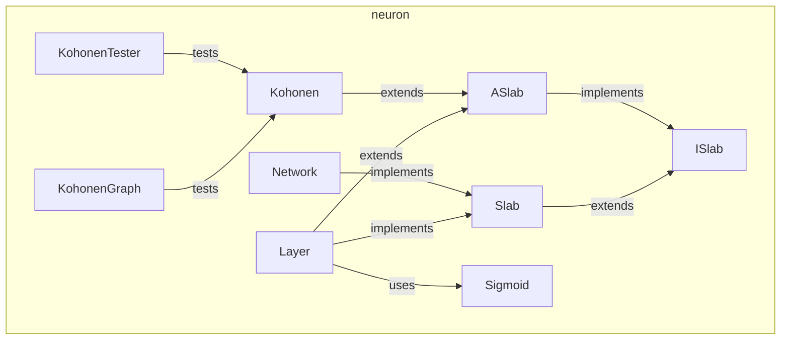

---
digest:
  local-classes:
    ASlab:
      mtime: '2026-09-05T16:31:20Z'
      digest: 51e49a08e51df1c924c5ebccfbc501bb5cc0e6bdd61b64de66d2ede870e24d14
    ISlab:
      mtime: '2026-09-05T10:13:18Z'
      digest: 594e4e9a2f32a6d85eec97437226439cff44dfd2375fb0788ded61c471952c12
    Kohonen:
      mtime: '2026-09-05T16:32:23Z'
      digest: 546e21eaea244e2e7d703b6f6a7366a89654f780cb7eaf6aaf05a7693aa4c94b
    KohonenGraph:
      mtime: '2026-09-05T16:31:50Z'
      digest: 8452130eaa44fa534a9d6431193e2ec43ad4e64f74eb32c058c00d4ec39eb078
    KohonenTester:
      mtime: '2026-09-05T16:32:23Z'
      digest: 65a4caef85d3b4e1b0b917c9a637629949b21586d03fec9fe6eb150c1c6290b8
    Layer:
      mtime: '2026-09-05T10:13:18Z'
      digest: ae6b912ce66378bcf661bf080c48abec40d0b2c0ac400d1f593cbe8056352de1
    Network:
      mtime: '2026-09-05T16:31:36Z'
      digest: e8b8287181cdc6affede637caeb37eb14cef5ca7d8d7b8be15ac2f23f5f0faa5
    Sigmoid:
      mtime: '2026-09-05T16:31:21Z'
      digest: f5e5396852daccb2b9abfe5c5cb73f0749d097b0cd3f7567aaeda572e5e16302
    Slab:
      mtime: '2026-09-05T10:13:18Z'
      digest: b53e751b055f910b6846146dd781a02ac8eb8d2e58b00ed2fbbe8947f95b8330
    testNeuronNet:
      mtime: '2026-09-05T10:13:18Z'
      digest: a32f6471d3d5bb15d4d766c6c05b666248b80f41d1ac54a3286cc6661af5543a
  folders: {}
tags:
- code/neural_network
- code/backpropagation
concepts:
- Neural Networks
facets:
  layer: domain
  status: broken
  complexity: high
description: A small feed-forward and self-organizing Neural Network toolkit. `ISlab`/`Slab`/`ASlab` define the shared contract and Weight-matrix bookkeeping for anything that can be trained by Back Propagation; `Layer` and `Network` compose `Layer`s into a Multilayer Perceptron trained by supervised Back Propagation (with `Sigmoid` as the default Switching Function, reusing the Derivative machinery from `function.derive`); `Kohonen` and its `KohonenGraph`/`KohonenTester` support classes implement an unsupervised, topology-preserving Self-Organizing Map (a Kohonen Map / Topology Representing Network) instead, including a Swing/AWT visualization of its convergence. `testNeuronNet` is the package's self-test entry point.
---

# neuron

A small feed-forward and self-organizing Neural Network toolkit. `ISlab`/`Slab`/`ASlab` define
the shared contract and Weight-matrix bookkeeping for anything that can be trained by Back
Propagation; `Layer` and `Network` compose `Layer`s into a Multilayer Perceptron trained by
supervised Back Propagation (with `Sigmoid` as the default Switching Function, reusing the
Derivative machinery from `function.derive`); `Kohonen` and its `KohonenGraph`/`KohonenTester`
support classes implement an unsupervised, topology-preserving Self-Organizing Map (a Kohonen
Map / Topology Representing Network) instead, including a Swing/AWT visualization of its
convergence. `testNeuronNet` is the package's self-test entry point.

## Classes

| Class | Responsibility |
|---|---|
| [ASlab](ASlab.java) | Contains all the Variables and Methods shared between a normal Layer and a Kohonen Layer |
| [ISlab](ISlab.java) | Abstract Interface for a Layer or a whole neuronal Network |
| [Kohonen](Kohonen.java) | Represents a Kohonen Layer with 1D, 2D, 3D or variable Topology. |
| [KohonenGraph](KohonenGraph.java) | Class for Testing the intermediate Progress of the Kohonen Approximation. |
| [KohonenTester](Kohonen.java) | Class for Testing the intermediate Progress of the Kohonen Approximation. |
| [Layer](Layer.java) | Single Layer of a Network consisting of a Matrix of Weights for the Mapping of the Input Vector to the Output Vector As preprocessing for Input and Output Values it is a good idea to scale one of them to fit the Range of the other or, even better, to scale one of them so the Frequencies on the Range are the same. |
| [Network](Network.java) | Network of a concatenated List of Slabs, which could again be Networks This Network processes both digital and continuous Data. |
| [Sigmoid](Sigmoid.java) | Sigmoid Function with Derivative This Function is one of the most useful Switching Functions, because it is smooth and Calculation of both Function value and Derivative are quite fast! It rises slowly from (-Infinity, 0) through (0, 1/2) to (+Infinity, 1) Caches Results, because frequently both the Function and the Derivative are requested interleaved. |
| [Slab](Slab.java) | Abstract Interface for a Layer or a whole neuronal Network that can be trained using a Back Propagation Mechanism given the Differences between the desired and the real Output. |
| [testNeuronNet](testNeuronNet.java) | This class tests all the Methods of the neuronal Network and can take a variable number of parameters on the command line. |

## Architecture

## Entry Points

| Class.Method | Description |
|---|---|
| [Network.getOutput(float[])](Network.java#L160) | Runs a forward Propagation through every Layer. |
| [Network.backProp(float[])](Network.java#L184) | Trains every Layer by Back Propagation. |
| [Kohonen.MODEL_DATA(int,int,int,IIStreamIn,ITester)](Kohonen.java#L200) | Builds and trains a Kohonen Map from an Input Stream. |
