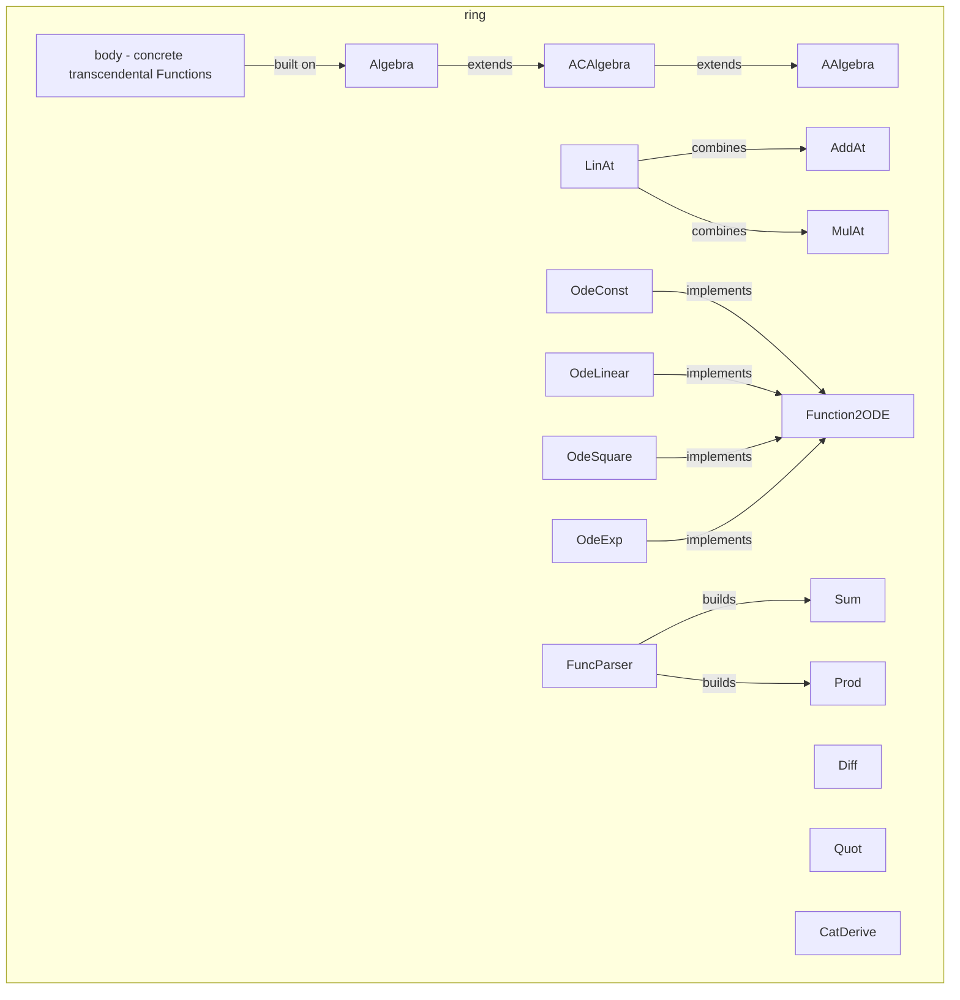

---
digest:
  local-classes:
    AAlgebra:
      mtime: '2026-09-05T10:13:18Z'
      digest: 9666cfd43200b809610e5442000e7c403914703ac285651713e3ecc62d05ebaf
    ACAlgebra:
      mtime: '2026-09-05T10:13:18Z'
      digest: eda0d34d8e93a5d5f8782a46ef3c80d0724ab185adfa5dadb6f30f1804f2eace
    AbsV:
      mtime: '2026-09-05T10:13:18Z'
      digest: 666f901e68f4da049f1a504a4b38ec116d71f649ebe07d9059fdfad836b39192
    AddAt:
      mtime: '2026-09-05T16:34:01Z'
      digest: 09f78d1be17a0e1dc76646a55b9a3d82208133fb9261d542ade048841cb9886b
    Algebra:
      mtime: '2026-09-05T16:39:12Z'
      digest: f3023da330410471b77c245de498a97b24c4b2cfaef87890931996afe1358bb2
    CatDerive:
      mtime: '2026-09-05T10:13:18Z'
      digest: 09c3985bb8ee3f2ce0974106c86c8270b85ad40c36bafeeeec6f63ea75eeabc4
    Delta1:
      mtime: '2026-09-05T10:13:18Z'
      digest: a5147d6f5211bf97d99037b3bff8e06725cae06680db97eb36fcd5c5354a1f9f
    Diff:
      mtime: '2026-09-05T16:34:04Z'
      digest: bc6af96a5c7a1ba01bd57754bc7c434e283922a6976d0d0aa8cca35a8bfb7fff
    DoubleAt:
      mtime: '2026-09-05T10:13:18Z'
      digest: 5d018faaff549ebf9f194aebce5a72c49447d2a7610f67088f419ed4f78dc4d7
    FuncParser:
      mtime: '2026-09-05T10:13:18Z'
      digest: 889e2af19a16052c9268a84674c9af6f8f35ae0b650764f7cd7ce30e8bee7488
    Function2ODE:
      mtime: '2026-09-05T10:13:18Z'
      digest: a49ba64051f75cd62ffe842de82e314f31b6a5b9c989d380e18e73a513d1744e
    HalfAt:
      mtime: '2026-09-05T10:13:18Z'
      digest: 655da3a6ea2b5d841098a2ceb499cbb3297885aa072557c06c70f3ac1b5845ca
    Inv:
      mtime: '2026-09-05T16:34:06Z'
      digest: 8f55ea31cd8f214d23a90301a11bd5ab78e1ea315e9a3c8800860a5384e7313d
    LinAt:
      mtime: '2026-09-05T16:34:14Z'
      digest: 18ddc8ea919bde4f41eb76bc9dd7f8c5e1037068b1aa53eafeff05d7deaf6bf8
    MulAt:
      mtime: '2026-09-05T16:34:58Z'
      digest: b27c8188bbfb17a94316880cd22a12423f6530a7ac38c7b3e0094952e224ae10
    Neg:
      mtime: '2026-09-05T16:35:01Z'
      digest: 084cb8ae337da5f4705f7af814d8ddbafca125697e050dc68f617a736530cee2
    OdeConst:
      mtime: '2026-09-05T10:13:18Z'
      digest: 93e638148437b5f7a3ca8dad7180e56cfd37c24e9613e2ac7e6d07e2c12b2a7a
    OdeExp:
      mtime: '2026-09-05T16:35:06Z'
      digest: 532c5484e78576c6a44e1cab959a808737380cac873bef52ff4c092e37872bc6
    OdeHeight2D:
      mtime: '2026-09-05T10:13:18Z'
      digest: abb387d4ee389b5c5527aed6409385c825abc445e1e4a2543971830902ceb678
    OdeLinear:
      mtime: '2026-09-05T10:13:18Z'
      digest: d25e9cabbec7bb5329819678eec771b8d13ffd1cc9c5f1cd417494e8fe5bdbd2
    OdeSquare:
      mtime: '2026-09-05T10:13:18Z'
      digest: d25e9cabbec7bb5329819678eec771b8d13ffd1cc9c5f1cd417494e8fe5bdbd2
    Pred:
      mtime: '2026-09-05T10:13:18Z'
      digest: 72b7d0d5a36512d0eb97d75b2ed1cb9d98ab60ff37580ce6cef9ad47250d3690
    Prod:
      mtime: '2026-09-05T16:35:20Z'
      digest: 59c3e8d2c9164db372ffb31ec67c2b0b90302aab2ce9d3e59416c1a54f70d603
    Quot:
      mtime: '2026-09-05T16:35:22Z'
      digest: 9864275f86e6ebf05f5554be7ed6d39ac0d65435caa85b420a7cd46b716918c3
    Resid:
      mtime: '2026-09-05T10:13:18Z'
      digest: 43e4613a9a36195c9634635d88c5456ab673fa9a24e06f02337b4e514d25474b
    SawToothAt:
      mtime: '2026-09-05T10:13:18Z'
      digest: 5b3dde82e69faa8284290b1277620d9117ac1e88fb769acf01ff7a28496e400a
    Sign:
      mtime: '2026-09-05T16:35:09Z'
      digest: 3b8c81654988f23dfe9f27aa0b15e37614b4d04c5ed26031d5b7352316901731
    SqRt:
      mtime: '2026-09-05T10:13:18Z'
      digest: 7a8e6ec7ba0f2880c0e229649abe849857bd5098d58a70783f768bd11f4bad5a
    Square:
      mtime: '2026-09-05T10:13:18Z'
      digest: 133a98c53bd14bcda7c8c468b5c74e42b891ce703f0f06f2d02ec33a60f164d6
    Step1:
      mtime: '2026-09-05T16:34:46Z'
      digest: d932a815b9981f430a5863767705eba4bf40cdf475e3a08888187d05531d4675
    Succ:
      mtime: '2026-09-05T10:13:18Z'
      digest: 99b149954fed66d0f89ad77c589bd76019f6282f94527a212efdcd765e41f73e
    Sum:
      mtime: '2026-09-05T16:35:23Z'
      digest: 612e96aba06856a76fee8507f9b8b0e04d156119c7558cd0f376dc8b9ff79bfb
    TestRingFuncs:
      mtime: '2026-09-05T16:35:25Z'
      digest: a8c9432c0dbf9ca14ca436b417f4577aede25189ef1d9385ecf3ce403a337936
    ThirdAt:
      mtime: '2026-09-05T10:13:18Z'
      digest: f774fa56056cf86238892886c7539a7c99ba317e2a76eaf624050ea37828914d
    TripleAt:
      mtime: '2026-09-05T10:13:18Z'
      digest: 5d018faaff549ebf9f194aebce5a72c49447d2a7610f67088f419ed4f78dc4d7
    fEulerFktn:
      mtime: '2026-09-05T10:13:18Z'
      digest: 3cbaa70f8b2a591b8316d39f8d17c58c47d9b79e6138aee56e3aae638b0d2681
    fEulerSum:
      mtime: '2026-09-05T10:13:18Z'
      digest: 0840d965e784a132bf3c3845753f1cf9f2a90556b3c2f2ecb70bc17ccf87f506
    fGeoSum:
      mtime: '2026-09-05T10:13:18Z'
      digest: 5ce1bc415575036215c7b74a24252c0587b1b5073348102448806b33d8f6f948
  folders:
    body/:
      mtime: '2026-09-05T20:43:27Z'
      digest: c83f852dab1861b159bdec9116df3d3bbecc5ad5a882856615421487e1dc3135
tags:
- code/algebraic_function
- code/derivable_function_contract
concepts:
- Ring-Structured Function Algebra
facets:
  layer: utility
  status: legacy
  complexity: high
description: 'Building blocks for a small Computer-Algebra-style Function Algebra over an algebraic Ring (`IIntRing`/`IGroup`/`IGroupM`): binary combinators (`Sum`, `Diff`, `Prod`, `Quot`, `Cat` via `CatDerive`) that combine two `IDeriveAble` Functions and know how to differentiate, integrate and (where possible) invert the combination symbolically; simple affine/scaling combinators (`AddAt`, `MulAt`, `LinAt`, `Neg`, `Inv`); a family of elementary named Functions (`Square`, `SqRt`, `Succ`, `Pred`, `Resid`, `AbsV`, `Sign`, `Step1`, `SawToothAt`, the `...At` fractional helpers); the `Algebra`/`AAlgebra`/`ACAlgebra` wrapper hierarchy that lets an arbitrary Object participate in this Function Algebra; a small expression parser (`FuncParser`); and a handful of `Function2ODE`-derived adapters (`OdeConst`, `OdeLinear`, `OdeSquare`, `OdeExp`, `OdeHeight2D`) that expose a symbolic Function as an ODE right-hand side for numerical integration. The `body` subfolder supplies the concrete transcendental and special Functions (trigonometric, hyperbolic, Gamma/Beta, ...) built on top of this Algebra.'
---

# ring

Building blocks for a small Computer-Algebra-style Function Algebra over an algebraic Ring
(`IIntRing`/`IGroup`/`IGroupM`): binary combinators (`Sum`, `Diff`, `Prod`, `Quot`, `Cat` via
`CatDerive`) that combine two `IDeriveAble` Functions and know how to differentiate, integrate
and (where possible) invert the combination symbolically; simple affine/scaling combinators
(`AddAt`, `MulAt`, `LinAt`, `Neg`, `Inv`); a family of elementary named Functions (`Square`,
`SqRt`, `Succ`, `Pred`, `Resid`, `AbsV`, `Sign`, `Step1`, `SawToothAt`, the `...At` fractional
helpers); the `Algebra`/`AAlgebra`/`ACAlgebra` wrapper hierarchy that lets an arbitrary Object
participate in this Function Algebra; a small expression parser (`FuncParser`); and a handful of
`Function2ODE`-derived adapters (`OdeConst`, `OdeLinear`, `OdeSquare`, `OdeExp`, `OdeHeight2D`)
that expose a symbolic Function as an ODE right-hand side for numerical integration. The `body`
subfolder supplies the concrete transcendental and special Functions (trigonometric, hyperbolic,
Gamma/Beta, ...) built on top of this Algebra.

## Classes

| Class | Responsibility |
|---|---|
| [AAlgebra](AAlgebra.java) | Defines an abstract Algebra or linear (Vector)Space over a Body like the Real Numbers R or the complex Numbers C by extending AIntRing with Monoid Operations. |
| [ACAlgebra](ACAlgebra.java) | ACAlgebra.java Abstract Algebra for constant Functions These have a constant Derivative of 0 / Zero Subclasses: |
| [AbsV](AbsV.java) | Implements a non continuous Version of the AbsV Function, which returns the absolute Value of the Argument. |
| [AddAt](AddAt.java) | This Class encapsulates the Shifting / Adding by a fixed amount Function. |
| [Algebra](Algebra.java) | Defines an Algebra or linear (Vector)Space (i.e. a Mapping) over a Body like the Real Numbers R or the complex Numbers C by extending AFunction with Ring Operations. |
| [CatDerive](CatDerive.java) | Extends the Concatenation Function by Derivation Capabilities |
| [Delta1](Delta1.java) | This Class encapsulates the Delta1 Function. |
| [Diff](Diff.java) | This Class encapsulates the Diff Function: Difference = Minuend - Subtrahend It adds two Functions given in the Constructor. |
| [DoubleAt](DoubleAt.java) | This Class encapsulates the DoubleAt Function. |
| [FuncParser](FuncParser.java) | Implements a Parser for an LL(1) Grammar with the following Operators: +,-,*,/,\,%,>,<,&,\|,!,^ Bracketing overrides any Operator Precedence! Variables are not defined and the Multiplication Sign can not be skipped. |
| [Function2ODE](Function2ODE.java) | ODE Definition for a Time-invariant Function y' = f(x,y) = f(y), The Derivative is not time(x)-dependent and described as a Vector Function |
| [HalfAt](HalfAt.java) | This Class encapsulates the HalfAt Function. |
| [Inv](Inv.java) | This Class encapsulates the Double Function. |
| [LinAt](LinAt.java) | This Class encapsulates the Affine Function for Stretching and Shifting. |
| [MulAt](MulAt.java) | This Class encapsulates the Stretching / Multiplying Function. |
| [Neg](Neg.java) | This Class encapsulates the Negative Function. |
| [OdeConst](OdeConst.java) | ODE Definition for the Constant Functions y = c, The Derivative is always 0 and not dependent on either x or y ! |
| [OdeExp](OdeExp.java) | ODE Definition for the Exponential Functions, The Derivative is a Copy of the current y Value and not dependent on x ! |
| [OdeHeight2D](OdeHeight2D.java) | Conversion of a Height Function to an ODE for constant Height Trajectories. |
| [OdeLinear](OdeLinear.java) | ODE Definition for the linear Functions y = x+c, The Derivative is always 1 and neither x- nor y- dependent! |
| [OdeSquare](OdeSquare.java) | ODE Definition for the Square Functions x^2+c /2, The Derivative is a Copy of the current x Value and not dependent on y ! |
| [Pred](Pred.java) | This Class encapsulates the Predecessor Function. |
| [Prod](Prod.java) | This Class encapsulates the Prod Function: Product = Factor1 * Factor2 It multiplies two Functions given in the Constructor. |
| [Quot](Quot.java) | This Class encapsulates the Quotient Function: Quotient = Dividend / Divisor It multiplies two Functions given in the Constructor. |
| [Resid](Resid.java) | This Class encapsulates the Resid Function: 1 - x It adds the Constant (Function) 1 to it's Argument. |
| [SawToothAt](SawToothAt.java) | This Class encapsulates the periodic Trunc()/SawTooth() Function. |
| [Sign](Sign.java) | Implements a non continuous Version of the Sign Function, which rises from -1 to 1 instantaneously at x = 0. The Width of the Interval in which this Function rises is assumed to 0, so this symbolizes a real discontinuous Function It could be derived to a Delta Function, but that would not scale properly since any Value of Infinity is not comparable. |
| [SqRt](SqRt.java) | This Class encapsulates the Square Root Function. |
| [Square](Square.java) | This Class encapsulates the Square Function. |
| [Step1](Step1.java) | Implements a non continuous Version of the Step (Heaviside) Function, which rises from 0 to 1 instantaneously at x=0. The Width of the Interval in which this Function rises is proportional to 1/H |
| [Succ](Succ.java) | This Class encapsulates the Successor Function. |
| [Sum](Sum.java) | This Class encapsulates the Sum Function: Sum = Summand1 + Summand2 It adds two Functions given in the Constructor. |
| [TestRingFuncs](TestRingFuncs.java) | Tests the Methods of the Package BodyFuncs This class can take a variable number of parameters on the command line. |
| [ThirdAt](ThirdAt.java) | This Class encapsulates the ThirdAt Function. |
| [TripleAt](TripleAt.java) | This Class encapsulates the DoubleAt Function. |
| [fEulerFktn](fEulerFktn.java) | Euler Function N -> R Integer Function with a Limes, that converges to e Used for testing the Limes() Function |
| [fEulerSum](fEulerSum.java) | Ruler Sum Function: N -> R Series with a Sum, that converges to e. e = Sum (n, 1/n!) |
| [fGeoSum](fGeoSum.java) | Geometric Sum Function: N -> R Series with a Sum, that converges to 1/(1-Radix) (starting from 0) resp. to Radix/(1-Radix) (starting from 1) for Radix < 1 |

## Subsystems

| Folder | Domain Role | Entry Point |
|---|---|---|
| `body/` | Concrete elementary and special Functions over a scalar `MetricBody` (a real or real-valued | `ArCosH` |

## Architecture

## Entry Points

| Class.Method | Description |
|---|---|
| [FuncParser.Expression()](FuncParser.java#L71) | Parses an additive Expression into a Function tree. |
| [Sum.getDerivative()](Sum.java#L159) | Differentiates a Sum symbolically. |
| [Algebra.getDerivative()](Algebra.java#L466) | Differentiates a wrapped Function symbolically. |
