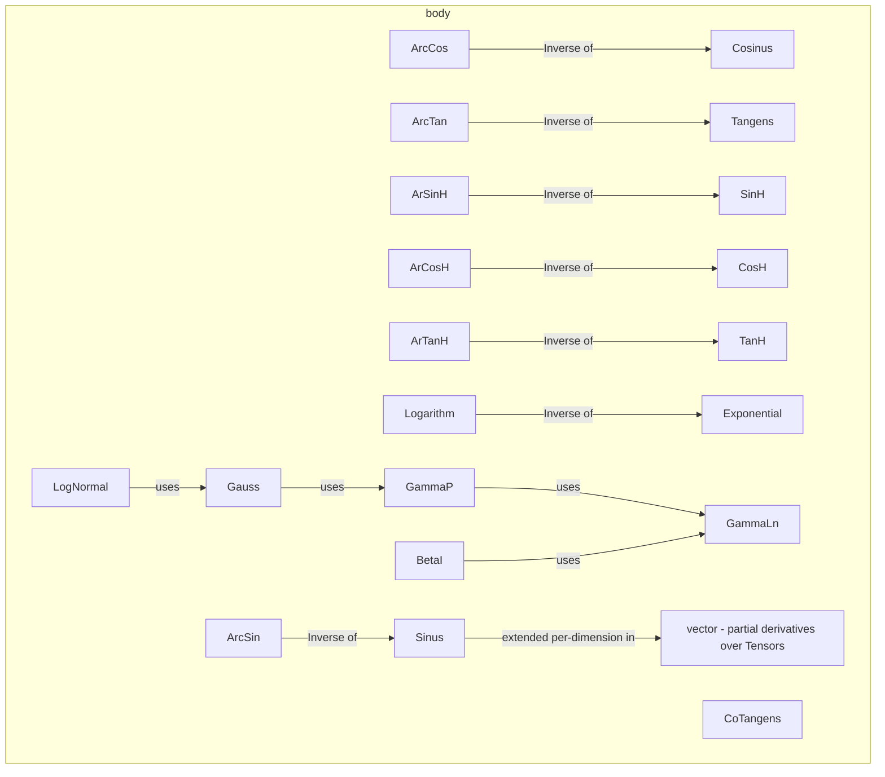

---
digest:
  local-classes:
    ArCosH:
      mtime: '2026-09-05T16:41:31Z'
      digest: cc55969b53f0bf98711c23ba39710f30f60174aa91fdfd8945f903c1034e0fa3
    ArSinH:
      mtime: '2026-09-05T16:41:34Z'
      digest: 85c0bb6b876b4fdc0504e9eb68ad6333ee7188e9dff133f35cd91d28c8bcd87c
    ArTanH:
      mtime: '2026-09-05T16:41:38Z'
      digest: a39c89224c3e0ad02bfe338122b6598df60f2241e2682b01c2a62669b231b567
    ArcCos:
      mtime: '2026-09-05T16:41:39Z'
      digest: 260b7226790d4a15ba786c78132ee325fcb0fa213869128285360a6d76bb33cb
    ArcSin:
      mtime: '2026-09-05T20:43:24Z'
      digest: 270ae0e65470f8f70d54be0c2ade58097038d06d2452f7f0e7ab96994428f9aa
    ArcTan:
      mtime: '2026-09-05T16:41:54Z'
      digest: bd46768a0613896b508092f26f06af82e30d7b4dab306f9982ddb2704e7d2b68
    BetaI:
      mtime: '2026-09-05T16:42:06Z'
      digest: 25dbf3cc5f692ba08200beaa031cc1b6733c7a78e68ceb29a68738f1d61e9b51
    Brillouin:
      mtime: '2026-09-05T16:42:07Z'
      digest: f1e5747d199ef9764d2b463275485f98f676ede0a3f18898d734ce123f15f3bd
    CI:
      mtime: '2026-09-05T16:42:20Z'
      digest: 552be1b72912e410909210435be8c6d4bf2dd025dcdad79b59de43ef9bb82b84
    CoTangens:
      mtime: '2026-09-05T16:42:26Z'
      digest: be011432c84450c84cea47679878a10de0307ccd55f376195a3ce3641fc86d87
    CosH:
      mtime: '2026-09-05T16:42:34Z'
      digest: 1695ba63d9af1e849aaad4d4403c0147a654545f0ebb78e132faa9eea1ff7872
    Cosinus:
      mtime: '2026-09-05T16:42:35Z'
      digest: 29a79546b24c68b561f73fd7baae765e2d08562219bc53dc5856f7c474b1313a
    DawsonInt:
      mtime: '2026-09-05T16:43:07Z'
      digest: 3aa591587d36cdd0a3b03a4af5cda326c634326f0304bf3279d21dba7be1364c
    EI:
      mtime: '2026-09-05T16:43:08Z'
      digest: a2d65a19b857d1ebd7dd60c49fb7f9ec6534e816c084d474ac7821f93b47999f
    ElliptInt:
      mtime: '2026-09-05T16:43:10Z'
      digest: 608ba54aaf69ff84401d2c47225df68b8c01457f0c2474cd8add4f836c804bb4
    Exponential:
      mtime: '2026-09-05T16:44:35Z'
      digest: 0361bccde7cab1bf6df4283c1c570af7b834da6503d9efb0a814180e1866133b
    GammaLn:
      mtime: '2026-09-05T16:44:00Z'
      digest: b5953fffab7a1eec365f8d326aae93d3bd688fd5e4464674096c3bc2dcb9265e
    GammaP:
      mtime: '2026-09-05T16:44:10Z'
      digest: 54ad0d16ffae1e59e092b9673bf7480e32ffc857a3eab9f0e2cd2d5f2590c9bf
    Gauss:
      mtime: '2026-09-05T16:44:39Z'
      digest: a8129f1e7e7d6916f93b5be61868805c54b5f786d6333ad5071db3886b297266
    Langevin:
      mtime: '2026-09-05T16:44:15Z'
      digest: f9a6b8781c5fffcf0458d9e212b801d7c4b50855a8f9927743a209954d6a1ce3
    LogNormal:
      mtime: '2026-09-05T20:31:21Z'
      digest: a60865a0b026d0cd061821920c4eaa28c8d37dd4b612c32fe398aa0cb4bb5f9c
    Logarithm:
      mtime: '2026-09-05T20:42:29Z'
      digest: 17a72627a83724031978c1f1cdefb6b92090918efd0fbd5e022ace64cfbf0dff
    Power:
      mtime: '2026-09-05T20:42:38Z'
      digest: 56a8be822df0989e530278372bb94d5aa9362abab1ef24854313c2a9a409bd82
    SI:
      mtime: '2026-09-05T20:42:39Z'
      digest: 6022a25baeace861a426b72acc8588f4594b80ed049aebf664b9f1db127edf9b
    SinH:
      mtime: '2026-09-05T20:43:26Z'
      digest: bf5079405d573dfc71ab810afb970b1306ebb9cff53a89bbcaf4c5c227d7850f
    Sinus:
      mtime: '2026-09-05T20:43:17Z'
      digest: bd322cf4c58c97b2fc182214c826f16015b5951035c383166c2ddc08f882a685
    TanH:
      mtime: '2026-09-05T20:43:27Z'
      digest: d5f7a49801ce630d8b8247547059ac973d896f56e007f64c98b7d4250987165b
    Tangens:
      mtime: '2026-09-05T20:42:55Z'
      digest: 67bb11546b0f6be09484477434add76e8999162d36cb55c3eb965bc74a5d3b32
    TestBodyFuncs:
      mtime: '2026-09-05T20:42:57Z'
      digest: c64151498bf126230843f8ba510e61e7f366cef6790bf5f70d5114bc27b2acf6
  folders:
    vector/:
      mtime: '2026-09-05T20:45:36Z'
      digest: a2b18851a132bec0b248c61dcf9b9044bae3125034c33c7834609d8b5ebd056d
tags:
- code/mathematical_function
- code/derivable_function_contract
concepts:
- Special Functions and Transcendental Bodies
facets:
  layer: utility
  status: legacy
  complexity: high
description: Concrete elementary and special Functions over a scalar `MetricBody` (a real or real-valued Numeric Type), each implementing the `IFloatDeriveAble` contract from `function.derive` so it can be differentiated, integrated and (where meaningful) inverted like any other combinator in `function.derive.ring`. Covers the trigonometric and hyperbolic families and their inverses (`Sinus`/`ArcSin`, `SinH`/`ArSinH`, ...), the exponential/logarithmic pair, `Power`, and a set of special Functions used by statistics and numerical analysis (`GammaLn`/`GammaP`, `BetaI`, `Gauss`/`LogNormal`, the Exponential/Sine/Cosine Integrals `EI`/`SI`/`CI`, `DawsonInt`, `ElliptInt`, `Brillouin`/`Langevin`). The `vector` subfolder extends the same combinators to per-dimension (partial) derivatives over Tensor-valued arguments. `TestBodyFuncs` is the package's self-test entry point.
---

# body

Concrete elementary and special Functions over a scalar `MetricBody` (a real or real-valued
Numeric Type), each implementing the `IFloatDeriveAble` contract from `function.derive` so it can
be differentiated, integrated and (where meaningful) inverted like any other combinator in
`function.derive.ring`. Covers the trigonometric and hyperbolic families and their inverses
(`Sinus`/`ArcSin`, `SinH`/`ArSinH`, ...), the exponential/logarithmic pair, `Power`, and a set of
special Functions used by statistics and numerical analysis (`GammaLn`/`GammaP`, `BetaI`,
`Gauss`/`LogNormal`, the Exponential/Sine/Cosine Integrals `EI`/`SI`/`CI`, `DawsonInt`,
`ElliptInt`, `Brillouin`/`Langevin`). The `vector` subfolder extends the same combinators to
per-dimension (partial) derivatives over Tensor-valued arguments. `TestBodyFuncs` is the
package's self-test entry point.

## Classes

| Class | Responsibility |
|---|---|
| [ArCosH](ArCosH.java) | This Class encapsulates the ArCosH Function. |
| [ArSinH](ArSinH.java) | This Class encapsulates the ArSinH Function. |
| [ArTanH](ArTanH.java) | This Class encapsulates the ArTanH Function. |
| [ArcCos](ArcCos.java) | This Class encapsulates the ArcCos Function. |
| [ArcSin](ArcSin.java) | This Class encapsulates the ArcSin Function. |
| [ArcTan](ArcTan.java) | This Class encapsulates the ArcTan Function. |
| [BetaI](BetaI.java) | This Class encapsulates the incomplete Beta Function: BetaI(x, a,b) = (Int[0,x] t^(a-1)*(1-t)^(b-1))/Beta(a,b) It is BetaI(0, a, b) = 0 and BetaI(1, a, b) = 1 as well as BetaI(a,b,x) = 1 - BetaI(b,a,1-x) (Symmetry) This Function rises from (0,0) to (1,1) with BetaI(x = a/(a+b)) = 0.5 This Function is used to calculate several Functions for Likelihood: Student's t Fisher's Z The Power Series doesn't converge well, so use the Continued Fraction. |
| [Brillouin](Brillouin.java) | This Class encapsulates the Brillouin Function. |
| [CI](CI.java) | This Class encapsulates the real Exponential Integral (CI) Function. |
| [CoTangens](CoTangens.java) | This Class encapsulates the CoTangens Function. |
| [CosH](CosH.java) | This Class encapsulates the Cosinus Hyperbolicus Function. |
| [Cosinus](Cosinus.java) | This Class encapsulates the Cosinus Function. |
| [DawsonInt](DawsonInt.java) | DawsonInt.java Created on 2. Januar 2001, 10:19 |
| [EI](EI.java) | This Class encapsulates the Exponential Integral (EI) Function. |
| [ElliptInt](ElliptInt.java) | This Class encapsulates the real Elliptic Integral (ElliptInt) Function of the 2nd Kind y arctan y EIn (y,k,a,b) = \| (a+b*x^2) dx \| a+b*tan^2 t \|---------------------------- = \|dt --------------------------- 0 (1+x^2)\/((1+x^2)(1+k^2x^2)) 0 \/((1+tan^2 t)(1+k^2tan^2 t)) For large y this Integral is dominated by ??? For small y this Integral approximates ??? the Derivative: (a+b*x^2) dx ---------------------------- (1+x^2)\/((1+x^2)(1+k^2x^2)) See Numerical Recipes 2nd Ed. p () |
| [Exponential](Exponential.java) | This Class encapsulates the Exponential Function. |
| [GammaLn](GammaLn.java) | This Class encapsulates the Logarithm of the Gamma Function, which is the Extension to the Factorial in the real Domain: Gamma(n+1) = n! Therefore it fulfills the Equation: Gamma(n+1) = n * Gamma(n) This Approximation converges for all complex z. GammaLn = Ln(GammaFactor (x-1.0)) -GammaFactorLn(x) Gamma = GammaFactor (x-1.0) * e^-GammaFactorLn(x) |
| [GammaP](GammaP.java) | This Class encapsulates the normed incomplete GammaP Function together with the Logarithm of the complete Gamma. |
| [Gauss](Gauss.java) | Title: Gauss Description: Defines the cumulative Gauss Function and it's Derivative, the Bell Curve. |
| [Langevin](Langevin.java) | This Class encapsulates the Langevin Function. |
| [LogNormal](LogNormal.java) | The LogNormal Distribution is derived from a normal Distribution in that it's Argument is a Logarithm of the (non-negative) Input. |
| [Logarithm](Logarithm.java) | This Class encapsulates the natural Logarithm Function. |
| [Power](Power.java) | This Class encapsulates the Power Function for arbitrary H: x^H It returns the Argument raised to the fixed Power H for rational H, not only integer H |
| [SI](SI.java) | This Class encapsulates the real part of the Exponential Integral (SI) which is the Integral of the Sinc Function. |
| [SinH](SinH.java) | This Class encapsulates the Sinus Hyperbolicus Function. |
| [Sinus](Sinus.java) | This Class encapsulates the Sinus Function. |
| [TanH](TanH.java) | This Class encapsulates the TanH Function. |
| [Tangens](Tangens.java) | This Class encapsulates the Tangens Function. |
| [TestBodyFuncs](TestBodyFuncs.java) | Tests the Methods of the Package BodyFuncs This class can take a variable number of parameters on the command line. |

## Subsystems

| Folder | Domain Role | Entry Point |
|---|---|---|
| `vector/` | Extends the scalar derivative/integral machinery of `function.derive.ring` into multiple | `CatPartial` |

## Architecture

## Entry Points

| Class.Method | Description |
|---|---|
| [Sinus.Map(double)](Sinus.java#L154) | Returns Sin(x). |
| [Exponential.Map(double)](Exponential.java#L37) | Returns Exp(x). |
| [GammaP.PROBABILITY_CHI_SQR(double,double)](GammaP.java#L139) | Computes the Chi-Squared cumulative Probability. |
| [Gauss.pGaussCum(double)](Gauss.java#L155) | Computes the cumulative normal Distribution. |
