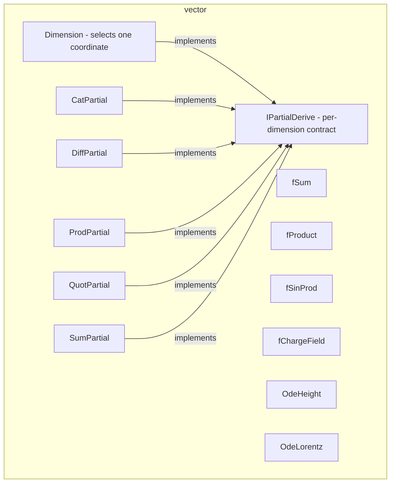

---
digest:
  local-classes:
    CatPartial:
      mtime: '2026-09-05T10:13:18Z'
      digest: a6e1e964dc2fa08b316155deb3ec3a2027e7327db25680d9fa64bbcaab32921a
    DiffPartial:
      mtime: '2026-09-05T10:13:18Z'
      digest: df61794bb77f652a670f6d9f20119f6e872f25cd5fc5fc52ff2de9d66c691b45
    Dimension:
      mtime: '2026-09-05T20:43:45Z'
      digest: f4102c23ed379fd005dd76f561ac8c7c28f2867d03f3a014404cc71c70997e3e
    IPartialDerive:
      mtime: '2026-09-05T10:13:18Z'
      digest: fd882d88c250bcb542da8c552c3b4aca39f194e3fc43fa5c2076720741a67cbd
    OdeHeight:
      mtime: '2026-09-05T10:13:18Z'
      digest: e0b190908d6ed14de495dba832a22a745b00e5f57fceee7aafae932eddb1f60f
    OdeLorentz:
      mtime: '2026-09-05T20:43:48Z'
      digest: 2d76a232e5d6104fb866e1271d7219fd64c0d372ca050de24e92657e3eef15b0
    ProdPartial:
      mtime: '2026-09-05T10:13:18Z'
      digest: a6e1e964dc2fa08b316155deb3ec3a2027e7327db25680d9fa64bbcaab32921a
    QuotPartial:
      mtime: '2026-09-05T10:13:18Z'
      digest: e3b0c44298fc1c149afbf4c8996fb92427ae41e4649b934ca495991b7852b855
    SumPartial:
      mtime: '2026-09-05T20:45:36Z'
      digest: df61794bb77f652a670f6d9f20119f6e872f25cd5fc5fc52ff2de9d66c691b45
    fChargeField:
      mtime: '2026-09-05T10:13:18Z'
      digest: 894b3dcad8ac7be4205bd7eb1a34f647c283facbc85536d2d32d7541398c343b
    fProduct:
      mtime: '2026-09-05T10:13:18Z'
      digest: 4baa9f6361d1276ff0e828d0c2a9e2238af484e97a1851994232993201f43fef
    fSinProd:
      mtime: '2026-09-05T20:43:49Z'
      digest: bbf25575f8194e5e23bbdbb3f5363a1ff6f5b1a03f6d8a05637bc224e940d627
    fSum:
      mtime: '2026-09-05T20:43:52Z'
      digest: 41dace332e9f448f358b85c6c01d83586c094e6cb4fe7f69fa8dace3d31d13a9
    testBodyVFuncs:
      mtime: '2026-09-05T10:13:18Z'
      digest: a32f6471d3d5bb15d4d766c6c05b666248b80f41d1ac54a3286cc6661af5543a
  folders: {}
tags:
- code/differential_integration
- code/vector_math
concepts:
- Vector Calculus and Partial Derivatives
facets:
  layer: utility
  status: broken
  complexity: high
description: Extends the scalar derivative/integral machinery of `function.derive.ring` into multiple Dimensions. `IPartialDerive` and `Dimension` let a Function be differentiated, integrated or inverted with respect to one coordinate of a Vector (Tensor) argument at a time; `CatPartial`, `DiffPartial`, `ProdPartial`, `QuotPartial` and `SumPartial` extend the scalar Cat/Diff/Prod/Quot/Sum combinators with that per-dimension awareness. `fSum`, `fProduct`, `fSinProd` and `fChargeField` are concrete example Functions built on a `Tensor`, and `OdeHeight`/`OdeLorentz` supply ODE right-hand sides (a Force Field derived from a Potential, and the chaotic Lorentz System) for numerical integration elsewhere in the codebase. `testBodyVFuncs` is the package's self-test entry point.
---

# vector

Extends the scalar derivative/integral machinery of `function.derive.ring` into multiple
Dimensions. `IPartialDerive` and `Dimension` let a Function be differentiated, integrated or
inverted with respect to one coordinate of a Vector (Tensor) argument at a time; `CatPartial`,
`DiffPartial`, `ProdPartial`, `QuotPartial` and `SumPartial` extend the scalar Cat/Diff/Prod/Quot/Sum
combinators with that per-dimension awareness. `fSum`, `fProduct`, `fSinProd` and `fChargeField`
are concrete example Functions built on a `Tensor`, and `OdeHeight`/`OdeLorentz` supply ODE right-hand
sides (a Force Field derived from a Potential, and the chaotic Lorentz System) for numerical
integration elsewhere in the codebase. `testBodyVFuncs` is the package's self-test entry point.

## Classes

| Class | Responsibility |
|---|---|
| [CatPartial](CatPartial.java) | This Class adds partial derivability to the Cat Function. |
| [DiffPartial](DiffPartial.java) | Extends Diff to process partial Derivation, Integration and Inversion. |
| [Dimension](Dimension.java) | Helper Function to enable partial Inversion, Integration and Derivation. |
| [IPartialDerive](IPartialDerive.java) | This Interface extends the IDeriveAble Interface to process partial Derivation, Integration and Inversion. |
| [OdeHeight](OdeHeight.java) | Helper Class to integrate ODEs that describe a Force Field, derived from a Potential, i.e. (X',Y') == (dX/dt,dY/dt) == (dS/dx, dS/dy). |
| [OdeLorentz](OdeLorentz.java) | ODE (Differentialgleichung) for the chaotic Lorentz curve, welche die Konvektionsrollen zwischen Schichten beschreibt. |
| [ProdPartial](ProdPartial.java) | This Class adds partial derivability to the Prod Function. |
| [QuotPartial](QuotPartial.java) | This Class adds partial derivability to the Prod Function. |
| [SumPartial](SumPartial.java) | Extends Sum to process partial Derivation, Integration and Inversion. |
| [fChargeField](fChargeField.java) | This Class encapsulates the the Charge Field Function, resulting from the Poisson Equation, in arbitrary Dimensions. |
| [fProduct](fProduct.java) | This Class implements a Function that assumes arg to be a Vector (Tensor) and returns the Product of all Coordinates. |
| [fSinProd](fSinProd.java) | Returns the Product of the Sinusses of all Coordinates times Pi, i.e. the full Period fits into the unit Circle. |
| [fSum](fSum.java) | This Class implements a Function that assumes arg to be a Tensor and returns the Sum of all Coordinates. |
| [testBodyVFuncs](testBodyVFuncs.java) | Tests the Methods of the Package BodyFuncs This class can take a variable number of parameters on the command line. |

## Architecture

## Entry Points

| Class.Method | Description |
|---|---|
| [fSum.Map(Object)](fSum.java#L13) | Sums a Tensor's Coordinates. |
| [fProduct.Map(Object)](fProduct.java) | Multiplies a Tensor's Coordinates. |
| [OdeLorentz.Funktion(IIntRing,IIntRing,IIntRing)](OdeLorentz.java#L35) | Evaluates the Lorentz System's right-hand side. |
