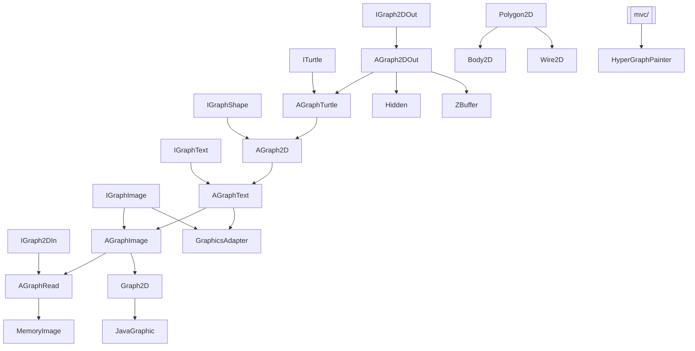

---
digest:
  local-classes:
    AGraph2D:
      mtime: '2026-09-05T12:19:08Z'
      digest: b6956ff6f7cdbd8acae17bd7e2e40f888e423c552bd244e5f9b48add6c23b838
    AGraph2DOut:
      mtime: '2026-09-05T11:55:02Z'
      digest: f6c56e08f3a359eaf0b233e03750f58d292251ad8d1c571b0c6ee838934a7f6b
    AGraphImage:
      mtime: '2026-09-05T11:53:02Z'
      digest: 5020fab31d37f207583a574a24fc9ee9a77efa9e5127ca6782f19b1b94f24307
    AGraphRead:
      mtime: '2026-09-05T11:55:18Z'
      digest: 1589100bcafed1aee8ae9bef8223ae6d23ea4ffa6f5add55d6151bdb8adffb86
    AGraphText:
      mtime: '2026-09-05T12:10:36Z'
      digest: 7e139bdd2d8d74ab996480f461611541bca81d03b3f7d4e0b9ec814de10ef04a
    AGraphTurtle:
      mtime: '2026-09-05T11:49:55Z'
      digest: 7455e2b2f89860219c0028706ddaf7d454e549a74ac8461fcd0fca39499d4d87
    Bar3D:
      mtime: '2026-09-05T11:57:01Z'
      digest: 6ca57ec90983a43a4cad6688c04acbb99526ed9648c5d5836051156c5475b5d7
    Body2D:
      mtime: '2026-09-05T11:58:15Z'
      digest: 5c06d308f3880806f404929266f1490900a082b5258b0fbc8d3fb43f2376f46b
    Figures:
      mtime: '2026-09-05T12:05:24Z'
      digest: 9de35de3fa6dc76ec41c2a657aa6df380ca64050751522ad360723b3cdc19982
    Graph2D:
      mtime: '2026-09-05T11:57:14Z'
      digest: 99e38ed3606a65fe96555080b86c9e9ac0ea35f6d220b8cbb9c862740a86ba3e
    GraphTextMetrics:
      mtime: '2026-09-05T12:10:36Z'
      digest: 4a13afbef640130b63c283b402762d6068f4814e14302d0aa3b3012109543dce
    GraphicPattern:
      mtime: '2026-09-05T11:52:15Z'
      digest: 970a9e919fe501c8dfd2e218d83c1378dc1aadcaa06ecb6ac3fd4e1157c72435
    GraphicsAdapter:
      mtime: '2026-09-05T12:16:31Z'
      digest: ea801da2823a14485f9febd5483a339c679da6130729d5a3433f642b78eccc6b
    Hidden:
      mtime: '2026-09-05T11:55:24Z'
      digest: 92f54315a926c97b63438daf7546f1d07ef8529d63248330e799b8c57468680b
    HyperGraphPainter:
      mtime: '2026-09-05T11:56:54Z'
      digest: 47ea802779e690b9726cebf95694260dabdbae240879ba16e6b12daf81df3d3c
    IDrawAble:
      mtime: '2026-09-05T11:47:42Z'
      digest: 697237ae89fd00545916a47d1e7606d448ccd84823b7a59635cd50c14ee0066d
    IGraph2DIn:
      mtime: '2026-09-05T11:47:11Z'
      digest: 0d1cc27fa2bb7f28424cf65d02302bc551ff282bf57617eb0ea0b34145560377
    IGraph2DOut:
      mtime: '2026-09-05T11:50:15Z'
      digest: 6b2084b3da06623c72ed1154cc008179a1e3988bbb086a8b590fe271e5d29063
    IGraphAddtl:
      mtime: '2026-09-05T12:02:02Z'
      digest: 7510e05fc5f58a85706ce66b470bd447dde1f28bd318ae228f76d59f705b39de
    IGraphImage:
      mtime: '2026-09-05T11:52:34Z'
      digest: 4fe135cfc993ee8a46020020168662818e23c21cbe94ee1ab5ec5639f8ca89a8
    IGraphShape:
      mtime: '2026-09-05T11:58:44Z'
      digest: 17b8f60909c83c739a53bf01e716cca3f1807d501d0bda3ed481047ede74aa8d
    IGraphText:
      mtime: '2026-09-05T11:53:17Z'
      digest: c21eb45016475d99242557348a6d3eb8b97c128e247664e9f3ad15b9f369c3c2
    IPalette:
      mtime: '2026-09-05T11:49:39Z'
      digest: 403d4c4bedd687a711844c351121c8759aab401f1cd50193c3a00aafe1bd3dbc
    IPoint2DFunction:
      mtime: '2026-09-05T11:47:38Z'
      digest: 640c2d04a78c81ff824ac1c2b9b3678d5c05a26a6adeefdc26efb27d9dbbe3a5
    IRaster:
      mtime: '2026-09-05T11:47:48Z'
      digest: cccbead50b83d86f18c190bc344c1933c48069df78129f2f15503d766c6558cc
    ISimplePalette:
      mtime: '2026-09-05T11:47:34Z'
      digest: 53de7ab98f8b45dc69aa228718f5db7d5d223549e4ba901e26912a1b16cc9ca6
    ITurtle:
      mtime: '2026-09-05T11:49:44Z'
      digest: b7414c76e8ed3e5fb465fb76695cdcddc4b77f26c017de5467c9b800b0b4ca2d
    JavaGraphic:
      mtime: '2026-09-05T12:09:12Z'
      digest: 4a5457bb942b01c40253be3c42f2129f8f49d5b5da31627bbdf00ccc85e7425f
    Line2D:
      mtime: '2026-09-05T11:58:11Z'
      digest: 58d14ab05118e5ca00d187769b4af2b183304f48cbc1a2c7bc8df218d0980e77
    Marker:
      mtime: '2026-09-05T12:06:18Z'
      digest: 7f3e9372626a5460beb008a0e69dc4050fa694058f04c8790f4b038e1ba3baf2
    MemoryImage:
      mtime: '2026-09-05T12:02:32Z'
      digest: e6e2987b4d402da3c8ff9549434e79c2077828bcc20231f4e2d969ba2cc7a90e
    PaletteRGB:
      mtime: '2026-09-05T12:03:20Z'
      digest: d9964e816cc6e7a92018723760d9080a615e84877ae8de8aee2bc19c20e49d76
    PaletteShading:
      mtime: '2026-09-05T11:50:12Z'
      digest: 5d6a9746f6b4342a47a494c37b52b6516aa8537295c668cc6caf5ae173c44add
    Point2D:
      mtime: '2026-09-05T12:04:32Z'
      digest: e971f2468efb8a14dc45335d10b10c5239414526cb334745c7f61fe303331bd3
    PolyTrigon:
      mtime: '2026-09-05T12:01:24Z'
      digest: d7ecc38a44429b79afa03dbb7d454ccdd602995c8e41e708424c4bde3d15919c
    Polygon2D:
      mtime: '2026-09-05T11:52:12Z'
      digest: b6973bac9df07c7d1dba7e43af60b16ccee108baa80bc65374a7e07e5ca253fd
    ScalarPlot:
      mtime: '2026-09-05T12:07:03Z'
      digest: f2c5617c86b6f5edd4ff21fd17b0acfbbd3e9b7b04b88e5896fc99110fee792d
    ScalarPlotNew:
      mtime: '2026-09-05T12:08:02Z'
      digest: 980690755fc2b7d9ddd2fd57556fa3e44bb78d0ee57f78cdc304a2aaf198d67a
    TexturePalette:
      mtime: '2026-09-05T11:49:50Z'
      digest: b74b20a31fc3381fc202c9089861ab3d9cacfd59608e534834604648dbddc4c3
    VectorPoint2D:
      mtime: '2026-09-05T12:24:20Z'
      digest: 968951b38b3022e7bbdb467b0199dcf9cef8b0358cb1bf0c930ad946be37048a
    Wire2D:
      mtime: '2026-09-05T11:54:53Z'
      digest: 1d456d041e156550ca8898df3d481b9000384e4deb665d9d1f91b77203ca8fc6
    ZBuffer:
      mtime: '2026-09-05T11:55:27Z'
      digest: 57daa47975574748299f1fb173b7670532920f608b50da38820afa177578ab25
  folders:
    example/:
      mtime: '2026-09-05T11:51:37Z'
      digest: caf719f0962db39506d7382ec31965cc4cbec1e4303c218c2116dab1cf242161
    implement/:
      mtime: '2026-09-05T11:52:39Z'
      digest: 7284e86a90671f1c3dee954a7a72e4609d9b4f92357c8f36f0c084292caefd07
    math2D/:
      mtime: '2026-09-05T11:48:46Z'
      digest: ae9ec52cd933887e0c181b5bc26bee6c2956dd45d9ebfa325aca9629ac0b85aa
    ms3d/:
      mtime: '2026-09-05T11:54:05Z'
      digest: 8220b46b6e99efe1cae38a8191f14c0db7e39d8f2a18a2e7f3d7209b7313e357
    svg/:
      mtime: '2026-09-05T11:48:29Z'
      digest: 454b7ce457cc87052bdd82b07f4c52b1887735fae2c94edbcfd4456542a58fb7
tags:
- code/graphics
- code/rendering
concepts:
- 2D Graphics Abstraction Layer
facets:
  layer: infrastructure
  status: legacy
  complexity: high
description: 'A self-contained 2D graphics abstraction layer predating (and independent of) `java.awt.Graphics2D`: a stack of interfaces and abstract base classes builds line/polygon/text/shape drawing out of a single low-level pixel or color primitive that each concrete backend supplies. `Graph2D` and `JavaGraphic` delegate that primitive to AWT; `GraphicsAdapter` inverts the direction, wrapping an AWT `Graphics` behind the `graphic` interfaces; `MemoryImage` backs it with an in-memory bitmap so images can be read back as well as drawn; `Hidden` and `ZBuffer` layer hidden-surface removal on top. Supporting value types (`Point2D`, `Line2D`, `Polygon2D`, `VectorPoint2D`, `PolyTrigon`), palettes (`IPalette`, `PaletteRGB`, `PaletteShading`, `TexturePalette`), and higher-level shapes (`Figures`, `Body2D`, `Wire2D`, `Bar3D`, `HyperGraphPainter`, `ScalarPlot`/`ScalarPlotNew`) build on this core to render geometry, wireframes, and interpolated color plots.'
---

# graphic

A self-contained 2D graphics abstraction layer predating (and independent of) `java.awt.Graphics2D`:
a stack of interfaces and abstract base classes builds line/polygon/text/shape drawing out of a
single low-level pixel or color primitive that each concrete backend supplies. `Graph2D` and
`JavaGraphic` delegate that primitive to AWT; `GraphicsAdapter` inverts the direction, wrapping an
AWT `Graphics` behind the `graphic` interfaces; `MemoryImage` backs it with an in-memory bitmap so
images can be read back as well as drawn; `Hidden` and `ZBuffer` layer hidden-surface removal on
top. Supporting value types (`Point2D`, `Line2D`, `Polygon2D`, `VectorPoint2D`, `PolyTrigon`),
palettes (`IPalette`, `PaletteRGB`, `PaletteShading`, `TexturePalette`), and higher-level shapes
(`Figures`, `Body2D`, `Wire2D`, `Bar3D`, `HyperGraphPainter`, `ScalarPlot`/`ScalarPlotNew`) build on
this core to render geometry, wireframes, and interpolated color plots.

## Classes

| Class | Responsibility |
|---|---|
| [AGraph2D](AGraph2D.java) | This Graphics Object implements most of the Methods itself, because today most Graphics Devices bring along optimized Versions of these Routines, that would rather be used than theses here. |
| [AGraph2DOut](AGraph2DOut.java) | Implements the pen-position and color bookkeeping common to IGraph2DOut implementations, in terms of a single abstract setPixel-by-color primitive subclasses supply. |
| [AGraphImage](AGraphImage.java) | Implements the convenience overloads of IGraphImage in terms of the one full-parameter drawImage overload subclasses must supply. |
| [AGraphRead](AGraphRead.java) | A graphics context that can be both written and read, adding non-recursive flood fill on top of AGraphImage and IGraph2DIn. |
| [AGraphText](AGraphText.java) | Renders text as vector polygons using a built-in bitmap-derived font, independent of AWT's Font mechanism, plus word-wrapping helpers. |
| [AGraphTurtle](AGraphTurtle.java) | Extends AGraph2DOut with turtle-graphics style movement: relative moves, turns and optional line trailing driven by a current direction and pen position. |
| [Bar3D](Bar3D.java) | Draws and fills 2D and pseudo-3D bars, including full histograms. |
| [Body2D](Body2D.java) | A 2-dimensional mapping of a body made of polygon planes, either a genuinely 2D body or the projection of a 3D body onto two dimensions. |
| [Figures](Figures.java) | The geometric Figures that are not likely substituted by Calls to System Functions, because they are too special, are collected here: Arrows, Coordinate Systems with optional Ticks and Rasters, Triangles, Squares, Rounded Rectangles, Balls with 3D Effect Bezier Splines |
| [Graph2D](Graph2D.java) | Minimal, concrete extension of AGraphImage onto AWT's Graphics, defining only the low-level pixel and clipping methods so it can serve as a testbed for everything AGraph2D, AGraphRead and AGraphText implement. |
| [GraphTextMetrics](AGraphText.java) | FontMetrics for AGraphText's built-in bitmap font: every character has the same fixed advance and ascent, scaled by a constant factor in each direction. |
| [GraphicPattern](GraphicPattern.java) | Generates bit-pattern constants for dashed pens and hatched brushes. |
| [GraphicsAdapter](GraphicsAdapter.java) | Adapts an IGraphImage to a wrapped Graphics instance, delegating nearly every call to it. |
| [Hidden](Hidden.java) | Implements the Hidden Line Algorithm. |
| [HyperGraphPainter](HyperGraphPainter.java) | Paints only the portion of a graph reachable from a focused center node, arranged as a hyperbolic layout with that node in the middle and its neighbors around it. |
| [IDrawAble](IDrawAble.java) | Defines the common contract for objects that can draw and fill their own graphical representation, favoring an object-oriented design over a purely functional one. |
| [IGraph2DIn](IGraph2DIn.java) | Interface describing 2dim Graphics that can also be read. |
| [IGraph2DOut](IGraph2DOut.java) | Most basic interface for output-only graphics in two dimensions. |
| [IGraphAddtl](IGraphAddtl.java) | Defines additional graphic primitives not in java.awt.Graphics, for optimized speed: direct line/rectangle/triangle/polygon drawing built on setPixel() instead of general path filling. |
| [IGraphImage](IGraphImage.java) | Collects all methods related to painting an image, to structure java.awt.Graphics's interface. |
| [IGraphShape](IGraphShape.java) | Defines the interface for painting complex shapes such as polygons, triangles and rounded rectangles, mirroring the relevant part of java.awt.Graphics plus interpolated, palette-driven variants. |
| [IGraphText](IGraphText.java) | Extends IGraphShape with text- and font-related drawing methods, mirroring the relevant part of java.awt.Graphics's interface. |
| [IPalette](IPalette.java) | Determines the color of a pixel from arbitrarily complex parameters encoded in a short[] array. |
| [IPoint2DFunction](IPoint2DFunction.java) | Defines a function that computes an integer value for a given Point2D. |
| [IRaster](IRaster.java) | Extends IPoint2DFunction with a callback for progressively refining raster resolutions, via #setRaster(int, int, int[][]). |
| [ISimplePalette](ISimplePalette.java) | Maps an integer color index to a Color object. |
| [ITurtle](ITurtle.java) | Defines the contract for a stateful colored turtle holding a pen position and orientation. |
| [JavaGraphic](JavaGraphic.java) | Extends Graph2D with optimized methods that delegate to AWT's possibly native routines for simple graphical objects like lines, rectangles, ovals and arcs. |
| [Line2D](Line2D.java) | A line between two integer Point2D coordinates, doubling as a bounding rectangle, ellipse or rounded rectangle depending on how the caller interprets it. |
| [Marker](Marker.java) | Interface for setting a Marker on a Graphics Device. |
| [MemoryImage](MemoryImage.java) | Implements a bitmapped RGB Graphics Object in Memory to enable Reading it. |
| [PaletteRGB](PaletteRGB.java) | Holds a palette, i.e. an array of colors, plus static color-model conversion methods (RGB/HSB/CMY). |
| [PaletteShading](PaletteShading.java) | Derives shaded variants of a single, dynamically replaceable base color. |
| [Point2D](Point2D.java) | The Point2D class represents a location in a two-dimensional ( x ,&nbsp; y ) Integer coordinate space. |
| [PolyTrigon](PolyTrigon.java) | Class to enable rapid trigonometric calculation in the integer range. |
| [Polygon2D](Polygon2D.java) | Adds the (calculated) extent of the resulting polygon to a plain array of points. |
| [ScalarPlot](ScalarPlot.java) | Paints lines, squares, triangles and polygons with bilinearly interpolated scalar color gradients, driven by an integer line-drawing algorithm. |
| [ScalarPlotNew](ScalarPlotNew.java) | Paints lines, squares, triangles and polygons with bilinearly interpolated scalar color gradients, against the generic IGraphShape interface rather than a concrete graphics class. |
| [TexturePalette](TexturePalette.java) | Determines the color of a pixel from the local u,v coordinates of a bitmap. |
| [VectorPoint2D](VectorPoint2D.java) | A typed, dynamically growable array of Point2D objects with integer coordinates. |
| [Wire2D](Wire2D.java) | A 2D wireframe model needing only vertex coordinates and undirected edges, stored as either a SparseMatrix or a MatrixGraph. |
| [ZBuffer](ZBuffer.java) | Implements the Z-Buffer Algorithm. |

## Architecture

## Entry Points

| Class.Method | Description |
|---|---|
| [AGraphImage.drawImage()](AGraphImage.java#L119) | The one full-parameter `drawImage` overload every concrete backend must implement; all other `IGraphImage.drawImage` overloads delegate to it. |
| [AGraph2DOut.setPixel(Color)](AGraph2DOut.java#L95) | Sets the current color and the pixel at the current position in one call - the simplest way to plot a single point. |
| [GraphicsAdapter.GraphicsAdapter(Graphics)](GraphicsAdapter.java#L58) | Wraps an existing AWT `Graphics` so `graphic` interface calls delegate to it. |
| [MemoryImage.MemoryImage(int, int)](MemoryImage.java#L172) | Creates an in-memory, readable bitmap of the given height and width. |
| [Hidden.Hidden(int, IGraph2DOut)](Hidden.java#L70) | Wraps an output graphics context with the hidden-line algorithm. |
| [ZBuffer.ZBuffer(IGraph2DOut, int, int)](ZBuffer.java#L81) | Wraps an output graphics context with Z-buffered hidden-surface removal. |

## Subsystems

| Folder | Domain Role | Entry Point |
|---|---|---|
| `example/` | Standalone AWT demo applets showing classic procedural-generation and emergent-behavior | `AntHillInside` |
| `implement/` | This folder collects concrete `graphic.Graph2D` subclasses that each override pixel | `GrayColor` |
| `math2D/` | Provides affine coordinate mapping between a 2D data range and a Graphics2D target area, plus | `Coord2DMouseController` |
| `ms3d/` | Loads, holds and displays Milkshape 3D (`.ms3d`) character models: meshes, materials, | `FileBMP` |
| `svg/` | This folder renders SVG documents through the `graphic` MVC framework rather than | `SvgApplet` |
