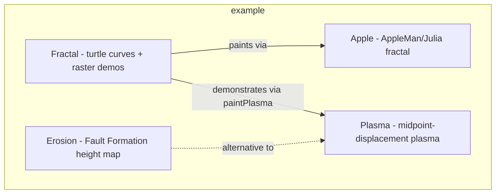

---
digest:
  local-classes:
    AntHillInside:
      mtime: '2026-09-05T11:49:07Z'
      digest: 190448e2d8ee6d9c29f63fb0b405b1606631fec72085f5b71028028e110a4665
    Apple:
      mtime: '2026-09-05T11:50:57Z'
      digest: a0e654b4f5726ea3c44530c821d59632fa8757f721fcd67042900d3cddfbc2d0
    CellularAutomaton1D:
      mtime: '2026-09-05T11:49:54Z'
      digest: 0485dcc8aec69e18709ab6f228b542669bf38114a6ea6316237bcb6d561f1eff
    Erosion:
      mtime: '2026-09-05T11:48:25Z'
      digest: 95adcfa40f678d2a80663c49c06b73b08ac737da0e35547a0eb7a9c0f364e146
    Fractal:
      mtime: '2026-09-05T11:51:37Z'
      digest: 56390f7115e42acb2db1486dcd5312d4a7d10e2802738ce23659ad1f62dc119e
    Plasma:
      mtime: '2026-09-05T11:47:37Z'
      digest: 032b31d0119559d6a638f30f06e5408e93a8788bfaf10b82997d0736ee24dd7b
    TravellingFlock:
      mtime: '2026-09-05T11:47:01Z'
      digest: 1ae0d8241d9702771f77681f721abfafccb34c6159716d8c1b823044d997b730
  folders: {}
tags:
- code/algorithm
concepts:
- Procedural Generation Demos
facets:
  layer: test
  status: legacy
  complexity: medium
description: 'Standalone AWT demo applets showing classic procedural-generation and emergent-behavior algorithms: 1D and 2D cellular automata (`CellularAutomaton1D`, `AntHillInside`), fractal and midpoint-displacement terrain/scalar fields (`Fractal`, `Apple`, `Plasma`, `Erosion`), and a particle-flock simulation (`TravellingFlock`). Each class is self-contained, owns its own `main()`/`testIt()` entry point, and paints into an AWT `Frame` or a `graphic` raster abstraction rather than depending on the rest of this module. The folder exists to illustrate algorithms in isolation, not to provide reusable infrastructure for other parts of the `graphic` tree.'
---

# example

Standalone AWT demo applets showing classic procedural-generation and emergent-behavior
algorithms: 1D and 2D cellular automata (`CellularAutomaton1D`, `AntHillInside`), fractal
and midpoint-displacement terrain/scalar fields (`Fractal`, `Apple`, `Plasma`, `Erosion`),
and a particle-flock simulation (`TravellingFlock`). Each class is self-contained, owns its
own `main()`/`testIt()` entry point, and paints into an AWT `Frame` or a `graphic` raster
abstraction rather than depending on the rest of this module. The folder exists to
illustrate algorithms in isolation, not to provide reusable infrastructure for other parts
of the `graphic` tree.

## Classes

| Class | Responsibility |
|---|---|
| [AntHillInside](AntHillInside.java) | Simulates "Langton's Ant", a 2D cellular automaton that flips pixel color and turns based on the color of the cell it enters. |
| [Apple](Apple.java) | Generates an "AppleMan" fractal (a Mandelbrot/Julia-style escape-time set) over a 2D parameter plane. |
| [CellularAutomaton1D](CellularAutomaton1D.java) | Simulates a 1D elementary cellular automaton, evolving a row of binary cells over time according to a numbered rule. |
| [Erosion](Erosion.java) | Generates a 2D fractal height map using the "Fault Formation" algorithm. |
| [Fractal](Fractal.java) | This Class has no state and therefore only static Methods. |
| [Plasma](Plasma.java) | Generates a 2D fractal scalar distribution ("Plasma") via recursive midpoint displacement over an IRaster. |
| [TravellingFlock](TravellingFlock.java) | Simulates a flock of points that repel each other and drift under random thermal noise, rendered live through a Map2DPainter. |

## Architecture

## Entry Points

| Class.Method | Description |
|---|---|
| [AntHillInside.main(String[])](AntHillInside.java#L199) | Launches the Langton's Ant frame and runs the simulation. |
| [Apple.main(String[])](Apple.java#L250) | Runs the AppleMan/Julia fractal self-test. |
| [CellularAutomaton1D.main(String[])](CellularAutomaton1D.java#L249) | Sweeps through rule numbers, rendering each 1D automaton. |
| [Erosion.MakeTerrainFault(int, int, int, int, int, float)](Erosion.java#L105) | Generates a height map using the Fault Formation algorithm. |
| [Fractal.main(String[])](Fractal.java#L390) | Opens a frame and paints an AppleMan fractal. |
| [Plasma.main(String[])](Plasma.java#L165) | Runs the plasma-generation self-test. |
| [TravellingFlock.main(String[])](TravellingFlock.java#L61) | Launches the flock simulation applet and animates it forever. |
