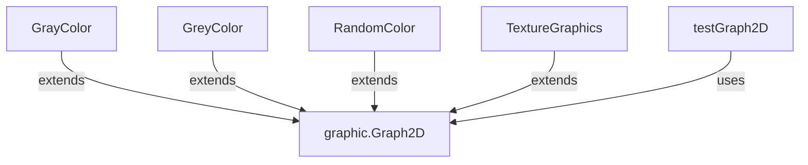

---
digest:
  local-classes:
    GrayColor:
      mtime: '2026-09-05T11:47:47Z'
      digest: c4bf9e6d8a422fc51e7be2f6f5965685a5accffd8d11ca1fb9c32d56e16ff0ec
    GreyColor:
      mtime: '2026-09-05T11:48:31Z'
      digest: 28e019968bec4a470b36335153215dc316ebb048b8621cc6c8dd70980c98ddcf
    RandomColor:
      mtime: '2026-09-05T10:13:18Z'
      digest: 96879795a2fa66471f1bafe3ff733fb4eb8aa0e8d6d3d40223c6607339c5c392
    TextureGraphics:
      mtime: '2026-09-05T11:49:06Z'
      digest: e10dfa76fb3e07d59d7957c94c39d6b5f9e07f3c080e7f98b00f899a6ccb0b2f
    testGraph2D:
      mtime: '2026-09-05T11:52:39Z'
      digest: 64a6dfbeaa0fbfb5b1dffda2f08c50499db0225ffd62b1dd604ccc475bb8f968
  folders: {}
tags:
- code/graphics
concepts:
- Graph2D Color Strategy Implementations
facets:
  layer: utility
  status: legacy
  complexity: medium
description: This folder collects concrete `graphic.Graph2D` subclasses that each override pixel output with a different color strategy - ordered dithering (`GrayColor`), a fixed grey-level raster (`GreyColor`), random palette selection (`RandomColor`), and image-derived texture fill (`TextureGraphics`) - plus `testGraph2D`, a standalone Frame-based demo/test harness that exercises most drawing primitives across the `graphic` package.
---

# implement

This folder collects concrete `graphic.Graph2D` subclasses that each override pixel
output with a different color strategy - ordered dithering (`GrayColor`), a fixed grey-level
raster (`GreyColor`), random palette selection (`RandomColor`), and image-derived texture
fill (`TextureGraphics`) - plus `testGraph2D`, a standalone Frame-based demo/test harness
that exercises most drawing primitives across the `graphic` package.

## Classes

| Class | Responsibility |
|---|---|
| [GrayColor](GrayColor.java) | Graphics Context that uses Dithering, choosing between two neighboring palette colors per pixel based on a precomputed threshold matrix. |
| [GreyColor](GreyColor.java) | Simulates 64 different Levels of Grey by setting the Pixels according to the GreyFillPalette, which defines a Raster of Pixels with growing Density. |
| [RandomColor](RandomColor.java) | Generates Pixels, Lines and Areas with Colors given by a random Selection from the palette. |
| [TextureGraphics](TextureGraphics.java) | TextureGraphics defines a Texture derived from an Image Object as the basis for setting Pixels, drawing Lines and filling Polygons. |
| [testGraph2D](testGraph2D.java) | This class reads PARAM tags from its HTML host page and sets the color and label properties of the applet. |

## Architecture

## Entry Points

| Class.Method | Description |
|---|---|
| [testGraph2D.main](testGraph2D.java#L594) | Application entry point; delegates to `testIt`, which opens the demo `Frame`. |
| [testGraph2D.paint](testGraph2D.java#L365) | Frame paint callback driving the full drawing-primitive demo sequence. |
| [RandomColor.setPixel](RandomColor.java#L32) | Overrides pixel output to pick a random palette color before delegating. |
| [GrayColor.init](GrayColor.java#L54) | Builds the dithering threshold matrix for a given palette and shift. |
| [GreyColor.setPixel](GreyColor.java#L111) | Overrides pixel output to apply the grey-level raster mask. |
| [TextureGraphics.setPixel](TextureGraphics.java#L111) | Overrides pixel output to sample the source image texture. |
