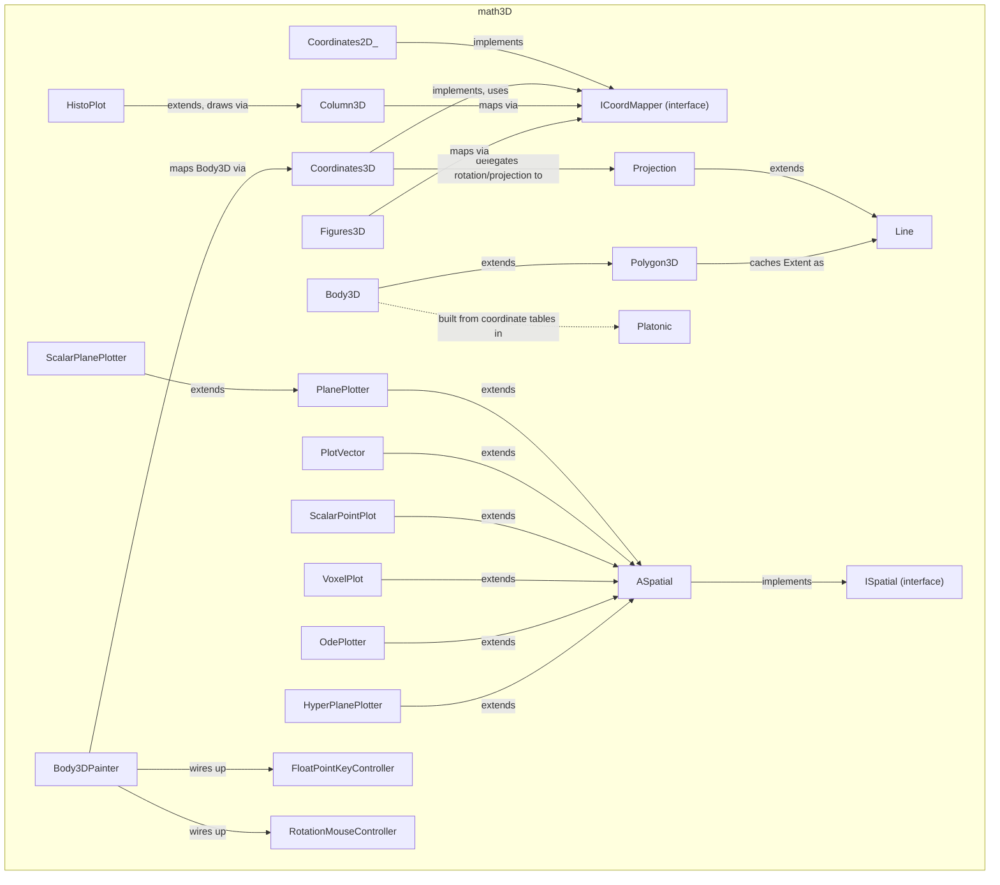

---
digest:
  local-classes:
    ASpatial:
      mtime: '2026-09-05T10:13:18Z'
      digest: c59475f71809f5bfd76bcdc107833e67f861731c5cb6454e496d48b8def0ca10
    Body3D:
      mtime: '2026-09-05T10:13:18Z'
      digest: fa16e1578fd31cd5b678f0e057ba0536849661f7d9493d0548ebfe86e512da48
    Body3DPainter:
      mtime: '2026-09-05T12:42:57Z'
      digest: 14baa639ced5f9161098c13e4f74aa33848bee5965d305c08c1a4953aea99241
    Column3D:
      mtime: '2026-09-05T12:45:17Z'
      digest: f6c86a52d57aecbf0ea7b4175a90235b10ebe5e8ee8dade9fb454ddf81f9647b
    Coordinates2D_:
      mtime: '2026-09-05T10:13:18Z'
      digest: 35bb23fae4f7957d1d20dcd8fd9214732158bf77cc9e77899c771336e2c2f216
    Coordinates3D:
      mtime: '2026-09-05T10:13:18Z'
      digest: c0c91d6e296b87203d94eb9afba07b7ca5262575dd7c71e1d7503584e843d465
    EnumFormXSection:
      mtime: '2026-09-05T12:43:41Z'
      digest: 6b21327e01ec8cedc56f32a7fe5b0f6c8716bbfed32c82f24b81424b864b018f
    Figures2D:
      mtime: '2026-09-05T10:13:18Z'
      digest: c3a08f96e79949a57e4db919efbc6015688199f23a8acec7a4963c97b30d058d
    Figures3D:
      mtime: '2026-09-05T10:13:18Z'
      digest: 8861d828ea0097b54bce66405f710b1623ecb12999fa1af8757d3a9d913335a9
    FloatPointKeyController:
      mtime: '2026-09-05T12:43:04Z'
      digest: 0a7776602a52eda30d4e4e800afb601685439486d5d67dc7573e6385819cf7cf
    HistoPlot:
      mtime: '2026-09-05T10:13:18Z'
      digest: 5eb1542c82861cd9f1f7709708e0de02a32a0feccacb57dc3673a53a1b03fbfd
    HyperPlanePlotter:
      mtime: '2026-09-05T10:13:18Z'
      digest: 3f2710a7e9387a18578a10f248dce64d8ab0b67ed73823334fac3030559072fb
    ICoordMapper:
      mtime: '2026-09-05T10:13:18Z'
      digest: 3b0f55f53a8756d2820b507094a41a4118a671dac67fe74e97a220410920f79f
    ISpatial:
      mtime: '2026-09-05T10:13:18Z'
      digest: df1161a3e8e33ee25911612b2f0901809e2be5b891420b3238e3ca3580d75056
    Line:
      mtime: '2026-09-05T12:43:13Z'
      digest: 42e918f04ea6718cb0151a8d3a3fcf1256695faa19fc4a1c6f02e6c5a6241cad
    OdePlotter:
      mtime: '2026-09-05T12:43:21Z'
      digest: 962ecc865bb78240bcd97fddef180bb170006268a3dcd69133f4ce8659ba6234
    PlanePlotter:
      mtime: '2026-09-05T10:13:18Z'
      digest: 27793d870d4330dcd57cdca39a7a5e9ae4586820301f2f87fe002eb58ff78f62
    Platonic:
      mtime: '2026-09-05T12:43:33Z'
      digest: 658452854a9bea9ff704f76e4f5357d4ebbdebcb30c762621df00ec1f79f04e5
    PlotVector:
      mtime: '2026-09-05T10:13:18Z'
      digest: bfcf629c2bc35bbe17281fb397428edd5e5ec50e88a8693e880ed58b12e80b21
    Polygon3D:
      mtime: '2026-09-05T12:43:41Z'
      digest: 11ba61c60c8c82bc2a3606a6356021ceda036422994bcb90e3cd46f5d2df14b8
    PolygonPlot:
      mtime: '2026-09-05T10:13:18Z'
      digest: 12acfd1555ee5f89e33b30033c6dd529975316a937389593974c3cea48c04b00
    ProjectPlot:
      mtime: '2026-09-05T10:13:18Z'
      digest: 3e045ed3d8c9008790e545d9e8b3ebcd575c15c68de384ebda6e35b36af79644
    Projection:
      mtime: '2026-09-05T10:13:18Z'
      digest: 274cecc64481a7e4c7b8530756741055b1601d5638ebd2e4b08bb4b2a809460c
    RotateFormXSection:
      mtime: '2026-09-05T12:43:41Z'
      digest: 4d05f74052c8e55377cbac74453a9fdf6432748f27703d9be18e6464afa64401
    RotationMouseController:
      mtime: '2026-09-05T10:13:18Z'
      digest: 7e188960c9c2e89bc988fabc1af2f628c72b64e48a90dae220b2cb7c6cb70754
    ScalarPlanePlotter:
      mtime: '2026-09-05T10:13:18Z'
      digest: 192611d1dd35096220e5610c4f447927de0eaa31b84a6aa6ed5304eb561e9034
    ScalarPointPlot:
      mtime: '2026-09-05T10:13:18Z'
      digest: 52ebe7a273d20eccdde68ca02e9ba7fa66c2e7f8121139389241403068789ca9
    TestMathGraph3:
      mtime: '2026-09-05T12:43:48Z'
      digest: 5a16ab48715ae164d55f5d1f9447b20cc7e6ab5cab262fa2209d90de186c8f1e
    TestOdePlotter:
      mtime: '2026-09-05T10:13:18Z'
      digest: 7bf5de9661991cfe6b362288809afbad894d6f33f38b749e92609fdc9ee27248
    TranslationMouseController:
      mtime: '2026-09-05T10:13:18Z'
      digest: 0e7045804931fe6458bef223410610ec7e8205af0e8c21116395a3043647e75c
    VoxelPlot:
      mtime: '2026-09-05T10:13:18Z'
      digest: f1987c4872f750f9fb34abeb6a3d9edb3dd60bde710dd1934387bbe916093607
    Wire3D:
      mtime: '2026-09-05T10:13:18Z'
      digest: 95e747849d8dc3c306319e106763442bc9c2bd36f0b8eb0baa3ff9e7bb1fe6cc
    testMathGraph2:
      mtime: '2026-09-05T12:43:54Z'
      digest: a555733308787286d2372e2b3e51ad11c8708389026984a8ad574214b255f5b9
    testMathGraph3D:
      mtime: '2026-09-05T12:43:56Z'
      digest: 9e1011bc96149b47b55fc3c33048149d63790d3ec049d4cfb92a82662664b585
  folders: {}
tags:
- code/3d_geometry
- code/3d_rendering
- code/coordinate_transform
concepts:
- 3D Graph Visualization and Plotting
facets:
  layer: domain
  status: legacy
  complexity: high
description: 'This folder is a legacy (pre-2004) 3D wireframe/solid graphics engine: it maps 3- and n-dimensional geometry (points, lines, polygons, bodies) onto a 2D `Point2D` viewport through projective or planar coordinate mappings, then renders the result via AWT-level graphics interfaces (`IGraphShape`/`IGraphText`) and Swing/AWT mouse and keyboard controllers. It underlies the older `graphic.math2D` package''s 2D-only counterpart and is itself superseded in places by `TestMathGraph3` over the earlier `testMathGraph2`/`testMathGraph3D` applet classes, which remain for reference and comparison.'
---

# math3D

This folder is a legacy (pre-2004) 3D wireframe/solid graphics engine: it maps 3- and
n-dimensional geometry (points, lines, polygons, bodies) onto a 2D `Point2D` viewport through
projective or planar coordinate mappings, then renders the result via AWT-level graphics
interfaces (`IGraphShape`/`IGraphText`) and Swing/AWT mouse and keyboard controllers. It
underlies the older `graphic.math2D` package's 2D-only counterpart and is itself superseded in
places by `TestMathGraph3` over the earlier `testMathGraph2`/`testMathGraph3D` applet classes,
which remain for reference and comparison.

Three concerns are cleanly layered: geometry storage and calculation (`Line`, `Polygon3D`,
`Body3D`, `Platonic`'s Platonic-solid coordinate tables), coordinate mapping from n dimensions
to 2 (`ICoordMapper`, `Coordinates2D_`, `Coordinates3D`, `Projection`), and drawing helpers that
consume a mapper to paint figures, vector fields, ODE trajectories, histograms and voxel grids
onto a canvas (`Figures2D`/`Figures3D`, `Column3D`, `PlanePlotter` and its `ScalarPlanePlotter`
subclass, `PlotVector`, `HistoPlot`, `ScalarPointPlot`, `VoxelPlot`, `OdePlotter`,
`HyperPlanePlotter`). The `ISpatial`/`ASpatial` pair is the callback contract the rastering
routines in `graphic.math2D.Raster` use to drive most of these plotters recursively over a grid.
User interaction is handled by three small AWT listener classes
(`FloatPointKeyController`, `RotationMouseController`, `TranslationMouseController`) that feed
back into a `Body3DPainter` or one of the `TestMathGraph*`/`testMathGraph*` demo/test classes.

## Classes

| Class | Responsibility |
|---|---|
| [ASpatial](ASpatial.java) | Abstract Class that defaults some Methods of the ISpatial Interface. |
| [Body3D](Body3D.java) | 2 or 3 dimensional Mapping of a Body consisting of Planes. |
| [Body3DPainter](Body3DPainter.java) | Title: Body3DPainter Description: Painter Object, receives or generates a Viewer Window to output the Body3D Model referenced. |
| [Column3D](Column3D.java) | Class for drawing real 3D Columns (solid or wire) import Graph2D.* and Points within this Column. |
| [Coordinates2D_](Coordinates2D_.java) | Adapter from Coordinates2D to the 'ICoordMapper' Interface. |
| [Coordinates3D](Coordinates3D.java) | This Class encapsulates 3 dimensional Mapping to 2 Dimensions. |
| [EnumFormXSection](Polygon3D.java) | Helper IFunction Class to help constructing Rotation Bodies with arbitrary XSections. |
| [Figures2D](Figures2D.java) | Class drawing different Figures (Arrows etc.) |
| [Figures3D](Figures3D.java) | loose Collection of 3dimensional Figures (Arrows, Points with Normals, etc.). |
| [FloatPointKeyController](FloatPointKeyController.java) | Title: FloatPointKeyController Description: Moves the given Vector proportional to the Mouse Drag Movement. |
| [HistoPlot](HistoPlot.java) | Helper Class that encapsulates Drawing a Vector Value in 3 Dimensions. |
| [HyperPlanePlotter](HyperPlanePlotter.java) | Draws the HyperPlane with constant Potential recursively. |
| [ICoordMapper](ICoordMapper.java) | Interface that defines a Mapping Method from a float[] to 2D Coordinates. |
| [ISpatial](ISpatial.java) | Interface that defines Methods of Figures that need to be rastered and drawn into a GUI or placed into or evaluated at a Position. |
| [Line](Line.java) | The Line consists of a Starting Point and an Endpoint thus it corresponds to a multidimensional Interval. |
| [OdePlotter](OdePlotter.java) | Integrates the ODE from the given Starting Points on. |
| [PlanePlotter](PlanePlotter.java) | Stateful Helper Class that encapsulates Drawing a Series of Planes in 3 Dimensions. |
| [Platonic](Platonic.java) | Contains the Coordinates for the five Platonic Bodies |
| [PlotVector](PlotVector.java) | Encapsulates Drawing Vector Arrows in 2 or 3 Dimensions Is to be called by the recursive Rastering Routine. |
| [Polygon3D](Polygon3D.java) | Polygon in 2 or 3 Dimensions. |
| [PolygonPlot](PolygonPlot.java) | Helper Class that encapsulates Drawing a Polygon in 2 or 3 Dimensions. |
| [ProjectPlot](ProjectPlot.java) | Used for drawing Points as well as their Projections to the Coordinate System. |
| [Projection](Projection.java) | Stores the Parameters of a projective or planar Mapping of n to n-1 Dimensions. |
| [RotateFormXSection](Polygon3D.java) | Helper IFunction Class to help drawing Rotation Bodies Used only in Rotation(). |
| [RotationMouseController](RotationMouseController.java) | Title: RotationMouseController Description: Rotates the given Vector proportional to the Mouse Drag Movement. |
| [ScalarPlanePlotter](ScalarPlanePlotter.java) | Helper Routine to be called by the recursive Rastering Routine. |
| [ScalarPointPlot](ScalarPointPlot.java) | Helper Class that encapsulates Drawing Balls symbolizing scalar Values in 3 Dimensions. |
| [TestMathGraph3](TestMathGraph3.java) | This class reads PARAM tags from its HTML host page and sets the color and label properties of the applet. |
| [TestOdePlotter](TestOdePlotter.java) | Title: TestOdePlotter Description: Purpose: Purpose / Responsibilities of this Class Design Decisions / Implementation Details: If similar Classes exist (e.g. Polymorphism), characterize the specific Differences to compare these. |
| [TranslationMouseController](TranslationMouseController.java) | Title: TranslationMouseController Description: Moves the given 2D or 3D Vector proportional to the Mouse Drag Movement. |
| [VoxelPlot](VoxelPlot.java) | Helper Class that encapsulates Drawing a Sequence of HyperCubes (Voxels) in 3D. |
| [Wire3D](Wire3D.java) | Title: Wire3D Description: Adds a Description of the Wireframe Lines to the Points in Polygon3D This is identical to the Model in @see graphic.math2D.Frame2DMap Design Decisions / Implementation Details: If similar Classes exist (e.g. Polymorphism), characterize the specific Differences to compare these. |
| [testMathGraph2](testMathGraph2.java) | Title: testMathGraph2 Description: Purpose: Purpose / Responsibilities of this Class Design Decisions / Implementation Details: If similar Classes exist (e.g. Polymorphism), characterize the specific Differences to compare these. |
| [testMathGraph3D](testMathGraph3D.java) | Title: testMathGraph3D.java Description: Older Class for testing MathGraph3 replaced by TestMathGraph3 Known SubClasses: Copyright: Copyright (c) Matthias Heuer Company: personal Created on 06-28-1999, 12:52 PM |

## Architecture

## Entry Points

| Class.Method | Description |
|---|---|
| [Body3DPainter.draw(IGraphText)](Body3DPainter.java#L156) | Prepares the current frame and paints the mapped 2D body into it. |
| [Coordinates3D.mapPt(float[])](Coordinates3D.java#L113) | Maps a 3D (or n-dim) Vector to the 2D target Range through the current Projection. |
| [Coordinates3D.rasterOrdered(ISpatial, float[][], Object[])](Coordinates3D.java#L293) | Rasters and paints Points in Distance order from the ViewPoint outward, so nearer Points hide farther ones. |
| [Body3D.getBody2D(ICoordMapper)](Body3D.java#L408) | Calculates the 2D projection of this Body, including the painting Sequence of its Planes. |
| [Polygon3D.Tube(float[][], IFunction)](Polygon3D.java#L495) | Creates a 3D Tube Body by sweeping a Cross Section Polygon along this Polygon. |
| [Polygon3D.Ribbon(float)](Polygon3D.java#L455) | Creates a planar Ribbon Body by widening this Polygon along its Normals. |
| [Body3DPainter.loadPolyhedron(int)](Body3DPainter.java#L212) | Loads one of a fixed set of named or numbered Polyhedron files as a {@link Body3D}. |
