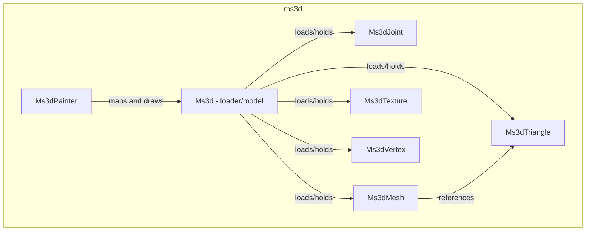

---
digest:
  local-classes:
    FileBMP:
      mtime: '2026-09-05T11:52:16Z'
      digest: 57e87b68c2e71224504d49fd75b12b3c933cc07f390f5d99a07fdc02758d49cb
    Ms3d:
      mtime: '2026-09-05T11:51:57Z'
      digest: 987aaf8f8693977e31dc93799b999f7f6bc95c4bea4fec556c56faa8cc7146cd
    Ms3dJoint:
      mtime: '2026-09-05T11:52:26Z'
      digest: eda016644b4e406ff07fae304e42cc4b75ca01e0918824961f3b8392677aa01d
    Ms3dKeyFrame:
      mtime: '2026-09-05T11:52:42Z'
      digest: a1fbb726a0af9ce52190ab49c29e6f19f489b21549f3d99eb689fb8146700d18
    Ms3dMesh:
      mtime: '2026-09-05T11:52:48Z'
      digest: ba0622e4636a4c23a19c5667897af3db76b6e69a411f664526271430d1097d24
    Ms3dPainter:
      mtime: '2026-09-05T11:53:07Z'
      digest: 76f390e46ed1517600f7b70fec5fdbbc8751d36be18913556b03dfcad52b7275
    Ms3dTexture:
      mtime: '2026-09-05T11:53:32Z'
      digest: 800666f67a1b86c3eb5d6ddd20ee3821e3ff7bb505e2158d45fd1cf7117da49b
    Ms3dTextureMap:
      mtime: '2026-09-05T11:53:49Z'
      digest: b870a1f8527ba2b71eb2f8864ce369ee817fb3da31659a6804ce16fc7afacdcb
    Ms3dTriangle:
      mtime: '2026-09-05T10:13:18Z'
      digest: 988bf11c444ab3d57c3862fca5536a0d577addc83a8069c45fbf592c579d77f2
    Ms3dVertex:
      mtime: '2026-09-05T11:54:05Z'
      digest: eab6d4dff89a68bf2241f3202daa6e4f76f337d5bd1630298c20b2597658fa0e
  folders: {}
tags:
- code/binary_parsing
- code/skeletal_animation
- code/mesh_data
concepts:
- MilkShape 3D Model Loader
facets:
  layer: domain
  status: legacy
  complexity: high
description: 'Loads, holds and displays Milkshape 3D (`.ms3d`) character models: meshes, materials, triangles, vertices and a skeleton of joints with keyframe animation. `Ms3d` is the loader and in-memory model; `Ms3dJoint`, `Ms3dKeyFrame`, `Ms3dMesh`, `Ms3dTriangle`, `Ms3dTexture`, `Ms3dTextureMap` and `Ms3dVertex` are its constituent data records, each reading its own section of the binary file format via `BigEndianReader`. `Ms3dPainter` renders a loaded model by mapping it into 2D and drawing its mesh and bones; `FileBMP` is an unrelated, currently-unimplemented stub for reading Windows BMP images (Java''s image I/O supports only JPEG/GIF/PNG).'
---

# ms3d

Loads, holds and displays Milkshape 3D (`.ms3d`) character models: meshes, materials,
triangles, vertices and a skeleton of joints with keyframe animation. `Ms3d` is the loader
and in-memory model; `Ms3dJoint`, `Ms3dKeyFrame`, `Ms3dMesh`, `Ms3dTriangle`, `Ms3dTexture`,
`Ms3dTextureMap` and `Ms3dVertex` are its constituent data records, each reading its own
section of the binary file format via `BigEndianReader`. `Ms3dPainter` renders a loaded
model by mapping it into 2D and drawing its mesh and bones; `FileBMP` is an unrelated,
currently-unimplemented stub for reading Windows BMP images (Java's image I/O supports only
JPEG/GIF/PNG).

## Classes

| Class | Responsibility |
|---|---|
| [FileBMP](FileBMP.java) | Reads (and writes) a picture from a Windows BMP file, a format Java's own image I/O does not support directly (only JPEG, GIF and PNG); currently a stub, see #FileBMP(). |
| [Ms3d](Ms3d.java) | Loads a Milkshape 3D (.ms3d) model file and holds its meshes, textures, triangles, vertices and skeleton joints, and can stream that data back out or animate the joints. |
| [Ms3dJoint](Ms3dJoint.java) | Stores one skeleton bone's name, parent, start pose and rotation/translation keyframes. |
| [Ms3dKeyFrame](Ms3dKeyFrame.java) | Holds a single animation keyframe's start time and translation-or-rotation vector. |
| [Ms3dMesh](Ms3dMesh.java) | Groups a subset of a model's triangles that share one material/texture. |
| [Ms3dPainter](Ms3dPainter.java) | Painter Object, receives or generates a Viewer Window to output the MilkShape3D Model referenced. |
| [Ms3dTexture](Ms3dTexture.java) | Holds one material/texture loaded from a Milkshape 3D file, including its lighting values, texture/alpha map file names and the loaded #textureImg. |
| [Ms3dTextureMap](Ms3dTextureMap.java) | Holds the texture-coordinate mapping for one vertex of a triangle. |
| [Ms3dTriangle](Ms3dTriangle.java) | Stores one facet triangle's vertex indices, texture and per-vertex texture coordinates. |
| [Ms3dVertex](Ms3dVertex.java) | Stores one model vertex's coordinates and the bone it is attached to. |

## Architecture

## Entry Points

| Class.Method | Description |
|---|---|
| [Ms3d.Ms3d(String)](Ms3d.java#L282) | Loads a full model from a `.ms3d` file path. |
| [Ms3d.loadTextures(Component)](Ms3d.java#L262) | Synchronously loads all of the model's texture images. |
| [Ms3d.getBody3DG()](Ms3d.java#L272) | Builds a `Body3D` view over the loaded vertex/triangle data. |
| [Ms3dPainter.draw(IGraphText)](Ms3dPainter.java#L96) | Maps the model to 2D and paints its mesh and bones. |
| [Ms3dPainter.main(String[])](Ms3dPainter.java#L184) | Standalone entry point that loads and displays a demo model. |
