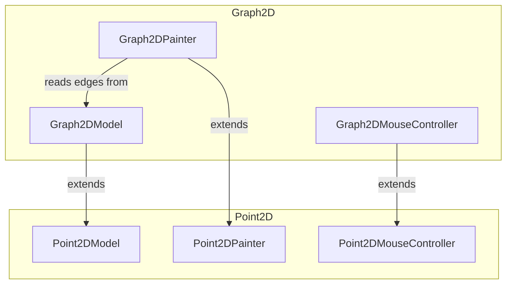

---
digest:
  local-classes:
    Graph2DModel:
      mtime: '2026-09-05T12:51:08Z'
      digest: 08b6753a90adc6f8362b903da0d9e83f1d5631ce9e29203acb5d5a27b1a4a592
    Graph2DMouseController:
      mtime: '2026-09-05T12:51:17Z'
      digest: 04fa73aaa9d93a9ddb38b0fd0e9baf28c69c1b14fe57c45090900c53271e79c3
    Graph2DPainter:
      mtime: '2026-09-05T12:51:30Z'
      digest: 989b9ff8f6c1cecfa2be521f7df6bec1d7fc8404307c7f744af8a62d2db3b791
  folders: {}
tags:
- code/interactive_editing
concepts:
- 2D Graph Editing MVC
facets:
  layer: domain
  status: legacy
  complexity: medium
description: Extends the `Point2D` MVC triad with graph edges.
---

# Graph2D

Extends the `Point2D` MVC triad with graph edges.

`Graph2DModel` adds a `SparseMatrix` of edges (and their labels) on top of `Point2DModel`'s
points, `Graph2DPainter` draws those edges before delegating to `Point2DPainter` to draw the
points on top, and `Graph2DMouseController` extends `Point2DMouseController` so dragging a
released point onto another creates an edge and double-clicking an edge removes it. Not used
for closed polygons with ordered edges - see `plane2D` for that.

## Classes

| Class | Responsibility |
|---|---|
| [Graph2DModel](Graph2DModel.java) | Title: Graph2DModel Description: Stores a Graph as a Set of Points (incl. |
| [Graph2DMouseController](Graph2DMouseController.java) | Mouse controller for Graph2DModel: extends Point2DMouseController with dragging a released point onto another to add an edge, and double-clicking an edge to remove it. |
| [Graph2DPainter](Graph2DPainter.java) | Title: Graph2DPainter Description: Painter Object, receives or generates a Viewer Window to output the Result of it's Instructions. |

## Architecture

## Entry Points

| Class.Method | Description |
|---|---|
| [Graph2DPainter.Graph2DPainter(ICanvas)](Graph2DPainter.java#L77) | Creates a painter over a new, empty graph model. |
| [Graph2DPainter.addDefaultControllers(IController)](Graph2DPainter.java#L191) | Wires up the default key and mouse controllers for a canvas. |
