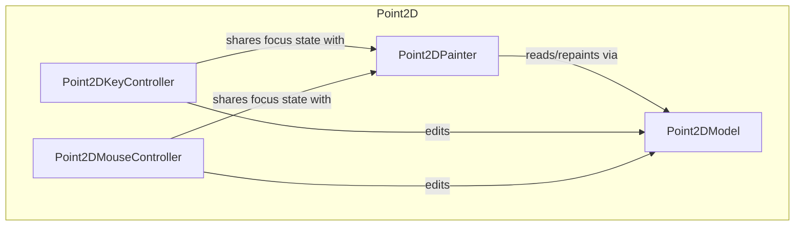

---
digest:
  local-classes:
    Point2DKeyController:
      mtime: '2026-09-05T12:45:39Z'
      digest: 0114a8ef2b3f544e6457867e38b060e48b42a09b8f744b01e33edec63709aaa8
    Point2DModel:
      mtime: '2026-09-05T12:45:47Z'
      digest: 80dcaa25c61173565880f51082d9335edee12cef8361e7b50bcd9c16f17c59b8
    Point2DMouseController:
      mtime: '2026-09-05T12:46:06Z'
      digest: d53606260afcfb332bae03fbaf7adb2b67bc53fc42f2d796ea294aade1d8d722
    Point2DPainter:
      mtime: '2026-09-05T12:46:21Z'
      digest: 9dba3823381794e873b63f2270ca822ac5cce85f6da1c3134ac4c3c9b0dcd845
  folders: {}
tags:
- code/interactive_editing
concepts:
- Point2D Editing MVC
facets:
  layer: domain
  status: legacy
  complexity: medium
description: The concrete MVC implementation for editing a flat set of labeled 2D points.
---

# Point2D

The concrete MVC implementation for editing a flat set of labeled 2D points.

A shared `Point2DModel` holds the point coordinates and labels, `Point2DPainter` renders them
onto an `ICanvas`, and `Point2DKeyController`/`Point2DMouseController` translate keyboard and
mouse input into model edits (add, remove, move, rename). This folder is the base case that
the sibling `Graph2D` folder extends with edges, and that `plane2D` extends with textured 3D
polygons.

## Classes

| Class | Responsibility |
|---|---|
| [Point2DKeyController](Point2DKeyController.java) | Title: Point2DKeyController Description: High-Level Controller, used passively by the Point2DPainter to perform (modifying) Actions on the Model like deleting the active Node, inserting a new at the Mouse Position or changing the Name of the active Node. |
| [Point2DModel](Point2DModel.java) | Title: Point2DModel Description: Model used by the Point2DPainter to read Data from. |
| [Point2DMouseController](Point2DMouseController.java) | Mouse controller for Point2DPainter/Point2DModel: clicking adds or removes a point, and dragging moves the focused point or pans the whole canvas. |
| [Point2DPainter](Point2DPainter.java) | Title: Point2DPainter Purpose: Painter Object, receives or generates a Viewer Window to output the Result of it's Instructions. |

## Architecture

## Entry Points

| Class.Method | Description |
|---|---|
| [Point2DPainter.Point2DPainter(ICanvas)](Point2DPainter.java#L160) | Creates a painter over a new, empty model. |
| [Point2DPainter.addDefaultControllers(IController)](Point2DPainter.java#L263) | Wires up the default key and mouse controllers for a canvas. |
| [Point2DModel.addPoint(Point2D)](Point2DModel.java#L176) | Adds a point to the model. |
