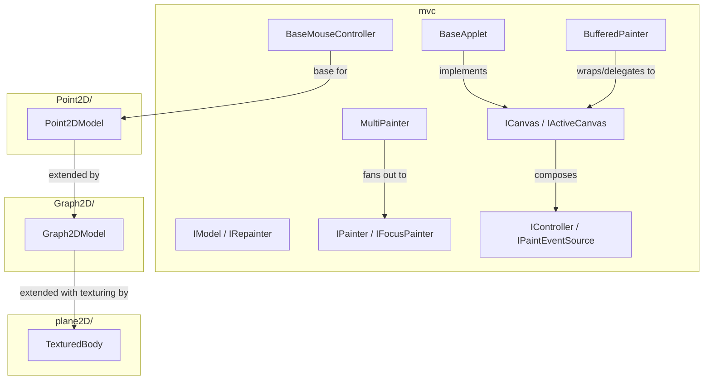

---
digest:
  local-classes:
    AModel:
      mtime: '2026-09-05T12:43:03Z'
      digest: 5c0d3f64f990cf91672080370fc9f72ebdcf0f62b8c389c64344150dd0dfce6f
    BaseApplet:
      mtime: '2026-09-05T12:44:17Z'
      digest: b34fc938c88515a7c9835268a6bf3c127af760107d0e227bf1a5aacc2b2d35a9
    BaseMouseController:
      mtime: '2026-09-05T12:44:45Z'
      digest: 54b32bc1d43cd045b3b37a4f8122df0336e610f7b66da921f67e42dd26eda195
    BufferedPainter:
      mtime: '2026-09-05T12:45:19Z'
      digest: f9814b58fa2efbada79bb7a95ce8004a33aa61db2490fca0c45fea6d173bc5eb
    ClearingPainter:
      mtime: '2026-09-05T12:43:04Z'
      digest: ac56bf661d2904d30266a0f443e08d361ee27dc09af08b5e15dbf61a9fc1f87a
    IActiveCanvas:
      mtime: '2026-09-05T12:42:20Z'
      digest: e3b0c44298fc1c149afbf4c8996fb92427ae41e4649b934ca495991b7852b855
    ICanvas:
      mtime: '2026-09-05T12:46:31Z'
      digest: 47c08a57f7be04a8d5ed1e88542cfbe7fa8e25733763474ef18fe0ce203cbab0
    IController:
      mtime: '2026-09-05T12:42:15Z'
      digest: 2df85afa152d886d09ccf688118f1960b8d41a95ff0e6275f54adb924945f783
    IFocusPainter:
      mtime: '2026-09-05T12:52:13Z'
      digest: 189ee3dbd4fc5cca98a47170a4a40b14408d1152ff02adf6d1003a2d3e73f258
    IModel:
      mtime: '2026-09-05T12:42:01Z'
      digest: e3b0c44298fc1c149afbf4c8996fb92427ae41e4649b934ca495991b7852b855
    IPaintEventSource:
      mtime: '2026-09-05T12:52:16Z'
      digest: f13f257f30fc2d6a29fe59e061434e3f4711886c376da510c85d5f55a0de9591
    IPainter:
      mtime: '2026-09-05T12:42:05Z'
      digest: 10256133fce5514114689ea94983ee890c94d4827625f47a7d216411a219428a
    IRepainter:
      mtime: '2026-09-05T10:13:18Z'
      digest: 2685d5a4b1612e9c63f801587279f6d2755bc597420775c6fd12901eb1e25b84
    KeyCounter:
      mtime: '2026-09-05T12:43:01Z'
      digest: a8a22936b66ca3e988942aa148a479661fa88028cf6f32a282f3992d41494f28
    MultiPainter:
      mtime: '2026-09-05T12:43:21Z'
      digest: 4b170351e96f008e98bac8d9c6c22b8e496516b09e0c61efc047c12f4517925d
  folders:
    Graph2D/:
      mtime: '2026-09-05T12:51:30Z'
      digest: 8270efcfcf23c54b34398c7b09ccff11aea572ab26bffb0004a828bc45fb7e31
    plane2D/:
      mtime: '2026-09-05T12:50:28Z'
      digest: 81e1da7066230162ef0d83e88349bec3aada9ecebbb850856f90f2584fbe50b2
    Point2D/:
      mtime: '2026-09-05T12:46:21Z'
      digest: f241bc0e6713394ff6570e3e0469b6bf533fb6bdf0916067062d984ad002f29d
tags:
- code/observer_pattern
- code/gui
concepts:
- Model-View-Controller Framework
facets:
  layer: infrastructure
  status: legacy
  complexity: high
description: A Model-View-Controller framework for 2D graphics built on AWT/Applet, predating Swing usage in this codebase.
---

# mvc

A Model-View-Controller framework for 2D graphics built on AWT/Applet, predating Swing usage
in this codebase.

The core contract lives in the `I*` interfaces: `IModel`/`IRepainter` define a model that can
push a repaint to its views, `IPainter`/`IFocusPainter` define a view that draws itself and
optionally tracks a focused point, `IController`/`IPaintEventSource` define an input source
that broadcasts paint events, and `ICanvas`/`IActiveCanvas` compose a passive drawing surface
with an active controller. `BaseApplet` is the concrete `IActiveCanvas` most applications
build on; `MultiPainter` fans a paint event out to several painters (with `AModel` and
`KeyCounter` as simple examples), `ClearingPainter` clears the background before other
painters draw, and `BufferedPainter` adds off-screen double buffering by delegating to a
wrapped canvas. `BaseMouseController` is the shared low-level mouse-event base that the three
sub-packages build their high-level, domain-specific controllers on: `Point2D` edits a plain
set of labeled points, `Graph2D` extends that with edges between points, and `plane2D` renders
textured 3D polygons.

## Classes

| Class | Responsibility |
|---|---|
| [AModel](AModel.java) | Title: AModel Description: Purpose: Overhead for introducing the MVC: Variables and Constants have to be shared (focusPointIndex, pointRadius) Events have to be routed (like this refresh() as well as the Controller Events) Known SubClasses: Known Uses: Copyright: Copyright (c) Matthias Heuer Company: personal Created on 10-26-2002, 12:47 PM |
| [BaseApplet](BaseApplet.java) | Title: BaseApplet Description: Base Class for Applets and Forms which are able to draw complex Models. |
| [BaseMouseController](BaseMouseController.java) | Title: BaseMouseController Description: Purpose: Basic Helper Class for low Level Mouse Events Determines the Distance of a Drag&Drop Event Known SubClasses: |
| [BufferedPainter](BufferedPainter.java) | Title: BufferedPainter Description: Painter Object, receives or generates a Viewer Window to output the Result of it's Instructions. |
| [ClearingPainter](ClearingPainter.java) | Title: ClearingPainter Description: A Painter that only clears the Graphics Context up to its ClipBorders. |
| [IActiveCanvas](IActiveCanvas.java) | Combines a passive ICanvas with an active IController into a single canvas that both draws and reacts to input. |
| [ICanvas](ICanvas.java) | Interface for a passive drawing surface that exposes its graphics context and size, and can be told to repaint. |
| [IController](IController.java) | Interface for a low-level controller that exposes AWT input-listener registration hooks. |
| [IFocusPainter](IFocusPainter.java) | A IPainter that tracks which of several drawn points currently has input focus, and can locate the point nearest a given screen position. |
| [IModel](IModel.java) | Marker interface for an MVC model that can notify its views to repaint themselves. |
| [IPaintEventSource](IPaintEventSource.java) | Interface for a source that broadcasts paint events to a set of subscribed IPainters. |
| [IPainter](IPainter.java) | Interface for a View/Painter object that renders itself onto a graphics context. |
| [IRepainter](IRepainter.java) | Title: IRepainter Description: Defines the Interface for the repaint() Method Known SubClasses: Known Uses: Copyright: Copyright (c) Matthias Heuer Company: personal Created on 10-26-2002, 12:47 PM |
| [KeyCounter](KeyCounter.java) | Title: KeyCounter Description: Counts the Number of Times that a Key has been pressed. |
| [MultiPainter](MultiPainter.java) | Title: MultiPainter Description: Delegates Painting to a List of Painters. |

## Subsystems

| Folder | Domain Role | Entry Point |
|---|---|---|
| `Graph2D/` | Extends the `Point2D` MVC triad with graph edges. | `Graph2DModel` |
| `plane2D/` | Renders textured 3D bodies (loaded from MilkShape3D-style model files) as flat, painted 2D polygons. | `MatrixShort` |
| `Point2D/` | The concrete MVC implementation for editing a flat set of labeled 2D points. | `Point2DKeyController` |

## Architecture

## Entry Points

| Class.Method | Description |
|---|---|
| [BaseApplet.BaseApplet()](BaseApplet.java) | The concrete `IActiveCanvas` most applications embed or extend. |
| [MultiPainter.addPainter(IPainter)](MultiPainter.java#L53) | Subscribes a painter to be invoked on every draw. |
| [BaseApplet.display(IPainter\[\])](BaseApplet.java#L517) | Convenience entry point that opens a window and displays the given painters. |
