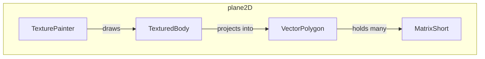

---
digest:
  local-classes:
    MatrixShort:
      mtime: '2026-09-05T12:49:27Z'
      digest: 8896c4bbc3d18a82bc0b7adb2b093106e526612bc600a65cd1fb0e545678a362
    TexturePainter:
      mtime: '2026-09-05T12:50:11Z'
      digest: c6d20fbcb9a1ef389595c643dec60089d7557428b79b1e9e54af076891cf590b
    TexturedBody:
      mtime: '2026-09-05T12:50:15Z'
      digest: c7ce1b74ddfea5ab3713853850a2e1f1eebe7faa43113d9164ee4f6b2d05a559
    VectorPolygon:
      mtime: '2026-09-05T12:50:28Z'
      digest: 84d3d0ab21780b5a618275e329d2dbdaf0760f7fcdccf21940113db967cda067
  folders: {}
tags:
- code/polygon_operations
- code/texture_mapping
concepts:
- 3D Model Texture Mapping and Rendering
facets:
  layer: domain
  status: broken
  complexity: high
description: Renders textured 3D bodies (loaded from MilkShape3D-style model files) as flat, painted 2D polygons.
---

# plane2D

Renders textured 3D bodies (loaded from MilkShape3D-style model files) as flat, painted 2D polygons.

`MatrixShort` is the low-level fixed-dimension coordinate/color matrix that represents one
polygon; `VectorPolygon` is a growable, optionally z-ordered collection of those polygons;
`TexturedBody` extends the plain `Body3D` mesh with texture coordinates and image references
and projects itself into a `VectorPolygon` each frame; `TexturePainter` drives that
projection and draws the result onto an `ICanvas`, extending the math3D `Body3DPainter` MVC
base with texturing.

## Classes

| Class | Responsibility |
|---|---|
| [MatrixShort](MatrixShort.java) | Title: MatrixShort Description: Structure (Polygon) to hold a dynamically growable Set of short[][] Point Objects with integer Coordinates and arbitrary Dimension (e.g. x,y,z Coordinates, Colors, Normals etc. ) Dynamic Array for holding short[][] Arrays usually used as Polygons. |
| [TexturePainter](TexturePainter.java) | Title: TexturePainter Description: Painter Object, receives or generates a Viewer Window to output the MilkShape3D Model referenced. |
| [TexturedBody](TexturedBody.java) | Title: TexturedBody Description: Additionally to it's Base Class, this stores Mappings to the Texture Coordinates and the References to the actual Textures. |
| [VectorPolygon](VectorPolygon.java) | Title: VectorPolygon Description: Dynamic Array for holding short[][][] Arrays usually used as Polygons generated from a 3D Model. |

## Architecture

## Entry Points

| Class.Method | Description |
|---|---|
| [TexturePainter.TexturePainter(ICanvas)](TexturePainter.java#L55) | Creates a texture painter over a passive canvas. |
| [TexturedBody.TexturedBody(String)](TexturedBody.java#L123) | Loads a textured body's geometry and textures from disk. |
| [TexturedBody.map(Coordinates3D)](TexturedBody.java#L136) | Projects the body into a drawable {@link VectorPolygon}. |
