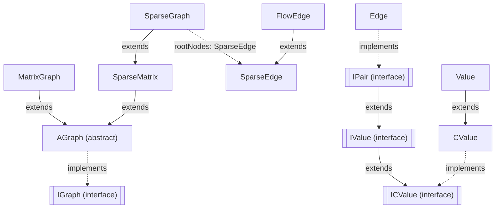

---
digest:
  local-classes:
    ACopy:
      mtime: '2026-09-05T10:13:18Z'
      digest: 869682918298db3d61f7b14e57309c8c1574194f815858861e6fce6fd8b5f1d5
    AEdgeStreamIn:
      mtime: '2026-09-05T10:42:19Z'
      digest: 80a6a7a7edec8c069378826a5f270944ee6ab0ff4362a39fb12cd7235dc56174
    AGraph:
      mtime: '2026-09-05T10:43:25Z'
      digest: dcbd7c14c5b67876e2d47ab169628f7abab2250e61f506f7eac6a27b21b86b60
    AdjMatrixEdgeStream:
      mtime: '2026-09-05T10:13:18Z'
      digest: dc81d0e54883831404906b566e6b48260a66df27b5b7f2d78dd4c6e5d812be04
    CValue:
      mtime: '2026-09-05T10:42:25Z'
      digest: 35cd6d7e5c95c03f9d06eee1b92bba05a8a9e6ad4e502a6fac90a1cf6dd25401
    DisJointSet:
      mtime: '2026-09-05T10:13:18Z'
      digest: 2995c9d885f3f6b7c7359d2060d970dfbecff7bb4c48e55f94a6fea0e7932f5c
    Edge:
      mtime: '2026-09-05T10:42:47Z'
      digest: c971612b7288d3d6a2bd3fd853bc31c62da385b0af85d30d259edd3e33c82533
    EquivalenceByParent:
      mtime: '2026-09-05T10:13:18Z'
      digest: e9d0e6ae10eed7e5a3f2be8d35ceef1fbe66b33455114519c520fda9618779e2
    FlowEdge:
      mtime: '2026-09-05T10:13:18Z'
      digest: 5df170b2624e2ef854962e7928450970b244fca683cff0c9a37077ae0436605f
    ICPair:
      mtime: '2026-09-05T10:42:13Z'
      digest: a1903fea526db7b8ec68adf2d1a8f525aa6a9e486a4fb1a5a214c032ab9da6ca
    ICValue:
      mtime: '2026-09-05T10:42:14Z'
      digest: a1903fea526db7b8ec68adf2d1a8f525aa6a9e486a4fb1a5a214c032ab9da6ca
    ICopy:
      mtime: '2026-09-05T10:13:18Z'
      digest: e3b0c44298fc1c149afbf4c8996fb92427ae41e4649b934ca495991b7852b855
    IEdgeStreamIn:
      mtime: '2026-09-05T10:42:22Z'
      digest: 5dd2816353def7ebd9fda650dc32649733fd0bf88ed91f5243f0b372b47ed012
    IGraph:
      mtime: '2026-09-05T10:42:48Z'
      digest: a8e5db3a205ba4059e1f21d37843ad4e92377debff806fdd50d8ae718733f9df
    ILinkAble:
      mtime: '2026-09-05T10:13:18Z'
      digest: 02f8a32a2515220d0985bf0096e93989a761924ec16a4a4c6c64ddd328d9b6ff
    ILinked:
      mtime: '2026-09-05T10:13:18Z'
      digest: 866d059657e42585b77618772023c2dd3e668f289e0a60224684696e3e27bcbd
    IPair:
      mtime: '2026-09-05T10:13:18Z'
      digest: a1903fea526db7b8ec68adf2d1a8f525aa6a9e486a4fb1a5a214c032ab9da6ca
    IValue:
      mtime: '2026-09-05T10:13:18Z'
      digest: e3b0c44298fc1c149afbf4c8996fb92427ae41e4649b934ca495991b7852b855
    IValueSetter:
      mtime: '2026-09-05T10:13:18Z'
      digest: a1903fea526db7b8ec68adf2d1a8f525aa6a9e486a4fb1a5a214c032ab9da6ca
    KeyValuePair:
      mtime: '2026-09-05T10:13:18Z'
      digest: 679e476b42c9836e85ae4e6227488a31715dfa894efff1be38e5fe76d05bf183
    MatrixGraph:
      mtime: '2026-09-05T10:13:18Z'
      digest: 7638e3e128dab1585b68eebaa8cd40a7603b6cc0bd0ffb91063f63dceb933e87
    Pair:
      mtime: '2026-09-05T10:13:18Z'
      digest: dc5827bc5288eaff970c51a3fc2e11d5cd237892cb2f99ebea0417db6de40fee
    PairKey:
      mtime: '2026-09-05T10:13:18Z'
      digest: 679e476b42c9836e85ae4e6227488a31715dfa894efff1be38e5fe76d05bf183
    PairSym:
      mtime: '2026-09-05T10:13:18Z'
      digest: 08cdb8852638623110cf22feab9735b2f393258f8b9d499866dba68789bc5eae
    PairVal:
      mtime: '2026-09-05T10:13:18Z'
      digest: 07de60191b93b2804b9729fc75af6ddb2ef2d98e25bda5aeea42efbc28b3c747
    Pairing:
      mtime: '2026-09-05T10:13:18Z'
      digest: 846c23449e0b4a5d53d6a14871469ffc509f6e29526d0a2e2a697fbc8ce935b4
    SparseEdge:
      mtime: '2026-09-05T10:13:18Z'
      digest: 24cef15f00d873ba5855444563eba719465f13967bd7c46ed362a2e61f22b727
    SparseEdgeStream:
      mtime: '2026-09-05T10:42:08Z'
      digest: 4655b80fb20e296b0cabc113437e17376bb20b4953a4524e2090e8003ea17fa0
    SparseGraph:
      mtime: '2026-09-05T10:13:18Z'
      digest: 2462d4931fc2560264a0442753f682006ffd1fac8b038548c0ba2dfd80971cae
    SparseMatrix:
      mtime: '2026-09-05T10:42:08Z'
      digest: 872df4a22456b9371aae67b66f7154709774b069b55d03537beaa6dfbdd7f74b
    StringIndex:
      mtime: '2026-09-05T10:42:46Z'
      digest: 656b90ade27942cc27572ab0cd1cf626aa6970605ef4b99c85d8460d146860ed
    Value:
      mtime: '2026-09-05T10:42:29Z'
      digest: 8b1f92079d952aab897ddabf24ff33779654228f90c2fa841a452c9ea2eb6e08
    testGraph:
      mtime: '2026-09-05T10:42:34Z'
      digest: 49b364a9d8448f92ff4acee01bff747c1c4ce7a78ad00055901d45e75589b448
  folders: {}
tags:
- code/graph_data_structure
- code/sparse_graph
- code/adjacency_matrix
concepts:
- Graph Data Structures
facets:
  layer: domain
  status: legacy
  complexity: high
description: 'This folder is a small graph-theory library: representations of weighted, directed or undirected graphs, algorithms over them (shortest paths, spanning trees, connected / strongly connected components, articulation points, maximum flow, topological sort, Hamilton cycles, stable pairing), and the supporting value types they are built from. Two independent graph representations exist side by side, both implementing `IGraph`: `MatrixGraph`, a dense adjacency-matrix backed by a `float[][]` (best for small or dense graphs, O(V^2) space and typically O(V^2) operations), and `SparseMatrix` / `SparseGraph`, a sparse adjacency-list backed by per-node linked lists of `SparseEdge` (better for large, sparse graphs, O(V+E) space). `SparseGraph` extends `SparseMatrix` with the graph algorithms (components, DAG/topological sort, bridges, flow); `AGraph` is a shared abstract base holding bulk edge-loading helpers and ternary-logic constants used by both representations.'
---

# graphs

This folder is a small graph-theory library: representations of weighted, directed or
undirected graphs, algorithms over them (shortest paths, spanning trees, connected /
strongly connected components, articulation points, maximum flow, topological sort,
Hamilton cycles, stable pairing), and the supporting value types they are built from.
Two independent graph representations exist side by side, both implementing `IGraph`:
`MatrixGraph`, a dense adjacency-matrix backed by a `float[][]` (best for small or dense
graphs, O(V^2) space and typically O(V^2) operations), and `SparseMatrix` /
`SparseGraph`, a sparse adjacency-list backed by per-node linked lists of `SparseEdge`
(better for large, sparse graphs, O(V+E) space). `SparseGraph` extends `SparseMatrix`
with the graph algorithms (components, DAG/topological sort, bridges, flow); `AGraph` is
a shared abstract base holding bulk edge-loading helpers and ternary-logic constants
used by both representations.

A second, unrelated group of types supports generic key/value and pair abstractions used
throughout: `IValue`/`ICValue`/`CValue`/`Value` form a small hierarchy of read/write
single-value holders, and `Pair`/`PairKey`/`PairSym`/`PairVal`/`KeyValuePair` build
various key-value pair semantics (identity by key only, by value only, symmetric, or
both) on top of them - independent of the graph representations, but used by `Edge` and
`SparseEdge` for the key/value pairs that describe a connection. `DisJointSet` and
`EquivalenceByParent` implement union-find / equivalence-class algorithms that are used
internally (e.g. by `SparseGraph.connectedComponentIndex()`) but can also be used
standalone. `StringIndex` is an unrelated small utility that interns Strings as dense
integer indices, for mapping node names onto the integer node ids the graph classes
require. `testGraph` and the classes' own `testIt()`/`main()` methods are ad hoc
self-tests from before this codebase had a real unit-test setup, not production entry
points.

## Architecture

## Entry Points

| Class.Method | Description |
|---|---|
| `IGraph.addEdge(int, int, boolean, float)` | Adds (or strengthens) a weighted edge; the common way both representations are populated. |
| `SparseGraph.stronglyConnectedComponents()` | Computes strongly/connected components via a single depth-first traversal. |
| `MatrixGraph.maximumFlow(int, int, float[][], float)` / `SparseMatrix.maxFlow(int, int, float)` | Computes maximum flow between a source and sink using augmenting shortest paths. |
| `SparseMatrix.minimumDistanceOrSpan(int)` | Computes shortest paths from a node, or the minimum spanning tree if no start node is given. |

## Classes

| Class | Responsibility |
|---|---|
| [ACopy](ACopy.java) | Default Implementation of Interface ICopy |
| [AEdgeStreamIn](AEdgeStreamIn.java) | Abstract base for streams of Edge objects (adjacency-list/-matrix iterators). |
| [AGraph](AGraph.java) | Abstract base for IGraph implementations, holding the shared ternary-logic and default-weight/-type Constants and a library of static helper Methods for bulk- loading Edges into any IGraph from int/char/float/double Arrays, a full Weight Matrix, or a StreamTokenizer, plus generating random or scale-free Graphs. |
| [AdjMatrixEdgeStream](MatrixGraph.java) | Read-only Iterator Class for this Type of Container. |
| [CValue](CValue.java) | Minimal, mutable holder for a single Object Value, implementing ICValue. |
| [DisJointSet](DisJointSet.java) | Builds up a Forest of disjoint Sets by adding Elements and successively adding Parents to the Elements identified by Elements (Edges) of Equivalence Relations. |
| [Edge](Edge.java) | Edge.java Value Class to transfer the Characteristics of an Edge identified by integer Values (e.g. Array Indices). |
| [EquivalenceByParent](EquivalenceByParent.java) | Title: EquivalenceByParent Description: Defines an Equivalence Relation by comparing the Root Objects of |
| [FlowEdge](FlowEdge.java) | extends the ListEdge with a Value for the Flow Throughput and a Reference to the Transposed Edge to set the reverse Flow |
| [ICPair](ICPair.java) | Title: ICPair Description: Defines the Interface for a Constant (read only) Object that links two Objects. |
| [ICValue](ICValue.java) | Title: ICValue Description: Defines the Interface for a stateful Constant Objet that can return (a Copy or Read Only Version of) its Value. |
| [ICopy](ICopy.java) | Minimum Interface to describe a copyAble Object leaving out all of the changing Operations This Method could be implemented by making the internal clone() Method public and catching all the possible Exceptions All "Value Classes" should implement this Interface, because it allows for a fast shallow Copy without compromising it's Contents. |
| [IEdgeStreamIn](IEdgeStreamIn.java) | Defines the Interface for a Class that delivers a streamIO of Edge objects, e.g. one Row of an adjacency Matrix or List at a time. |
| [IGraph](IGraph.java) | Interface for all Graph-specific Operations: querying and mutating Edges (add/set, weighted or Flow), and reading Fan-In/Fan-Out and In-/Out-Degree per Node or for the whole Graph. |
| [ILinkAble](ILinkAble.java) | Title: ILinkAble.java Description: Implementors of this Interface are used for linked Lists and upward navigable Trees. |
| [ILinked](ILinked.java) | Title: ILinked.java Description: These are used for linked Lists and upward navigable Trees. |
| [IPair](IPair.java) | Title: IPair Description: Defines the Interface for a read / write Object that links two Objects This is more modular and standalone than using the |
| [IValue](IValue.java) | Title: IValue Description: Defines the Interface for a stateful Objet that can return its Value. |
| [IValueSetter](IValueSetter.java) | Title: IValueSetter Description: Defines a separate Interface for the setVal Method. |
| [KeyValuePair](KeyValuePair.java) | Title: KeyValuePair Description: This Pair Class assumes the Identity of its key only. |
| [MatrixGraph](MatrixGraph.java) | Fixed Size Matrix Representation (Adjacency Matrix) of dense (un-)directed Graphs (Trees or Forests). |
| [Pair](Pair.java) | Title: Pair Description: Lightweight Class to group two Objects neither symmetrically nor asymmetrically. |
| [PairKey](PairKey.java) | Title: PairKey Description: This Pair Class assumes the Identity of its key only. |
| [PairSym](PairSym.java) | Title: PairSym Description: Lightweight Class to symmetrically group two Objects, i.e. (A,B) == (B,A). |
| [PairVal](PairVal.java) | Title: PairVal Description: Lightweight Class to group two Objects. |
| [Pairing](Pairing.java) | Title: Pairing Description: Contains Methods to generate a maximum ranked Pairing for (bipartite) Graphs. |
| [SparseEdge](SparseEdge.java) | Container Record Class for the Adjacency List. |
| [SparseEdgeStream](SparseMatrix.java) | Iterator Class for this Type of Container This Iterator is quite similar to the Iterator of |
| [SparseGraph](SparseGraph.java) | Title: SparseGraph Extends SparseMatrix by adding numerous Graph Methods. |
| [SparseMatrix](SparseMatrix.java) | Implements a contiguous 2D dynamic Linked List (for Cols) and dynamic Length (for Rows) Representation of sparse Matrices which can also be used for Graphs (Tree, Forest, Polygons or general Network) represented by float Numbers stored in a dynamic ListItem Vector. |
| [StringIndex](StringIndex.java) | Bidirectional mapping between Strings and dense zero-based int Indices, assigned in first-seen Order. |
| [Value](Value.java) | Extends CValue with a public #setVal(Object), implementing IValue for a mutable, read/write single-Value holder. |
| [testGraph](testGraph.java) | Command-line entry point that runs the self-tests of several unrelated Classes (SparseMatrix, MatrixGraph, DisJointSet and two Classes outside this Package) in sequence; kept separate from those Classes' own testIt() Methods just to bundle them into one runnable Program. |
