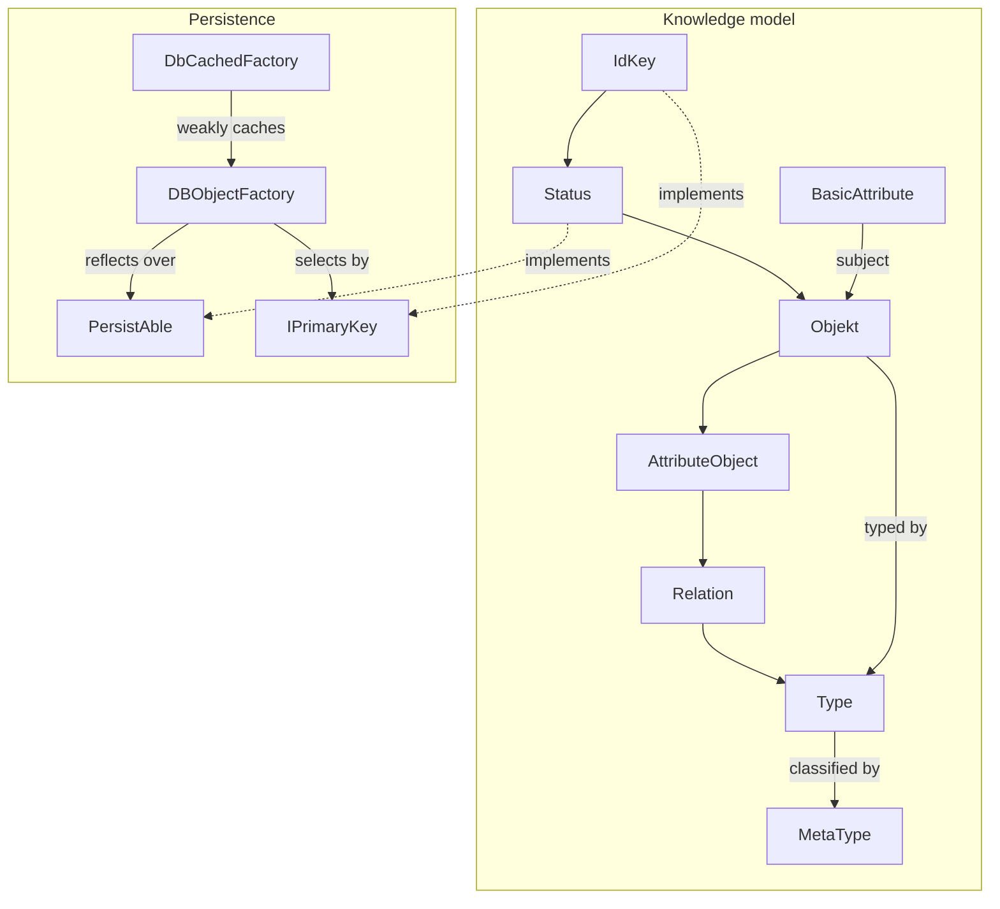

---
digest:
  local-classes:
    AttributeObject:
      mtime: '2026-09-05T08:13:26Z'
      digest: 3ad6a09b894102a440ecb61db23b95c40f26b3ba7d4c0a3904553dbeebab54d8
    BasicAttribute:
      mtime: '2026-09-05T08:12:43Z'
      digest: 33b966511689c9b9caed04d6f16b44d712582f3fef5f9ca6fcf4b2b07ad75b8a
    CachedValue:
      mtime: '2026-09-05T08:10:13Z'
      digest: 327a7738f6b4f8450bcdd6bc19927b6d3e7fd0cfe659814458fd248eaae31460
    DBObjectFactory:
      mtime: '2006-03-11T02:04:43Z'
      digest: 1c6bc609d8ecc848acc12f660f2491e9827acda816c4619787b280f66bb9b5da
    DbCachedFactory:
      mtime: '2026-09-05T08:15:05Z'
      digest: f67c870a8da4593e7b6730db628bb74fb020aa5596bca60c4fe8a15f25bfbaad
    DirtyFlag:
      mtime: '2026-09-05T08:10:26Z'
      digest: 946778b2895cc75af25c1b608b1736f2397fe6825b5c144fc1d3c2292303e331
    EnumAttribute:
      mtime: '2026-09-05T08:13:09Z'
      digest: 7ac9f2da8972260a9befa646c7fcb1831c1220bb8d43db75e5c45dc7039c8cbd
    IAttribute:
      mtime: '2026-09-05T08:07:14Z'
      digest: 4f4123369d7d12f341250849fbd47e9e18a25d43795079d28a169d1b03eb0f89
    IDescriptor:
      mtime: '2026-09-05T08:08:18Z'
      digest: fa851efe1fb3361d5f2a89597fc80163781a5806062d7de484091002c9aae71e
    IDirtyFlag:
      mtime: '2026-09-05T08:08:12Z'
      digest: 07a767715e8234a811703fa44c6fe1783af77296bfe14dbca74aa7a9a78d7e05
    IObject:
      mtime: '2026-09-05T08:07:26Z'
      digest: 4855d745126326a3a5dfef45e7fef31c9f50798a59a098db19119792967a942d
    IPersistAble:
      mtime: '2026-09-05T08:10:52Z'
      digest: 9e9b4bb3b0c2bb592006bbca3e036b6c4fbeecab5a7cb185450dc9775c37865c
    IPrimaryKey:
      mtime: '2026-09-05T08:08:35Z'
      digest: fdda815f85185d9922e37b2cc1d6b205a355d68f33a5f153ff736e8a22d68573
    IReadyFlag:
      mtime: '2026-09-05T08:08:01Z'
      digest: f4ed74a8c450ddafff2c4eec19c6a985af0886e33aa9ae05b415ca86a8dd1b2e
    IRelation:
      mtime: '2026-09-05T08:07:36Z'
      digest: 1966f21371d872d66df711088938453447ec7416b3ee3d116fee3cd704663924
    IdKey:
      mtime: '2026-09-05T08:16:08Z'
      digest: 16fe011f60dca9f33ac26c7d4c908cdcf4e910a6dd52fa20e6ef4a3e2aff04e8
    MetaType:
      mtime: '2026-09-05T08:11:11Z'
      digest: 8dce032d90db5813b6457eda5da2ecf05643b4cc41faff06e5054e866a228722
    MetricAttribute:
      mtime: '2026-09-05T08:13:09Z'
      digest: d34aaab096aea167707de4730b370adfc353208e29c07c119af2597ea131fe74
    ObjectType:
      mtime: '2026-09-05T08:10:38Z'
      digest: fa0303d5d18de8f10951f55cbce718858c1d7d4a51f64d65b2b22fa66fb58147
    Objekt:
      mtime: '2026-09-05T08:17:51Z'
      digest: 1dbe6ed790a568df2a522e7a0b71c6e616d0efe002b1b33bf42594c25d5e7ae4
    PersistAble:
      mtime: '2026-09-05T08:11:04Z'
      digest: 1d1e78689fda5fe65676aee605f05e04244529374a40435dae01f5cb9a9855f1
    Relation:
      mtime: '2026-09-05T08:13:26Z'
      digest: 6432581a9ca8b74efce8dfdabc89261c11c19b4cf274dee7693f4bce7723c4cc
    Status:
      mtime: '2026-09-05T08:15:05Z'
      digest: 5d2a1df7bb7addff238a168aa40034dcf3c013325f8cf238f231689267753dec
    StringAttribute:
      mtime: '2026-09-05T08:13:09Z'
      digest: 80c2dcf5a634d69ce6ac0a8cf0cd2ca0bcf029e75d9906684bf04828e2f9f638
    TimeAttribute:
      mtime: '2026-09-05T08:13:09Z'
      digest: 15e5a1d110d57d6036802c17986ec89ab670763329b5468f7cf8de6661754d34
    Type:
      mtime: '2026-09-05T08:15:05Z'
      digest: 3e9ea35caf35e54a98c55037e662b1c11b0bd9d813060ce3e1c8b0e44d8b7cef
  folders: {}
---

# knowledge

A small object-relational layer for a self-describing knowledge model, in which the schema
is data rather than Java classes.

Everything the model holds is an `Objekt` with a `Type` and a `Status`. What an object
*means* is not decided by its Java class but by the `MetaType` of its type: the same row is
a plain object, a 1:N attribute carrier or an N:M relation depending on that one value.
`AttributeObject` and `Relation` are the Java classes that give those cases their extra
columns, while the four `*Attribute` classes hold the primitive values - metric, string,
time and enumerated - hanging off a subject. Because a relation is itself an object, further
attributes can hang off it in turn, which is how the model expresses relations of three or
more members and relations that carry data without adding a construct.

The persistence half is deliberately generic. A class implements `PersistAble` to describe
its table and columns, and `DBObjectFactory` reflects over those declarations to build the
SQL, run it and fill the fields back in - so adding a persisted type means declaring fields,
not writing statements. `IPersistAble` is the alternative for a class that would rather
issue its own SQL. `DbCachedFactory` adds identity on top: the same key yields the same
instance for as long as anything holds it, using weak references so unused rows unload.
`IdKey` supplies the stable meaningless ID that makes both the caching and the equality
contract work.

This folder is 2001-2002 code and is documented here as it stands, not as it should be.
Pass 1 flagged twelve defects in it, several of them structural: the generic INSERT lines
its values up against the wrong columns, values are concatenated into SQL unquoted, two
`getType()` implementations look the type up by status ID, and the four value attributes
report only their own column while promising their parents'. See the `## Bugs Found` table
in the repository's `HANDOFF.md`. Nothing was fixed - the folder is documentation-complete,
not correct.

## Classes

| Class | Responsibility |
|---|---|
| [AttributeObject](AttributeObject.java) | An Objekt that additionally points at a subject, modelling the 1:N side of the model: many attributes grouped under one subject. |
| [BasicAttribute](BasicAttribute.java) | Base class for a primitive attribute value hanging off a subject Objekt in a 1:N relation, typed by a Type and stamped with a Status. |
| [CachedValue](CachedValue.java) | A DirtyFlag whose clean state is restored on demand by a caller-supplied Runnable rather than by whoever mutated it. |
| [DBObjectFactory](DBObjectFactory.java) | Loads, saves and deletes any PersistAble object over one JDBC connection, by reading the table and column names the object reports about itself and reflecting over its fields. |
| [DbCachedFactory](DbCachedFactory.java) | A DBObjectFactory that returns the same instance for the same primary key for as long as anything still holds it, by caching loaded objects weakly. |
| [DirtyFlag](DirtyFlag.java) | Holds the boolean modification flag that IDirtyFlag describes, and nothing else. |
| [EnumAttribute](EnumAttribute.java) | A BasicAttribute holding one enumerated value, stored as the long ID of the Type representing that value. |
| [IAttribute](IAttribute.java) | An IObject that qualifies exactly one subject Objekt. |
| [IDescriptor](IDescriptor.java) | Gives an object a human-readable name and description. |
| [IDirtyFlag](IDirtyFlag.java) | Adds a setter to IReadyFlag, so the dirty state becomes something a caller asserts rather than something the object concludes. |
| [IObject](IObject.java) | Base interface for most objects in this package, giving each one a Status and a Type. |
| [IPersistAble](IPersistAble.java) | Lets an object load, save and delete itself, leaving the storage mechanism entirely to the implementor. |
| [IPrimaryKey](IPrimaryKey.java) | Identifies one persistent record, both as the Java fields making up the key and as the SQL condition selecting it. |
| [IReadyFlag](IReadyFlag.java) | Exposes a read-only dirty/ready state that the implementor derives rather than stores. |
| [IRelation](IRelation.java) | An IAttribute that also names an object, modelling an N:M relation between two Objekts. |
| [IdKey](IdKey.java) | A primary key that is a single meaningless integer ID, and the base class for every object identified that way. |
| [MetaType](MetaType.java) | The coarsest classification a Type carries, saying whether an object is a plain object, a relation, or a primitive attribute value. |
| [MetricAttribute](MetricAttribute.java) | A BasicAttribute holding one double measurement. |
| [ObjectType](ObjectType.java) | Classifies an object along a single dimension, carrying its MetaType, super-Type and Status. |
| [Objekt](Objekt.java) | A named, typed entity in the knowledge model - the plain object that attributes and relations are hung off, and the root of both. |
| [PersistAble](PersistAble.java) | Describes a class to DBObjectFactory well enough for it to be loaded and saved generically: its table, its fields, and how those fields are named in the database. |
| [Relation](Relation.java) | An AttributeObject that also points at an object, making it the N:M side of the model. |
| [Status](Status.java) | A named, described row identified by an inherited ID - the lifecycle state of an object, and the base class most persisted types in this package derive from. |
| [StringAttribute](StringAttribute.java) | A BasicAttribute holding one String value. |
| [TimeAttribute](TimeAttribute.java) | A BasicAttribute holding one java.util.Date value. |
| [Type](Type.java) | The classification an object carries, itself modelled as a Relation so that types can be related to one another rather than only listed. |

## Architecture

Inheritance is shown as a plain arrow from parent to child; the labelled edges are
references. The chain on the left is why a single table row can be read back as an object,
an attribute carrier or a relation: each class adds columns to the one above it, and the
`MetaType` decides which reading applies.

## Entry Points

| Line | Member | Purpose |
|--:|---|---|
| 164 | [`DBObjectFactory.initFactories(Connection)`](DBObjectFactory.java) | Installs the eight per-table factories; nothing in the model resolves a reference before this runs. |
| 62 | [`DbCachedFactory.initCachedFactories(Connection)`](DbCachedFactory.java) | The same, with identity caching for the four ID-keyed kinds. |
| 442 | [`DBObjectFactory.getObject(IPrimaryKey)`](DBObjectFactory.java) | Loads one row as its object. |
| 416 | [`DBObjectFactory.getObjects(String)`](DBObjectFactory.java) | Loads every row matching a WHERE clause. |
| 181 | [`Objekt.relatedSubjects()`](Objekt.java) | Walks from an object to the attributes and relations that name it as subject. |
