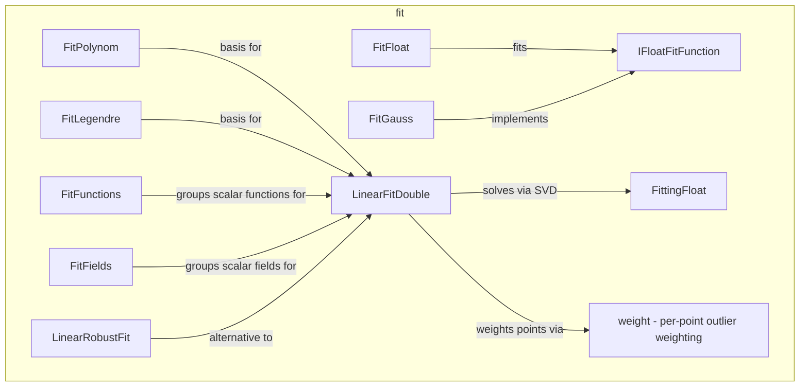

---
digest:
  local-classes:
    FitFields:
      mtime: '2026-09-05T11:46:34Z'
      digest: 2303fcb1ec640b5f55df581b76f97e4e19cf68f54820afea782d1160593bceaa
    FitFloat:
      mtime: '2026-09-05T11:48:27Z'
      digest: 5b385606dca9bf6412d19c27e2ab14d05e0eab0443c4bfa26808e525ab322d37
    FitFunctions:
      mtime: '2026-09-05T11:47:11Z'
      digest: a6a7771748f67d956b7a5f53ace75170c904709415ce906620e165b3de0a1c6f
    FitGauss:
      mtime: '2026-09-05T11:47:43Z'
      digest: 2ec33d51a02c429f3c3ed777346631bbff111bb425fc8656d2c5a195a69c3837
    FitLegendre:
      mtime: '2026-09-05T11:47:51Z'
      digest: 2f07d4bc12d7e64e816f390e376eae776816e02c87eefe4192af9a0c78e9cc8c
    FitPolynom:
      mtime: '2026-09-05T11:47:57Z'
      digest: 055de3aec6a3bbab4c789b6995dd01961ff94a8775bc31046e88f81d7c9fae87
    FittingFloat:
      mtime: '2026-09-05T11:49:24Z'
      digest: 0257be445b51248eae5b246bfcf437ea1e2de0fd3ec79a972465aeec524819c2
    IFloatFitFunction:
      mtime: '2026-09-05T11:46:51Z'
      digest: 2e4adb36d517b1e0b6e00881f607457dd898afee435e0456f394b8c1aa020166
    LinearFitDouble:
      mtime: '2026-09-05T11:50:41Z'
      digest: 6b8de1248e2e14bc46bc8c914ab471193be2702d44c768c0ac5dbed745912cf3
    LinearRobustFit:
      mtime: '2026-09-05T11:51:11Z'
      digest: d517d50d78c9bf5368ffef7799f402e6307b6723f6bade17b30343ca0f55f12b
  folders:
    weight/:
      mtime: '2026-09-05T11:45:55Z'
      digest: 5f1f11f6505bbc1a74e1e677f478c91fd174bbaa4b65a0f696af33d0eecb543e
tags:
- code/curve_fitting
concepts:
- Curve Fitting
facets:
  layer: utility
  status: legacy
  complexity: high
description: Fits parameterized functions and scalar fields to measured data sets, covering both nonlinear fitting (`FitFloat`'s Levenberg-Marquardt minimization of chi-squared over an `IFloatFitFunction`) and linear fitting (`LinearFitDouble`'s and `FittingFloat`'s singular value decomposition, and `FittingFloat.lfit`'s normal-equations solve, over an `IFloatVectorFunction`/`IFloatVectorField`), plus a robust alternative (`LinearRobustFit`) that minimizes absolute deviation instead of chi-squared to resist outliers. `FitGauss`, `FitLegendre` and `FitPolynom` supply ready-made fitting bases (sums of Gaussians, Legendre polynomials, plain powers), and the `weight` subsystem supplies the per-point weighting used when outliers must be discounted.
---

# fit

Fits parameterized functions and scalar fields to measured data sets, covering both
nonlinear fitting (`FitFloat`'s Levenberg-Marquardt minimization of chi-squared over an
`IFloatFitFunction`) and linear fitting (`LinearFitDouble`'s and `FittingFloat`'s singular
value decomposition, and `FittingFloat.lfit`'s normal-equations solve, over an
`IFloatVectorFunction`/`IFloatVectorField`), plus a robust alternative (`LinearRobustFit`)
that minimizes absolute deviation instead of chi-squared to resist outliers. `FitGauss`,
`FitLegendre` and `FitPolynom` supply ready-made fitting bases (sums of Gaussians, Legendre
polynomials, plain powers), and the `weight` subsystem supplies the per-point weighting used
when outliers must be discounted.

## Classes

| Class | Responsibility |
|---|---|
| [FitFields](FitFields.java) | Combines an array of scalar fields into a single IFloatVectorField, mapping each component of the output vector through its own IFloatScalarField. |
| [FitFloat](FitFloat.java) | Performs general (non-linear) fitting of an IFloatFitFunction to a data set by Levenberg-Marquardt minimization of chi-squared. |
| [FitFunctions](FitFunctions.java) | Groups a set of ordinary scalar IFloatFunctions into a single IFloatVectorFunction for use in LinearFitDouble. |
| [FitGauss](FitGauss.java) | Implements a parameterized linear combination of Gauss functions, calculating the sum of several Gauss functions with location, width and amplitude packed into a[], plus the derivative of that sum for every parameter, for use by a fitting algorithm. |
| [FitLegendre](FitLegendre.java) | Evaluates the Legendre polynomials up to the requested degree at a point x, using the standard three-term recurrence, for use as a fitting basis. |
| [FitPolynom](FitPolynom.java) | Evaluates the successive powers of x (1, x, x^2, ...) in one sweep, used as a polynomial basis for fitting a set of functions to a data set. |
| [FittingFloat](FittingFloat.java) | Collects static methods for fitting functions to data by singular value decomposition and by normal equations, and implements IFloatVectorFunction itself only to supply a test basis function for its own self-tests. |
| [IFloatFitFunction](IFloatFitFunction.java) | Defines a parameterized fitting function that shares its parameter state with the fitting algorithm and returns both the function value and the derivatives to each parameter in one call. |
| [LinearFitDouble](LinearFitDouble.java) | Performs a general linear fit of data values to a set of scalar functions, or to a scalar field, by singular value decomposition, since fitting usually creates ill-conditioned linear systems and SVD is used to identify the relevant fitting parameters. |
| [LinearRobustFit](LinearRobustFit.java) | Defines static methods to fit an affine model y = a + b*x (linear regression) by minimizing the mean absolute deviation rather than chi-squared, which is much more robust against outliers. |

## Architecture

## Entry Points

| Class.Method | Description |
|---|---|
| [FitFloat.fit(float[], float[])](FitFloat.java#L206) | Runs one nonlinear least-squares fit step, Marquardt's method. |
| [LinearFitDouble.getChiSqr()](LinearFitDouble.java#L179) | Evaluates the fitted functions at every data point with the solved params and sums the squared, standard-deviation-weighted residual. |
| [LinearRobustFit.LINEAR_ROBUST_FIT(float[], float[], float[])](LinearRobustFit.java#L66) | Fits data to a straight line robustly by least absolute (not squared) deviation. |

## Subsystems

| Folder | Domain Role | Entry Point |
|---|---|---|
| `weight/` | Defines how much influence a single measured or random value contributes to a robust fit or | `IWeightFunction` |
