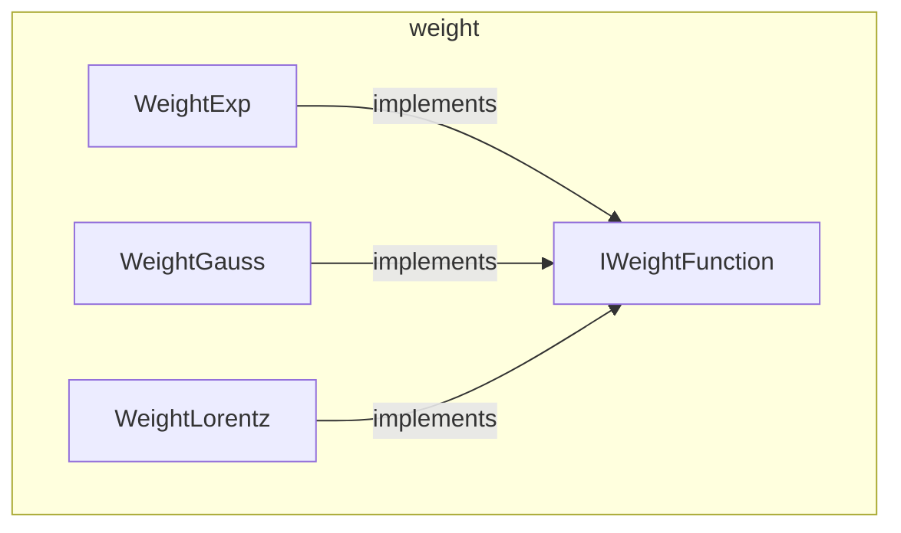

---
digest:
  local-classes:
    IWeightFunction:
      mtime: '2026-09-05T11:45:13Z'
      digest: 7cdc963c0ff0591d7b3eaea529d914fba3a658dbaba4a2f92271cb041e47e9e0
    WeightExp:
      mtime: '2026-09-05T11:45:24Z'
      digest: 97d1334f12efa0f6529ee713b001873c3a1ab5ca980704a43ee565de390439f9
    WeightGauss:
      mtime: '2026-09-05T11:45:43Z'
      digest: 04b138ed4213168680e5974fb925e70421efa8b8b1352c719547cdc9eb634fdc
    WeightLorentz:
      mtime: '2026-09-05T11:45:55Z'
      digest: 15584148ca38ee244ea416d87eadb60d734fffe61a06737f152dc4f9eaa8be9f
  folders: {}
tags:
- code/weighting
concepts:
- Robust-Fit Weighting Functions
facets:
  layer: utility
  status: broken
  complexity: medium
description: 'Defines how much influence a single measured or random value contributes to a robust fit or distribution estimate, based on its normalized deviation from the mean. Each implementation models a different distribution shape (exponential, gaussian, or Lorentzian/Cauchy), and the whole point of the abstraction is to bound the influence of outliers: weight should first increase with the deviation, then decrease past a certain magnitude, so a single wild data point cannot dominate an otherwise-good fit.'
---

# weight

Defines how much influence a single measured or random value contributes to a robust fit or
distribution estimate, based on its normalized deviation from the mean. Each implementation
models a different distribution shape (exponential, gaussian, or Lorentzian/Cauchy), and the
whole point of the abstraction is to bound the influence of outliers: weight should first
increase with the deviation, then decrease past a certain magnitude, so a single wild data
point cannot dominate an otherwise-good fit.

## Classes

| Class | Responsibility |
|---|---|
| [IWeightFunction](IWeightFunction.java) | Defines a weighting function over the normalized deviation of a measured or random value from a distribution's mean. |
| [WeightExp](WeightExp.java) | Weighting function whose weight and probability density fall off exponentially with the normalized deviation, giving outliers a bounded (not squared) influence. |
| [WeightGauss](WeightGauss.java) | Weighting function for normal ("gaussian") distributions, delegating its probability density and cumulative probability to Gauss. |
| [WeightLorentz](WeightLorentz.java) | Weighting function for Lorentzian ("Cauchy") distributions, whose weight and probability density fall off with the square of the normalized deviation rather than exponentially. |

## Architecture

## Entry Points

| Class.Method | Description |
|---|---|
| [IWeightFunction.weight(double)](IWeightFunction.java#L50) | Returns the weight to apply to a value at the given normalized deviation, penalizing outliers. |
