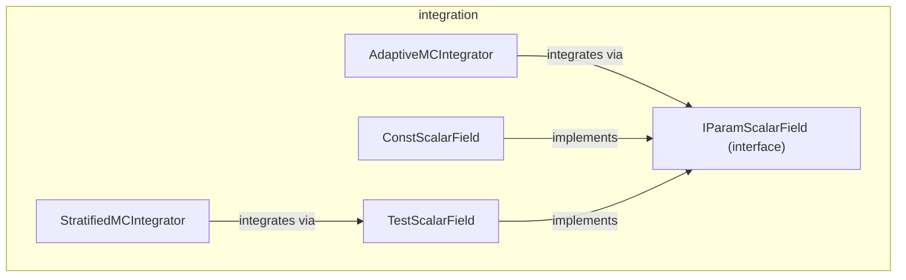

---
digest:
  local-classes:
    AdaptiveMCIntegrator:
      mtime: '2026-09-05T11:50:26Z'
      digest: 59b0e83f9700fc5e5e41484b231ada1a296e243a08b14b61dfa216ddc48762a7
    ConstScalarField:
      mtime: '2026-09-05T11:50:35Z'
      digest: dbadb7c4b1fd50cfc670cff0ccae97b3e847cbcac221d464a9cbd35ab791ea45
    IParamScalarField:
      mtime: '2026-09-05T11:50:43Z'
      digest: 68b0577f28af13b3332d4e1d6f111e8b1c0a840bc1e497e3c82c0217e710dd2f
    StratifiedMCIntegrator:
      mtime: '2026-09-05T11:51:29Z'
      digest: a66a68b090244ae1c9fa0b4baa12779a7e7a4ac8710879e191217de31f222f04
    TestScalarField:
      mtime: '2026-09-05T11:51:06Z'
      digest: a53087a650c77c06741378d060a1e167ba85e8660aedc717d93159f5d76fd7cc
  folders: {}
tags:
- code/numerical_integration
concepts:
- Monte Carlo Numerical Integration
facets:
  layer: utility
  status: legacy
  complexity: medium
description: Implements Monte Carlo Integration over rectangular Regions of R^n, translated from Numerical Recipes Chapter 7.8. Two independent Integrators are provided - the adaptive Grid (VEGAS) Method and a recursive stratified-sampling Method - both driven by a Scalar Field the caller supplies. `ConstScalarField` and `TestScalarField` are ready-made Fields used mainly for testing the Integrators against a known analytic Result.
---

# integration

Implements Monte Carlo Integration over rectangular Regions of R^n, translated from
Numerical Recipes Chapter 7.8. Two independent Integrators are provided - the adaptive
Grid (VEGAS) Method and a recursive stratified-sampling Method - both driven by a Scalar
Field the caller supplies. `ConstScalarField` and `TestScalarField` are ready-made Fields
used mainly for testing the Integrators against a known analytic Result.

## Classes

| Class | Responsibility |
|---|---|
| [AdaptiveMCIntegrator](AdaptiveMCIntegrator.java) | Implements an adaptive Grid (VEGAS) Monte Carlo Integration, with possible Restarts of the Grid, the accumulated Values or the Parameters on several Levels. |
| [ConstScalarField](ConstScalarField.java) | Implements a Scalar Field that returns the same constant Value at every Position. |
| [IParamScalarField](IParamScalarField.java) | Defines a Scalar Field parameterized by an extra scalar Value, used by the vegas Algorithm to be able to sum up the Weights during Integration. |
| [StratifiedMCIntegrator](StratifiedMCIntegrator.java) | Implements a recursive stratified Monte Carlo Integration over a rectangular Region in R^n, bisecting into two Subregions along the Dimension of highest Variance. |
| [TestScalarField](TestScalarField.java) | Implements a sharp Gaussian test Function, located on the Diagonal at a given Offset, whose Integral over the Unit (Hyper-)Cube should be nearly 1 except when the Offset is positioned close to the Cube's Border. |

## Architecture

## Entry Points

| Class.Method | Description |
|---|---|
| [AdaptiveMCIntegrator.integrate(int, int, float[])](AdaptiveMCIntegrator.java#L228) | Runs the adaptive VEGAS Integration for the given Number of Calls and Iterations. |
| [StratifiedMCIntegrator.integrate(IFloatScalarField, float[][], int, long, float, float[])](StratifiedMCIntegrator.java#L84) | Runs the recursive stratified-sampling Integration over the given Region. |
