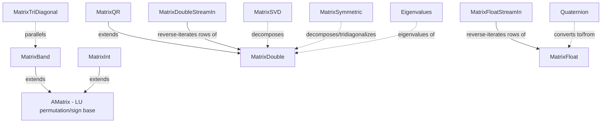

---
digest:
  local-classes:
    AMatrix:
      mtime: '2026-09-05T12:42:22Z'
      digest: 8033d7f295acb85370e8d937994c33b1ea9f796fc3b88dcd51c4a402f12c3319
    Eigenvalues:
      mtime: '2026-09-05T12:45:35Z'
      digest: 85352e2a4e078d8fac55893a91380c904730dba08248aa4f080cefc11ad9be91
    MatrixBand:
      mtime: '2026-09-05T12:46:12Z'
      digest: 7fc761933a5dfa831e2b2102188db8bd3db0203835acb96204f72de2b5ad0573
    MatrixDouble:
      mtime: '2026-09-05T13:04:13Z'
      digest: c9776a145dc8badb6d547380cf4c0578b0fc79bc7c1b4bb3163d2519a2a87bb9
    MatrixDoubleStreamIn:
      mtime: '2026-09-05T13:04:13Z'
      digest: 3c8e7c897244549b353e1f5c6aa7c1b8a4413c0be34cb3769c4491afc0b8578c
    MatrixFloat:
      mtime: '2026-09-05T12:57:44Z'
      digest: 6ca344e67cace59c3fc80e862586629bab7ce835d8dfe0fa9a7bd9cbda9b6365
    MatrixFloatStreamIn:
      mtime: '2026-09-05T12:42:58Z'
      digest: 1cb29bef72324d3bdc13e6bac5f0c8fe40369d33c6f54ec3aa56f91b7351e726
    MatrixInt:
      mtime: '2026-09-05T12:52:28Z'
      digest: 0324262935d2c65dd43a11e6d3ebf81c55ed5d86badc34f72f61dc11773a311c
    MatrixObject:
      mtime: '2026-09-05T12:43:46Z'
      digest: 856c3c019d0f07b9ad736bc977e3b5165caa1417384041d57703a862330a9c1b
    MatrixQR:
      mtime: '2026-09-05T12:47:06Z'
      digest: 78fa0b49e68ebbb0185f72de8a9abf7840acf96b220224039015313c31f75d66
    MatrixSVD:
      mtime: '2026-09-05T12:47:35Z'
      digest: 499d976593db3395202f84b20b2c2a6903beb4c5694dae7ddae31b721c9890d9
    MatrixSymmetric:
      mtime: '2026-09-05T12:46:40Z'
      digest: ec24a2c0026dce2eeb778a1b3eb68550eb616044c801c5cbd72bbb35fd70e262
    MatrixTriDiagonal:
      mtime: '2026-09-05T12:44:58Z'
      digest: e29a8dce3bff27012e781a591db91f6ad404bf31bf0d93c0d80264373736552d
    Quaternion:
      mtime: '2026-09-05T12:48:13Z'
      digest: 9c564c52de4a247057241b49684dc5643850be838eee14a704a8b5697a2c1fb3
  folders: {}
tags:
- code/matrix_algebra
- code/numerical_linear_algebra
concepts:
- Numerical Linear Algebra (Matrix Types and Decompositions)
facets:
  layer: utility
  status: legacy
  complexity: high
description: 'Numerical linear-algebra library providing dense and specialized matrix representations (general `double`/`float`/`int` matrices, band, tridiagonal, symmetric, and QR-decomposable forms) together with the classic dense-matrix algorithms built on Numerical-Recipes-style ports: LU/QR/Cholesky/SVD decomposition, eigenvalue and eigenvector extraction, Householder tridiagonalization, and Hamilton quaternions for rotation. The three parallel `Matrix{Double, Float,Int}` classes each combine a dynamic row-vector container with a large static API operating directly on raw two-dimensional arrays, so callers can choose the array-based static methods for hot loops or the instance API for bookkeeping convenience.'
---

# matrix

Numerical linear-algebra library providing dense and specialized matrix representations
(general `double`/`float`/`int` matrices, band, tridiagonal, symmetric, and QR-decomposable
forms) together with the classic dense-matrix algorithms built on Numerical-Recipes-style
ports: LU/QR/Cholesky/SVD decomposition, eigenvalue and eigenvector extraction, Householder
tridiagonalization, and Hamilton quaternions for rotation. The three parallel `Matrix{Double,
Float,Int}` classes each combine a dynamic row-vector container with a large static API
operating directly on raw two-dimensional arrays, so callers can choose the array-based static
methods for hot loops or the instance API for bookkeeping convenience.

## Classes

| Class | Responsibility |
|---|---|
| [AMatrix](AMatrix.java) | Abstract base class for band and regular matrices, holding the LU-decomposition permutation and sign flags shared by every matrix subclass. |
| [Eigenvalues](Eigenvalues.java) | Groups static methods to calculate eigenvalues of general (possibly nonsymmetric) matrices via balancing, Hessenberg reduction and the QR algorithm. |
| [MatrixBand](MatrixBand.java) | Represents a matrix in band-diagonal form and provides LU decomposition with partial pivoting to map and solve vectors against it. |
| [MatrixDouble](MatrixDouble.java) | Dynamic matrix of VectorDouble-shaped rows, plus a large set of static methods operating directly on non-dynamic double[][] arrays. |
| [MatrixDoubleStreamIn](MatrixDouble.java) | Iterator for the MatrixDouble Class (in reverse Order) to iterate over the Row Vectors. |
| [MatrixFloat](MatrixFloat.java) | Dynamic matrix of VectorFloat-shaped rows, plus a large set of static methods operating directly on non-dynamic float[][] arrays. |
| [MatrixFloatStreamIn](MatrixFloatStreamIn.java) | Iterates a MatrixFloat's row vectors back to front, from the last row to the first. |
| [MatrixInt](MatrixInt.java) | Collects static and instance methods for int[][] arrays, usually representing polygons and their planes. |
| [MatrixObject](MatrixObject.java) | Dynamic-size matrix of Object[] rows, backed by a plain two-dimensional array rather than VectorObject items. |
| [MatrixQR](MatrixQR.java) | QR-decomposable matrix that retains its decomposition in place as instance state, so a changed coefficient can be re-solved via an O(n^2) update rather than a full re-decomposition. |
| [MatrixSVD](MatrixSVD.java) | Performs and holds the Singular Value Decomposition of a matrix, A=U*w*V^t, so its members can be processed comfortably afterwards. |
| [MatrixSymmetric](MatrixSymmetric.java) | Groups static methods to solve linear equations and to calculate eigenvalues and eigenvectors of symmetric matrices via Cholesky decomposition and Householder tridiagonalization. |
| [MatrixTriDiagonal](MatrixTriDiagonal.java) | Solves tri- and cyclic-tridiagonal linear systems, storing each diagonal as its own vector indexed from 0. By letting the non-diagonal vectors always start from 0, transposition is made very easy: just swap the vectors around the diagonal. |
| [Quaternion](Quaternion.java) | Represents a Hamilton quaternion, a 4-dimensional algebraic extension of the complex numbers, and provides the algebra and rotation conversions built on it. |

## Architecture

## Entry Points

| Class.Method | Description |
|---|---|
| [MatrixDouble.decomposeLU()](MatrixDouble.java) | LU-decomposes a general matrix in place with partial pivoting. |
| [MatrixQR.decomposeAt()](MatrixQR.java#L204) | QR-decomposes this matrix in place, retaining the factors for later solves and updates. |
| [MatrixSVD.MatrixSVD(double[][])](MatrixSVD.java#L84) | Singular-value-decomposes the given matrix in place at construction. |
| [MatrixSymmetric.TRI_DIAGONALIZE(double[][], double[], double[], boolean)](MatrixSymmetric.java#L219) | Householder-tridiagonalizes a symmetric matrix as a prelude to eigenvalue extraction. |
| [MatrixSymmetric.EIGENVALUES(double[], double[], double[][])](MatrixSymmetric.java#L141) | QL-algorithm eigenvalues/eigenvectors of a symmetric tridiagonal matrix. |
| [Eigenvalues.EIGENVALUES(double[][], double[], double[])](Eigenvalues.java#L156) | QR-algorithm eigenvalues of a general (possibly nonsymmetric) Hessenberg matrix. |
| [MatrixBand.solveLuAt(double[])](MatrixBand.java#L225) | Solves a band-diagonal system in place via LU back-substitution. |
| [MatrixTriDiagonal.solve(double[])](MatrixTriDiagonal.java#L191) | Solves a (possibly cyclic) tridiagonal system. |
| [Quaternion.fromAxisAngle(Vector3D, double)](Quaternion.java#L184) | Builds a rotation quaternion from an axis and angle. |
