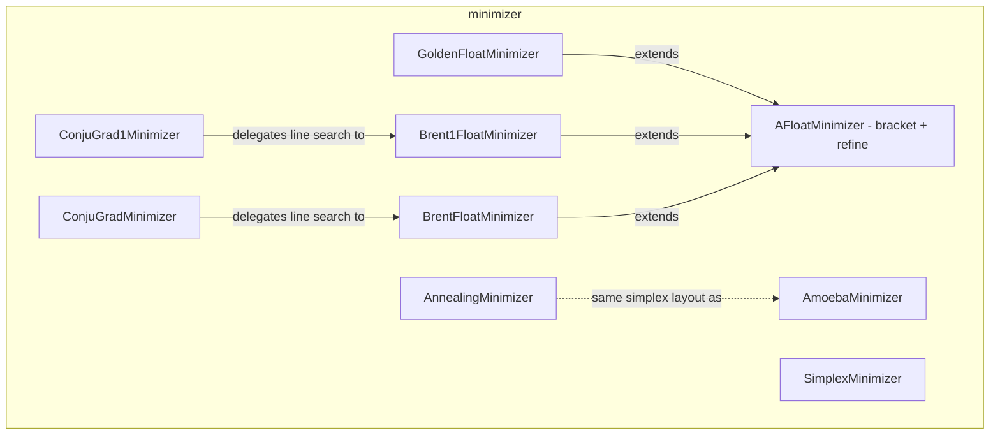

---
digest:
  local-classes:
    AFloatMinimizer:
      mtime: '2026-09-05T11:46:26Z'
      digest: b079ad63abb3bf5004b508d8f5eaa8c2ac8cf7339b17bbd1bc5462195524b9f3
    AmoebaMinimizer:
      mtime: '2026-09-05T11:46:41Z'
      digest: 79bbf6b36498ee5d33332f5f2e56caeaf6e072b69a97dd8dcab78df823e254b1
    AnnealingMinimizer:
      mtime: '2026-09-05T11:47:01Z'
      digest: ff53fb1716493b325109155b0f4087b361ce82b31e0cfcf1f08a57f6bdc9c951
    Brent1FloatMinimizer:
      mtime: '2026-09-05T11:46:32Z'
      digest: 147efbca1860708a6519f91ec5f791290906baad57993cfd2c28ccbf4b4362e8
    BrentFloatMinimizer:
      mtime: '2026-09-05T11:46:34Z'
      digest: 10a4df5dab48893ab0bbcc6064ac2f8ffe1efc36484c712f910e01176e11b341
    ConjuGrad1Minimizer:
      mtime: '2026-09-05T11:47:35Z'
      digest: bac51004c6c05037d94c22e33b2023580aa4aeb17ab4638c576eb85c9b9b2c44
    ConjuGradMinimizer:
      mtime: '2026-09-05T11:48:01Z'
      digest: bb3a40401ed41153bc3d726af993e9cb7b33a6ce8ffd05ca8677aba1a6db6227
    DistSqr:
      mtime: '2026-09-05T11:47:35Z'
      digest: 15802de96f18e3e4ef443b765c6fb794e5edad4e5b49b3630570b2f5a8c3bc94
    DistSqrDistorted:
      mtime: '2026-09-05T11:48:01Z'
      digest: f099b3d48c85b28c03b42f0eb40fcdbfb7cf5d983e2be7c9c505f7f5c3d44b18
    GoldenFloatMinimizer:
      mtime: '2026-09-05T11:46:09Z'
      digest: 8f55c3dda83b839ae21ce146648ffe262a7eae64dbfad5d2b3fe3df4965f7eb4
    SimplexMinimizer:
      mtime: '2026-09-05T11:48:12Z'
      digest: 5ecc21792202700fab2774b67d0ad00bccc11dab61cd9ea752a7fc8ba4fd83ab
    SinOfDistDivDist:
      mtime: '2026-09-05T11:45:40Z'
      digest: 54f29d8dca6bedeba2a72b2bd93bd6a8a35337ca009587411ca0b1ecf82180b3
    TestScalarField:
      mtime: '2026-09-05T11:47:01Z'
      digest: 2c751133445b1e958b2e1dcf89f54cb1f5de840d0b477aa4b78d57fb685fe4fe
    VariableMetricMinimizer:
      mtime: '2026-09-05T11:46:02Z'
      digest: 13a8e78c840761853a33f7a87b5713410594f2b907de348de7c605bde5067e0a
  folders: {}
tags:
- code/minimum_search
- code/optimization
concepts:
- Numerical Function Minimization
facets:
  layer: utility
  status: legacy
  complexity: high
description: 'Numerical function-minimization algorithms translated from Numerical Recipes: bracketing and one-dimensional line search (`AFloatMinimizer` and its `GoldenFloatMinimizer`, `Brent1FloatMinimizer`, `BrentFloatMinimizer` subclasses), N-dimensional gradient-free methods (`AmoebaMinimizer` downhill simplex, `AnnealingMinimizer` simulated annealing over the same simplex), N-dimensional gradient-based methods (`ConjuGrad1Minimizer` conjugate gradient with derivatives, `ConjuGradMinimizer` Powell''s method without derivatives), and linear programming (`SimplexMinimizer`). The remaining types (`DistSqr`, `DistSqrDistorted`, `SinOfDistDivDist`, `TestScalarField`, `VariableMetricMinimizer`) are test scalar fields, or in `VariableMetricMinimizer`''s case an unimplemented placeholder.'
---

# minimizer

Numerical function-minimization algorithms translated from Numerical Recipes: bracketing
and one-dimensional line search (`AFloatMinimizer` and its `GoldenFloatMinimizer`,
`Brent1FloatMinimizer`, `BrentFloatMinimizer` subclasses), N-dimensional gradient-free
methods (`AmoebaMinimizer` downhill simplex, `AnnealingMinimizer` simulated annealing over
the same simplex), N-dimensional gradient-based methods (`ConjuGrad1Minimizer` conjugate
gradient with derivatives, `ConjuGradMinimizer` Powell's method without derivatives), and
linear programming (`SimplexMinimizer`). The remaining types (`DistSqr`, `DistSqrDistorted`,
`SinOfDistDivDist`, `TestScalarField`, `VariableMetricMinimizer`) are test scalar fields, or
in `VariableMetricMinimizer`'s case an unimplemented placeholder.

## Classes

| Class | Responsibility |
|---|---|
| [AFloatMinimizer](AFloatMinimizer.java) | Base class that brackets and iteratively refines the local minimum of a one-dimensional function, in the manner of the golden rule: xl------xm--xt------xr. |
| [AmoebaMinimizer](AmoebaMinimizer.java) | Finds the minimum of a continuous scalar field (not necessarily differentiable) using the downhill simplex ("amoeba") method. |
| [AnnealingMinimizer](AnnealingMinimizer.java) | Finds the minimum of a continuous, multidimensional function (not necessarily differentiable) by simulated annealing over a downhill-simplex search. |
| [Brent1FloatMinimizer](Brent1FloatMinimizer.java) | Finds the minimum of a one-dimensional function using derivative information (10.3), by Brent's algorithm for one-dimensional minimization (Chapter 10.2). |
| [BrentFloatMinimizer](BrentFloatMinimizer.java) | Finds the minimum of a one-dimensional function by Brent's method (10.2), without requiring derivative information. |
| [ConjuGrad1Minimizer](ConjuGrad1Minimizer.java) | Minimizes a scalar field in N dimensions by the conjugate-gradient method, using the first derivative (gradient) supplied by an IFloatVectorField. |
| [ConjuGradMinimizer](ConjuGradMinimizer.java) | Minimizes a scalar field in N dimensions by Powell's conjugate-direction method, without requiring derivative information. |
| [DistSqr](ConjuGrad1Minimizer.java) | Scalar field returning the squared multidimensional distance to an origin, handed over in the constructor. |
| [DistSqrDistorted](ConjuGradMinimizer.java) | Scalar field returning the squared multidimensional distance to an origin, handed over in the constructor, but with the quadratic squished and its main axes tilted. |
| [GoldenFloatMinimizer](GoldenFloatMinimizer.java) | Finds the minimum of a continuous, one-dimensional function by golden-section search. |
| [SimplexMinimizer](SimplexMinimizer.java) | Solves linear programs by the simplex method (10.8): maximizes a linear objective function over a bounded region defined by linear inequality and equality constraints. |
| [SinOfDistDivDist](SinOfDistDivDist.java) | This Class implements a smooth Test Function that returns the negative Sine of the Square of the Euklidean Distance of the Input to a certain Vector or the Origin divided by this Distance. |
| [TestScalarField](AnnealingMinimizer.java) | This Class implements a smooth Test Function that returns the negative Sine of the Square of the Euklidean Distance of the Input to a certain Vector or the Origin divided by this Distance. |
| [VariableMetricMinimizer](VariableMetricMinimizer.java) | Placeholder for the Variable Metric (quasi-Newton) Minimization Algorithm, which is not really better than the Conjugate Gradient Methods and has not yet been implemented. |

## Architecture

## Entry Points

| Class.Method | Description |
|---|---|
| [GoldenFloatMinimizer.refine()](GoldenFloatMinimizer.java#L83) | Best ordinate for the minimum found so far by one golden-section step. |
| [BrentFloatMinimizer.refine()](BrentFloatMinimizer.java#L156) | Best ordinate for the minimum found so far by one Brent step. |
| [Brent1FloatMinimizer.refine()](Brent1FloatMinimizer.java#L156) | Best ordinate for the minimum found so far by one derivative-assisted Brent step. |
| [AmoebaMinimizer.minimize(double, int)](AmoebaMinimizer.java#L253) | Minimizes the scalar field with at most the given number of downhill-simplex steps. |
| [ConjuGradMinimizer.minimize(double[])](ConjuGradMinimizer.java#L189) | Minimizes the scalar field in N dimensions by Powell's method. |
| [SimplexMinimizer.minimizeSimplex(double[][], int, int, int, int, int, int[], int[])](SimplexMinimizer.java#L280) | Maximizes a linear objective function subject to linear constraints. |
