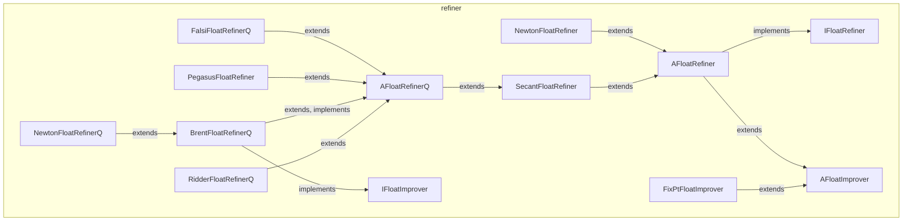

---
digest:
  local-classes:
    AFloatImprover:
      mtime: '2026-09-05T11:54:49Z'
      digest: c390a61249c87b88d499ad006c6804965d4b9fb7dce85816d29c4266dfe1dd53
    AFloatRefiner:
      mtime: '2026-09-05T11:54:40Z'
      digest: d5ff8db23e256ccfd3574813e355dcd4b2da8892797489a9861e254d5a8f5188
    AFloatRefinerQ:
      mtime: '2026-09-05T11:55:28Z'
      digest: 7869751ceaf41c8d2aea1e9cd4335cf51049fa9479dd87d6e8154c210bf47dd5
    BrentFloatRefinerQ:
      mtime: '2026-09-05T11:57:53Z'
      digest: 4fa681c58f98d89cc4e4969c165d08442ba950d7a01277250b0d079fe2723efb
    FalsiFloatRefinerQ:
      mtime: '2026-09-05T11:56:54Z'
      digest: 32d9f1ef42567acbcb2729761ce8a7cd4d3264029abb6c59722ad9ccda2f698a
    FixPtFloatImprover:
      mtime: '2026-09-05T11:55:35Z'
      digest: 56e2f0df4260044a7a138f1f32170539d1684ced584275fd4a1bbca9cc7e6f75
    IFloatImprover:
      mtime: '2026-09-05T11:54:34Z'
      digest: 7eb5913917e79f1ab25f12ee5ea7b1907ec0076adfe984d2d792817bd42cc684
    IFloatRefiner:
      mtime: '2026-09-05T11:54:26Z'
      digest: 0abcfba82c57a06f8ebc7374e1a2e5f11768ecee947361b1459dab264a2fc426
    NewtonFloatRefiner:
      mtime: '2026-09-05T11:56:17Z'
      digest: 9fb69919ddca71e52bdc814da35a0fafbeeafcdf71044865cd5e9e5fead5f637
    NewtonFloatRefinerQ:
      mtime: '2026-09-05T11:58:34Z'
      digest: 3124a12da19427b1910764a275060b71daccdef778caf94855ce343842c9917b
    PegasusFloatRefiner:
      mtime: '2026-09-05T11:57:03Z'
      digest: a72485b51c1aa50dc41a2543b43bb04a8fbcb3372d1b7ac7c9d04b8c91a900e5
    RidderFloatRefinerQ:
      mtime: '2026-09-05T11:58:09Z'
      digest: 8dd05697679e8158c93e9d1e4b9b08be367768f41f3f8e92bd3b44aa7a8dfbe3
    SecantFloatRefiner:
      mtime: '2026-09-05T11:56:44Z'
      digest: 900179b95b5c44435e8ea5e37d52c0932f71e654008bf6c68b177dd6929853c8
  folders: {}
tags:
- code/root_finding
concepts:
- Root Finding and Refinement
facets:
  layer: utility
  status: legacy
  complexity: high
description: 'Iteratively refines an estimate toward a root, fixpoint or extremum of a scalar function, one step at a time. `IFloatRefiner`/`AFloatRefiner` define the single-point-state family (secant, Newton, fixpoint), while `AFloatRefinerQ` and its subclasses (`FalsiFloatRefinerQ`, `BrentFloatRefinerQ`, `RidderFloatRefinerQ`, `NewtonFloatRefinerQ`, `PegasusFloatRefiner`) add quality control: they track both endpoints of a bracketing interval and keep the root bracketed between them, trading various amounts of complexity for guaranteed convergence. `IFloatImprover`/`AFloatImprover` is the lower-level, value-only sibling abstraction that some of these refiners are built on.'
---

# refiner

Iteratively refines an estimate toward a root, fixpoint or extremum of a scalar function,
one step at a time. `IFloatRefiner`/`AFloatRefiner` define the single-point-state family
(secant, Newton, fixpoint), while `AFloatRefinerQ` and its subclasses (`FalsiFloatRefinerQ`,
`BrentFloatRefinerQ`, `RidderFloatRefinerQ`, `NewtonFloatRefinerQ`, `PegasusFloatRefiner`)
add quality control: they track both endpoints of a bracketing interval and keep the root
bracketed between them, trading various amounts of complexity for guaranteed convergence.
`IFloatImprover`/`AFloatImprover` is the lower-level, value-only sibling abstraction that
some of these refiners are built on.

## Classes

| Class | Responsibility |
|---|---|
| [AFloatImprover](AFloatImprover.java) | Holds the current x/y iteration state (last step size and last point) shared by every AFloatRefiner subclass, independent of any particular improvement algorithm. |
| [AFloatRefiner](AFloatRefiner.java) | Abstract base class for searching for the root of a function, adding iteration-control (#solve(int, double, boolean)) and self-test scaffolding on top of AFloatImprover's state and IFloatRefiner's single-step contract. |
| [AFloatRefinerQ](AFloatRefinerQ.java) | Stepper algorithm with quality control: extends bracketed root search by iterating until the zero is hit in both the x and y direction, and collects the static bracketing helper methods used to find such an interval in the first place. |
| [BrentFloatRefinerQ](BrentFloatRefinerQ.java) | Implements the Van Wijngaarden-Dekker-Brent method to find the root of a function (Numerical Recipes §9.3), combining bracketing, bisection and inverse quadratic interpolation, using extrapolation to find a bracket when one is not yet available. |
| [FalsiFloatRefinerQ](FalsiFloatRefinerQ.java) | Root finding (x0 for which f(x0)==0) with the false-position (Regula Falsi) step method, working only on R->R value functions; doesn't work well for multiple zeros, except if the multiplicity is known and given (multiplicity can also act as a relaxation parameter). |
| [FixPtFloatImprover](FixPtFloatImprover.java) | Fixpoint search according to Banach, working on R->R value functions; requires f to be differentiable with \|f'\| < 1 in the range considered, and converges linearly. |
| [IFloatImprover](IFloatImprover.java) | Defines a stateful improvement step for minimization or root finding that works from function values alone, without needing a function.IFloatFunction object. |
| [IFloatRefiner](IFloatRefiner.java) | Defines a single refinement step toward a special point (zero, fixpoint or maximum) of a function. |
| [NewtonFloatRefiner](NewtonFloatRefiner.java) | Root finding with Newton's formula using the 1st derivative; doesn't work well for multiple zeros unless the multiplicity is known and given (multiplicity can also act as a relaxation parameter). |
| [NewtonFloatRefinerQ](NewtonFloatRefinerQ.java) | O(2) root search with Newton's formula, bracketing and optional bisection, guaranteeing linear global convergence due to the bisection fallback. |
| [PegasusFloatRefiner](PegasusFloatRefiner.java) | Pegasus root finding algorithm, a melange of several algorithms: callers can choose between the Pegasus and the Andersson/Bjoerk algorithm, and King's modification can be added too. |
| [RidderFloatRefinerQ](RidderFloatRefinerQ.java) | Root (x = 0) search with a modified secant false-position formula, which requires 2 evaluations and has quadratic convergence, an actual order of sqrt(2), and is extraordinarily robust. |
| [SecantFloatRefiner](SecantFloatRefiner.java) | Root (x = 0) search with the secant formula, which differs from Regula Falsi in that it always accepts the newly extrapolated zero position and thus may not keep a root bracketed. |

## Architecture

## Entry Points

| Class.Method | Description |
|---|---|
| [AFloatRefiner.solve(int, double, boolean)](AFloatRefiner.java#L132) | Refines the solution until the given tolerance is fulfilled, or the iteration limit is reached. |
| [AFloatRefinerQ.BRACKET(IFloatFunction, float[])](AFloatRefinerQ.java#L64) | Searches outward from the given interval for a sign change bracketing a root. |
| [BrentFloatRefinerQ.finished(double)](BrentFloatRefinerQ.java#L145) | Performs a single Brent iteration step, keeping the root bracketed by inverse quadratic interpolation or bisection. |
