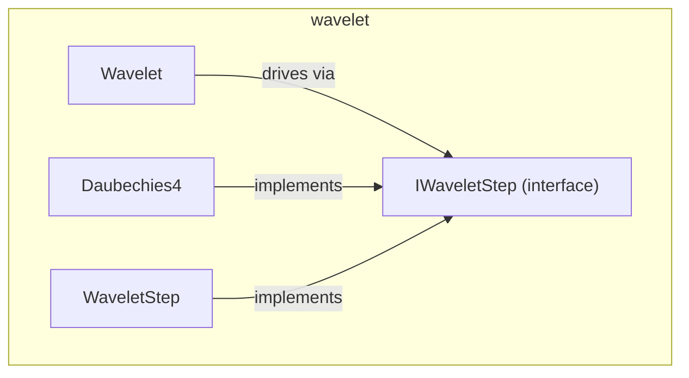

---
digest:
  local-classes:
    Daubechies4:
      mtime: '2026-09-05T11:52:11Z'
      digest: 587a2f530055a990f0d28d700c4cbbd5c6ccf518807f68de53348ebd1bba81b2
    IWaveletStep:
      mtime: '2026-09-05T11:52:19Z'
      digest: 1947d12136ced4ddb3292f59a4115a1dc3458857288467a5732f9bbb3da98c67
    Wavelet:
      mtime: '2026-09-05T11:53:03Z'
      digest: 3cd6b021660f26dcab84e3789ae5ffd81dbe99f36aba8b7c18b6bd0fe738f558
    WaveletStep:
      mtime: '2026-09-05T11:52:49Z'
      digest: 12d4590e61ee79b1f01aa7d663c4a2dd3a0c25e5904a67be1289b780a6d6ecf7
  folders: {}
tags:
- code/wavelet_transform
concepts:
- Wavelet Transform
facets:
  layer: utility
  status: legacy
  complexity: medium
description: 'Implements the discrete Wavelet Transform (Numerical Recipes Chapter 13.10) as a Strategy Pattern: `Wavelet` drives the one- and multidimensional Transform, delegating each Filter Sweep to a pluggable `IWaveletStep`. `Daubechies4` is a hand-optimized 4-Coefficient Filter, while `WaveletStep` is a generic Daubechies-family Implementation offering the 6/12/20-Coefficient variants as precomputed Flyweight Instances.'
---

# wavelet

Implements the discrete Wavelet Transform (Numerical Recipes Chapter 13.10) as a Strategy
Pattern: `Wavelet` drives the one- and multidimensional Transform, delegating each Filter
Sweep to a pluggable `IWaveletStep`. `Daubechies4` is a hand-optimized 4-Coefficient
Filter, while `WaveletStep` is a generic Daubechies-family Implementation offering the
6/12/20-Coefficient variants as precomputed Flyweight Instances.

## Classes

| Class | Responsibility |
|---|---|
| [Daubechies4](Daubechies4.java) | Implements the 4-coefficient Daubechies Wavelet Filter Step (Numerical Recipes 13.10), as a Singleton IWaveletStep. |
| [IWaveletStep](IWaveletStep.java) | Defines the single Stepper Method that applies one Wavelet Filter Sweep to a Data Array, implemented by each concrete Wavelet Filter (e.g. Daubechies4, WaveletStep). |
| [Wavelet](Wavelet.java) | Collects static Methods to transform real Vectors into Wavelet Space and back, for both one-dimensional and multidimensional Data, given a pluggable IWaveletStep. |
| [WaveletStep](WaveletStep.java) | Implements a generic Daubechies-family Wavelet Filter Step, precomputing the Filter's Coefficient pairs and offering the 4/6/12/20-Coefficient variants as Flyweight Instances via #GET_PARTIAL_TRAFO(int). |

## Architecture

## Entry Points

| Class.Method | Description |
|---|---|
| [Wavelet.transformWavelet(double[], int, boolean, IWaveletStep)](Wavelet.java#L37) | Runs the one-dimensional discrete Wavelet Transform, forward or inverse. |
| [Wavelet.transformWavelet(double[], int[], boolean, IWaveletStep)](Wavelet.java#L56) | Runs the multidimensional discrete Wavelet Transform, forward or inverse. |
| [WaveletStep.GET_PARTIAL_TRAFO(int)](WaveletStep.java#L62) | Looks up the Flyweight Filter Step for a given Coefficient count (4, 6, 12 or 20). |
