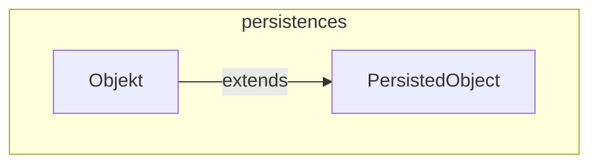

---
digest:
  local-classes:
    Objekt:
      mtime: '2026-09-05T09:12:16Z'
      digest: 4d36d1fbaa6c6af34b9e2c79774d7c71a66dac8d5d57ac84f69ba2c366e090e5
    PersistedObject:
      mtime: '2026-09-05T09:12:58Z'
      digest: 8c74a4945e1684e9b6224126a3dfd0dde5638e956448c64311cc1e1a997e7df7
  folders: {}
tags:
- code/entity_model
- code/registry_pattern
- code/domain_model
concepts:
- Domain Model
- Persistence
facets:
  layer: persistence
  status: broken
  complexity: low
description: 'A minimal two-level base-class hierarchy for persisted domain objects, identified by a non-semantic String ID rather than a direct reference: `PersistedObject` supplies ID-based identity, hashing and equality plus a process-wide registry keyed by that ID, and `Objekt` extends it with a Name and Description loaded from a `ResultSet`.'
---

# persistences

A minimal two-level base-class hierarchy for persisted domain objects, identified by a
non-semantic String ID rather than a direct reference: `PersistedObject` supplies
ID-based identity, hashing and equality plus a process-wide registry keyed by that ID,
and `Objekt` extends it with a Name and Description loaded from a `ResultSet`.

**Known defects** (see `## Bugs Found` in the repository root `HANDOFF.md`): the registry
field in `PersistedObject` is never initialized, and its `ID_`-setting constructor checks
the wrong variable, so an object built through either public constructor currently ends
up with a `null` ID.

## Classes

| Class | Responsibility |
|---|---|
| [Objekt](Objekt.java) | Base Object for any persistable Class. |
| [PersistedObject](PersistedObject.java) | Base Class for persistent Objects, identified and hashed by a non-semantic String ID. |

## Architecture

## Entry Points

| Class.Method | Description |
|---|---|
| [PersistedObject.getId()](PersistedObject.java#L124) | Returns the ID of this Object. |
| [PersistedObject.getObject(String)](PersistedObject.java#L59) | Looks up a previously registered instance by ID. |
| [Objekt.getName()](Objekt.java#L62) | Returns this Object's Name. |
| [Objekt.getDescription()](Objekt.java#L70) | Returns this Object's Description. |
