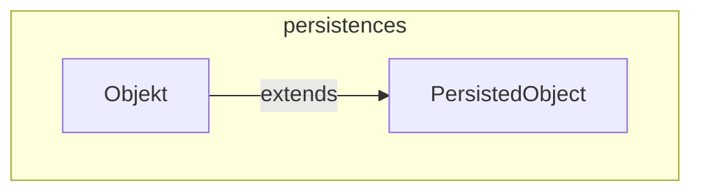

---
digest:
  local-classes:
    Objekt:
      mtime: '2026-09-05T09:12:16Z'
      digest: 4d36d1fbaa6c6af34b9e2c79774d7c71a66dac8d5d57ac84f69ba2c366e090e5
    PersistedObject:
      mtime: '2026-09-05T09:12:58Z'
      digest: 8c74a4945e1684e9b6224126a3dfd0dde5638e956448c64311cc1e1a997e7df7
  folders: {}
tags:
- code/entity_model
- code/registry_pattern
- code/domain_model
concepts:
- Domain Model
- Persistence
facets:
  layer: data
  status: broken
  complexity: '2'
description: 'A minimal two-level base-class hierarchy for persisted domain objects, identified by a non-semantic String ID rather than a direct reference: `PersistedObject` supplies ID-based identity, hashing and equality plus a process-wide registry keyed by that ID, and `Objekt` extends it with a Name and Description loaded from a `ResultSet`.'
dv_has_:
  sub_:
    folders: 0
    files: 5
    units: 2
    facet_:
      layer_:
        data: 2
      status_:
        broken: 1
        stable: 1
      complexity_:
        "2": 2
    tag_:
      code_:
        entity_model: 2
        registry_pattern: 1
        domain_model: 1
    concept_:
      "Technology\\IT\\Data\\Data_Storage.md": 2
      record_identity: 1
      "Technology\\IT\\Software\\SW~Programming\\Domain-Driven_Design.md": 1
has_sub_folders: 0
has_sub_files: 5
has_sub_units: 2
has_sub_facet_layer_data: 2
has_sub_facet_status_broken: 1
has_sub_facet_status_stable: 1
has_sub_facet_complexity_2: 2
has_sub_tag_code_entity_model: 2
has_sub_tag_code_registry_pattern: 1
has_sub_tag_code_domain_model: 1
has_sub_concept_technology_it_data_data_storage_md: 2
has_sub_concept_record_identity: 1
has_sub_concept_technology_it_software_sw_programming_domain_driven_design_md: 1
related:
- path: ../_Matthias/Code/Java/knowledge
  shared-tags:
  - code/domain_model
  - code/entity_model
---

# persistences

A minimal two-level base-class hierarchy for persisted domain objects, identified by a
non-semantic String ID rather than a direct reference: `PersistedObject` supplies
ID-based identity, hashing and equality plus a process-wide registry keyed by that ID,
and `Objekt` extends it with a Name and Description loaded from a `ResultSet`.

**Known defects** (see `## Bugs Found` in the repository root `HANDOFF.md`): the registry
field in `PersistedObject` is never initialized, and its `ID_`-setting constructor checks
the wrong variable, so an object built through either public constructor currently ends
up with a `null` ID.

## Classes

| Class | Responsibility |
|---|---|
| [Objekt](Objekt.java) | Base Object for any persistable Class. |
| [PersistedObject](PersistedObject.java) | Base Class for persistent Objects, identified and hashed by a non-semantic String ID. |

## Architecture

```mermaid
flowchart TD
  subgraph persistences
    PersistedObject["PersistedObject"]
    Objekt["Objekt"]

    Objekt -->|"extends"| PersistedObject
    linkStyle 0 opacity:1
  end
```

## Entry Points

| Class.Method | Description |
|---|---|
| [PersistedObject.getId()](PersistedObject.java#L124) | Returns the ID of this Object. |
| [PersistedObject.getObject(String)](PersistedObject.java#L59) | Looks up a previously registered instance by ID. |
| [Objekt.getName()](Objekt.java#L62) | Returns this Object's Name. |
| [Objekt.getDescription()](Objekt.java#L70) | Returns this Object's Description. |
