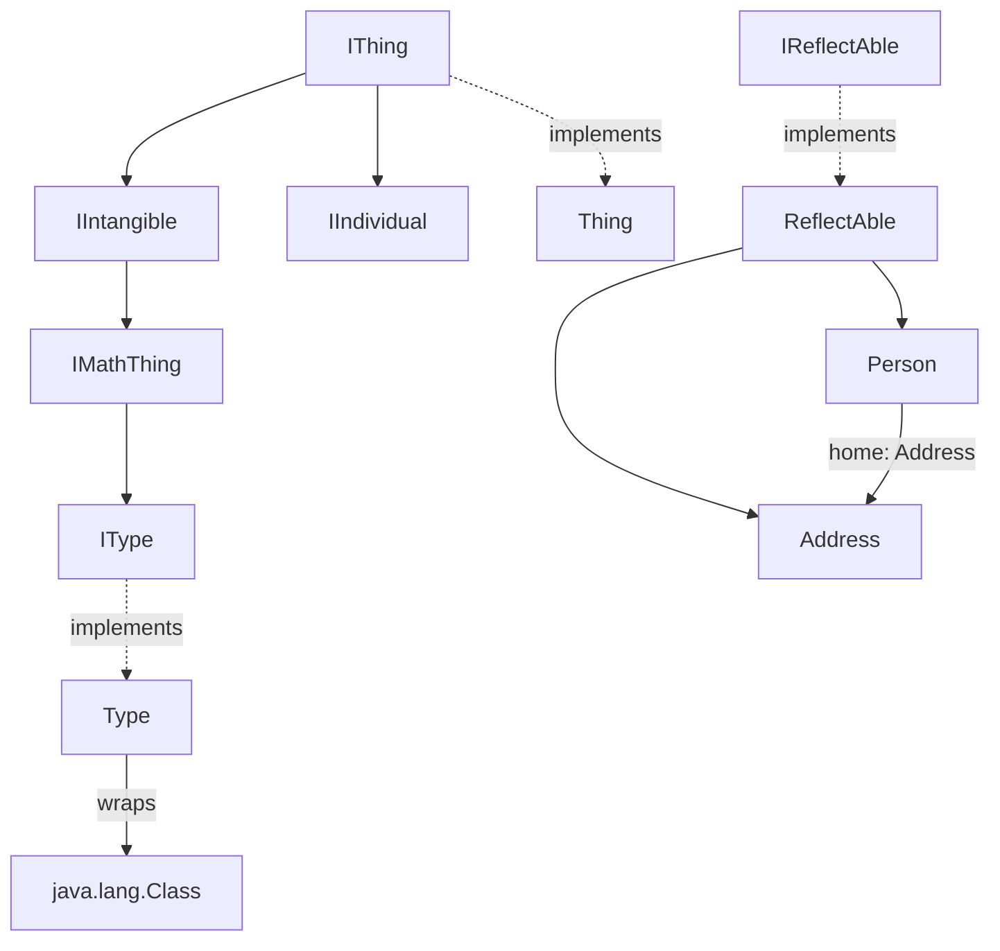

---
digest:
  local-classes:
    Accessor:
      mtime: '2026-09-05T10:22:13Z'
      digest: e75575b684f7c2d0b3b4fedebd4518a89641971d3c9fad5febd490cf56885fc5
    Address:
      mtime: '2026-09-05T10:22:23Z'
      digest: 691dddd61ce042528ae219fade243e9f0fac67586f6d485551ecb0d99b7b214a
    IIndividual:
      mtime: '2026-09-05T10:22:31Z'
      digest: c2f4cbb5ba21efef35cc8c109b5b9d74a43ed6b6952599ec7672bb9899a092c9
    IIntangible:
      mtime: '2026-09-05T10:22:34Z'
      digest: c2f4cbb5ba21efef35cc8c109b5b9d74a43ed6b6952599ec7672bb9899a092c9
    IMathThing:
      mtime: '2026-09-05T10:22:38Z'
      digest: c2f4cbb5ba21efef35cc8c109b5b9d74a43ed6b6952599ec7672bb9899a092c9
    IReflectAble:
      mtime: '2026-09-05T10:22:58Z'
      digest: 1010e4e23f74f9de03293f1c16a1e2fee3fe06f1d1323e55a28977740941dbd1
    IThing:
      mtime: '2026-09-05T10:22:46Z'
      digest: 0a4784c424b1fdf40b0e093afdc23b60cf6044ec78d43120bd9a6e370cdda543
    IType:
      mtime: '2026-09-05T10:22:42Z'
      digest: c2f4cbb5ba21efef35cc8c109b5b9d74a43ed6b6952599ec7672bb9899a092c9
    Person:
      mtime: '2026-09-05T10:23:07Z'
      digest: 08f14257b5e5ed9e841745819e4aa0ab9060672686da6f0fb5a14d69068946b4
    ReflectAble:
      mtime: '2026-09-05T10:23:32Z'
      digest: d321c6bd5dd918d718134ae02eb7aa430164240d1684b8419ef0659560743340
    Thing:
      mtime: '2026-09-05T10:23:41Z'
      digest: 0f64399909c8e1b83f25bb752f289fe676dbbf3709cf6fca35552cdebd1cbf8a
    Type:
      mtime: '2026-09-05T10:23:59Z'
      digest: a3a8358f77020d6b5a8e3c0351cfe71a25400752e8a546886ba5e5fa0ad16e90
  folders: {}
tags:
- code/reflection
- code/domain_model
concepts:
- Reflection
- Domain Model
facets:
  layer: domain
  status: legacy
  complexity: medium
description: This package is a small, self-contained reflection/introspection framework predating Java Bean-style libraries such as Apache Commons BeanUtils. `IThing` roots a tiny classification hierarchy (`IThing` -> `IIntangible`/`IIndividual`, `IIntangible` -> `IMathThing` -> `IType`) mirroring an upper-ontology distinction between concrete individuals and abstract/mathematical concepts; `Type` is the concrete `IType` implementation, wrapping a `java.lang.Class` restricted to Interfaces. Separately, `IReflectAble`/`ReflectAble` define a uniform, name-based get/set/call API over an object's public Fields and getter/setter Methods, including `_`-separated nested Property paths (e.g. `home_StreetNr`) and recursive deep-copy support; `Person` and `Address` are sample `ReflectAble` entities demonstrating this. `Accessor` is an independent, standalone reflection helper offering a similar name-based get/set/call API but usable on any Object, not only `IReflectAble` implementors.
---

# reflect

This package is a small, self-contained reflection/introspection framework predating
Java Bean-style libraries such as Apache Commons BeanUtils. `IThing` roots a tiny
classification hierarchy (`IThing` -> `IIntangible`/`IIndividual`, `IIntangible` ->
`IMathThing` -> `IType`) mirroring an upper-ontology distinction between concrete
individuals and abstract/mathematical concepts; `Type` is the concrete `IType`
implementation, wrapping a `java.lang.Class` restricted to Interfaces. Separately,
`IReflectAble`/`ReflectAble` define a uniform, name-based get/set/call API over an
object's public Fields and getter/setter Methods, including `_`-separated nested Property
paths (e.g. `home_StreetNr`) and recursive deep-copy support; `Person` and `Address` are
sample `ReflectAble` entities demonstrating this. `Accessor` is an independent, standalone
reflection helper offering a similar name-based get/set/call API but usable on any Object,
not only `IReflectAble` implementors.

## Architecture

## Entry Points

| Class.Method | Description |
|---|---|
| `ReflectAble.get(String)` / `set(String, Object)` | Reads or writes a Property by name, including nested `_`-separated paths across `ReflectAble` object graphs. |
| `ReflectAble.Copy()` | Produces a recursive deep copy of an `IReflectAble` object graph. |
| `Accessor.getFieldOrMethod(Object, String)` / `setOrAddFieldOrMethod(...)` | Generic name-based Field/getter/setter access on any Object, independent of `IReflectAble`. |
| `Type(Class)` | Wraps an Interface `Class` as this package's own `IType` Type Object. |

## Classes

| Class | Responsibility |
|---|---|
| [Accessor](Accessor.java) | Title: Accessor Description: Reflection helper that reads or writes a named Field or JavaBean-style getter/setter on an arbitrary Object, swallowing the usual reflection Exceptions so callers can treat "no such Member" as a simple boolean/null result instead of a checked Exception. |
| [Address](Address.java) | Title: Address Description: Sample ReflectAble entity holding a street/zip/city Address, used as a nested Property of Person to demonstrate path-based get/set navigation (e.g. "home_StreetNr") through the reflect Package. |
| [IIndividual](IIndividual.java) | Title: IIndividual Description: Marker Interface classifying a IThing as a concrete, individual instance (as opposed to an IIntangible such as a Type or abstract concept), following an upper-ontology style distinction (individual vs. abstract Thing). |
| [IIntangible](IIntangible.java) | Title: IIntangible Description: Marker Interface classifying a IThing as intangible - an abstract or conceptual entity such as a IMathThing/IType, as opposed to a concrete IIndividual. |
| [IMathThing](IMathThing.java) | Title: IMathThing Description: Marker Interface classifying a IIntangible as a mathematical/computational Thing - the common super-Interface of IType, i.e. entities describable purely by their formal Properties and Methods rather than by physical extension. |
| [IReflectAble](IReflectAble.java) | Title: IReflectAble Description: Defines the Interface for Classes that expose their Data and Methods via Reflection. |
| [IThing](IThing.java) | Title: IThing Description: Root Interface of the reflect Package's classification hierarchy, denoting any "Thing" that can report its own Type. |
| [IType](IType.java) | Title: IType Description: Interface denoting a Type, i.e. a Set of Instances described by common Properties and Methods rather than by enumerating its Members. |
| [Person](Person.java) | Title: Person Description: Purpose: Test Implementation for ReflectAble Demonstrates that Reflection can be used to implement Attributes and Relations. |
| [ReflectAble](ReflectAble.java) | Title: ReflectAble Description: Purpose: Implements the basic Functionality for IReflectAble. |
| [Thing](Thing.java) | Title: Thing Description: Minimal concrete Implementation of IThing, returning the shared IThing#TYPE constant for every Instance. |
| [Type](Type.java) | Title: Type Description: Purpose: Class of all Types, i.e. Sets described by common Properties and Methods instead of being Collections of Items instanceof newInstance is not supported, because there is no Standard Class for an Interface. |
