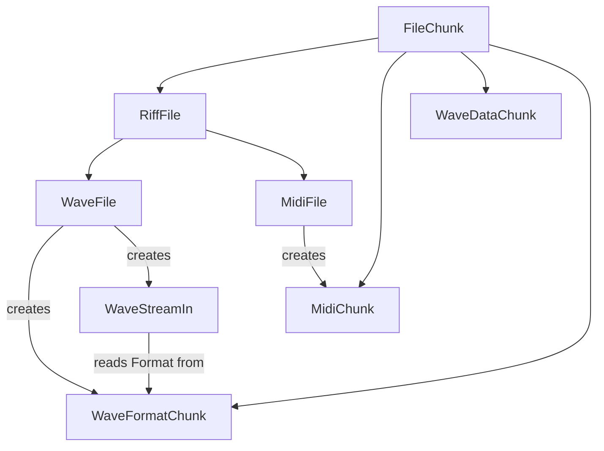

---
digest:
  local-classes:
    DirectPlayer:
      mtime: '2026-09-05T10:24:48Z'
      digest: 4cd3f38e3c7e904a0a5362104717f4d44636344313693e0001921f51e3190839
    FileChunk:
      mtime: '2026-09-05T10:22:16Z'
      digest: 5374854bde555d80614dd8e379843f85c82183d4d55bdc182a9d2fd58c5657b8
    MidiChunk:
      mtime: '2026-09-05T10:22:41Z'
      digest: 8a4964081ce0acacfeb0bc62a7dbcb830ad415d931717727d8fec7294e0d7fd9
    MidiFile:
      mtime: '2026-09-05T10:22:51Z'
      digest: 92b3c1dc1308b0f93db281ce3f081114b0cf1bc2032214831652e632286c06ff
    RiffFile:
      mtime: '2026-09-05T10:13:24Z'
      digest: 204d0ee3a8988c8e45876d595271e3191c8353ccd78b07ad0a8e9573ebe8507d
    WaveDataChunk:
      mtime: '2026-09-05T10:23:08Z'
      digest: 48eb140df3d8d7b35cc2ab9aa010051b81440d6f2ba606e46202ab94d39284fa
    WaveFile:
      mtime: '2026-09-05T10:23:22Z'
      digest: 0f3c876d65d87f1ef31ee6fae9548fb8d266f72de4c8e6d2be6134027858b360
    WaveFormatChunk:
      mtime: '2026-09-05T10:23:32Z'
      digest: 30c3f74e44126b91bfc396952540a82f25c93df97df8c90fae255a6f667e6754
    WaveStreamIn:
      mtime: '2026-09-05T10:24:56Z'
      digest: 6858d125b359ccf5692b340b2de029ddf2fcd8eae5d014f19acd4410dae93e9d
    WaveStreamOut:
      mtime: '2026-09-05T10:24:03Z'
      digest: 6180a829999cc6f229e4cc4d054921a25d6c2fc6c0fbe28be20a42fd6d4b39b4
  folders: {}
tags:
- code/binary_file_format
- code/file_parsing
- code/audio
concepts:
- Audio File Parsing
- RIFF/WAV/MIDI
facets:
  layer: domain
  status: legacy
  complexity: medium
description: 'This folder parses and (partially) writes Microsoft RIFF-based audio containers - WAV and Standard MIDI Files - plus one interactive MIDI player. `FileChunk` reads any generic RIFF-style Chunk (a 4-Character Type Tag followed by a 4-Byte Size); `RiffFile` builds on it to read the outer "RIFF" Container Header. `WaveFile` and `MidiFile` each build on `RiffFile`/`FileChunk` to read a concrete Container: `WaveFile` reads the "fmt " Chunk (`WaveFormatChunk`) and "data" Chunk of a WAV File, while `MidiFile` reads the "MThd" Header and a Sequence of "MTrk" Track Chunks (`MidiChunk`). `WaveDataChunk` is an alternative, self-contained reader for a WAV "data" Chunk that decodes Samples directly rather than exposing the raw Bytes. For playback, `WaveStreamIn` and `WaveStreamOut` adapt a `WaveFile`''s Data Chunk to/from a sequential per-Channel sample stream (`streamIO.integer` interfaces), and `DirectPlayer` is an unrelated, self-contained Swing/MIDI toy that maps computer-keyboard Keys to MIDI Notes for live Synthesizer playback via `javax.sound.midi`.'
---

# sound

This folder parses and (partially) writes Microsoft RIFF-based audio containers - WAV and Standard MIDI Files -
plus one interactive MIDI player. `FileChunk` reads any generic RIFF-style Chunk (a 4-Character Type Tag followed
by a 4-Byte Size); `RiffFile` builds on it to read the outer "RIFF" Container Header. `WaveFile` and `MidiFile`
each build on `RiffFile`/`FileChunk` to read a concrete Container: `WaveFile` reads the "fmt " Chunk
(`WaveFormatChunk`) and "data" Chunk of a WAV File, while `MidiFile` reads the "MThd" Header and a Sequence of
"MTrk" Track Chunks (`MidiChunk`). `WaveDataChunk` is an alternative, self-contained reader for a WAV "data" Chunk
that decodes Samples directly rather than exposing the raw Bytes. For playback, `WaveStreamIn` and `WaveStreamOut`
adapt a `WaveFile`'s Data Chunk to/from a sequential per-Channel sample stream (`streamIO.integer` interfaces),
and `DirectPlayer` is an unrelated, self-contained Swing/MIDI toy that maps computer-keyboard Keys to MIDI Notes
for live Synthesizer playback via `javax.sound.midi`.

## Classes

| Class | Responsibility |
|---|---|
| [DirectPlayer](DirectPlayer.java) | Allows to play the Synthesizer using the Keyboard. |
| [FileChunk](FileChunk.java) | Title: FileChunk Description: Base Class for different Types of File Chunks Known SubClasses: Known Uses: Copyright: Copyright (c) Matthias Heuer Company: personal Created on 10-26-2002, 12:47 PM |
| [MidiChunk](MidiChunk.java) | Title: MidiChunk Description: Represents a single MIDI Track Chunk ("MTrk") read from a File, sized to hold its raw Event Data as an unparsed Byte Array. |
| [MidiFile](MidiFile.java) | Title: MidiFile Description: Reads a Standard MIDI File ("MThd" Header plus a Sequence of "MTrk" Track Chunks): parses the Track Type, Track Count and Ticks-per-Quarter-Note from the Header, then reads each declared Track as a MidiChunk. |
| [RiffFile](RiffFile.java) | Title: RiffFile Description: Functionality to read and write Windows RIFF Files (Resource Interchange File Format), which consist of several consecutive Chunks. |
| [WaveDataChunk](WaveDataChunk.java) | Title: WaveDataChunk Description: MetaData Class for a Wav File Data Frame. |
| [WaveFile](WaveFile.java) | Title: WaveFile Description: Class to encapsulate the Functionality to read and write Windows *.WAV Files Known SubClasses: Known Uses: Copyright: Copyright (c) Matthias Heuer Company: personal Created on 10-26-2002, 12:47 PM |
| [WaveFormatChunk](WaveFormatChunk.java) | Title: WaveFormatChunk Description: Reads the "fmt " Chunk of a WAV File, describing the Sample Encoding (Channel Count, Sample Rate, Bit Depth, Compression Tag) used by the following "data" Chunk. |
| [WaveStreamIn](WaveStreamIn.java) | Adapts one Channel of a WAV WaveDataChunk's interleaved Sample Data (as described by a WaveFormatChunk) into a sequential int-valued Sample Stream, skipping over the other Channels' Bytes in each Frame. |
| [WaveStreamOut](WaveStreamOut.java) | Writes a single-Channel (mono) PCM WAV File: on construction it writes the RIFF/WAVE Header, the "fmt " Chunk, and the "data" Chunk Header (with a Size computed from numSamples up front), after which Samples are appended one by one via #addInt(int). |

## Architecture

`FileChunk` is the generic RIFF Chunk reader that every other type in this folder either extends or is composed
with. `RiffFile` extends it to read the outer Container Header; `WaveFile` and `MidiFile` each extend `RiffFile`
to read a concrete Container Type, composing in their nested Chunks (`WaveFormatChunk`, `MidiChunk`).
`WaveStreamIn`/`WaveStreamOut` are independent of this hierarchy - they adapt a `WaveFile`'s already-parsed
`WaveFormatChunk`/data `FileChunk` to a sequential Sample Stream for playback or re-encoding. `WaveDataChunk` and
`DirectPlayer` are not part of this hierarchy: the former is an alternative "data" Chunk reader not currently
used by `WaveFile`, and the latter is a standalone keyboard-driven MIDI player unrelated to the File Chunk types.

## Entry Points

| Class.Method | Description |
|---|---|
| `WaveFile.WaveFile(BigEndianReader)` | Reads a complete WAV File (RIFF/WAVE Header, "fmt " and "data" Chunks) from a Stream. |
| `WaveFile.getStream(int)` | Creates a `WaveStreamIn` over one Channel of a parsed `WaveFile`, for sequential Sample playback. |
| `MidiFile.MidiFile(BigEndianReader)` | Reads a complete Standard MIDI File (Header plus all Track Chunks) from a Stream. |
| `WaveStreamOut.WaveStreamOut(String, int, int, int)` | Opens a new mono WAV File for writing and appends Samples via `addInt`/`addLong`. |
