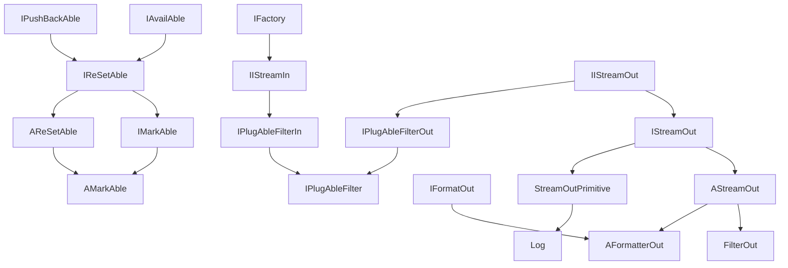

---
digest:
  local-classes:
    AFormatterOut:
      mtime: '2026-09-05T10:13:24Z'
      digest: dc9d088a24570ca2d2ee3adef75c3bcd9e08a25b7b3ee99d54d4be259991df5c
    AMarkAble:
      mtime: '2026-09-05T10:13:24Z'
      digest: 4e97988c01550e13d4acedbd7ec459c58dc02c221422ccf8058f27b607d287b2
    AReSetAble:
      mtime: '2026-09-05T10:13:24Z'
      digest: 2635a2ae201b530acbdf4d58b7102122cb912df006a550f2251f063420f00e74
    AStreamOut:
      mtime: '2026-09-05T10:13:24Z'
      digest: 9e1b4debe533512015a3051eb4d09f4ac0c5690b887adadc95e0faad0014dc06
    Assert:
      mtime: '2026-09-05T10:13:24Z'
      digest: 566d0837417071d9a9e50de3861b6f9d4516510b6f8fcc7919db922d9c6801ae
    DevNullOut:
      mtime: '2026-09-05T10:13:24Z'
      digest: 2e6f8f70a3c9ecf586e2552e59d927b04635822ef5a47f413b95fdcd7b1a8cb8
    FilterOut:
      mtime: '2026-09-05T10:13:24Z'
      digest: d60b0bfad3ad37560ff5ca671f49adac9b29e011df9cbb2866d49ef9cabcc4b2
    IAvailAble:
      mtime: '2026-09-05T10:13:24Z'
      digest: bca433136cc150a6769f1494c239a6b30f30d2aa851ed76cb2c30552391b0bbd
    IDeserializer:
      mtime: '2026-09-05T10:13:24Z'
      digest: 12f8ba0cc1a64e9f2316d8d87bb74d0afdef528294179b2503eb1b59d66577a9
    IFactory:
      mtime: '2026-09-05T10:13:24Z'
      digest: e3b0c44298fc1c149afbf4c8996fb92427ae41e4649b934ca495991b7852b855
    IFormatOut:
      mtime: '2026-09-05T10:13:24Z'
      digest: 1661791ba8dd4400f8919f51be8d3009f64156443bf72a7f5fc04bd4bdebfc85
    IIStreamIn:
      mtime: '2026-09-05T10:13:24Z'
      digest: a7596dbcc92811c7a46985513f4f86747549ef8f3c1825d3f07cbe9d8bedd8ba
    IIStreamOut:
      mtime: '2026-09-05T10:13:24Z'
      digest: d36132cd70ea67ea3a73528d894335a413523b20dd93752c85f138e19157d190
    IInstantiAble:
      mtime: '2026-09-05T10:13:24Z'
      digest: a6af71b8e4214d06fc9dd263946deb3775063b9e7e2c7f304d0e43837e1ff9f1
    IIterAble:
      mtime: '2026-09-05T10:13:24Z'
      digest: 74a7163d227c0c4c3eb64ea97e32e0e7f8ab0c8cd787271bb09a326fdf93b0ff
    IMarkAble:
      mtime: '2026-09-05T10:13:24Z'
      digest: 907fb959042f896a4c4c7690e473790144ae6f1db7f8ac345d3a99012549b2b1
    IOrdered:
      mtime: '2026-09-05T10:13:24Z'
      digest: a36e001a3d79c9a7299509add6ced8278dad79c8a81aacc3273fac81c821f785
    IPlugAbleFilter:
      mtime: '2026-09-05T10:41:27Z'
      digest: e3b0c44298fc1c149afbf4c8996fb92427ae41e4649b934ca495991b7852b855
    IPlugAbleFilterIn:
      mtime: '2026-09-05T10:41:24Z'
      digest: 89052db693d719b701aa04d1b164f7ae6b35e7a410f39ccfdfcea75f53515f78
    IPlugAbleFilterOut:
      mtime: '2026-09-05T10:13:24Z'
      digest: 79d4ccd4a8369fea6e0e9c0c44755922aee80ba72e15337a49d881a465c1578e
    IPushBackAble:
      mtime: '2026-09-05T10:13:24Z'
      digest: c5b8d6fcded01676fc8d5b53d40b37afa842e01fe67f02c8822f478de0c9e163
    IReSetAble:
      mtime: '2026-09-05T10:13:24Z'
      digest: 794b44e625c9b6758ad90b2960f0ed566625b0af9b043f9e3e62bc3d99364db0
    IStreamIn_String:
      mtime: '2026-09-05T10:13:24Z'
      digest: e3b0c44298fc1c149afbf4c8996fb92427ae41e4649b934ca495991b7852b855
    IStreamOut:
      mtime: '2026-09-05T10:13:24Z'
      digest: 5546862285d0b85316ed8a5a76a6f1619c45d7b0d811dc47a40a0050e81d0cfc
    Log:
      mtime: '2026-09-05T10:41:11Z'
      digest: d26290567bd79bbd121972c7dcc9148c994bbe4581e8fc0362ce8081ccd1a447
    RunnablePrinter:
      mtime: '2026-09-05T10:41:18Z'
      digest: 02639ed54bae8b7444ea3ccd6f4b1c24adf2ca2a256a61283b980966c2c70368
    StreamInRunner:
      mtime: '2026-09-05T10:13:24Z'
      digest: 77136d3616f76d5193782e5cb2733c7f78e2ca0e49266e25bac736a39d5e3bbe
    StreamOutPrimitive:
      mtime: '2026-09-05T10:13:24Z'
      digest: 4f8f87ae993241dfa0c4f03b90a426eb2c684c04dc29286572d1172bb6052cf2
    StringBufferOutputStream:
      mtime: '2026-09-05T10:13:24Z'
      digest: 27b65934373c2e61ff9ba57f410f65d93e3daec09a60d39a586dcd329ebf3da5
  folders:
    adapter/:
      mtime: '2026-09-05T09:38:01Z'
      digest: e5d5a4cb76cbe188c4d715973b6eda150080a77ce43dc4ac62f26357c87a6118
    asyncMessage/:
      mtime: '2026-09-05T09:50:22Z'
      digest: 10bafb77a5f273c07da0066b8255bcc96401d2c7248c3df984e44eac13d145df
    character/:
      mtime: '2026-09-05T09:09:21Z'
      digest: 1fefd8a8b68d7bd830e134aed28746e295c04f3726b8e8f9d46f27b962c33776
    detector/:
      mtime: '2026-09-05T08:59:38Z'
      digest: 0b8924683907961c4e8f558cc76a7b51b72c0c3b919eeb68ec49478e388425bd
    diffPatch/:
      mtime: '2026-09-05T10:25:10Z'
      digest: 25b3b8e67604ec6fe9f9cc324814cfcdda04e25fb69d011ee7d2b3b32430277d
    exception/:
      mtime: '2026-09-05T09:28:19Z'
      digest: cf1022b57dad5dabdd137ac97f999227369d19698fb06e75ce4aa8f1ba2495c2
    factory/:
      mtime: '2026-09-05T09:06:26Z'
      digest: 5f28a6246de1782c7831a9402de23a9af01531b0a2b53544851f40e1ad91e468
    fileSystem/:
      mtime: '2026-09-05T09:22:52Z'
      digest: bde0f9cb9edd49f26b5829b5aba5b8d13341338b23f57d425439a7043c921ce6
    testing/:
      mtime: '2026-09-05T09:19:40Z'
      digest: e0874c1e153ded067a4f9b0fa9953f6bb44a6a52c9dbf370f974236b098d3f2b
    vector/:
      mtime: '2026-09-05T09:32:44Z'
      digest: 4546161c69c16ef62d66d82707b02b8e93fd191a6b5a6b38d7fd90a9ccf3cd56
tags:
- code/stream_positioning
- code/logging
- code/assertion_framework
concepts:
- Stream I/O Base Interfaces
facets:
  layer: infrastructure
  status: legacy
  complexity: medium
description: 'This folder holds the foundational, push-based streaming abstractions that the rest of the `streamIO` subtree (its `object`, `integer`, `real`, `copy`, `adapter` and other subfolders) is built on. At the core sit `IIStreamIn`/`IIStreamOut` (and their richer siblings `IStreamIn`/`IStreamOut`): a minimal "pull one Item" / "push one Item" pair, deliberately weaker than `java.util.Iterator`, so that a single `nextItem()`/`addItem()` call can double as a linked-list node, a filter stage, or a demultiplexer without committing to a container shape. `AStreamOut` is the common abstract base that implements the recursive, reflection-based array/collection flattening (`addItems`, `STREAM`) shared by concrete output streams such as `FilterOut`, `StreamOutPrimitive` and `StringBufferOutputStream`. Positioning and re-reading a stream are factored out into a separate hierarchy: `IAvailAble` (position/available count) is extended by `IReSetAble` (reset/jump) and further by `IMarkAble` (mark/reset like `InputStream.markSupported()`), with `AReSetAble`/`AMarkAble` providing default, static-method-backed implementations. `IPlugAbleFilter(In/Out)` lets a filter''s upstream or downstream be swapped at Runtime for a pluggable pipeline architecture. `IFormatOut`/`IDeserializer` are the paired Object&lt;-&gt;Stream (de)serialization interfaces used by format-specific writers/parsers elsewhere in the tree. `Assert` and `Log` are cross-cutting utilities used throughout the whole codebase, not just `streamIO`: `Assert` is a runtime-assertion/testing framework that optionally logs failures instead of throwing, and `Log` (final, extending `StreamOutPrimitive`) is a deliberately terse (`l()`/`n()`/`L()`/`N()`) structured logger with per-call Log Levels, optional Stack Traces and Timestamps.'
---

# streamIO

This folder holds the foundational, push-based streaming abstractions that the rest of the `streamIO`
subtree (its `object`, `integer`, `real`, `copy`, `adapter` and other subfolders) is built on. At the
core sit `IIStreamIn`/`IIStreamOut` (and their richer siblings `IStreamIn`/`IStreamOut`): a minimal
"pull one Item" / "push one Item" pair, deliberately weaker than `java.util.Iterator`, so that a single
`nextItem()`/`addItem()` call can double as a linked-list node, a filter stage, or a demultiplexer without
committing to a container shape. `AStreamOut` is the common abstract base that implements the recursive,
reflection-based array/collection flattening (`addItems`, `STREAM`) shared by concrete output streams such
as `FilterOut`, `StreamOutPrimitive` and `StringBufferOutputStream`. Positioning and re-reading a stream
are factored out into a separate hierarchy: `IAvailAble` (position/available count) is extended by
`IReSetAble` (reset/jump) and further by `IMarkAble` (mark/reset like `InputStream.markSupported()`), with
`AReSetAble`/`AMarkAble` providing default, static-method-backed implementations. `IPlugAbleFilter(In/Out)`
lets a filter's upstream or downstream be swapped at Runtime for a pluggable pipeline architecture.
`IFormatOut`/`IDeserializer` are the paired Object&lt;-&gt;Stream (de)serialization interfaces used by
format-specific writers/parsers elsewhere in the tree. `Assert` and `Log` are cross-cutting utilities used
throughout the whole codebase, not just `streamIO`: `Assert` is a runtime-assertion/testing framework that
optionally logs failures instead of throwing, and `Log` (final, extending `StreamOutPrimitive`) is a
deliberately terse (`l()`/`n()`/`L()`/`N()`) structured logger with per-call Log Levels, optional Stack
Traces and Timestamps.

## Architecture

## Entry Points

| Class.Method | Description |
|---|---|
| `IIStreamIn.nextItem()` / `IIStreamOut.addItem(Object)` | The single pull/push primitive that every stream, filter and container in the subtree implements or wraps. |
| `AStreamOut.STREAM(IIStreamIn, IIStreamOut, ...)` | Transfers/flattens the full content of an input stream into an output stream, recursively up to a given depth. |
| `Assert.A` (instance) / `Assert.EQUALS(...)` etc. | Default shared assertion instance and its static forwarding methods, used pervasively in test code across the codebase. |
| `Log.L` / `Log.L(...)`, `Log.N(...)` | Default shared logger instance (writes to `System.err`) and its brief static logging entry points. |

## Classes

| Class | Responsibility |
|---|---|
| [AFormatterOut](AFormatterOut.java) | Title: FormatterOut.java Description: Defines the Interface for Formatting an Objects into an OutPut streamIO This is the Partner for ParserIn, which parses Objects from Output Streams. |
| [AMarkAble](AMarkAble.java) | Title: Description: Purpose: Abstract Base Class for all IMarkAble Implementations. |
| [AReSetAble](AReSetAble.java) | Title: Description: Purpose: Abstract Base Class together with static Implementation of most Methods for new Implementation Strains to call. |
| [AStreamOut](AStreamOut.java) | AStreamOut Abstract Object Output streamIO Class. |
| [Assert](Assert.java) | Title: Assert Each Test Case should instantiate its own Assert Object, to avoid Side Effects by global Criteria Changes (Defaults for relative and absolute Deviation in float and double). |
| [DevNullOut](IStreamOut.java) | Instance of a Null Device that takes any Input and ignores/destroys it Simple Helper Class to avoid complicated Workarounds Always symbolizes an empty Output streamIO. |
| [FilterOut](FilterOut.java) | FilterOut.java The Filter is derived from the abstract Base Class AStreamOut and delegates the abstract Operations to an Implementor of the Base Interface. |
| [IAvailAble](IAvailAble.java) | Title: IAvailAble Description: Defines the Interface for an Input streamIO with additional Information about the (minimum) Number of (currently) available Elements. |
| [IDeserializer](IDeserializer.java) | Title: IDeserializer.java Description: Defines the Interface for Parsing an InPut streamIO into Objects This is the Partner for FormatterOut, which formats Objects into Output Streams. |
| [IFactory](IFactory.java) | Title: IFactory Description: Defines the Interface for abstract Factories without Parameters. |
| [IFormatOut](IFormatOut.java) | Title: FormatterOut Description: Defines the Interface for Formatting an Objects into an OutPut streamIO. |
| [IIStreamIn](IIStreamIn.java) | IStreamIn.java Interface for Classes that inherently allows to build (singly) linked Structures like Linked Lists, Trees and Set Representations. |
| [IIStreamOut](IIStreamOut.java) | IStreamOut.java Minimal Interface defined for a Store analogous to an OutputStream Not used 'SemiGroup', because that carries too much Overhead and you have to distinguish between addAt() and addItem() anyway, because addAt() unwraps Containers and Iterators. |
| [IInstantiAble](IInstantiAble.java) | Title: InstantiAble Description: This Interface takes Account for the frequent Need, especially in recursive Operations, to create new Instances of an Object, especially to be filled with Contents like in ICopyAble or in IStreamOut. |
| [IIterAble](IIterAble.java) | This is the Interface containing the Method to create an Iterator for a Container. |
| [IMarkAble](IMarkAble.java) | Title: Description: Purpose: Marks a Stream as mark()able, i.e. the Origin for reSet() Operations can be relocated. |
| [IOrdered](IOrdered.java) | Title: Description: Purpose: Defines the Interface and Order Values for Streams and Stores. |
| [IPlugAbleFilter](IPlugAbleFilter.java) | Title: IConfigFilter Description: A Filter whose Input AND Output Streams can both be replaced during Runtime, combining IPlugAbleFilterIn and IPlugAbleFilterOut into a single reconfigurable Filter. |
| [IPlugAbleFilterIn](IPlugAbleFilterIn.java) | Title: IConfigFilter Description: A Filter whose upstream Input Stream can be swapped out at Runtime via setStreamIn_(), instead of being fixed at Construction Time. |
| [IPlugAbleFilterOut](IPlugAbleFilterOut.java) | Title: IConfigFilterOut Description: Purpose: A Filter whose Output Stream can be replaced during Runtime. |
| [IPushBackAble](IPushBackAble.java) | Title: Description: Purpose: Defines the Interface for a generic (untyped) Stream with PushBack Functionality. |
| [IReSetAble](IReSetAble.java) | Title: Description: Purpose: Defines common Methods for relative and absolute Positioning in all Stream Classes. |
| [IStreamIn_String](IStreamIn_String.java) | IStreamIn_String.java Interface for Classes that inherently allows to build (singly) linked Structures like Linked Lists, Trees and Set Representations. |
| [IStreamOut](IStreamOut.java) | StreamOut.java Interface defined for a Store analogous to an OutputStream Not used 'SemiGroup', because that carries too much Overhead and you have to distinguish between addAt() and addItem() anyway, because addAt() unwraps Containers and Iterators. |
| [Log](Log.java) | Logging Class that... |
| [RunnablePrinter](RunnablePrinter.java) | Title: RunnablePrinter Description: A Runnable that prints a fixed String to a given PrintStream each time it is run(), inserting a line break once the running Position exceeds the configured Line Size. |
| [StreamInRunner](StreamInRunner.java) | Abstract Processor just performing the nextItem() Operation in either single Step or until no Items are available anymore. |
| [StreamOutPrimitive](StreamOutPrimitive.java) | Title: PrintStreamOut.java Description: Adds the Interfaces IStreamOut, IStreamOutChar and IFormatterOut to the PrintStream Class. |
| [StringBufferOutputStream](StringBufferOutputStream.java) | Title: StringBufferOutputStream.java Description: OutputStream, also used for counting and filtering Characters from the streamIO and for assembling the Data into a String. |
