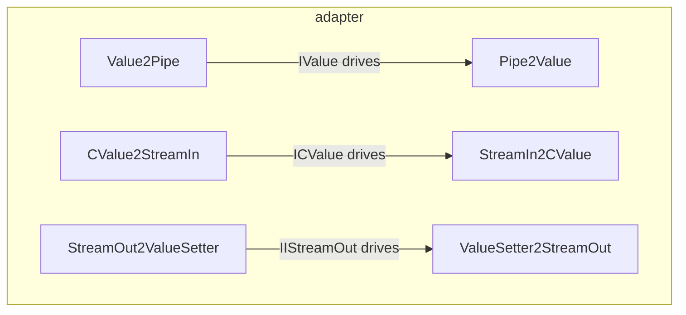

---
digest:
  local-classes:
    CValue2StreamIn:
      mtime: '2026-09-05T09:37:34Z'
      digest: 38875256f51d504aec572627cba2398fd746af67debf140541a6f8cf5f07f287
    Pipe2Value:
      mtime: '2026-09-05T09:37:06Z'
      digest: 30205c66afabcda37c97046914520afc0f181722e1e10f3fd23f8153164a808b
    StreamIn2CValue:
      mtime: '2026-09-05T09:37:15Z'
      digest: 53818c34bd531717398b336791fee75693cb95cda32cc2f233f927f3b21aa3ce
    StreamOut2ValueSetter:
      mtime: '2026-09-05T09:38:01Z'
      digest: 1662926b308f25f6cc96e14093c9162487703fb0b98c594d3dcbf02d53a5afcd
    Value2Pipe:
      mtime: '2026-09-05T09:37:46Z'
      digest: 0e83d3a82518dd563cd88cec8a733d192f6a0a7cbb555aca091abbe0091093c0
    ValueSetter2StreamOut:
      mtime: '2026-09-05T09:37:56Z'
      digest: e29cb6e0fadb82b5371f7de5790d26b1d21fafe1f8bde43f700d4c0f67ace440
  folders: {}
tags:
- code/adapter_pattern
- code/stream_abstraction
concepts:
- Adapter Pattern
facets:
  layer: infrastructure
  status: broken
  complexity: low
description: 'Bridges between the single-value getter/setter interfaces (`IValue`, `ICValue`, `IValueSetter`) and the streaming interfaces (`IIStreamIn`, `IIStreamOut`, `IPipe`), so either style of API can drive the other without a caller-side rewrite. The six types form three matched pairs, one direction each: `Value2Pipe`/`Pipe2Value` for the bidirectional `IValue`/`IPipe` pairing, `CValue2StreamIn`/`StreamIn2CValue` for the read-only getter side, and `StreamOut2ValueSetter`/`ValueSetter2StreamOut` for the write-only setter side.'
---

# adapter

Bridges between the single-value getter/setter interfaces (`IValue`, `ICValue`,
`IValueSetter`) and the streaming interfaces (`IIStreamIn`, `IIStreamOut`, `IPipe`), so
either style of API can drive the other without a caller-side rewrite. The six types form
three matched pairs, one direction each: `Value2Pipe`/`Pipe2Value` for the bidirectional
`IValue`/`IPipe` pairing, `CValue2StreamIn`/`StreamIn2CValue` for the read-only getter
side, and `StreamOut2ValueSetter`/`ValueSetter2StreamOut` for the write-only setter side.

**Known defect** (see `## Bugs Found` in the repository root `HANDOFF.md`):
`CValue2StreamIn`'s only constructor never assigns its wrapped `cValue` dependency, unlike
every other adapter here, which throws `NullPointerException` on first use.

## Classes

| Class | Responsibility |
|---|---|
| [CValue2StreamIn](CValue2StreamIn.java) | Adapter from the ICValue Interface to the StreamIn Interface. |
| [Pipe2Value](Pipe2Value.java) | Adapter from the IValue Interface to a bidirectional streamIO Interface. |
| [StreamIn2CValue](StreamIn2CValue.java) | Adapter from the StreamIn Interface to the read-only CValue Interface. |
| [StreamOut2ValueSetter](StreamOut2ValueSetter.java) | Adapter from the StreamOut Interface to the ValueSetter Interface. |
| [Value2Pipe](Value2Pipe.java) | Adapter from the IValue get/set Interface to the Pipe Interface (bidirectional streamIO). |
| [ValueSetter2StreamOut](ValueSetter2StreamOut.java) | Adapter from the IValueSetter to the StreamOut Interface. |

## Architecture

## Entry Points

| Class.Method | Description |
|---|---|
| [Value2Pipe.nextItem()](Value2Pipe.java#L69) | Reads the next Item from the wrapped IValue getter. |
| [Pipe2Value.getVal()](Pipe2Value.java#L41) | Reads the next Value from the wrapped Pipe. |
| [CValue2StreamIn.nextItem()](CValue2StreamIn.java#L67) | Reads the next Item from the wrapped ICValue getter. |
| [StreamOut2ValueSetter.setVal(Object)](StreamOut2ValueSetter.java#L48) | Writes the given Value to the wrapped Output streamIO. |
| [ValueSetter2StreamOut.addItem(Object)](ValueSetter2StreamOut.java#L68) | Writes the given Item to the wrapped IValueSetter. |
