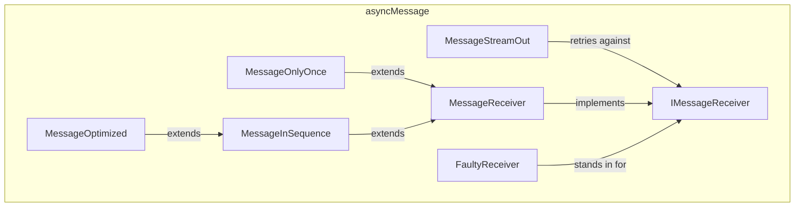

---
digest:
  local-classes:
    FaultyReceiver:
      mtime: '2026-09-05T09:50:11Z'
      digest: fe07a64020aa732a04d6ca99907ed386d5b2bacc16dbfaa04a46541e616bd5fe
    IMessageReceiver:
      mtime: '2026-09-05T09:48:35Z'
      digest: 9a9ea3dd27cae651f99d6d6e5da5df017b75c5c97c92433335823aac3e17943c
    MessageInSequence:
      mtime: '2026-09-05T09:49:08Z'
      digest: 73c21cd37d4d8fe65d4f7e2e9999b42d8132b91fce4f23566eaaecd76c2183ac
    MessageOnlyOnce:
      mtime: '2026-09-05T09:50:22Z'
      digest: 7f6d8412fe11d1bddfa8ef805b998b2ae90ef9685aa318dd479606e83b3d1b7e
    MessageOptimized:
      mtime: '2026-09-05T09:49:30Z'
      digest: ec34bd3baa44b79eda0bddc9da34f90e49b61b1366933e3c9fd1690e6fdebd51
    MessageReceiver:
      mtime: '2026-09-05T09:48:44Z'
      digest: bbd65fad70b09bee67c64c7a0f202b633a515c3ec3cb1ba127cd7e83a960a451
    MessageStreamOut:
      mtime: '2026-09-05T09:49:57Z'
      digest: 6adb8368b6290c4dd7d00064db04aeb9ce7b293ab2afed0d0320419bd5757c4c
  folders: {}
tags:
- code/message_queue
concepts:
- Asynchronous Messaging
facets:
  layer: infrastructure
  status: stable
  complexity: medium
description: 'An asynchronous, retrying alternative to the synchronous `streamIO` pipeline: a `MessageStreamOut` sender assigns each item a strictly ascending ID and retries against an `IMessageReceiver` until the Receiver reports the item accepted. Receivers offer increasingly strict Service Levels built by inheritance - `MessageReceiver` (reliable transport only), `MessageOnlyOnce` (deduplicates via a Bit Vector, allows out-of-order delivery), `MessageInSequence` (enforces strict order, rejects anything else) and `MessageOptimized` (enforces strict order like its parent but caches and replays out-of-order arrivals instead of rejecting them). `FaultyReceiver` is a Test harness that randomly throws to exercise the Retry/Sequence/Duplicate guarantees of the other four.'
---

# asyncMessage

An asynchronous, retrying alternative to the synchronous `streamIO` pipeline: a
`MessageStreamOut` sender assigns each item a strictly ascending ID and retries against an
`IMessageReceiver` until the Receiver reports the item accepted. Receivers offer increasingly
strict Service Levels built by inheritance - `MessageReceiver` (reliable transport only),
`MessageOnlyOnce` (deduplicates via a Bit Vector, allows out-of-order delivery),
`MessageInSequence` (enforces strict order, rejects anything else) and `MessageOptimized`
(enforces strict order like its parent but caches and replays out-of-order arrivals instead of
rejecting them). `FaultyReceiver` is a Test harness that randomly throws to exercise the
Retry/Sequence/Duplicate guarantees of the other four.

## Classes

| Class | Responsibility |
|---|---|
| [FaultyReceiver](FaultyReceiver.java) | Throws a random Exception on about half of its Calls instead of ever processing a Message, to exercise the Retry Behaviour of MessageStreamOut and the Duplicate/Sequence Guarantees of the IMessageReceiver implementations under Test. |
| [IMessageReceiver](IMessageReceiver.java) | Receives Messages identified by a strictly ascending long ID, the asynchronous counterpart to an streamIO.IIStreamOut. |
| [MessageInSequence](MessageInSequence.java) | This simple Implementation of a Receiver can support only the 'in Sequence' Model; It is quite ineffective because it doesn't cache out of Sequence Messages. |
| [MessageOnlyOnce](MessageOnlyOnce.java) | Receives Messages only once and thus prevents double Processing. |
| [MessageOptimized](MessageOptimized.java) | Processes Messages in Sequence and only once, optimizing on MessageInSequence by caching out-of-sequence incoming Messages instead of rejecting them, and replaying the Cache forward as soon as the gap is filled. |
| [MessageReceiver](MessageReceiver.java) | Implements the Interface for the least Service Level Agreement (SLA): reliable Transport. |
| [MessageStreamOut](MessageStreamOut.java) | This is the Drain for Messages, here Messages can be deposited. |

## Architecture

## Entry Points

| Class.Method | Description |
|---|---|
| [MessageStreamOut.addItem(Object)](MessageStreamOut.java#L109) | Blocks and retries until the Receiver accepts the item, in ascending-ID order. |
| [IMessageReceiver.addItem(long, Object)](IMessageReceiver.java#L29) | Accepts or rejects one incoming Message; the Service Level Agreement varies per implementor. |
| [FaultyReceiver.main(String[])](FaultyReceiver.java#L59) | Runs the reliability Test harness against all four Receiver implementations. |
