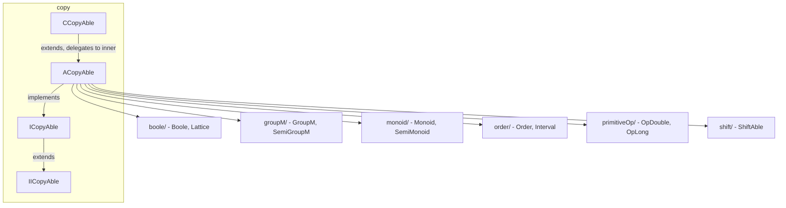

---
digest:
  local-classes:
    ACopyAble:
      mtime: '2026-09-05T20:48:42Z'
      digest: 57cfad59da206e214d89b2e91914168a7e0730ff2884efc952c5e138a5a7587f
    CCopyAble:
      mtime: '2026-09-05T10:13:24Z'
      digest: 63c4af46ef332e49269761392a59ef34cca9e8b0754daf2b766d632a695f5f14
    ICopyAble:
      mtime: '2026-09-05T10:13:24Z'
      digest: 639af05a9a4a2a9562b0f3bf9e22e02a718f79defeaa1dab065caa810409c6e9
    IICopyAble:
      mtime: '2026-09-05T10:13:24Z'
      digest: 7808ddedd7455c81fd404614598d743f6415ad7014d01e3b062c906d70add4ec
    TestCopy:
      mtime: '2026-09-05T20:48:47Z'
      digest: 4ad2dcd84b7bfb9bfa648a9ec91a165d37aefaa27c24616bbdfec8661ab97b44
  folders:
    boole/:
      mtime: '2026-09-05T20:42:19Z'
      digest: a6f87e2e40af25cf4167b6370cffc8395723ba8f57591b21f845b67176e82892
    groupM/:
      mtime: '2026-09-05T16:32:09Z'
      digest: 800bf2648368cfc89c25b5b9ca6081959941a49731bfdfc8c7d7ffbac8880557
    monoid/:
      mtime: '2026-09-05T16:41:47Z'
      digest: 14255d989aaf1abd7ff9b45dbcc963934abf5364d798c68edfbd56a16f1a8d11
    order/:
      mtime: '2026-09-05T16:30:32Z'
      digest: 9b732be8421e36aed563d68b214f80842df4b249b20cbac0d53b118177dc85fd
    primitiveOp/:
      mtime: '2026-09-05T16:15:56Z'
      digest: 49993afbd9f6cf80dd29baae143c023bca035d79722b498573a64e769dd12331
    shift/:
      mtime: '2026-09-05T16:29:09Z'
      digest: 041ac95e66df1c5986cddfceb1795f1780d8021db20f89c4e335959b21539da6
tags:
- code/abstract_base
- code/serialization
- code/delegation
concepts:
- Copy Semantics
- Algebraic Structure
facets:
  layer: utility
  status: legacy
  complexity: medium
description: 'Root of a value-semantics / copy-based object model: `ICopyAble` is the shared contract for objects that support deep copy, shallow copy, in-place copy (`copyAt`), swap and stream-based (de)serialization instead of relying on immutability or `Object.clone()`. `ACopyAble` supplies the default, reflection-capable implementation; `CCopyAble` is the constant/immutable wrapper counterpart, delegating reads to an inner instance and throwing on every mutating `...At()` call. `IICopyAble` factors out the smaller subset of the contract (`newInstance`, `randomizeAt`, stream writing) that a class can implement without also being a full `ICopyAble`. `TestCopy` is the package''s manual test-harness entry point.'
---

# copy

Root of a value-semantics / copy-based object model: `ICopyAble` is the shared contract
for objects that support deep copy, shallow copy, in-place copy (`copyAt`), swap and
stream-based (de)serialization instead of relying on immutability or `Object.clone()`.
`ACopyAble` supplies the default, reflection-capable implementation; `CCopyAble` is the
constant/immutable wrapper counterpart, delegating reads to an inner instance and
throwing on every mutating `...At()` call. `IICopyAble` factors out the smaller subset
of the contract (`newInstance`, `randomizeAt`, stream writing) that a class can
implement without also being a full `ICopyAble`. `TestCopy` is the package's manual
test-harness entry point.

Every algebraic hierarchy below this folder builds on `ICopyAble`: a lattice/group/
monoid element is copyable first, and its arithmetic (`AND`/`add`/`map`, ...) is
expressed in terms of `copy()`/`copyAt()` via the "delegation to self" pattern used
throughout this codebase. `boole/`, `groupM/`, `monoid/`, `order/`, `primitiveOp/` and
`shift/` are documented below; the sibling `group/` subfolder (additive group/ring/
metric/body hierarchy, including `group/ring/metric/body/vector` and friends) is a
separate, much larger tree not yet covered by this pass - it is omitted from
Subsystems until its own `ReadMe.md` exists.

This tree has no `pom.xml`/`build.gradle`/`Makefile` of its own; it is compiled as
part of the larger `streamIO` source tree rather than as a standalone module.

## Classes

| Class | Responsibility |
|---|---|
| [ACopyAble](ACopyAble.java) | Defines the Interface for a public 'copy' Method with variable Depth. |
| [CCopyAble](CCopyAble.java) | Implements Constants for all Types of CopyAble Classes. |
| [ICopyAble](ICopyAble.java) | Full Interface for lightweight Classes with an empty Constructor and copying of Values in a later state. |
| [IICopyAble](IICopyAble.java) | Basic Interface for classes with an empty constructor and copying of Values in a later state. |
| [TestCopy](TestCopy.java) | Manual test harness entry point for the streamIO.copy package, exercising ACopyAble's copy/serialization contract via ACopyAble#testIt. |

## Subsystems

| Folder | Domain Role | Entry Point |
|---|---|---|
| `boole/` | Implements Boolean algebra as an extension of the more general `ILattice`/`Lattice` | `ABoole` |
| `groupM/` | Models the multiplicative algebraic hierarchy (semigroup -> group) that mirrors the | `AGroupM` |
| `monoid/` | Models the concatenative algebraic hierarchy (semigroup -> monoid) that mirrors the | `AMapper` |
| `order/` | Defines the strict order relation (`<`, `>`, Max/Min) that comparable types in | `AOrder` |
| `primitiveOp/` | Defines the in-place arithmetic contract (`add`/`subt`/`mul`/`div`, min/max, linear mapping) | `AOpDouble` |
| `shift/` | Models bit/digit-level shifting and rotation for numbers represented in a g-adic | `AShiftAble` |

## Architecture

## Entry Points

| Class.Method | Description |
|---|---|
| [ICopyAble.copy()](ICopyAble.java#L40) | Deep copy, for further use. |
| [ICopyAble.copyAt(Object)](ICopyAble.java#L49) | In-place deep copy from arg. |
| [ICopyAble.swap(Object)](ICopyAble.java#L72) | Swaps internal components with arg. |
