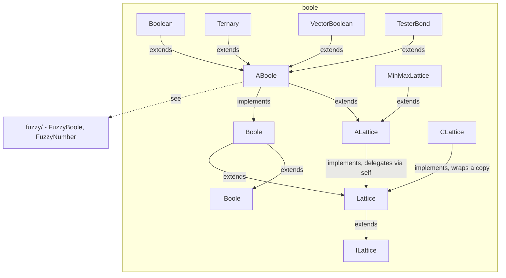

---
digest:
  local-classes:
    ABoole:
      mtime: '2026-09-05T10:13:24Z'
      digest: 49c26c8d00d86df878f9079d10d1db506b6ca2fc8eaf7474efe8e7f5a016a26e
    ACBoole:
      mtime: '2026-09-05T16:45:04Z'
      digest: 2447fe19369e9d0d8f9ea54e6a08fb30045516a3c2ed2d8dadb36ef8932d8b06
    ACLattice:
      mtime: '2026-09-05T16:45:07Z'
      digest: 3228981694aeb1ea818ad79cb9119bce9a1fa2f593953ded9c92b685b1bed192
    ALattice:
      mtime: '2026-09-05T10:13:24Z'
      digest: 7dd6925e3c5a2d7e39ac3787e788eb17fc1d54f93c8e76ca3617f74de5283c09
    Boole:
      mtime: '2026-09-05T10:13:24Z'
      digest: 1b2455fac98d2e35c12e5db829a1fee563bfbe8c7cc6591408939634c9d1905a
    Boolean:
      mtime: '2026-09-05T10:13:24Z'
      digest: 8f53324e434da24eb8d4a5c51b56b2a61eb018a2ebaa7f08da521273d2206756
    CLattice:
      mtime: '2026-09-05T16:45:09Z'
      digest: 5a74fc45cecb8709496c24008d8ea46b3890cd934e03e93f6a2edcac5ec6f4da
    IBoole:
      mtime: '2026-09-05T10:13:24Z'
      digest: b0fcb2ebc4a4fdc505867ec1ad809c50ba14b647782ccce170921b264e36346d
    ILattice:
      mtime: '2026-09-05T10:13:24Z'
      digest: 929bb16577ff24edfe762c1ccdef2bade3e7ebcd2a0933e54471b258916b7f86
    Lattice:
      mtime: '2026-09-05T10:13:24Z'
      digest: 6ca5e3beee3e2edafa97a0500620d55bec7e0852a18857611619c04b15937a89
    MinMaxLattice:
      mtime: '2026-09-05T10:13:24Z'
      digest: a28503540f85c54db5bdde714542212fb78fbc8cf317c4fe471bb055a7296187
    Probability:
      mtime: '2026-09-05T10:13:24Z'
      digest: e1a8c18b8aa89c6b2ef3ea99a7aec09a312f8ba15a5aec48bdff715a1c614765
    Ternary:
      mtime: '2026-09-05T16:48:32Z'
      digest: 8dd3f89809f21396ae9901b665420ccbf9a690951a5b41f4900d0c2eb06b00f6
    TesterBond:
      mtime: '2026-09-05T16:44:44Z'
      digest: ec63526d1ee08017692e0e053bd52e1826a4be0e89646902f0bc30a3d887106a
    VectorBoolean:
      mtime: '2026-09-05T20:42:19Z'
      digest: 43dec5464dc685b77bdcdf264fa519e40b94507755f4688f668a7712244f606e
  folders:
    fuzzy/:
      mtime: '2026-09-05T20:45:07Z'
      digest: e0526fb483d7f2d31f89b296e8622ef0225b3cd2893dd36a3a376880a1b2a8b5
tags:
- code/boolean_algebra
- code/lattice_structure
- code/fuzzy_logic
concepts:
- Boolean Algebra
- Lattice
facets:
  layer: utility
  status: legacy
  complexity: medium
description: 'Implements Boolean algebra as an extension of the more general `ILattice`/`Lattice` contract: a lattice defines only AND/OR (a set closed under two commutative, associative, idempotent operations), and `IBoole`/`Boole` add NOT plus the False/True constants that make it a full Boolean algebra. `ALattice`/`ABoole` supply the default, delegation-based implementation (the "delegation to self" pattern used throughout this codebase) - `ANDat`/`ORat`/`NOTat` (or just `less`, for `MinMaxLattice`) are the only primitives a concrete subclass must redefine; everything else (`XOR`, `DIFF`, `IMP`, `EQV`, `SubEq`/`Sub`/`Super`) is derived. `CLattice`/`ACLattice` mirror this for constant (read-only) values, delegating reads and throwing on every in-place operation. Concrete realizations range from a single bit (`Boolean`), three-valued logic (`Ternary`), a resizable bit vector (`VectorBoolean`), a `[0,1]`-valued probability lattice (`Probability`), an order-relation-based lattice with no complement (`MinMaxLattice`), to an algebra over `ITester` predicate functions (`TesterBond`) that simplifies expressions using idempotency and complement laws. The `fuzzy/` subfolder builds continuous-valued (fuzzy) predicates and logic connectives on top of this package''s `Boole` contract.'
---

# boole

Implements Boolean algebra as an extension of the more general `ILattice`/`Lattice`
contract: a lattice defines only AND/OR (a set closed under two commutative,
associative, idempotent operations), and `IBoole`/`Boole` add NOT plus the False/True
constants that make it a full Boolean algebra. `ALattice`/`ABoole` supply the default,
delegation-based implementation (the "delegation to self" pattern used throughout this
codebase) - `ANDat`/`ORat`/`NOTat` (or just `less`, for `MinMaxLattice`) are the only
primitives a concrete subclass must redefine; everything else (`XOR`, `DIFF`, `IMP`,
`EQV`, `SubEq`/`Sub`/`Super`) is derived. `CLattice`/`ACLattice` mirror this for
constant (read-only) values, delegating reads and throwing on every in-place
operation. Concrete realizations range from a single bit (`Boolean`), three-valued
logic (`Ternary`), a resizable bit vector (`VectorBoolean`), a `[0,1]`-valued
probability lattice (`Probability`), an order-relation-based lattice with no complement
(`MinMaxLattice`), to an algebra over `ITester` predicate functions (`TesterBond`) that
simplifies expressions using idempotency and complement laws. The `fuzzy/` subfolder
builds continuous-valued (fuzzy) predicates and logic connectives on top of this
package's `Boole` contract.

## Classes

| Class | Responsibility |
|---|---|
| [ABoole](ABoole.java) | This Class defines the full Interface for a Boolean Algebra. |
| [ACBoole](ACBoole.java) | Abstract base class for constant (read-only) Boolean-algebra objects, throwing on every in-place `...At()` operation. |
| [ACLattice](ACLattice.java) | Abstract base class for constant (read-only) lattice objects; concrete subclasses implement the read-only comparisons while every in-place operation is left abstract. |
| [ALattice](ALattice.java) | Abstract implementation of a Lattice (without NOT, False and True) |
| [Boole](Boole.java) | This Class defines the full Interface for a Boolean Algebra. |
| [Boolean](Boolean.java) | This Class is a Realization of Boole with a single boolean Value (Bit). |
| [CLattice](CLattice.java) | Constant (read-only) wrapper around an inner Lattice, delegating every read-only operation and throwing ReadOnlyException on every in-place one. |
| [IBoole](IBoole.java) | This Class defines the basic Interface for a Boolean Algebra. |
| [ILattice](ILattice.java) | This Interface defines the basic Operations on a Set with two Operations: AND and OR. |
| [Lattice](Lattice.java) | Interface for a Lattice (so far without NOT and 0 resp. 1) But already here you can define the 'SubSet' Relation, an Order Relation using a 'less' b a Sub b a AND b == a a 'grtr' b a Super b a OR b == b The Definition of AND and OR based on an Order Relation is done in 'MinMaxLattice' |
| [MinMaxLattice](MinMaxLattice.java) | This Class realizes a distributive Lattice with False and True, but without Complement. |
| [Probability](Probability.java) | Defines a Boolean Set on the continuous Range of [0, 1] using 'float' The Operations AND and OR refer to the analogous Operations on the Result Sets from a Result Space X. Thus a Homeophism is defined between the Result Sets and their Probabilities. |
| [Ternary](Ternary.java) | Realizes a three-valued (false/null/true) Boolean-like lattice backed by a single byte. |
| [TesterBond](TesterBond.java) | Boolean Algebra for the ITester Function Allows to combine and operate on ITester Functions. |
| [VectorBoolean](VectorBoolean.java) | A resizable, int-array-backed bit vector implementing Boole with per-bit AND/OR/XOR/NOT. |

## Subsystems

| Folder | Domain Role | Entry Point |
|---|---|---|
| `fuzzy/` | Implements fuzzy logic: predicates and combinators whose truth value is a continuous | `AFuzzyBinaryOp` |

## Architecture

## Entry Points

| Class.Method | Description |
|---|---|
| [Lattice.AND(Object)](Lattice.java#L19) | Intersection/conjunction, returning a copy. |
| [Boole.NOT()](Boole.java#L31) | Complement, returning a copy. |
| [Boole.IMP(Object)](Boole.java#L49) | Boolean implication `a => b`. |
