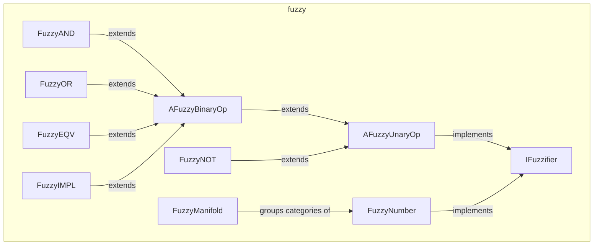

---
digest:
  local-classes:
    AFuzzyBinaryOp:
      mtime: '2026-09-05T10:13:24Z'
      digest: 384328ba9e927141b017b2869d6b0caca24991f880d7ab1a4b09b0b75df90b85
    AFuzzyUnaryOp:
      mtime: '2026-09-05T20:44:07Z'
      digest: 68906883966a52105cae21ce15cf91aa52524b0f80c6f535b0648cd8d206f0e4
    FuzzyAND:
      mtime: '2026-09-05T20:44:10Z'
      digest: e37138ad1df11c85fdc7b662f1c470e392f79edf1612c98bc4f5e1d14ce7e8dc
    FuzzyBoole:
      mtime: '2026-09-05T10:13:24Z'
      digest: 3e0006e85dbcd39af2af216aca4dae48ddbc20820ef1acf7e33fa3670db790d4
    FuzzyEQV:
      mtime: '2026-09-05T20:43:59Z'
      digest: 6ad8ea433570371dece7046b8fbb122572ebd5fde1de561e90039fc379c9bd28
    FuzzyIMPL:
      mtime: '2026-09-05T10:13:24Z'
      digest: 327630afc8d45ea3417de8caaf66220cef204b250344748e0ece741deff82e31
    FuzzyManifold:
      mtime: '2026-09-05T20:45:07Z'
      digest: 9d50ed2ee16fff46e8e224d3f84d3efe0e374c6ddc8b57ab1acb68010e2a9779
    FuzzyNOT:
      mtime: '2026-09-05T20:44:14Z'
      digest: 355d133ca802bbb0a7a4ea34fd1931febccd1a0fabd49115e7edcad1e169d794
    FuzzyNumber:
      mtime: '2026-09-05T20:44:37Z'
      digest: 93575cdbf2061fcbe3cf543b28349a0e6213caa9c275e5ad865913b885386e70
    FuzzyOR:
      mtime: '2026-09-05T20:44:12Z'
      digest: d5a05c177dd8a1d8458dfe61239c91f9ac49ff5298e2ec265c0525c07796fe99
    IFuzzifier:
      mtime: '2026-09-05T20:44:16Z'
      digest: e071c6f22bdde4825e088d859d36b135a61301e593422ecde92e35b8114d2d09
  folders: {}
tags:
- code/fuzzy_logic
concepts:
- Fuzzy Logic
facets:
  layer: utility
  status: legacy
  complexity: medium
description: 'Implements fuzzy logic: predicates and combinators whose truth value is a continuous degree of membership in `[0, 1]` rather than a crisp boolean. `IFuzzifier` is the single `getMembership(Object)` contract; `AFuzzyUnaryOp`/`AFuzzyBinaryOp` are abstract bases for combinators over one or two fuzzifiers, and `FuzzyNOT`/`FuzzyAND`/`FuzzyOR`/`FuzzyEQV`/ `FuzzyIMPL` implement the standard min/max-based fuzzy connectives (De Morgan''s laws hold for min/max/complement, unlike full Boolean distributivity). `FuzzyBoole` is a scalar fuzzy value that also implements `streamIO.copy.boole.Boole`, plugging fuzzy logic into the `boole` package''s own algebra. `FuzzyNumber` represents a fuzzy scalar or interval as a triangular membership function with precomputed weight and center of mass (for fast defuzzification); `FuzzyManifold` groups an ordered set of `FuzzyNumber` categories for one dimension (e.g. "jam"/"stop"/"float" traffic-speed categories) and supports fuzzification, categorization and rule-based defuzzification across multi-dimensional rule tables.'
---

# fuzzy

Implements fuzzy logic: predicates and combinators whose truth value is a continuous
degree of membership in `[0, 1]` rather than a crisp boolean. `IFuzzifier` is the single
`getMembership(Object)` contract; `AFuzzyUnaryOp`/`AFuzzyBinaryOp` are abstract bases for
combinators over one or two fuzzifiers, and `FuzzyNOT`/`FuzzyAND`/`FuzzyOR`/`FuzzyEQV`/
`FuzzyIMPL` implement the standard min/max-based fuzzy connectives (De Morgan's laws
hold for min/max/complement, unlike full Boolean distributivity). `FuzzyBoole` is a
scalar fuzzy value that also implements `streamIO.copy.boole.Boole`, plugging fuzzy
logic into the `boole` package's own algebra. `FuzzyNumber` represents a fuzzy scalar
or interval as a triangular membership function with precomputed weight and center of
mass (for fast defuzzification); `FuzzyManifold` groups an ordered set of `FuzzyNumber`
categories for one dimension (e.g. "jam"/"stop"/"float" traffic-speed categories) and
supports fuzzification, categorization and rule-based defuzzification across
multi-dimensional rule tables.

## Classes

| Class | Responsibility |
|---|---|
| [AFuzzyBinaryOp](AFuzzyBinaryOp.java) | Title: AFuzzyBinaryOp Description: Abstract Base Class for a binary Fuzzy Operation like AND, OR, IMPL etc. Known SubClasses: |
| [AFuzzyUnaryOp](AFuzzyUnaryOp.java) | Title: AFuzzyUnaryOp Description: Abstract Base Class for unary Fuzzy Functions. |
| [FuzzyAND](FuzzyAND.java) | Title: FuzzyAND Description: Binary Conjunction of two fuzzy inputs (Predicates). |
| [FuzzyBoole](FuzzyBoole.java) | Title: FuzzyBoole Description: This Class is a Realization of a Boolean Value with continuous Range (float). |
| [FuzzyEQV](FuzzyEQV.java) | Fuzzy equivalence of two fuzzifiers: their memberships agree exactly when this returns 1, and disagree completely when it returns 0. Title: FuzzyEQV Description: Purpose: Purpose / Responsibilities of this Class Design Decisions / Implementation Details: If similar Classes exist (e.g. Polymorphism), characterize the specific Differences to compare these. |
| [FuzzyIMPL](FuzzyIMPL.java) | Fuzzy (Kleene-Dienes) implication of two fuzzifiers: A IMPL B = max(1-A, B). |
| [FuzzyManifold](FuzzyManifold.java) | Title: FuzzyManifold Description: Models a 1-dim. |
| [FuzzyNOT](FuzzyNOT.java) | Title: FuzzyNOT Description: Fuzzy Complement / unary NOR Operation Known SubClasses: Known Uses: Copyright: Copyright (c) Matthias Heuer Company: personal Created on 10-26-2002, 12:47 PM |
| [FuzzyNumber](FuzzyNumber.java) | Class representing a fuzzy 1-dim. |
| [FuzzyOR](FuzzyOR.java) | Title: FuzzyOR Description: Binary Disjunction of two fuzzy inputs (Predicates). |
| [IFuzzifier](IFuzzifier.java) | Title: IFuzzifier Description: Defines the Interface for a fuzzy Predicate, which is used to define fuzzy Sets based on a Membership Test. |

## Architecture

## Entry Points

| Class.Method | Description |
|---|---|
| [IFuzzifier.getMembership(Object)](IFuzzifier.java#L39) | Degree to which arg belongs to this fuzzy set. |
| [FuzzyManifold.fuzzify(float)](FuzzyManifold.java#L252) | Memberships of a value across every category. |
| [FuzzyManifold.getDescription(int)](FuzzyManifold.java#L393) | Human-readable "dimension=category" label. |
