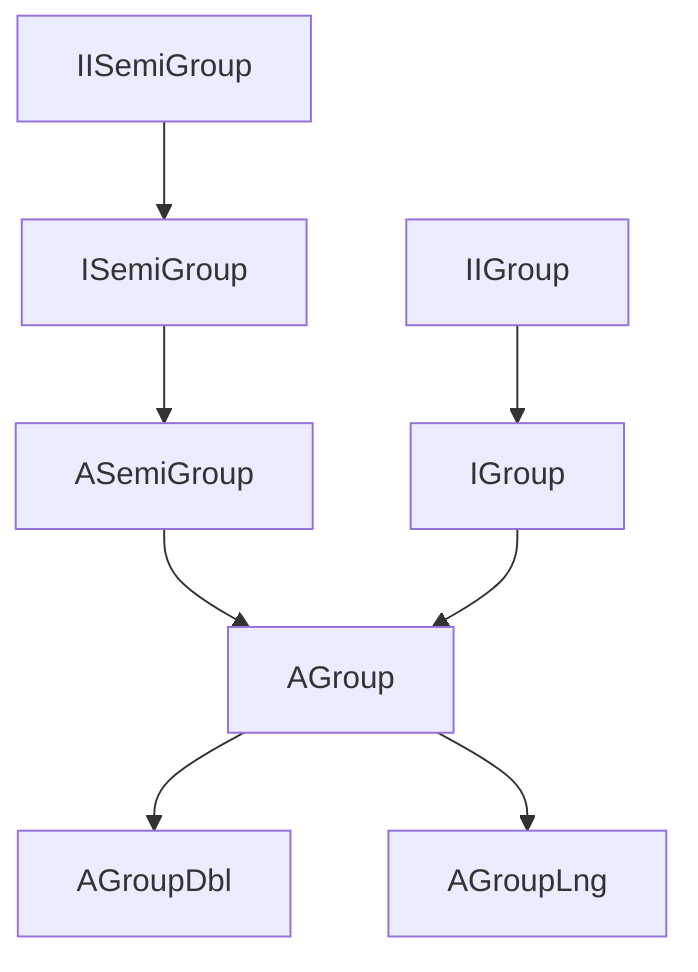

---
digest:
  local-classes:
    AGroup:
      mtime: '2026-09-05T21:16:44Z'
      digest: 9feda1a5b100dd0d323db8d2add7a65d93675a05f0fa0011ce6bfda352dd51ed
    AGroupDbl:
      mtime: '2026-09-05T10:13:24Z'
      digest: 6725ce8bc31b1c49029b10e5ccaf7e77f1e6fe7d115a925079bcf882f017b1cf
    AGroupLng:
      mtime: '2026-09-05T10:13:24Z'
      digest: eb9f7fc3fcb8f44c77bc4be45b52e684a592c85cb27efe4353f7eda163602395
    ASemiGroup:
      mtime: '2026-09-05T10:13:24Z'
      digest: cf238d2cdc4eff098ac94587bb4439f65bc6412f5f103badb998c3f2fdbe4eb3
    CGroup:
      mtime: '2026-09-05T10:13:24Z'
      digest: ca8258e1de5fef64fe566b0823ccb68d722cbfd42435a30848cde3e186eae586
    CSemiGroup:
      mtime: '2026-09-05T10:13:24Z'
      digest: 4f761f1e2b37b9a68164d28d94d9ac37b89570a96c9cc796e2d7beda08630ea1
    DateTime:
      mtime: '2026-09-05T21:18:18Z'
      digest: ea94bfee1d75b8b582f0a9ccbccd8d601019156a4b8c5d51b7e4c72458126fcf
    IDblGroup:
      mtime: '2026-09-05T10:13:24Z'
      digest: 6a79dd9fc12940e58ee375cbc3121297e713da8edd8d293b3af2b52efe23c39c
    IGroup:
      mtime: '2026-09-05T10:13:24Z'
      digest: 7e2ca790f2acf5e12005d81e5a2a212114c0f4b87fa7c2495e19544ba108b431
    IIGroup:
      mtime: '2026-09-05T10:13:24Z'
      digest: e9682101424d22dd4600dec48319c6239b0a46632d47db2b9d21340f98d597df
    IISemiGroup:
      mtime: '2026-09-05T10:13:24Z'
      digest: b5a39a48b540d4186676e1223b52045cdb499187af69644812a8371f291a6fd6
    ILngGroup:
      mtime: '2026-09-05T10:13:24Z'
      digest: 5c1c5a3067fff539948c8d1116f71fb31d92c9ac9b8cd61b00bedbb357a7d7b1
    ISemiGroup:
      mtime: '2026-09-05T10:13:24Z'
      digest: 08fa52430453ffb4091811a2699e6dc8d27b2de1057aaf55322bbe3242f821d7
    TestGroup:
      mtime: '2026-09-05T10:13:24Z'
      digest: a32f6471d3d5bb15d4d766c6c05b666248b80f41d1ac54a3286cc6661af5543a
  folders:
    ring/:
      mtime: '2026-09-05T21:14:05Z'
      digest: bf4d7d1cb810686ada94c8d10413362f7fc1bf0d40d97797b1484f4913656d87
tags:
- code/group_algebra
- code/date_time
concepts:
- Group/SemiGroup Algebra
facets:
  layer: domain
  status: legacy
  complexity: high
description: 'This folder defines the additive Algebraic Group layer of the streamIO copy-Semantics hierarchy: `ISemiGroup`/`ASemiGroup` model a plain additive SemiGroup (G,+), and `IGroup`/`AGroup` extend it with Subtraction and a neutral 0 Element (G,+,-,0) - symmetric to the multiplicative `groupM` folder (a sibling folder outside this scope), which it is combined with by Delegation rather than Interface Inheritance. `IDblGroup`/`AGroupDbl` and `ILngGroup`/`AGroupLng` add direct `double`/`long` Overloads for performance, `IIGroup`/`IISemiGroup` factor out the single abstract `+=`/`-=` Operation each concrete Group must define, and `CGroup`/`CSemiGroup` hold shared Constant Implementations. `DateTime` is a self-contained Date/Time/Julian-Day/Calendar utility Class (not part of the Group Algebra itself). `TestGroup` is the manual test-suite entry point. The `ring/` Subfolder builds the multiplicative Ring Algebra and its Number types on top of this additive Group.'
---

# group

This folder defines the additive Algebraic Group layer of the streamIO copy-Semantics hierarchy:
`ISemiGroup`/`ASemiGroup` model a plain additive SemiGroup (G,+), and `IGroup`/`AGroup` extend it with
Subtraction and a neutral 0 Element (G,+,-,0) - symmetric to the multiplicative `groupM` folder (a
sibling folder outside this scope), which it is combined with by Delegation rather than Interface
Inheritance. `IDblGroup`/`AGroupDbl` and `ILngGroup`/`AGroupLng` add direct `double`/`long` Overloads for
performance, `IIGroup`/`IISemiGroup` factor out the single abstract `+=`/`-=` Operation each concrete
Group must define, and `CGroup`/`CSemiGroup` hold shared Constant Implementations. `DateTime` is a
self-contained Date/Time/Julian-Day/Calendar utility Class (not part of the Group Algebra itself).
`TestGroup` is the manual test-suite entry point. The `ring/` Subfolder builds the multiplicative Ring
Algebra and its Number types on top of this additive Group.

## Classes

| Class | Responsibility |
|---|---|
| [AGroup](AGroup.java) | Default Implementation of an additive Group (G,+,-,0). |
| [AGroupDbl](AGroupDbl.java) | Adds the Capability to add double Numbers directly |
| [AGroupLng](AGroupLng.java) | Adds the Capability to add long Numbers directly |
| [ASemiGroup](ASemiGroup.java) | Default Implementation of an additive SemiGroup (G,+). |
| [CGroup](CGroup.java) | Implements Constants for all Types of Group Classes. |
| [CSemiGroup](CSemiGroup.java) | Implements Constants for all Types of SemiGroup Classes. |
| [DateTime](DateTime.java) | This Class contains Methods to calculate Dates and Times. |
| [IDblGroup](IDblGroup.java) | Adds the Capability to add double Precision Numbers directly |
| [IGroup](IGroup.java) | Algebraic Group (M,+,-,0): Set of Objects with inner Operations "+,-" on any two Objects In a SemiGroup any two Objects can be "added" or "subtracted". |
| [IIGroup](IIGroup.java) | Group (M,+,-,0): Defines the most basic Interface necessary for an additive Group: '-='. |
| [IISemiGroup](IISemiGroup.java) | HalfGroup (M,+): Defines the most basic Interface necessary for an additive SemiGroup: '+='. |
| [ILngGroup](ILngGroup.java) | Adds the Capability to add long Numbers directly |
| [ISemiGroup](ISemiGroup.java) | Algebraic SemiGroup (M,+): Set of Objects with inner Operation "+" on any two Objects. |
| [TestGroup](TestGroup.java) | Tests all classes in the Package Group |

## Architecture

## Entry Points

| Entry Point | Description |
|---|---|
| [TestGroup.main(String[])](TestGroup.java) | Manual test-suite entry point running all tests in this package. |

## Subsystems

| Folder | Domain Role | Entry Point |
|---|---|---|
| `ring/` | This folder builds the Algebraic Ring layer on top of the parent `groupM` folder's Multiplicative | `ABoolRing` |
