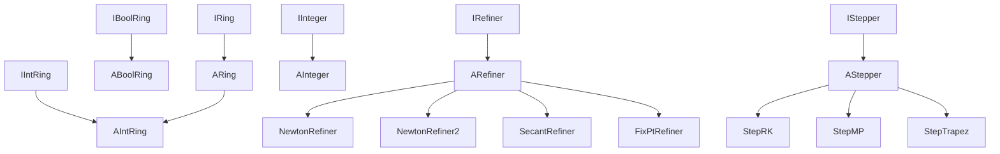

---
digest:
  local-classes:
    ABoolRing:
      mtime: '2026-09-05T10:13:24Z'
      digest: d146d9f54504c07e2d37d7c4753ada5a96d23a1b1d10cbcb95dfee3016e527b1
    AIntRing:
      mtime: '2026-09-05T10:13:24Z'
      digest: 83bfabc2d82728aee2d2cd8c4ba22ef3054bcd7b020b69075f2cb9355b96d938
    AInteger:
      mtime: '2026-09-05T10:13:24Z'
      digest: 9336269dbf793c45a5b36192fdfa5127412a3c4a09480de4f72cf67d60feeb40
    ARefiner:
      mtime: '2026-09-05T10:13:24Z'
      digest: 026045d1c455d858e489c47efb37d316f86e83038f4c02fe0789a22bd2247ca8
    ARing:
      mtime: '2026-09-05T10:13:24Z'
      digest: de97b5d79902ba6cbfcf1a7374a505eeabbb721a4e6b9264ab147a9d0947aff1
    AStepper:
      mtime: '2026-09-05T21:13:00Z'
      digest: 9bec6385be1319f2ad6d5aea5e050a2b44a14e4b50f0828f6f7ac2db249b54bd
    BoolRing:
      mtime: '2026-09-05T10:13:24Z'
      digest: e3b0c44298fc1c149afbf4c8996fb92427ae41e4649b934ca495991b7852b855
    CIntRing:
      mtime: '2026-09-05T10:13:24Z'
      digest: 5e2dfd69e00b8e3aa1ca8040d67cbcd6a6e217d63f5e1902c10e6ed3a730d4cb
    CRing:
      mtime: '2026-09-05T10:13:24Z'
      digest: b85799f343ff74d6eb45c04cee2f58d9fed2a55c10893c662039e6d4950463d7
    Extrapolator:
      mtime: '2026-09-05T10:13:24Z'
      digest: c1176c5e06f4f2416b6034738fd3ba11f5c4c6233940c981f0c6b0a2ac222c9e
    FixPtRefiner:
      mtime: '2026-09-05T10:13:24Z'
      digest: fb8d2c16e16d767ce7dd72d0b9e6a628a04d622ed7c17e25f23d497388566e43
    IComplex:
      mtime: '2026-09-05T10:13:24Z'
      digest: 158a962777812899eae1e2c55be84b810fcaf6368d1c3b708e428cca707de72e
    IFloatStepper:
      mtime: '2026-09-05T10:13:24Z'
      digest: 33c58da311af1032e9bb1ba07335add56ef5a5e996131c5442db1479c6e11001
    IIntRing:
      mtime: '2026-09-05T10:13:24Z'
      digest: 52ea65e70b8a0275ab844f2aa86ec0e9a2f0cf06490cc277dd4e9ce4c3d4b0fd
    IInteger:
      mtime: '2026-09-05T10:13:24Z'
      digest: 2a4385bce6dfb1700a29c1b87c92f879e35cad64b337342c9e961d27ff76d10a
    IODE:
      mtime: '2026-09-05T10:13:24Z'
      digest: c016f92b06cb03d4f5e7de4c8b2ead36a9417ae2a6ded068b5a5dc2ff4f962d7
    IRefiner:
      mtime: '2026-09-05T10:13:24Z'
      digest: 0abcfba82c57a06f8ebc7374e1a2e5f11768ecee947361b1459dab264a2fc426
    IRing:
      mtime: '2026-09-05T10:13:24Z'
      digest: 8d763cad613ae9093dab1fe754d7db840037e5aa86f258f2a09954e30cb80462
    IStepper:
      mtime: '2026-09-05T10:13:24Z'
      digest: 33c58da311af1032e9bb1ba07335add56ef5a5e996131c5442db1479c6e11001
    Interpolator:
      mtime: '2026-09-05T21:13:14Z'
      digest: 001137420d6c266fee2fe7fc26030c92fe2f5d2c435490a46913b83dadac1073
    NewtonRefiner:
      mtime: '2026-09-05T10:13:24Z'
      digest: d7f38299f3c9ae946add9e04598568598cc384e468c17bdaa21c2fa9bbd27a77
    NewtonRefiner2:
      mtime: '2026-09-05T21:13:21Z'
      digest: d7647936271a26ef0f16eae6940a02dc38861d3c3d6659e624ba1ead93ace390
    SecantRefiner:
      mtime: '2026-09-05T10:13:24Z'
      digest: f6a21b0bff4a065d1dfb3a7591801a116aed7ae9faed494d3d94a13c8a12f8ec
    StepMP:
      mtime: '2026-09-05T21:13:31Z'
      digest: 648bef55b270b3a2ea64f9217f40f52bfea59f76d5b8efa2a037caa4bae00c75
    StepRK:
      mtime: '2026-09-05T21:13:44Z'
      digest: b4ccf01736b87137e5ebdaf37f7d509035dba9557a88ef04bdd5b40b705f667e
    StepTrapez:
      mtime: '2026-09-05T21:13:57Z'
      digest: 80048007eaea110228f4d600d82308040b23ec22bb9d2d57160ba5528a870a22
    TestRing:
      mtime: '2026-09-05T21:14:05Z'
      digest: a32f6471d3d5bb15d4d766c6c05b666248b80f41d1ac54a3286cc6661af5543a
    integer:
      mtime: '2026-09-05T10:13:24Z'
      digest: da8d8e81055079b0ef1b0221e342509c9ff78702c714c7b3ae7884736414e2a7
  folders:
    metric/:
      mtime: '2026-09-05T21:10:14Z'
      digest: eb6f0ef1cbc78d7756af61892ebb0af03e1795e30c81973eae638235ca45aeb8
tags:
- code/ring_theory
- code/ode_solver
concepts:
- Ring Algebra and ODE Solvers
facets:
  layer: domain
  status: legacy
  complexity: high
description: 'This folder builds the Algebraic Ring layer on top of the parent `groupM` folder''s Multiplicative SemiGroup. `IRing`/`ARing` define the plain commutative Ring (M,+,-,0,*), `IBoolRing`/`ABoolRing` generalise the same Framework for Boolean/Set-typed Containers, and `IIntRing`/`AIntRing` add the full multiplicative and additive Integrity-Ring Capabilities (Division, no Zero Divisors) used pervasively by the `metric` Subfolder''s Number types. `IComplex` factors out Complex-Conjugation Support for `IIntRing`, `IInteger`/`AInteger`/`integer` define the basic inc()/dec()/pred()/succ() Operations for Integer Types, and `CIntRing`/`CRing` hold shared Constants. The remaining classes implement numerical Algorithms over this algebra: root/FixPoint Refiners (`IRefiner`/`ARefiner` and their `NewtonRefiner`/ `NewtonRefiner2`/`SecantRefiner`/`FixPtRefiner` implementations), an `Extrapolator` for rational/polynomial Extrapolation to zero Step-width, an `Interpolator` for polynomial Interpolation, and ODE/Function Steppers (`IStepper`/`IFloatStepper`/`AStepper`/`IODE` and their `StepRK`/`StepMP`/`StepTrapez` implementations). `TestRing` is the manual test-suite entry point. The `metric/` Subfolder builds the concrete scalar and Tensor Number types on top of this Ring Algebra.'
---

# ring

This folder builds the Algebraic Ring layer on top of the parent `groupM` folder's Multiplicative
SemiGroup. `IRing`/`ARing` define the plain commutative Ring (M,+,-,0,*), `IBoolRing`/`ABoolRing`
generalise the same Framework for Boolean/Set-typed Containers, and `IIntRing`/`AIntRing` add the full
multiplicative and additive Integrity-Ring Capabilities (Division, no Zero Divisors) used pervasively by
the `metric` Subfolder's Number types. `IComplex` factors out Complex-Conjugation Support for
`IIntRing`, `IInteger`/`AInteger`/`integer` define the basic inc()/dec()/pred()/succ() Operations for
Integer Types, and `CIntRing`/`CRing` hold shared Constants. The remaining classes implement numerical
Algorithms over this algebra: root/FixPoint Refiners (`IRefiner`/`ARefiner` and their `NewtonRefiner`/
`NewtonRefiner2`/`SecantRefiner`/`FixPtRefiner` implementations), an `Extrapolator` for rational/polynomial
Extrapolation to zero Step-width, an `Interpolator` for polynomial Interpolation, and ODE/Function
Steppers (`IStepper`/`IFloatStepper`/`AStepper`/`IODE` and their `StepRK`/`StepMP`/`StepTrapez`
implementations). `TestRing` is the manual test-suite entry point. The `metric/` Subfolder builds the
concrete scalar and Tensor Number types on top of this Ring Algebra.

## Classes

| Class | Responsibility |
|---|---|
| [ABoolRing](ABoolRing.java) | Title: ABoolRing.java Description: Abstracts the independent Functionality of Rings and Boolean Groups used by Containers and Streams like StreamSet. |
| [AIntRing](AIntRing.java) | Default Implementation of the Algebraic Integrity Ring (M,+,-,0,*,/,1): Set of Objects with inner Operations +,-,*,/ , where 1) (M,+,-,0,*) form an Algebraic Ring 2) 1 exists neutral Element for * 3) a=0 v b=0 a*b=0 i.e. free of Zero Divisors (exist in Mod Classes) Design Decisions: No new operations are defined, but both Interfaces are integrated into one. |
| [AInteger](AInteger.java) | Default Implementation of the 'integer' Interface for Integer Types. |
| [ARefiner](ARefiner.java) | Framework for performing a Step to find a Solution (e.g. Root of Function f) Design Decisions: This Class is for Determining an x Value that fulfills a certain Criterion, like with Finding Roots or Minima. |
| [ARing](ARing.java) | Default Implementation of the Algebraic Ring (M,+,-,0,*): Set of Objects with inner Operations +,-,* , where 1) (M,+,-,0) form a commutative Group 2) (M,*) form a SemiGroup 3) and the Distributive Laws apply: a*(b+c)=a*b+a*b und (a+b)*c =a*c+b*c It can be proved that... |
| [AStepper](AStepper.java) | Abstract Stepper Routine for Integration of ODEs and Functions. |
| [BoolRing](BoolRing.java) | Title: ABoolRing.java Description: Unifies the independent Functionalities of Rings and Boolean Groups used by Containers and Streams like StreamSet. |
| [CIntRing](CIntRing.java) | Implements Constants for all Types of IIntRing Classes. |
| [CRing](CRing.java) | Implements Constants for all Types of Ring Classes. |
| [Extrapolator](Extrapolator.java) | This class inter / extrapolates the recursively added Values of x and y Coordinates to 0 (Zero) It uses either rational or polynomial Interpolation, where the first one is more flexible in the Presence of Poles. |
| [FixPtRefiner](FixPtRefiner.java) | Title: FixPtRefiner Description: Fixpoint Search according to Banach Works on R^n->R^n Value Functions. |
| [IComplex](IComplex.java) | Defines the Operations for Complex Conjugation for the IIntRing already, because it is used in Tensor Arithmetic |
| [IFloatStepper](IFloatStepper.java) | Interface for a Stepper Routine, either for Integration or for ODEs e.g. Euler Sums or Runge Kutta etc. This can be used for DGLs of higher Degree by just using a Tensor as y Value and defining one Dimension per Degree. |
| [IIntRing](IIntRing.java) | Integrity Ring integrates full multiplicative and additive Group Capabilities. |
| [IInteger](IInteger.java) | Defines the most basic Operations inc() and dec(), usually for Integer Types. |
| [IODE](IODE.java) | Interface for an ordinary Differential Equation (ODE). |
| [IRefiner](IRefiner.java) | Title: IFloatRefiner Description: Interface for performing a single Step to find a special Point (Zero, FixPoint or Extremum) in Function f Known SubClasses: Known Uses: similar Classes: |
| [IRing](IRing.java) | Default Implementation of the Algebraic Ring (M,+,-,0,*): Set of Objects with inner Operations +,-,* , where 1) (M,+,-,0) form a commutative Group 2) (M,*) form a SemiGroup 3) and the Distributive Laws apply: a*(b+c)=a*b+a*b und (a+b)*c =a*c+b*c It can be proved that... |
| [IStepper](IStepper.java) | Interface for a Stepper Routine, either for Integration or for ODEs e.g. Euler Sums or Runge Kutta etc. This can be used for DGLs of higher Degree by just using a Tensor as y Value and defining one Dimension per Degree. |
| [Interpolator](Interpolator.java) | This Class implements a polynomial Interpolator that interpolates a Function dependent on a one-dimensional Variable. |
| [NewtonRefiner](NewtonRefiner.java) | Title: NewtonFloatRefiner Description: Nullstellensuche with Newton Formula Doesn't work well for multiple Zeros, except if the Multiplicity is known and given (can also act as a Relaxation Parameter!) Works only on R^n->R^n Value Functions. |
| [NewtonRefiner2](NewtonRefiner2.java) | Nullstellensuche with Newton Formula and 2nd Derivative Works well, also for multiple Zeros, Works only on R->R Value Functions. |
| [SecantRefiner](SecantRefiner.java) | Title: SecantRefiner Description: Root (x = 0) Search with Secant Formula, which differs from the Regula Falsi in that it may not keep a Root bracketed! Doesn't work well for multiple Zeros, except if the Multiplicity is known and given (can also act as a Relaxation Parameter!) Works only on 1-dim. |
| [StepMP](StepMP.java) | Integrates the ODE in (x,y) by using the MidPoint Rule. |
| [StepRK](StepRK.java) | Integrates the given ODE in (x,y) using the Runge-Kutta Formula. |
| [StepTrapez](StepTrapez.java) | Integrates the Function f(x) using the Trapez (MidPoint) Rule. |
| [TestRing](TestRing.java) | Manual test-suite entry point that runs this package's self-tests, then hands off to TestGroup/ TestGroupM to continue testing the parent Packages. |
| [integer](integer.java) | Defines the Function pred() and succ(), usually for Integer Types as a complement to inc() and dec() in IInteger. |

## Architecture

## Entry Points

| Entry Point | Description |
|---|---|
| [TestRing.main(String[])](TestRing.java) | Manual test-suite entry point running this package's self-tests before handing off to TestGroup/TestGroupM. |

## Subsystems

| Folder | Domain Role | Entry Point |
|---|---|---|
| `metric/` | This folder adds Metric-Space structure - a Norm/Distance, a strict Order and Well-Order Constants | `AMetric` |
