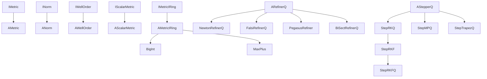

---
digest:
  local-classes:
    AMetric:
      mtime: '2026-09-05T10:13:24Z'
      digest: aef8a84eea25c51c6963b5ea8bc6ce5626205173a309223ac40b31c14aff2517
    AMetricIRing:
      mtime: '2026-09-05T21:06:27Z'
      digest: 90749431550c937068ac1623fa60db9adbfa5e665d4adfa4564fd504f3ab6e2b
    ANorm:
      mtime: '2026-09-05T10:13:24Z'
      digest: 89bd1ad748e9ca678c425ac6f815fb7585b6621405d682ceb55fd2ad9ed08ea7
    ARefinerQ:
      mtime: '2026-09-05T10:13:24Z'
      digest: 2d174e129804694e5c7dc6170728ae1edb2889816abd549c679846554cfdddb2
    AScalarMetric:
      mtime: '2026-09-05T10:13:24Z'
      digest: 5d6c47b6b3c4552a3918f85557ce12853c0f79e267758b54002ad6aec8f21194
    AStepperQ:
      mtime: '2026-09-05T10:13:24Z'
      digest: 530c0eaf4b5312d67a901c12a215684829c3c1f39068f9566ea57c02675c59b9
    AWellOrder:
      mtime: '2026-09-05T10:13:24Z'
      digest: 25cbcb318dfe7b8eb0b484a17f5fea6b65ef8ac52e614b4894759d5f4349ff5e
    BiSectRefinerQ:
      mtime: '2026-09-05T10:13:24Z'
      digest: 414beed65c010979841956e1a3d37b2f648c0d4bab568a7f14ac15e7659f0b9b
    BigInt:
      mtime: '2026-09-05T21:05:32Z'
      digest: 5e27082f717c3e985a604ecb7f876d7f461017fae1ea2411b483503d343e25a8
    CMetric:
      mtime: '2026-09-05T10:13:24Z'
      digest: 29890469122e171ddf801c1d6050f5a475e1dc6f7dfa41872171f33af378f783
    CMetricIRing:
      mtime: '2026-09-05T10:13:24Z'
      digest: df95e825884a8500f39e97ae5d4edf026f63638732786f1117747e45517b9067
    CNorm:
      mtime: '2026-09-05T10:13:24Z'
      digest: 8c050ce6eae9d9b24814a16fa3a4ebc60a26b6c61159920769af0aa4ff9c71ce
    CScalarMetric:
      mtime: '2026-09-05T10:13:24Z'
      digest: 8bfa821c5454e0ed5324a533ef7c0658ec96e972d86d26016acaec9f08033b2e
    CWellOrder:
      mtime: '2026-09-05T10:13:24Z'
      digest: 6d722afe87e65f20e30fc1801e4187117200cea0f1bf38a8168e79c3008bda64
    ExtraPolValue:
      mtime: '2026-09-05T10:13:24Z'
      digest: 7efb6e6bddb46c376a3220bdea35c259f20d40a665e751166ec8ed9b60c54d8f
    FalsiRefinerQ:
      mtime: '2026-09-05T10:13:24Z'
      digest: ae4c1bf88daa99ea23dd341a2031abdf6a15e023cbb27f8fc59b71405558a74e
    GoldenMinimizer:
      mtime: '2026-09-05T10:13:24Z'
      digest: 11d87a492cd823106cba41cb070075e01db0b770c91b7d4c7b6c4b528e3556ab
    IIMetric:
      mtime: '2026-09-05T10:13:24Z'
      digest: 972e157edfd6054e3c843b38d9600e88afe6d8804d676df838832e5d46a71a61
    IINorm:
      mtime: '2026-09-05T10:13:24Z'
      digest: 32c881ca953669c36e8065533acbcdd9f7266594fe21547aae92831f7d731478
    IIWellOrder:
      mtime: '2026-09-05T10:13:24Z'
      digest: 058bc364b39b2fb23d7b39cbee07acfa96c9bf768d53693a5a81c7fdf336ecf8
    IMetric:
      mtime: '2026-09-05T10:13:24Z'
      digest: 4a14b852017719f3e36e4e3a23db958e0ce4ff33847fa4ba64a8b9ee6e2a5088
    IMetricIRing:
      mtime: '2026-09-05T10:13:24Z'
      digest: 7906308a2b5d9a05be0be2312fd657a730c83d80d8600af1f335f6bcd3351061
    IMetricObject:
      mtime: '2026-09-05T10:13:24Z'
      digest: 972e157edfd6054e3c843b38d9600e88afe6d8804d676df838832e5d46a71a61
    INorm:
      mtime: '2026-09-05T10:13:24Z'
      digest: d08e0df0a8bfe3f7d36da3019ded99a71af30962ae9261e0ff92893e7a8c3d06
    IScalarMetric:
      mtime: '2026-09-05T10:13:24Z'
      digest: 38b88e60f9f7062dab8cc740f5fff0f4892c8bdb0fd11937a3d01a08367acb7a
    IScalarMetricIRing:
      mtime: '2026-09-05T10:13:24Z'
      digest: e3b0c44298fc1c149afbf4c8996fb92427ae41e4649b934ca495991b7852b855
    IWellOrder:
      mtime: '2026-09-05T10:13:24Z'
      digest: 6fbdadd20e58078adfbff656a05716d5f3364361cf9e7c359d744d447d4cc612
    MaxPlus:
      mtime: '2026-09-05T21:07:30Z'
      digest: c286669e7d0bf73cb996dc2363e712e105d8140eeb8d4981befa44fdc99acda9
    MultiStep:
      mtime: '2026-09-05T10:13:24Z'
      digest: 4d23523ade9c2f2a4524e178a7bf0779414a581d962ee6123359f02079e57ec9
    MultiStepY:
      mtime: '2026-09-05T21:07:43Z'
      digest: ba33d0d560832da769e42311b5c5dc0c4f0033e4e88a4c74f6e1e2c7b1565d61
    MultiStepYQ:
      mtime: '2026-09-05T10:13:24Z'
      digest: 4bc09dd159a4761b565713b1a0b0aefe70f12572f52ecb286d6fb5e76c6df1f8
    NewtonRefinerQ:
      mtime: '2026-09-05T10:13:24Z'
      digest: 0e344b3aee639cf48be4daab1d33294b7986d7e9a866b68090db4f0de4d44797
    NewtonStep2Q:
      mtime: '2026-09-05T21:10:14Z'
      digest: e3b0c44298fc1c149afbf4c8996fb92427ae41e4649b934ca495991b7852b855
    PegasusRefiner:
      mtime: '2026-09-05T10:13:24Z'
      digest: f727c22459b894a956a3c9b5b7fc6dc3076ab0c6170e2270afb757726c834fd2
    StepMPQ:
      mtime: '2026-09-05T10:13:24Z'
      digest: 53d6368d4783bc38d993d25896527a440595b955d07bc94750b6f5bcca952cc9
    StepRKF:
      mtime: '2026-09-05T21:07:56Z'
      digest: b150e51d866d804019d583762b0b2efccb3544b21144076819556a7b74fa991c
    StepRKFQ:
      mtime: '2026-09-05T21:08:16Z'
      digest: c1acf3d4bf7f057b642305b97fc815bb80181e689504b5e4e2a10fb57180feaa
    StepRKQ:
      mtime: '2026-09-05T21:08:24Z'
      digest: 3266cd78c00c46d781fc0ccea0299bcb9b9ee80eac1d17e59a2630b31fe97b64
    StepTrapezQ:
      mtime: '2026-09-05T10:13:24Z'
      digest: 8b3f75dce59d8af896170ed520dfbbe5528eab0ab0d13e5cbd19314bae2c12bc
    TestMetric:
      mtime: '2026-09-05T21:08:30Z'
      digest: a32f6471d3d5bb15d4d766c6c05b666248b80f41d1ac54a3286cc6661af5543a
  folders:
    body/:
      mtime: '2026-09-05T21:00:22Z'
      digest: 1b7fee34b6c83f7a297a6511db87e4ed854e8391dd1e01983e863fa4530a74a2
tags:
- code/metric_space
- code/root_finding
- code/numerical_integration
- code/big_integer_arithmetic
concepts:
- Metric Spaces - Root Finding and Numerical Integration
facets:
  layer: domain
  status: legacy
  complexity: high
description: 'This folder adds Metric-Space structure - a Norm/Distance, a strict Order and Well-Order Constants (Infinity, NaN, min/max Value) - on top of the plain Algebraic Ring from the parent `ring` folder. `IMetric`/`AMetric`, `INorm`/`ANorm` and `IWellOrder`/`AWellOrder` define the three orthogonal Interfaces (Distance, Norm, Order-with-Constants), `IScalarMetric`/`AScalarMetric` integrates 1-dimensional Order with a Metric, and `IMetricIRing`/`AMetricIRing` fuses all of this with the Ring''s algebraic Operations into the single `IMetricIRing` used pervasively by the `body` Number types. The `C*` classes (`CMetric`, `CMetricIRing`, `CNorm`, `CScalarMetric`, `CWellOrder`) provide shared Constant Implementations. `BigInt` is a dynamic-Size arbitrary-Precision integer built directly on this layer, and `MaxPlus` is a (max,+) tropical-Algebra number type. The remaining classes implement iterative numerical Algorithms over `IMetricIRing` Values: root/zero Refiners (`ARefinerQ` and its `NewtonRefinerQ`/`FalsiRefinerQ`/ `PegasusRefiner`/`BiSectRefinerQ` subclasses), a `GoldenMinimizer`, an `ExtraPolValue` Extrapolator, and ODE Steppers with adaptive Step-width control (`AStepperQ` and its `StepRKQ`/`StepRKF`/`StepRKFQ`/ `StepMPQ`/`StepTrapezQ`/`MultiStep`/`MultiStepY`/`MultiStepYQ`/`NewtonStep2Q` subclasses). `TestMetric` is the manual test-suite entry point. The `body/` Subfolder builds the concrete scalar and Tensor Number types on top of this Metric-Ring Algebra.'
---

# metric

This folder adds Metric-Space structure - a Norm/Distance, a strict Order and Well-Order Constants
(Infinity, NaN, min/max Value) - on top of the plain Algebraic Ring from the parent `ring` folder.
`IMetric`/`AMetric`, `INorm`/`ANorm` and `IWellOrder`/`AWellOrder` define the three orthogonal Interfaces
(Distance, Norm, Order-with-Constants), `IScalarMetric`/`AScalarMetric` integrates 1-dimensional Order
with a Metric, and `IMetricIRing`/`AMetricIRing` fuses all of this with the Ring's algebraic Operations
into the single `IMetricIRing` used pervasively by the `body` Number types. The `C*` classes (`CMetric`,
`CMetricIRing`, `CNorm`, `CScalarMetric`, `CWellOrder`) provide shared Constant Implementations. `BigInt`
is a dynamic-Size arbitrary-Precision integer built directly on this layer, and `MaxPlus` is a (max,+)
tropical-Algebra number type. The remaining classes implement iterative numerical Algorithms over
`IMetricIRing` Values: root/zero Refiners (`ARefinerQ` and its `NewtonRefinerQ`/`FalsiRefinerQ`/
`PegasusRefiner`/`BiSectRefinerQ` subclasses), a `GoldenMinimizer`, an `ExtraPolValue` Extrapolator, and
ODE Steppers with adaptive Step-width control (`AStepperQ` and its `StepRKQ`/`StepRKF`/`StepRKFQ`/
`StepMPQ`/`StepTrapezQ`/`MultiStep`/`MultiStepY`/`MultiStepYQ`/`NewtonStep2Q` subclasses). `TestMetric` is
the manual test-suite entry point. The `body/` Subfolder builds the concrete scalar and Tensor Number
types on top of this Metric-Ring Algebra.

## Classes

| Class | Responsibility |
|---|---|
| [AMetric](AMetric.java) | Defines a Metric on a Set: d:X*X -> R with the following Properties: 1) x != y => d(x,y) > 0 (positive definite) 2) d(x,x) == 0 3) d(x,y) == d(y,x) (symmetric) 4) d(x,z) <= d(x,y) + d(y,z) (Triangle Inequation) You can define an absolute Value by \|x\| = d(x,0) A Metric defines a Topology on the Set. |
| [AMetricIRing](AMetricIRing.java) | Default Implementation of the Algebraic Integrity Ring with strict Order (M,+,-,0,*,/,1,>): Set of Objects with inner Operations +,-,*,/ and binary Relation > with: 1) (M,+,-,0,*,/,1) form an Algebraic Integrity Ring 2) > is a strict Order relation No new operations are defined, but both Interfaces are integrated into one. |
| [ANorm](ANorm.java) | Normed Space (X,\|\|: X -> R) VectorSpace X is called Normed Space with Norm \|\| when the following is true: 1) \|x\| > 0 when x!=0 : d is positive definite (otherwise Pseudo-Norm) 3) \|k*x\|==\|k\|*\|x\| : d is homogenic 4) \|x+y\|<=\|x\|+\|y\| : Triangle-Inequation You can define a Metric d and Topology t by defining d(x,y)=\|x-y\|. |
| [ARefinerQ](ARefinerQ.java) | Quality Stepper Algorithm: Extends Stepping for a Solution in a 1-dim Varable Space by bounding the Zero Position (continuous f) and iterating until the Zero is hit in x AND y Direction. |
| [AScalarMetric](AScalarMetric.java) | Implements all the Methods of the Interface 'ScalarMetric', which integrates 1-dim Order with a Metric. |
| [AStepperQ](AStepperQ.java) | Performs several Steps for ODE Integration with a variable Step Size up to the Target. |
| [AWellOrder](AWellOrder.java) | AWellOrder: Interface for a Class whose Objects are well and connex ordered by Relations ">"resp."<". |
| [BiSectRefinerQ](BiSectRefinerQ.java) | Title: BiSectRefinerQ Description: Performs a Search by Bisection. |
| [BigInt](BigInt.java) | Concrete Implementation of a dynamic Size arbitrary Precision Number. |
| [CMetric](CMetric.java) | Implements Constants for all Types of WellOrder Classes. |
| [CMetricIRing](CMetricIRing.java) | Implements Constants for all Types of IIntRing Classes. |
| [CNorm](CNorm.java) | Implements Constants for all Types of IIntRing Classes. |
| [CScalarMetric](CScalarMetric.java) | Implements Constants for all Types of WellOrder Classes. |
| [CWellOrder](CWellOrder.java) | Implements Constants for all Types of WellOrder Classes. |
| [ExtraPolValue](ExtraPolValue.java) | Extends Extrapolator with an Evaluation, if the Extrapolation converges and if yes, to which Value it converges. |
| [FalsiRefinerQ](FalsiRefinerQ.java) | Root Finding (x0 Value for which f(x0)==0) with Falsi Step Doesn't work well for multiple Zeros, except if the Multiplicity is known and given (can also act as a Relaxation Parameter!) Works only on R->R Value Functions. |
| [GoldenMinimizer](GoldenMinimizer.java) | Title: GoldenMinimizer Description: Finds the local Minimum for the given Function by iterative best bracketing in the manner of the golden Rule: xl------xm--xt------xr The Idea is to calculate a Test Point in the larger Interval and to compare it's Function Value to the current Minimum Estimation. |
| [IIMetric](IIMetric.java) | Interface for Classes that have a Metric defined that defines a Topology on it's Elements by defining Neighborhoods of Elements close to each other. |
| [IINorm](IINorm.java) | Normed Space (X,\|\|: X -> R) VectorSpace X is called Normed Space with Norm \|\| when the following is true: 1) \|x\| > 0 when x!=0 : d is positive definite (otherwise Pseudo-Norm) 3) \|k*x\|==\|k\|*\|x\| : d is homogenic 4) \|x+y\|<=\|x\|+\|y\| : Triangle-Inequation You can define a Metric d and Topology t by defining d(x,y)=\|x-y\|. |
| [IIWellOrder](IIWellOrder.java) | IWellOrder: Interface for a Class whose Objects are well and connex ordered by Relations ">"resp."<". |
| [IMetric](IMetric.java) | Defines a Metric on a Set: d:X*X -> R with the following Properties: 1) x != y => d(x,y) > 0 (positive definite, not for Graphs) 2) d(x,x) == 0 (not for Graphs!) 3) d(x,y) == d(y,x) (symmetric, not for Graphs) 4) d(x,z) <= d(x,y) + d(y,z) (Triangle Inequation, not for Graphs) You can define an absolute Value by \|x\| = d(x,0) A Metric defines a certain Kind of Topology on the Set. |
| [IMetricIRing](IMetricIRing.java) | Interface that integrates the algebraic Operations with the Order and Metrics of a Metric Space. |
| [IMetricObject](IMetricObject.java) | Interface for Classes that have a Metric defined that defines a Topology on it's Elements by defining Neighborhoods of Elements close to each other. |
| [INorm](INorm.java) | Defines a Norm on a Set: \|\|:X -> R with the following Properties: 1) x != 0 => \|x\| > 0 (positive definite) 2) \|k*x\| == \|k\|*\|x\| (homogenic) 3) \|x+z\| <= \|x\| + \|z\| (Triangle Inequation) A Metric defines a Topology on the Set. |
| [IScalarMetric](IScalarMetric.java) | This Interface defines all Methods of a Metric defined on a scalar (1D) Type. |
| [IScalarMetricIRing](IScalarMetricIRing.java) | SMIntRing.java It is useful to define all the Operations elementwise on Vectors to prepare Manifold Operations and thus allow for bulk Operations. |
| [IWellOrder](IWellOrder.java) | WellOrder: Interface for a Class whose Objects are well and connex ordered by Relations ">"resp."<". |
| [MaxPlus](MaxPlus.java) | Defines a Max-Plus Algebra on the Real Numbers using Double Precision Addition is represented by the Max Operation Multiplication is represented by the Addition Operation The same Algebra can also be defined using the Min Operation!!! This is a real Ring Structrue with 0 and 1 (R,max,+,-Infinity,0): Neutral additive Element is -Infinity Neutral multiplicative Element is 0 '+' and '*' are both associative and commutative '-' is not always defined (see below) and '/' is the usual Subtraction - . |
| [MultiStep](MultiStep.java) | Multiple Iterations with the given Refiner Same Restrictions for f as on the Refiner Class. |
| [MultiStepY](MultiStepY.java) | Multiple Zero Iteration with the given Refiner Same Restrictions for f as on the Refiner Class. |
| [MultiStepYQ](MultiStepYQ.java) | Multiple Zero Iteration with the given Refiner Same Restrictions for f as on the Refiner Class. |
| [NewtonRefinerQ](NewtonRefinerQ.java) | Root Search with Newton Formula and bracketing. |
| [NewtonStep2Q](NewtonStep2Q.java) | Empty placeholder Class, currently without any Fields or Methods. |
| [PegasusRefiner](PegasusRefiner.java) | Title: PegasusRefiner Description: Pegasus Zero Algorithm is a Melange of several Algorithms: You can choose between the Pegasus- and the Andersson/Bjoerk Algorithm King's Modifikation can be added also. |
| [StepMPQ](StepMPQ.java) | Integrates the given ODE in (x,y) and controls the Step Width by using MultiPoint Formula with Bulirsch-Stoer Extrapolation of Step width to 0. This is exactly the Trapezoidal Rule used for Integration of normal Functions. |
| [StepRKF](StepRKF.java) | Integrates the given ODE in (x,y) using the Runge-Kutta-Fehlberg Formula. |
| [StepRKFQ](StepRKFQ.java) | Runge Kutta Fehlberg Integration of ODEs. |
| [StepRKQ](StepRKQ.java) | Integrates the given ODE in (x,y) and controls the Step Width by using the Runge-Kutta Formula with Step Size h and h/2, evaluating and eliminating the Difference. |
| [StepTrapezQ](StepTrapezQ.java) | Integrates the Function in x, but does not control the Step Width, by using the Trapez Formula with Bulirsch-Stoer Extrapolation of Step width to 0. The previously calculated Points are re-used (not possible for ODEs) That's why the corresponding ODE Method StepMP has been singled out. |
| [TestMetric](TestMetric.java) | Manual test-suite entry point that runs this package's self-tests, then hands off to TestRing to continue testing the parent Packages. |

## Architecture

## Entry Points

| Entry Point | Description |
|---|---|
| [TestMetric.main(String[])](TestMetric.java) | Manual test-suite entry point running this package's self-tests before handing off to TestRing. |

## Subsystems

| Folder | Domain Role | Entry Point |
|---|---|---|
| `body/` | This folder implements `IBody`/`Body` - a Metric Body (a Field with a Norm/Order: +,-,*,/,0,1, plus | `ABody` |
