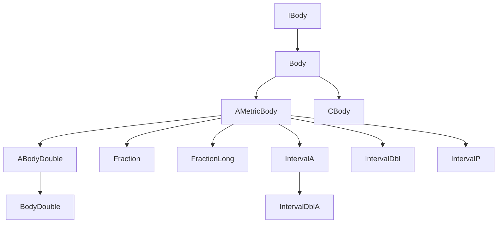

---
digest:
  local-classes:
    ABody:
      mtime: '2026-09-05T10:13:24Z'
      digest: e3b0c44298fc1c149afbf4c8996fb92427ae41e4649b934ca495991b7852b855
    ABodyDouble:
      mtime: '2026-09-05T20:56:38Z'
      digest: f2796b9a281575b4e871ed0705c1f91218cf816458a4692ecfe1f2031ae6e53d
    AMetricBody:
      mtime: '2026-09-05T20:57:34Z'
      digest: 056dd460a0a6c6fc4e22b93fa0d9035ffdb2e7684b4f1df9b471031c486bf19d
    Body:
      mtime: '2026-09-05T10:13:24Z'
      digest: e3b0c44298fc1c149afbf4c8996fb92427ae41e4649b934ca495991b7852b855
    BodyDouble:
      mtime: '2026-09-05T10:13:24Z'
      digest: 63cc9036652912acaf7225d406b1ed24ffd747b170bc80f76c47d0fa6abe749e
    CBody:
      mtime: '2026-09-05T10:13:24Z'
      digest: 11f9b52198cf0fe9ca98c5ed733d07a8a1e7c6572e5699ab94b32286a35b3744
    Fraction:
      mtime: '2026-09-05T21:00:02Z'
      digest: 3b427498675f7efef18391a3bee458b1f45d3680af1489bfb629d48e901b68a4
    FractionLong:
      mtime: '2026-09-05T20:59:49Z'
      digest: c33c8f837e61db896f7155ebf54307f36b467b1bf6c168e487466dd61371c9ee
    IBody:
      mtime: '2026-09-05T10:13:24Z'
      digest: e3b0c44298fc1c149afbf4c8996fb92427ae41e4649b934ca495991b7852b855
    IntervalA:
      mtime: '2026-09-05T10:13:24Z'
      digest: b4984a852002951ffa34a68ed5a0e73f87b1916053868582c960abafbf44abb8
    IntervalDbl:
      mtime: '2026-09-05T21:00:22Z'
      digest: 1c2f311a0b9648b33da42f286f0da1dc609ae72480b0975a486718663020daaf
    IntervalDblA:
      mtime: '2026-09-05T10:13:25Z'
      digest: a0d308765d41ccd38f0a7fccd2bb9cd9eeb54271f751c72e4a18ad930fb0ac5d
    IntervalP:
      mtime: '2026-09-05T10:13:25Z'
      digest: c8035784fd19a76490420c0a16848a752f4da95a9efd44cdb901a8ad0904ef17
    MetricBody:
      mtime: '2026-09-05T10:13:25Z'
      digest: 2b1ca1e041cb8f837d2f39473a745ea32dd5cd88294d91316d0f996591541f24
    TestBody:
      mtime: '2026-09-05T10:13:25Z'
      digest: a32f6471d3d5bb15d4d766c6c05b666248b80f41d1ac54a3286cc6661af5543a
  folders:
    complex/:
      mtime: '2026-09-05T16:28:04Z'
      digest: c9c3c4252bd7a716d36bb8bef97d0965dd331b2d8be5714ef34762b68662ac29
    units/:
      mtime: '2026-09-05T16:35:17Z'
      digest: 20001f6ab8cf81632776bdc12c241ccbe0f1221fc006e50e5fc343347973ed67
    vector/:
      mtime: '2026-09-05T20:54:51Z'
      digest: ade31f4caa6afbde0b0d9ee4aab238f6b8b5970d5c50e5e68d1090b085465df6
tags:
- code/rational_numbers
- code/interval_arithmetic
concepts:
- Rational Numbers and Interval Arithmetic
facets:
  layer: domain
  status: legacy
  complexity: high
description: 'This folder implements `IBody`/`Body` - a Metric Body (a Field with a Norm/Order: +,-,*,/,0,1, plus distance and comparison) - and its concrete number types. `AMetricBody` provides the shared analytical Machinery (Pi/e/log constants, trigonometric series) on top of the abstract Algebra layer, and `ABodyDouble`/`BodyDouble` specialise this to primitive `double`. `Fraction`/`FractionLong` layer an exact rational representation on top of any (respectively primitive-`long`) `IMetricIRing` Numerator/ Denominator pair. `IntervalA`/`IntervalDbl`/`IntervalDblA`/`IntervalP` model an ordered Interval (affine or projective) over a scalar Metric Space, and `CBody` produces constant, write-protected Representatives of any of these Body types. `TestBody` is the manual test-suite entry point for the package. The `complex/`, `units/` and `vector/` Subfolders build further number- and Tensor-domains on top of these scalar Body types.'
---

# body

This folder implements `IBody`/`Body` - a Metric Body (a Field with a Norm/Order: +,-,*,/,0,1, plus
distance and comparison) - and its concrete number types. `AMetricBody` provides the shared analytical
Machinery (Pi/e/log constants, trigonometric series) on top of the abstract Algebra layer, and
`ABodyDouble`/`BodyDouble` specialise this to primitive `double`. `Fraction`/`FractionLong` layer an
exact rational representation on top of any (respectively primitive-`long`) `IMetricIRing` Numerator/
Denominator pair. `IntervalA`/`IntervalDbl`/`IntervalDblA`/`IntervalP` model an ordered Interval (affine
or projective) over a scalar Metric Space, and `CBody` produces constant, write-protected Representatives
of any of these Body types. `TestBody` is the manual test-suite entry point for the package. The
`complex/`, `units/` and `vector/` Subfolders build further number- and Tensor-domains on top of these
scalar Body types.

## Classes

| Class | Responsibility |
|---|---|
| [ABody](ABody.java) | Default Constructor for the abstract Body Class The Body is rather used as a metric Body, because of it's topological Properties. |
| [ABodyDouble](ABodyDouble.java) | Concrete, optimized Wrapper-Class for scalar double Precision Float Point Types to define a Metric Body. |
| [AMetricBody](AMetricBody.java) | This is the abstract Implementation of a Metric Body. |
| [Body](Body.java) | Operations for a Body that complement the basic Operation in IBody. |
| [BodyDouble](BodyDouble.java) | Concrete final optimized Wrapper- Class for 'double' Values. |
| [CBody](CBody.java) | Creates constant Representatives of the Constructed Classes by overwriting their addAt() etc. Methods to throw Exceptions. |
| [Fraction](Fraction.java) | Concrete fincal Class to define Fractions of arbitrary Types. |
| [FractionLong](FractionLong.java) | Concrete final Class to define Fractions backed by primitive long Numerator and Denominator. |
| [IBody](IBody.java) | Body (M,+,-,*,/,0,1): Defines the most basic Interface necessary for a Body. |
| [IntervalA](IntervalA.java) | Defines an affine Interval in a fully ordered Scalar (1-dim) Metric Space. |
| [IntervalDbl](IntervalDbl.java) | An ordered Set of left and right Coordinates allows for a faster test for the Position of an Item relative to the Interval. |
| [IntervalDblA](IntervalDblA.java) | Defines an affine Interval in a fully ordered Scalar (1-dim) Metric Space. |
| [IntervalP](IntervalP.java) | Defines a projective Interval in a fully ordered Scalar (1-dim) Metric Space. |
| [MetricBody](MetricBody.java) | Defines Methods and Constants for analytical Operations which are possibly overwritten by fast native Implementations like sin() etc. |
| [TestBody](TestBody.java) | Tests all Methods in this Package |

## Architecture

## Entry Points

| Entry Point | Description |
|---|---|
| [TestBody](TestBody.java) | Manual test-suite entry point exercising all Methods in this package. |

## Subsystems

| Folder | Domain Role | Entry Point |
|---|---|---|
| `complex/` | Complex-number arithmetic for the `body` layer, in both rectangular ({@link Complex}/ | `CComplex` |
| `units/` | Physical units and dimensioned quantities, modeling base SI units as primes and derived | `Quantity` |
| `vector/` | This folder implements the Tensor/Vector/Matrix algebra that sits on top of `body`'s scalar | `AManifold` |
