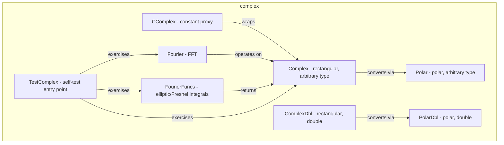

---
digest:
  local-classes:
    CComplex:
      mtime: '2026-09-05T10:13:25Z'
      digest: 22b8fa0164602b93d7c57cf77573fcc0048660640a026184a9405621654083e5
    Complex:
      mtime: '2026-09-05T16:15:11Z'
      digest: 7945e02f47adca6965d6283be382f4cfb1ed981f5f2ab5d3d01e272a9a33170e
    ComplexDbl:
      mtime: '2026-09-05T16:17:34Z'
      digest: 55b2ece8dd7d36b0abe6fef22ad5add3d66b8de1b801a3a5fd0fcff924db63a4
    Fourier:
      mtime: '2026-09-05T16:18:05Z'
      digest: ee62910fa63b2d41422d015c10f661a72e662dea54d5ab1fc1f19dd1b6d6a434
    FourierFuncs:
      mtime: '2026-09-05T16:18:15Z'
      digest: c3b07a4d58320f8f0a2c27883e02c71ac77e831e0879c4344533e79bdcb8a3dd
    Polar:
      mtime: '2026-09-05T10:13:25Z'
      digest: 95cea1633b23687abae9e8a4a3db9baea542005a75845002b5f0141fb37396a9
    PolarDbl:
      mtime: '2026-09-05T10:13:25Z'
      digest: 9df3d1f3ca058b0d7be60a64457b56f2f3ada29b204cca268be636ce36bd043c
    TestComplex:
      mtime: '2026-09-05T16:28:04Z'
      digest: a32f6471d3d5bb15d4d766c6c05b666248b80f41d1ac54a3286cc6661af5543a
  folders: {}
tags:
- code/complex_numbers
- code/fourier_transform
concepts:
- Complex Number Arithmetic and Fourier Transform
facets:
  layer: domain
  status: legacy
  complexity: high
description: 'Complex-number arithmetic for the `body` layer, in both rectangular ({@link Complex}/ {@link ComplexDbl}) and polar ({@link Polar}/{@link PolarDbl}) representations. Each pair follows the same generic-versus-primitive split used elsewhere in this tree: the plain class stores its parts as arbitrary {@link streamIO.copy.group.ring.metric.IMetricIRing} constituents so it can host any numeric body, while the `Dbl` variant fixes both parts to primitive `double` for speed. {@link CComplex} is the constant-sharing proxy over {@link Complex} used to compare complex constants by pointer instead of by value. {@link Fourier} and {@link FourierFuncs} supply FFT and elliptic/Fresnel integral routines that operate on arrays of these complex types; {@link TestComplex} is the manual self-test entry point that exercises the whole package.'
---

# complex

Complex-number arithmetic for the `body` layer, in both rectangular ({@link Complex}/
{@link ComplexDbl}) and polar ({@link Polar}/{@link PolarDbl}) representations. Each pair
follows the same generic-versus-primitive split used elsewhere in this tree: the plain
class stores its parts as arbitrary {@link streamIO.copy.group.ring.metric.IMetricIRing}
constituents so it can host any numeric body, while the `Dbl` variant fixes both parts to
primitive `double` for speed. {@link CComplex} is the constant-sharing proxy over
{@link Complex} used to compare complex constants by pointer instead of by value.
{@link Fourier} and {@link FourierFuncs} supply FFT and elliptic/Fresnel integral routines
that operate on arrays of these complex types; {@link TestComplex} is the manual
self-test entry point that exercises the whole package.

## Classes

| Class | Responsibility |
|---|---|
| [CComplex](CComplex.java) | The Advantage of these Constants is that they can be very quickly checked for equality enabling considerable savings in Operations by using the fast Pointer Comparison opposed to the slow Float Point Comparison. |
| [Complex](Complex.java) | Concrete final Class to define Complex Numbers of arbitrary Types. |
| [ComplexDbl](ComplexDbl.java) | Concrete final Class to define Complex Numbers backed by primitive double parts. |
| [Fourier](Fourier.java) | Class with static Methods and Coefficients Cache to encapsulate the Fourier Operations used with FFT. |
| [FourierFuncs](FourierFuncs.java) | This Class contains some Integral Functions that appear in Fourier Transformations: e.g. e^x/x and e^x/SqRt(x) |
| [Polar](Polar.java) | Concrete final Class to define Complex Numbers of arbitrary Types in Polar Representation. |
| [PolarDbl](PolarDbl.java) | Concrete final Class to define ComplexDbl Numbers, backed by primitive double parts, in Polar Representation. |
| [TestComplex](TestComplex.java) | Manual test-suite entry point that runs this package's self-tests in dependency order, then hands off to TestBody to continue testing the parent packages. |

## Architecture

## Entry Points

| Class.Method | Description |
|---|---|
| [TestComplex.main(String[])](TestComplex.java#L11) | Runs the complex, Fourier and body self-tests in dependency order. |
| [Fourier.SineFFT(MetricBody[], int)](Fourier.java#L32) | Sine transform of an N=2^n real array. |
| [FourierFuncs.Fresnel(MetricBody)](FourierFuncs.java#L148) | Complex Fresnel integral F(x) = C(x) + i*S(x). |
