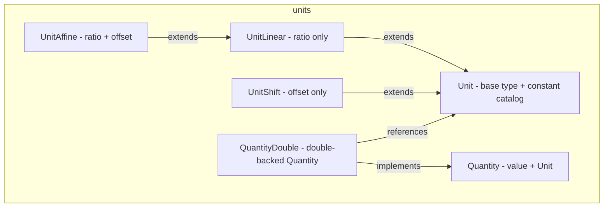

---
digest:
  local-classes:
    Quantity:
      mtime: '2026-09-05T16:34:30Z'
      digest: 4d7d35ba225a41aa281e8e39d161eb705a02ebc638110c8be3229dd6f52243b1
    QuantityDouble:
      mtime: '2026-09-05T16:34:52Z'
      digest: 6810c370e938b2effc400f86eb9ea3816797f698d116cf39a8df8214f1bd289f
    Unit:
      mtime: '2026-09-05T16:33:53Z'
      digest: c8f8348b301aa800a54271e9e72308fa6f2737e50d445878cbb844ec14a48502
    UnitAffine:
      mtime: '2026-09-05T16:35:16Z'
      digest: 81a89862da43f67427af9d9ba1edbeab4f9f60b558d60345abd47c00bbd5c06a
    UnitLinear:
      mtime: '2026-09-05T16:35:13Z'
      digest: 81a89862da43f67427af9d9ba1edbeab4f9f60b558d60345abd47c00bbd5c06a
    UnitShift:
      mtime: '2026-09-05T16:35:17Z'
      digest: b01369c396e4dac026148e997836b1002f04399fde36b7fa639bea94bfb69c73
  folders: {}
tags:
- code/si_units
- code/unit_conversion
concepts:
- Physical Units and Conversion
facets:
  layer: domain
  status: legacy
  complexity: high
description: Physical units and dimensioned quantities, modeling base SI units as primes and derived units as products/ratios of primes so unit-safe conversion falls out of ordinary arithmetic. {@link Unit} is the root type and doubles as a catalog of hundreds of named unit constants (SI, CGS, imperial, and physical/astronomical constants); a Unit's own class ({@link UnitLinear}, {@link UnitAffine}, {@link UnitShift}) fixes how it converts to its Base Unit - by ratio, by ratio-plus-offset, or by offset alone. {@link Quantity} pairs a numeric value with a Unit; {@link QuantityDouble} is its primitive-`double`-backed implementation.
---

# units

Physical units and dimensioned quantities, modeling base SI units as primes and derived
units as products/ratios of primes so unit-safe conversion falls out of ordinary
arithmetic. {@link Unit} is the root type and doubles as a catalog of hundreds of named
unit constants (SI, CGS, imperial, and physical/astronomical constants); a Unit's own
class ({@link UnitLinear}, {@link UnitAffine}, {@link UnitShift}) fixes how it converts to
its Base Unit - by ratio, by ratio-plus-offset, or by offset alone. {@link Quantity} pairs
a numeric value with a Unit; {@link QuantityDouble} is its primitive-`double`-backed
implementation.

## Classes

| Class | Responsibility |
|---|---|
| [Quantity](Quantity.java) | Quantities are Values of a Dimension quantified by a Unit. |
| [QuantityDouble](QuantityDouble.java) | Represents a continuous physical Quantity as a primitive double value paired with a Unit. |
| [Unit](Unit.java) | Defines a physical Unit as a scale factor into its base SI Unit, with a large catalog of predefined constants for the SI, CGS, imperial and other unit systems. |
| [UnitAffine](UnitAffine.java) | A UnitLinear that additionally converts to its Base Unit with an affine offset (ratio and shift), e.g. Fahrenheit to Celsius. |
| [UnitLinear](UnitLinear.java) | A Unit that converts to its Base Unit by a pure multiplicative ratio (no offset), e.g. kilometers to meters. |
| [UnitShift](UnitShift.java) | A Unit that converts to its Base Unit by a pure additive offset (no ratio), e.g. Celsius to Kelvin. |

## Architecture

