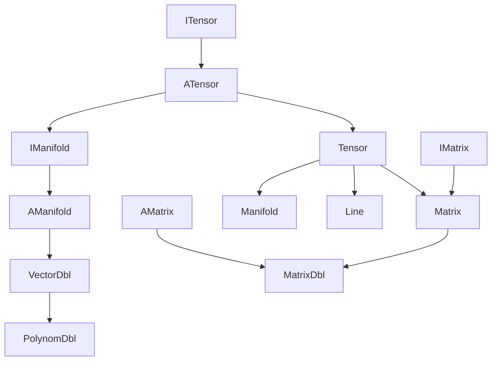

---
digest:
  local-classes:
    AManifold:
      mtime: '2026-09-05T16:44:19Z'
      digest: 3b314189fd1455a6e76158e5df4621ac8b18c3c642eef54a81ea536654c2e1f6
    AMatrix:
      mtime: '2026-09-05T10:13:25Z'
      digest: e3b0c44298fc1c149afbf4c8996fb92427ae41e4649b934ca495991b7852b855
    ATensor:
      mtime: '2026-09-05T16:41:54Z'
      digest: 037efcb680d6b8b7dc8318755f66e8952001017a95c592eb512db86ab3c8ab51
    IManifold:
      mtime: '2026-09-05T16:42:54Z'
      digest: 944e01d78273a84fa83fe684efa27759bffe0f7b2957aa8e2c8e6b02036278b5
    IMatrix:
      mtime: '2026-09-05T10:13:25Z'
      digest: e3b0c44298fc1c149afbf4c8996fb92427ae41e4649b934ca495991b7852b855
    ITensor:
      mtime: '2026-09-05T16:39:56Z'
      digest: dba6f78e09f333faee839af511e0a86e21085d747f697e56b2581eded70e7f69
    Line:
      mtime: '2026-09-05T20:53:50Z'
      digest: c9a41805b6c203d80dca35cab710386216221dd99af58f7fab1ef3f993df504a
    Manifold:
      mtime: '2026-09-05T20:53:43Z'
      digest: 8e626c730864b16cb6c5cb601fe274d2f99474b3b8d505c1ecd0d37de9a6852a
    Matrix:
      mtime: '2026-09-05T20:54:51Z'
      digest: d017014b188abb6327f98ad85427b7536eb7dc6a48570a86b707b6db326110ac
    MatrixDbl:
      mtime: '2026-09-05T10:13:25Z'
      digest: d7641f881ec8e458acd6df30c7ecba93c6645be8a9aa627bad3802902683fc8c
    PolynomDbl:
      mtime: '2026-09-05T20:54:27Z'
      digest: 5e4e9c191a21da677c3b4a787dda19403a6d4cd2e314d0ca1938097c92ca94c6
    Tensor:
      mtime: '2026-09-05T20:46:21Z'
      digest: 4eef7e2895f2aadb1af8af15d8cd04f26a8ea76130b428e97513c5d6ec79c887
    VectorDbl:
      mtime: '2026-09-05T20:52:27Z'
      digest: 01ea6191be9cec28bcb0da8621e537f2f12a595a18f93dfdb30e7ab91a9ede9c
  folders: {}
tags:
- code/tensor
- code/manifold_generation
- code/interpolation
concepts:
- Vector/Matrix/Tensor and Manifold Interpolation
facets:
  layer: domain
  status: legacy
  complexity: high
description: This folder implements the Tensor/Vector/Matrix algebra that sits on top of `body`'s scalar `IIntRing` elements. `ITensor`/`ATensor` add index-based, `IndexEnumerator`-style traversal to the metric-integrity-ring algebra, giving a multi-dimensional container that can both be computed on and iterated over. `IManifold`/`AManifold` extend this with finite-difference calculus (difference, summation, derivative, integral, Horner-scheme evaluation) so an `AManifold` subclass doubles as a sampled function usable for interpolation and extrapolation. `Tensor` is the generic, arbitrary-Degree implementation (Elements can themselves be Tensors), while `VectorDbl` is a primitive-`double`-backed, 1-Dimensional specialisation kept separate for debuggability and speed - at the cost of an unresolved design tension (flagged inline) between treating it as an ordered Sample sequence versus a Polynom. `Matrix`/`AMatrix`/`IMatrix`/`MatrixDbl` specialise Tensor to 2nd Degree for linear mappings and bilinear forms (including LU decomposition), `Line` specialises Tensor to a 2-row (Start/Stop) Matrix for Box/Line geometry, `Manifold` adds Raster-sampling and weighted-power-product helpers, and `PolynomDbl` redefines `VectorDbl`'s difference/integral Operations as Polynom (not Sample) algebra.
---

# vector

This folder implements the Tensor/Vector/Matrix algebra that sits on top of `body`'s scalar
`IIntRing` elements. `ITensor`/`ATensor` add index-based, `IndexEnumerator`-style traversal to the
metric-integrity-ring algebra, giving a multi-dimensional container that can both be computed on
and iterated over. `IManifold`/`AManifold` extend this with finite-difference calculus (difference,
summation, derivative, integral, Horner-scheme evaluation) so an `AManifold` subclass doubles as a
sampled function usable for interpolation and extrapolation. `Tensor` is the generic, arbitrary-Degree
implementation (Elements can themselves be Tensors), while `VectorDbl` is a primitive-`double`-backed,
1-Dimensional specialisation kept separate for debuggability and speed - at the cost of an unresolved
design tension (flagged inline) between treating it as an ordered Sample sequence versus a Polynom.
`Matrix`/`AMatrix`/`IMatrix`/`MatrixDbl` specialise Tensor to 2nd Degree for linear mappings and
bilinear forms (including LU decomposition), `Line` specialises Tensor to a 2-row (Start/Stop) Matrix
for Box/Line geometry, `Manifold` adds Raster-sampling and weighted-power-product helpers, and
`PolynomDbl` redefines `VectorDbl`'s difference/integral Operations as Polynom (not Sample) algebra.

## Architecture

## Entry Points

| Entry Point | Description |
|---|---|
| [Matrix.main(String[])](Matrix.java) | Manual smoke-test constructing and mapping a 2-Dimensional `BodyDouble` Matrix. |
| [VectorDbl.testVector(VectorDbl)](VectorDbl.java) | Exercises AManifold's static statistical Methods against a sample Vector. |

## Classes

| Class | Responsibility |
|---|---|
| [AManifold](AManifold.java) | Abstract base class for a sampled function (IManifold), extending ATensor with finite-difference, statistical and search Operations that mix across Dimensions. |
| [AMatrix](AMatrix.java) | Abstract Class officially introducing the Monoid Implementations into the Ring Subtree. |
| [ATensor](ATensor.java) | Abstract base class for tensor-like Manifolds, adding IndexEnumerator traversal to the streamIO.copy.group.ring.metric.IMetricIRing algebra so a Manifold can be both computed on and iterated over. |
| [IManifold](IManifold.java) | Extends ITensor with finite-difference/derivative Operations (difference, summation, derivative, integral) and Horner-scheme evaluation, so a Manifold can be used as a sampled function for interpolation and extrapolation. |
| [IMatrix](IMatrix.java) | A Matrix is a Tensor of 2nd Degree Several Properties can be defined |
| [ITensor](ITensor.java) | Integrates the Interfaces of Metric IntegrityRing and IndexEnumerator |
| [Line](Line.java) | All Methods of a Vector can also be applied to both points of the Line In that Respect the Line forms a 2-Row Tensor again. |
| [Manifold](Manifold.java) | A Tensor subclass that defines Methods mixing across its Elements (sampling a Function onto a multidimensional Raster, weighted power Products, Sum, Product). |
| [Matrix](Matrix.java) | This class defines all Methods specific to Matrices. |
| [MatrixDbl](MatrixDbl.java) | Title: MatrixDbl Description: This Class relies on the Elements of this Tensor being of Type VectorDbl It therefore defines some Optimizations for Transposing and for calculating the Scalar Product between MatrixDbl Objects as well as for the Product of VectorDbl and MatrixDbl. |
| [PolynomDbl](PolynomDbl.java) | Title: PolynomDbl Description: Extends the VectorDbl Class to redefine the Methods that work differently as Samples (i.e. ordered Sets) over the same Dimension (addAt, diff etc.) or as Polynomes (addAt adds only to the 1st Element, diff does Polynom division) TODO: Sampling a Function builds the interpolating Polynom right away... |
| [Tensor](Tensor.java) | Most generic Implementation of a Tensor The Elements can be Scalars or Tensors, which creates a Tensor of higher Degree |
| [VectorDbl](VectorDbl.java) | A AManifold Manifold of primitive double Elements, which is much easier to debug and faster than using Tensor, which is a Vector of IIntRing Elements. |
