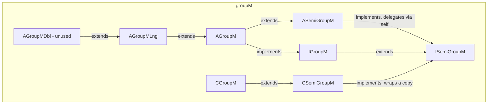

---
digest:
  local-classes:
    AGroupM:
      mtime: '2026-09-05T10:13:25Z'
      digest: 6a488b8d1bea511a961fb9e4561e3ba567f6b7d00b49ade3727e2305e33cf821
    AGroupMDbl:
      mtime: '2026-09-05T10:13:25Z'
      digest: b0bba1ffe6bc0dd42f154f7d436b83eacc1989c52af97f0bd53dd93ad0edb78e
    AGroupMLng:
      mtime: '2026-09-05T16:32:07Z'
      digest: 2841e04434878d00eeff22b7f1d041933000309bc9de4beab0052affce802d70
    ASemiGroupM:
      mtime: '2026-09-05T10:13:25Z'
      digest: 60651f235ccf090adaf0b09fb8c7af56bd81b09f337b297c236746ab4da224ca
    CGroupM:
      mtime: '2026-09-05T10:13:25Z'
      digest: 655248ffb57ce6e21800f8796283987ba61c4301cc7fa72ecfa1bc0a43604296
    CSemiGroupM:
      mtime: '2026-09-05T10:13:25Z'
      digest: cf0842b300c50f76ce57d5648e6e042f5fd654fc11dbc7f069911786378fc5fb
    IDblGroupM:
      mtime: '2026-09-05T10:13:25Z'
      digest: b8c070dcce4ce3dcd33e2b25efc158aea9c19924ec2539d9efe90ea750b4997e
    IGroupM:
      mtime: '2026-09-05T10:13:25Z'
      digest: e73345aef7d9210ad5613060f400bea87159c7870e3b53bf98f5886c1d6d70a0
    IIGroupM:
      mtime: '2026-09-05T10:13:25Z'
      digest: f22e591f1485e4d4ff15f099a744cef7f8456894f0f5bd7c070df3587105198d
    IISemiGroupM:
      mtime: '2026-09-05T10:13:25Z'
      digest: 527da231265d1ba61089cb6ea514df521d7f2c9d0b6eb556a3dac6ad5281c584
    ILngGroupM:
      mtime: '2026-09-05T10:13:25Z'
      digest: 8463f44a9a71adb3a7ee4ae8dcb989e5577f07ee570dfe612fd34144260afb9f
    ISemiGroupM:
      mtime: '2026-09-05T10:13:25Z'
      digest: bfb13cda01f605b8a5ca8032f79e2cae367bc358922c7218867752ffe7506bd9
    TestGroupM:
      mtime: '2026-09-05T16:32:09Z'
      digest: a32f6471d3d5bb15d4d766c6c05b666248b80f41d1ac54a3286cc6661af5543a
  folders: {}
tags:
- code/multiplicative_group
- code/algebraic_structure
- code/delegation
concepts:
- Algebraic Group
- Multiplicative Structure
facets:
  layer: utility
  status: legacy
  complexity: medium
description: 'Models the multiplicative algebraic hierarchy (semigroup -> group) that mirrors the additive hierarchy in the sibling `group` package: `ISemiGroupM`/`IGroupM` define `*`, `/`, `Pow` and related operations, kept deliberately synchronous with the `group` package''s additive `+`/`-` interfaces so both hierarchies can be generated from the same design. `ASemiGroupM`/`AGroupM` supply the default, delegation-based implementation - only `mulAt`/`divAt` must be redefined by a concrete class, and `Pow`/`Pow2Pow`/`sqr`/`cbc`/`qad` all derive from them via the "delegation to self" pattern (a `self` field standing in for `this`, so the abstraction can be mixed in without single inheritance getting in the way). `AGroupMLng`/`AGroupMDbl`/`IDblGroupM`/ `ILngGroupM` add direct `long`/`double`-argument overloads; `AGroupMDbl`''s own comment marks it as never actually used. `CSemiGroupM`/`CGroupM` are constant/immutable wrappers that delegate every read-only operation to an inner instance and throw on every mutating `...At()` method.'
---

# groupM

Models the multiplicative algebraic hierarchy (semigroup -> group) that mirrors the
additive hierarchy in the sibling `group` package: `ISemiGroupM`/`IGroupM` define `*`,
`/`, `Pow` and related operations, kept deliberately synchronous with the `group`
package's additive `+`/`-` interfaces so both hierarchies can be generated from the
same design. `ASemiGroupM`/`AGroupM` supply the default, delegation-based
implementation - only `mulAt`/`divAt` must be redefined by a concrete class, and
`Pow`/`Pow2Pow`/`sqr`/`cbc`/`qad` all derive from them via the "delegation to self"
pattern (a `self` field standing in for `this`, so the abstraction can be mixed in
without single inheritance getting in the way). `AGroupMLng`/`AGroupMDbl`/`IDblGroupM`/
`ILngGroupM` add direct `long`/`double`-argument overloads; `AGroupMDbl`'s own comment
marks it as never actually used. `CSemiGroupM`/`CGroupM` are constant/immutable
wrappers that delegate every read-only operation to an inner instance and throw on
every mutating `...At()` method.

## Classes

| Class | Responsibility |
|---|---|
| [AGroupM](AGroupM.java) | Default Implementation of a multiplicative Group (G,*,/,1). |
| [AGroupMDbl](AGroupMDbl.java) | This Class is actually never used! |
| [AGroupMLng](AGroupMLng.java) | Default implementation layer adding direct long-argument multiplication and division on top of AGroupM's generic Object-argument operations. |
| [ASemiGroupM](ASemiGroupM.java) | Default Implementation of a multiplicative SemiGroup (G,*). |
| [CGroupM](CGroupM.java) | Implements Constants for all Types of GroupM Classes. |
| [CSemiGroupM](CSemiGroupM.java) | Implements Constants for all Types of SemiGroupM Classes. |
| [IDblGroupM](IDblGroupM.java) | Adds the Capability to multiply and divide double Numbers directly |
| [IGroupM](IGroupM.java) | Algebraic Group (M,*,/,1): This Interface must be kept completely synchronous to Group Set of Objects with inner Operations "*,/" on any two Objects In a SemiGroup any two Objects can be "multiplied" or "divided". |
| [IIGroupM](IIGroupM.java) | multiplicative Group (M,*,/,1): This Interface must be kept completely synchronous to intGroup Defines the most basic Interface necessary for an additive Group: '/='. |
| [IISemiGroupM](IISemiGroupM.java) | SemiGroupM (M,*): This Interface must be kept completely synchronous to ISemiGroup Defines the most basic Interface necessary for a multiplicative SemiGroup:'*=' All other operations are only Shortcuts and can be defined using '*='. |
| [ILngGroupM](ILngGroupM.java) | Adds the Capability to multiply and divide long Numbers directly |
| [ISemiGroupM](ISemiGroupM.java) | Algebraic SemiGroup (M,*): This Interface must be kept completely synchronous to SemiGroup Set of Objects with inner Operation "*" on any two Objects. |
| [TestGroupM](TestGroupM.java) | Manual test harness entry point for the groupM package, delegating to TestCopy#main(String[]). |

## Architecture

## Entry Points

| Class.Method | Description |
|---|---|
| [ISemiGroupM.mul(Object)](ISemiGroupM.java#L34) | Multiplication, returning a copy. |
| [IGroupM.div(Object)](IGroupM.java#L39) | Division, returning a copy. |
| [ISemiGroupM.Pow(int)](ISemiGroupM.java#L42) | Integer power `x^n`. |
