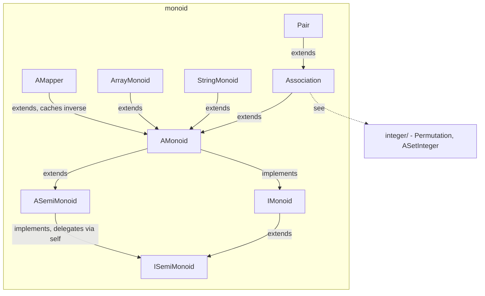

---
digest:
  local-classes:
    AMapper:
      mtime: '2026-09-05T16:41:47Z'
      digest: a8977c5db1c4c5c988b6864757ce0465a962cf3df6b7318a9e315424472fffaa
    AMonoid:
      mtime: '2026-09-05T16:40:38Z'
      digest: b4d9693cc2d990337565454957cf116a938343e2842b0354e5933837358babd6
    ASemiMonoid:
      mtime: '2026-09-05T16:41:37Z'
      digest: 502e05b2ae506ef4cbcb7a2cc0ab18146f03cd5ed875034dc33e51a405c68cd2
    ArrayMonoid:
      mtime: '2026-09-05T16:41:38Z'
      digest: 9b321a96e2aed71fc4863e756efd19dcb7a89acb76d78a63215c0eb739c43262
    Association:
      mtime: '2026-09-05T16:41:19Z'
      digest: 80a516596264248c9f9dd0d8e700ee298069c507c22a032823d434298f8a3a2c
    AssociationEquivalence:
      mtime: '2026-09-05T16:41:26Z'
      digest: bfdb449a6e3d578ea3852a2a1ab292723258331bde09b48fa519bcb0c4b3697e
    IIMonoid:
      mtime: '2026-09-05T10:13:25Z'
      digest: c872a5e30f3b12fe88f9b37a1c3c70da42ee445d18efeebb8cfed149e92297d7
    IISemiMonoid:
      mtime: '2026-09-05T10:13:25Z'
      digest: 6c2efa5723ed0d0ec94a440938c0c56173a114e8f28243dda61546106e78a1b4
    IMonoid:
      mtime: '2026-09-05T10:13:25Z'
      digest: cacf3e8f500c029abf143f9c57d7c143dffe6e6606362b57d1d63e5f7a07fe73
    ISemiMonoid:
      mtime: '2026-09-05T10:13:25Z'
      digest: fea721cfea886b2980d2f124a49920d9b3701d1d8d23fc399c2694589accf395
    Pair:
      mtime: '2026-09-05T10:13:25Z'
      digest: e69085b7bb22b54b8e48379d02e6c2413b9dc9f1ae63a397eb2b1ec33e96ac86
    StringMonoid:
      mtime: '2026-09-05T10:13:25Z'
      digest: 1b83405b720c8f0127c06feacf5657056de331e851b8906edfac0c30b40138a8
    testMonoid:
      mtime: '2026-09-05T10:13:25Z'
      digest: a93eb1bdbbe7a37c7a4c9f0f04121399af75bd02fa545d00b9bcd615e6a508a1
  folders:
    integer/:
      mtime: '2026-09-05T16:34:07Z'
      digest: 76582c948234cd65e5051a3a16cf1b5765bd947b77e6cbf56f01e9d9dd70349c
tags:
- code/concatenation
- code/algebraic_structure
- code/dictionary_entry
concepts:
- Monoid
- Concatenation
facets:
  layer: utility
  status: legacy
  complexity: medium
description: 'Models the concatenative algebraic hierarchy (semigroup -> monoid) that mirrors the multiplicative and additive hierarchies in `groupM`/`group`: `ISemiMonoid` defines a single operation `map`/`mapAt` ("this after arg", i.e. function composition), kept deliberately asymmetric from the group hierarchies because concatenation is associative but not commutative (string/array concatenation is the running example). `IMonoid` adds the inverse-based operations (`solve`, `reSolve`, `rev`, `Identity`) that require a two-sided inverse to exist. `ASemiMonoid`/`AMonoid` supply the default, delegation-based implementation - only `mapAt` (and, for `AMonoid`, `pamAt`) must be redefined by a concrete class - using the same "delegation to self" pattern as the sibling packages. `AMapper` adds inverse-caching on top of `AMonoid` for mapping-style monoids. `ArrayMonoid`/`StringMonoid` are the two concrete concatenative monoids (`Object[]` and `String` respectively); `Association`/`Pair` model a key-value mapping as a (rarely-instantiated) monoid, with `AssociationEquivalence` providing a key-only equivalence relation for containers built on `Association`. The `integer/` subfolder builds an integer-backed set and a permutation monoid on top of this and the `boole`/`groupM`/`shift` packages.'
---

# monoid

Models the concatenative algebraic hierarchy (semigroup -> monoid) that mirrors the
multiplicative and additive hierarchies in `groupM`/`group`: `ISemiMonoid` defines a
single operation `map`/`mapAt` ("this after arg", i.e. function composition), kept
deliberately asymmetric from the group hierarchies because concatenation is
associative but not commutative (string/array concatenation is the running example).
`IMonoid` adds the inverse-based operations (`solve`, `reSolve`, `rev`, `Identity`) that
require a two-sided inverse to exist. `ASemiMonoid`/`AMonoid` supply the default,
delegation-based implementation - only `mapAt` (and, for `AMonoid`, `pamAt`) must be
redefined by a concrete class - using the same "delegation to self" pattern as the
sibling packages. `AMapper` adds inverse-caching on top of `AMonoid` for mapping-style
monoids. `ArrayMonoid`/`StringMonoid` are the two concrete concatenative monoids
(`Object[]` and `String` respectively); `Association`/`Pair` model a key-value mapping
as a (rarely-instantiated) monoid, with `AssociationEquivalence` providing a
key-only equivalence relation for containers built on `Association`. The `integer/`
subfolder builds an integer-backed set and a permutation monoid on top of this and the
`boole`/`groupM`/`shift` packages.

## Classes

| Class | Responsibility |
|---|---|
| [AMapper](AMapper.java) | Abstract Class that implements both the IInvertAble and the Monoid Interface Sublasses: |
| [AMonoid](AMonoid.java) | Default Implementation of a non commutative Group (G,*,/,1), usually a Mapping. |
| [ASemiMonoid](ASemiMonoid.java) | Default Implementation of a concatenative SemiMonoid (G,�). |
| [ArrayMonoid](ArrayMonoid.java) | Monoid whose elements are Object[] arrays, concatenated the same way StringMonoid concatenates char[]s. ArrayMonoid.java Created on 6. Mai 2001, 11:16 |
| [Association](Association.java) | Creates an Association between two Objects: the key, which supplies the HashCode() and the equals() Method, as well as any Comparison or Metric Operations like compare() and the Value, which is returned. |
| [AssociationEquivalence](AssociationEquivalence.java) | Stateless ITester Implementation that tests incoming Objects for exact Equivalence to the inner key (not the Value) of the Association. |
| [IIMonoid](IIMonoid.java) | Concatenative Group (M,�,\,Id): This Interface must be kept completely synchronous to intGroup Defines the Inverse of an Element x^-1, and it's Concatenation, x�x^-1 = Id concatenated with results in the Identity. |
| [IISemiMonoid](IISemiMonoid.java) | ISemiMonoid (M,�): This Interface must be kept completely synchronous to ISemiGroup Defines the most basic Interface necessary for a concatenative SemiGroup:'()=' All other operations are only Shortcuts and can be defined using '()='. |
| [IMonoid](IMonoid.java) | Algebraic Group (M,�,\,Id): This Interface cannot be kept synchronous to Group because of missing Commutativity. |
| [ISemiMonoid](ISemiMonoid.java) | SemiMonoid (M,�): Set of Objects with Operation � called 'map()' on any two Objects. |
| [Pair](Pair.java) | Pair.java Redefines the hashCode() and equals() Methods of of 'Association' to reflect the Role of both Partners. |
| [StringMonoid](StringMonoid.java) | Monoid working on Strings. |
| [testMonoid](testMonoid.java) | Tests all Methods and Classes of this Package |

## Subsystems

| Folder | Domain Role | Entry Point |
|---|---|---|
| `integer/` | Integer-backed set and permutation types built on top of the `boole`/`groupM`/`shift` | `ASetInteger` |

## Architecture

## Entry Points

| Class.Method | Description |
|---|---|
| [ISemiMonoid.map(Object)](ISemiMonoid.java#L94) | Mapping/left-concat, returning a copy. |
| [IMonoid.solve(Object)](IMonoid.java#L64) | Left-concatenation with the inverse, resolving `A * B = C` for `A`. |
| [StringMonoid(String)](StringMonoid.java#L117) | Wraps a string as a concatenative monoid. |
