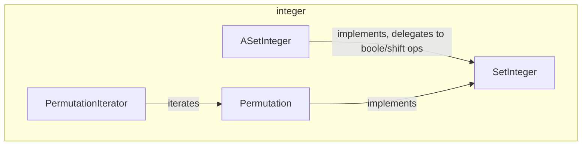

---
digest:
  local-classes:
    ASetInteger:
      mtime: '2026-09-05T16:33:39Z'
      digest: 541f8d8635402591f6abf146e079472d0e234ac9c4cd5a825707cddd80e0eb24
    Permutation:
      mtime: '2026-09-05T16:34:07Z'
      digest: 60d5e807916ae1e87b561028a803cc692be4c2b4ce7797e3b46d25b405d88eef
    PermutationIterator:
      mtime: '2026-09-05T16:34:07Z'
      digest: a161b1166546bcdfeae795bcf43db60707c808385944a84360d40d6109417151
    SetInteger:
      mtime: '2026-09-05T10:13:25Z'
      digest: 1dfc44d302eb744b9b2bea106c7f581d535530605abf6987af21db5ba08e37e0
  folders: {}
tags:
- code/permutation
- code/bit_manipulation
- code/multiplicative_semigroup
concepts:
- Permutation
- Bit Set
facets:
  layer: utility
  status: legacy
  complexity: medium
description: 'Integer-backed set and permutation types built on top of the `boole`/`groupM`/`shift` abstractions. `SetInteger`/`ASetInteger` provide a bit-set (same functionality as `java.util.BitSet`) by delegating single-bit set/clear/get to AND/OR/XOR operations on a shifted one-bit mask, reusing `Boole`''s bitwise algebra and `ShiftAble`''s left-shift rather than any dedicated bit-manipulation code. `Permutation` is the folder''s centerpiece: a single class doing triple duty as a permutation, a multi-index into a tensor of arbitrary degree, and an integer-set representation, built as an `AMonoid` (permutations compose but do not commute, so they form a monoid, not a group). `PermutationIterator` (declared in the same file) walks a `Permutation`''s indices by delegating position tracking to the wrapped instance.'
---

# integer

Integer-backed set and permutation types built on top of the `boole`/`groupM`/`shift`
abstractions. `SetInteger`/`ASetInteger` provide a bit-set (same functionality as
`java.util.BitSet`) by delegating single-bit set/clear/get to AND/OR/XOR operations on
a shifted one-bit mask, reusing `Boole`'s bitwise algebra and `ShiftAble`'s left-shift
rather than any dedicated bit-manipulation code. `Permutation` is the folder's
centerpiece: a single class doing triple duty as a permutation, a multi-index into a
tensor of arbitrary degree, and an integer-set representation, built as an `AMonoid`
(permutations compose but do not commute, so they form a monoid, not a group).
`PermutationIterator` (declared in the same file) walks a `Permutation`'s indices by
delegating position tracking to the wrapped instance.

## Classes

| Class | Responsibility |
|---|---|
| [ASetInteger](ASetInteger.java) | Abstract Implementation of a Set, only valid for BitSets! It delegates the Element setting to AND and OR Operations on Masks denoting a single Element. |
| [Permutation](Permutation.java) | Instances of this Class can be used for 3 different Purposes at the same Time: - Permutation - Multi Index - Integer Set Operations TODO: most Functionality is already in VectorInt! Permutations for a fixed length Vector of Integers form a Monoid, no Group, since they don't commute, as can be seen easily using (1,3,2)*(2,1,3). |
| [PermutationIterator](Permutation.java) | Iterates through the indices of a Permutation, delegating position tracking to the wrapped instance. |
| [SetInteger](SetInteger.java) | Set consisting of Bits. |

## Architecture

## Entry Points

| Class.Method | Description |
|---|---|
| [SetInteger.set(int)](SetInteger.java#L15) | Sets bit n. |
| [SetInteger.get(int)](SetInteger.java#L18) | Gets bit n. |
| [Permutation.toArray()](Permutation.java#L568) | Returns a copy of this permutation's coefficients. |
