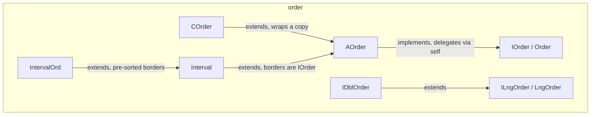

---
digest:
  local-classes:
    AOrder:
      mtime: '2026-09-05T10:13:25Z'
      digest: 038a7ba4e5dbe1556f01bc4db804f12b9d987fcc2e631737f54a4e5449a9620a
    COrder:
      mtime: '2026-09-05T10:13:25Z'
      digest: 6c40af6350593748ac7e2079e4a5f20add36fc1ac1e67ce9aca3d30dda9aa94e
    IDblOrder:
      mtime: '2026-09-05T10:13:25Z'
      digest: 14f278f2569831dcdbdebb362db089dd494ab58c5789e512a920dcbd136b9808
    IInterval:
      mtime: '2026-09-05T10:13:25Z'
      digest: e3b0c44298fc1c149afbf4c8996fb92427ae41e4649b934ca495991b7852b855
    ILngOrder:
      mtime: '2026-09-05T10:13:25Z'
      digest: ec997d32d0a6169bcae9b3c0e595440e3c54adb827a5da8bb42c4a15f281a9b6
    IOrder:
      mtime: '2026-09-05T10:13:25Z'
      digest: 1339efb09cd1a2f3424b5ed52774c4db9a1da7a0bd0071845001964ed1fdad37
    Interval:
      mtime: '2026-09-05T16:30:32Z'
      digest: c74a90cb3f0e1bc8ed9bf2f9484aa4d5e7d4f1bca296215cb95a3600b70f6237
    IntervalOrd:
      mtime: '2026-09-05T10:13:25Z'
      digest: bac55d174f3fb434bbbdd2ca899fbeec92cd5b47a4c41de5d388b08c705555ef
    LngOrder:
      mtime: '2026-09-05T10:13:25Z'
      digest: ec997d32d0a6169bcae9b3c0e595440e3c54adb827a5da8bb42c4a15f281a9b6
    Order:
      mtime: '2026-09-05T10:13:25Z'
      digest: 1339efb09cd1a2f3424b5ed52774c4db9a1da7a0bd0071845001964ed1fdad37
    testOrder:
      mtime: '2026-09-05T16:30:29Z'
      digest: a32f6471d3d5bb15d4d766c6c05b666248b80f41d1ac54a3286cc6661af5543a
  folders: {}
tags:
- code/numeric_comparison
- code/interval_arithmetic
- code/abstract_base
concepts:
- Order Relation
- Interval Arithmetic
facets:
  layer: utility
  status: legacy
  complexity: medium
description: Defines the strict order relation (`<`, `>`, Max/Min) that comparable types in `streamIO.copy` build on, plus an `Interval` abstraction built on top of it. `IOrder` (and its apparent duplicate `Order`) extend `function.IOrderAble` with copy-based Max/Min; `AOrder` supplies the default implementation - `isLessThan` stays the one abstract primitive, and `notLessThan`/`notMoreThan`/`compareTo`/`Position` are all derived from it via the "delegation to self" pattern used across this codebase. `IDblOrder`/`ILngOrder` (and their apparent duplicate `LngOrder`) add direct `double`/`long` comparison for primitive-backed types. `Interval` represents a set of values by its two borders and implements the interval algebra (contains, overlaps, intersect/union) in terms of the border type's own `IOrder`; `IntervalOrd` is a performance specialisation that keeps the borders pre-sorted so containment tests need only check one side. `COrder` is a delegating, effectively-constant wrapper around an `IOrder`. Several type pairs here (`IOrder`/`Order`, `ILngOrder`/`LngOrder`) carry identical members - almost certainly leftovers from a naming-convention change rather than intentional variants; treat them as the same contract when reading this package.
---

# order

Defines the strict order relation (`<`, `>`, Max/Min) that comparable types in
`streamIO.copy` build on, plus an `Interval` abstraction built on top of it. `IOrder`
(and its apparent duplicate `Order`) extend `function.IOrderAble` with copy-based
Max/Min; `AOrder` supplies the default implementation - `isLessThan` stays the one
abstract primitive, and `notLessThan`/`notMoreThan`/`compareTo`/`Position` are all
derived from it via the "delegation to self" pattern used across this codebase.
`IDblOrder`/`ILngOrder` (and their apparent duplicate `LngOrder`) add direct
`double`/`long` comparison for primitive-backed types. `Interval` represents a set of
values by its two borders and implements the interval algebra (contains, overlaps,
intersect/union) in terms of the border type's own `IOrder`; `IntervalOrd` is a
performance specialisation that keeps the borders pre-sorted so containment tests
need only check one side. `COrder` is a delegating, effectively-constant wrapper
around an `IOrder`. Several type pairs here (`IOrder`/`Order`, `ILngOrder`/`LngOrder`)
carry identical members - almost certainly leftovers from a naming-convention change
rather than intentional variants; treat them as the same contract when reading this
package.

## Classes

| Class | Responsibility |
|---|---|
| [AOrder](AOrder.java) | Default Implementation of an order Relation. |
| [COrder](COrder.java) | Implements Constants for all Types of OrderAble Classes. |
| [IDblOrder](IDblOrder.java) | Adds the Capability to compare double Numbers directly |
| [IInterval](IInterval.java) | Defining the Interface for an Interval, since the Interval is being re- used for simple Order Classses as well as for arithmetic Classes like IntervalA and IntervalP. |
| [ILngOrder](ILngOrder.java) | Adds the Capability to compare long Numbers directly |
| [IOrder](IOrder.java) | OrderAble: Interface for a Class whose Objects have a strict Order Relation ">" resp. "<". |
| [Interval](Interval.java) | This Class defines a Set of Objects by an Interval. |
| [IntervalOrd](IntervalOrd.java) | This Subclass orders the left and right coordinates in the Constructor to achieve a normed Format. |
| [LngOrder](LngOrder.java) | Adds the Capability to compare long Numbers directly |
| [Order](Order.java) | OrderAble: Interface for a Class whose Objects have a strict Order Relation ">" resp. "<". |
| [testOrder](testOrder.java) | Manual test harness that exercises AOrder's comparison and Max/Min Methods via AOrder#testIt(). |

## Architecture

## Entry Points

| Class.Method | Description |
|---|---|
| [IOrder.Max(Object)](IOrder.java#L24) | Returns the maximum of both operands. |
| [Interval.contains(Object)](Interval.java#L120) | Returns true when this interval contains the argument. |
| [Interval.AND(Interval)](Interval.java#L215) | Returns the intersection interval of this and the argument. |
