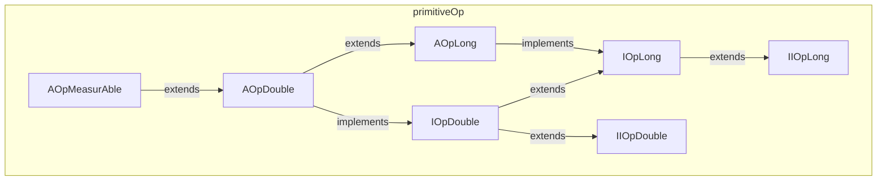

---
digest:
  local-classes:
    AOpDouble:
      mtime: '2026-09-05T16:15:54Z'
      digest: 32058e54c71db15ba039d5edeb6f606d385dba57c139ec09fb4770587e4451ca
    AOpLong:
      mtime: '2026-09-05T10:13:25Z'
      digest: 45025bc5b8d4d29b97d603fab7347a8e06c2a469587d4b641708ad7726fa49c6
    AOpMeasurAble:
      mtime: '2026-09-05T16:15:56Z'
      digest: 841fd9a098ba1a4deff12630b268c4a73d41989a3ce12fd268042ab37dfca0d1
    IIOpDouble:
      mtime: '2026-09-05T10:13:25Z'
      digest: 5b0bc6bb2ac790adeda3079bb822f7448935f2249c3329d021c7656534cdb93c
    IIOpLong:
      mtime: '2026-09-05T10:13:25Z'
      digest: 567e796b1cc13906e478a0dc6116357cd0f38c2228734c4022819fe7cb1e47fe
    IOpDouble:
      mtime: '2026-09-05T10:13:25Z'
      digest: 986668d3d2265053c03fc4ee0f921ca912570d6749d665c15b9a824108631edc
    IOpLong:
      mtime: '2026-09-05T10:13:25Z'
      digest: bfbd9bb5eb1ef325f4f946ca3a8ab349c8d5dd4ce9c4bc077a91c8d0972647ee
  folders: {}
tags:
- code/arithmetic_operation
- code/abstract_base
- code/deprecated_api
concepts:
- Primitive Numeric Operations
- Deprecated API
facets:
  layer: utility
  status: legacy
  complexity: medium
description: 'Defines the in-place arithmetic contract (`add`/`subt`/`mul`/`div`, min/max, linear mapping) shared by every mutable numeric type in `streamIO.copy`, split into a `long`-based layer (`IOpLong`/`IIOpLong`) and a `double`-based layer (`IOpDouble`/`IIOpDouble`) that extends it. `AOpLong`, `AOpDouble` and `AOpMeasurAble` provide the default, copy-based implementation of the non-primitive operations (`Lin`, `dbl`, `sqr`, ...) in terms of the small set of abstract `*At` primitives a concrete subclass must still supply. The module''s own comments mark it **deprecated**: its double-argument operations were superseded by the `Real` interface, and its long-argument operations by `IIntRing`, so new code should prefer those instead.'
---

# primitiveOp

Defines the in-place arithmetic contract (`add`/`subt`/`mul`/`div`, min/max, linear mapping)
shared by every mutable numeric type in `streamIO.copy`, split into a `long`-based layer
(`IOpLong`/`IIOpLong`) and a `double`-based layer (`IOpDouble`/`IIOpDouble`) that extends it.
`AOpLong`, `AOpDouble` and `AOpMeasurAble` provide the default, copy-based implementation of
the non-primitive operations (`Lin`, `dbl`, `sqr`, ...) in terms of the small set of abstract
`*At` primitives a concrete subclass must still supply. The module's own comments mark it
**deprecated**: its double-argument operations were superseded by the `Real` interface, and
its long-argument operations by `IIntRing`, so new code should prefer those instead.

## Classes

| Class | Responsibility |
|---|---|
| [AOpDouble](AOpDouble.java) | Abstract Class that implements most of the Methods of OpDouble by calling Methods from intOpDouble Actually these Classes are deprecated, because Operations with double Arguments are added to the Real Interface. |
| [AOpLong](AOpLong.java) | Abstract Class that implements most of the Methods of OpLong by calling Methods from IOpLong. |
| [AOpMeasurAble](AOpMeasurAble.java) | Abstract Class that implements most of the Methods of OpDouble by calling Methods from intOpDouble Actually these Classes are deprecated, because Operations with double Arguments are added to the Real Interface. |
| [IIOpDouble](IIOpDouble.java) | This Interface is definitely implemented for a mutable Class that also implements IMeasurAble. |
| [IIOpLong](IIOpLong.java) | This Interface is definitely implemented for a mutable Class that also implements IMeasurAble. |
| [IOpDouble](IOpDouble.java) | This Interface adds all Methods to the intOpDouble that can be indirectly defined by intOpDouble |
| [IOpLong](IOpLong.java) | This Interface adds all Methods to the IOpLong that can be indirectly defined by IOpLong |

## Architecture

## Entry Points

| Class.Method | Description |
|---|---|
| [IOpLong.add(long)](IOpLong.java#L18) | Addition of a long number in place. |
| [IOpDouble.add(double)](IOpDouble.java#L15) | Addition of a double number in place. |
| [IOpLong.Lin(long, long)](IOpLong.java#L134) | Linear mapping `x * a + y`. |
